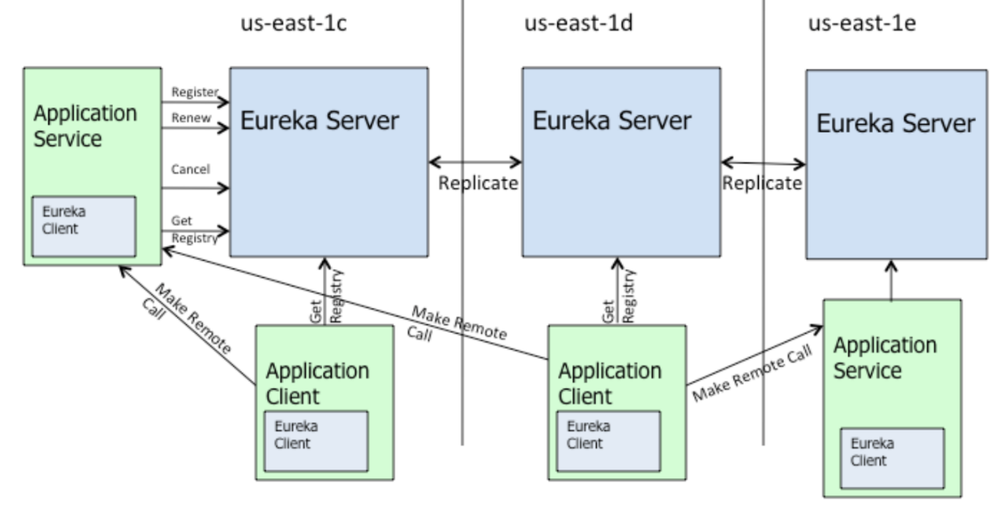

# eureka 注册中心

spring boot中使用注解@EnableEurekaServer，开启一个eureka注册中心。

```java
@EnableEurekaServer
@SpringBootApplication
public class EurekaServerApplication {

    public static void main(String[] args) {
        SpringApplication.run(EurekaServerApplication.class, args);
    }

}
```

实际上`@EnableEurekaServer`仅仅是引入EurekaServerMarkerConfiguration，spring相关框架中有很多类似`xxxMarkerxxx`这样的注解.其实他们的意思就是一个**开关**。会在其他地方进行开关的判断，有对应`xxxMarkerxxx`类就表示打开，没有表示关闭。

```java
@Target(ElementType.TYPE)
@Retention(RetentionPolicy.RUNTIME)
@Documented
@Import(EurekaServerMarkerConfiguration.class)
public @interface EnableEurekaServer {

}

/**
 * Responsible for adding in a marker bean to activate
 * {@link EurekaServerAutoConfiguration}.
 *
 * @author Biju Kunjummen
 */
@Configuration(proxyBeanMethods = false)
public class EurekaServerMarkerConfiguration {

	@Bean
	public Marker eurekaServerMarkerBean() {
		return new Marker();
	}

	class Marker {

	}

}
```

`org.springframework.cloud.netflix.eureka.server`项目spring.factories资源文件中自动注入类`EurekaServerAutoConfiguration`，此类在自动注入的过程中，会判断开关是否打开来决定是否自动注入相关类

```java
@Configuration(proxyBeanMethods = false)
@Import(EurekaServerInitializerConfiguration.class)
@ConditionalOnBean(EurekaServerMarkerConfiguration.Marker.class)
@EnableConfigurationProperties({ EurekaDashboardProperties.class,
      InstanceRegistryProperties.class })
@PropertySource("classpath:/eureka/server.properties")
public class EurekaServerAutoConfiguration implements WebMvcConfigurer {
    
}
```

## EurekaServerAutoConfiguration

下面我们看看`EurekaServerAutoConfiguration`配置了什么东西。 (1.先看注解上相关配置

```java
@Configuration
@Import(EurekaServerInitializerConfiguration.class)
@ConditionalOnBean(EurekaServerMarkerConfiguration.Marker.class)
@EnableConfigurationProperties({ EurekaDashboardProperties.class,
		InstanceRegistryProperties.class })
@PropertySource("classpath:/eureka/server.properties")
public class EurekaServerAutoConfiguration extends WebMvcConfigurerAdapter {
	...
}
```

- 引入`EurekaServerInitializerConfiguration`类,此类继承了`SmartLifecycle`接口，所以会在spring启动完毕时回调此类的start()方法
- EurekaDashboardProperties 表示Euerka面板相关配置属性。例如：是否打开面板；面板的访问路径
- InstanceRegistryProperties 表示实例注册相关配置属性。例如：每分钟最大的续约数量，默认打开的通信数量 等
- 加载`/eureka/server.properties`的配置属性。

(2.再看类内部相关配置(代码比较长，这里只讲内容，建议打开源码看) **寻找类中的Bean**

- HasFeatures 注册HasFeatures表示Eureka特征，
- EurekaServerConfigBean配置类，表示EurekaServer的配置信息。通过`@ConfigurationProperties(“eureka.server”)`映射我们的配置文件中的`eureka.server.xxxx`格式的配置信息（此类很重要啊，我们想修改EurekaServer的配置信息,可以配置`eureka.server.xxxx`覆盖此类中的默认配置）
- EurekaController： 面板的访问配置默认是“/”
- 注册编码器`(ServerCodecs)CloudServerCodecs`
- PeerAwareInstanceRegistry：对等节点同步器。 多个节点下复制相关。 与注册中心高可用有关的组件。此处注册的是 `InstanceRegistry`(**注意PeerAwareInstanceRegistry实现了AbstractInstanceRegistry，这里准确的说是 对等节点+当前节点同步器**）
- PeerEurekaNodes： Eureka-Server 集群节点的集合。存储了集群下各个节点信息。也是与高可用有关。
- EurekaServerContext : 上下文。默认注册的`DefaultEurekaServerContext`
- EurekaServerBootstrap: EurekaServer启动器。EurekaServerBootstrap
- FilterRegistrationBean： 注册 Jersey filter过滤器。这里有必要讲一下。Eureka也是servlet应用。不过他是通过Jersey 框架来提供接口的。Jersey 框架是一个类Springmvc的web框架。我们项目中大多都是使用springmvc来处理。所以注册 Jersey filter过滤器，把`/eureka`开头的请求都交给Jersey 框架去解析。容器是`com.sun.jersey.spi.container.servlet.ServletContainer`
- ApplicationResource： 暴漏`com.netflix.discovery","com.netflix.eureka"`包路径下的接口。通常我们再springmvc中通过Controller概念来表示接口，Jersey框架下用ApplicationResource的概念来表示接口。暴露的接口其实就是eureka各个应用通信的接口。(下面再说这些接口)

`EurekaServerAutoConfiguration`基本上就做了这些工作。我们来归类总结下

针对当前Eureka实例的相关组件：

- EurekaDashboardProperties：面板属性
- EurekaController: 面板的访问的处理器。
- InstanceRegistryProperties：实例注册相关属性
- (EurekaServerConfig)EurekaServerConfigBean：当前ErekekaServer相关配置
- EurekaServerContext ： 当前Eureka 注册中心上下文
- 请求相关组件：注册`/eureka`路径的相关接口，注册拦截`/eureka`的拦截器，注册`com.sun.jersey.spi.container.servlet.ServletContainer`容器来处理对应的请求

两个针对集群下相关组件：

- PeerAwareInstanceRegistry：用于集群下的节点相关复制信息用
- PeerEurekaNodes：集群下的所有节点信息

两个针对启动相关类：

- EurekaServerInitializerConfiguration： 对接spring，再spring启动完成后，调用
- EurekaServerBootstrap：启动器，用于启动当前Eureak实例的上下文

至此：我们也可以大致了解了一个EurekaServer大致长什么样子了。


## Eureka架构图及描述



 

 

 

1.**服务注册**(register)：Eureka Client会通过发送REST请求的方式向Eureka Server注册自己的服务，提供自身的元数据，比如ip地址、端口、运行状况指标的url、主页地址等信息。Eureka Server接收到注册请求后，就会把这些元数据信息存储在一个双层的Map中。  

2.**服务续约**(renew)：在服务注册后，Eureka Client会维护一个心跳来持续通知Eureka Server，说明服务一直处于可用状态，防止被剔除。Eureka Client在默认的情况下会每隔30秒(eureka.instance.leaseRenewallIntervalInSeconds)发送一次心跳来进行服务续约。  

3.**服务同步**(replicate)：Eureka Server之间会互相进行注册，构建Eureka Server集群，不同Eureka Server之间会进行服务同步，用来保证服务信息的一致性。 

4.**获取服务**(get registry)：服务消费者（Eureka Client）在启动的时候，会发送一个REST请求给Eureka Server，获取上面注册的服务清单，并且缓存在Eureka Client本地，默认缓存30秒(eureka.client.registryFetchIntervalSeconds)。同时，为了性能虑，Eureka Server也会维护一份只读的服务清单缓存，该缓存每隔30秒更新一次。  

5.**服务调用**：服务消费者在获取到服务清单后，就可以根据清单中的服务列表信息，查找到其他服务的地址，从而进行远程调用。Eureka有Region和Zone的概念，一个Region可以包含多个Zone，在进行服务调用时，优先访问处于同一个Zone中的服务提供者。 

6.**服务下线**(cancel)：当Eureka Client需要关闭或重启时，就不希望在这个时间段内再有请求进来，所以，就需要提前先发送REST请求给Eureka Server，告诉Eureka Server自己要下线了，Eureka Server在收到请求后，就会把该服务状态置为下线（DOWN），并把该下线事件传播出去。  

7.**服务剔除**(evict)：有时候，服务实例可能会因为网络故障等原因导致不能提供服务，而此时该实例也没有发送请求给Eureka Server来进行服务下线，所以，还需要有服务剔除的机制。Eureka Server在启动的时候会创建一个定时任务，每隔一段时间（默认60秒），从当前服务清单中把超时没有续约（默认90秒，eureka.instance.leaseExpirationDurationInSeconds）的服务剔除。

8.**自我保护**：既然Eureka Server会定时剔除超时没有续约的服务，那就有可能出现一种场景，网络一段时间内发生了异常，所有的服务都没能够进行续约，Eureka Server就把所有的服务都剔除了，这样显然不太合理。所以，就有了自我保护机制，当短时间内，统计续约失败的比例，如果达到一定阈值，则会触发自我保护的机制，在该机制下，Eureka Server不会剔除任何的微服务，等到正常后，再退出自我保护机制。自我保护开关(eureka.server.enable-self-preservation: false)

## 接口

Eureka是一个基于REST(Representational State Transfer)服务，我们从官方文档中可以看到其对外提供的接口： [官方文档](https://github.com/Netflix/eureka/wiki/Eureka-REST-operations)

**appID** 是应用名 

**instanceID** 是应用实例的唯一id 

| **Operation**                                                | **HTTP action**                                              | **Description**                                              |
| ------------------------------------------------------------ | ------------------------------------------------------------ | ------------------------------------------------------------ |
| Register new application instance                            | POST /eureka/v2/apps/**appID**                               | Input: JSON/XML payload HTTP Code: 204 on success            |
| De-register application instance                             | DELETE /eureka/v2/apps/**appID**/**instanceID**              | HTTP Code: 200 on success                                    |
| Send application instance heartbeat                          | PUT /eureka/v2/apps/**appID**/**instanceID**                 | HTTP Code:  * 200 on success  * 404 if **instanceID** doesn’t exist |
| Query for all instances                                      | GET /eureka/v2/apps                                          | HTTP Code: 200 on success Output: JSON/XML                   |
| Query for all **appID** instances                            | GET /eureka/v2/apps/**appID**                                | HTTP Code: 200 on success Output: JSON/XML                   |
| Query for a specific **appID**/**instanceID**                | GET /eureka/v2/apps/**appID**/**instanceID**                 | HTTP Code: 200 on success Output: JSON/XML                   |
| Query for a specific **instanceID**                          | GET /eureka/v2/instances/**instanceID**                      | HTTP Code: 200 on success Output: JSON/XML                   |
| Take instance out of service                                 | PUT /eureka/v2/apps/**appID**/**instanceID**/status?value=OUT_OF_SERVICE | HTTP Code:  * 200 on success  * 500 on failure               |
| Move instance back into service (remove override)            | DELETE /eureka/v2/apps/**appID**/**instanceID**/status?value=UP  (The value=UP is optional, it is used as a suggestion for the fallback status due to removal of the override) | HTTP Code:  * 200 on success  * 500 on failure               |
| Update metadata                                              | PUT /eureka/v2/apps/**appID**/**instanceID**/metadata?key=value | HTTP Code:  * 200 on success  * 500 on failure               |
| Query for all instances under a particular **vip address**   | GET /eureka/v2/vips/**vipAddress**                           | * HTTP Code: 200 on success Output: JSON/XML   * 404 if the **vipAddress** does not exist. |
| Query for all instances under a particular **secure vip address** | GET /eureka/v2/svips/**svipAddress**                         | * HTTP Code: 200 on success Output: JSON/XML   * 404 if the **svipAddress** does not exist. |

# EurekaServerContext初始化

EurekaServerContext作为上下文，应该是核心所在。上文讲过注册`DefaultEurekaServerContext`。此类中有`@Inject,@PostConstruct, @PreDestroy`注解的方法，重点来看看。

## 构造函数

`@Inject`注解的方法，参数由IOC容器注入。`serverConfig ,serverCodecs ,registry ,peerEurekaNodes`我们已经认识了。ApplicationInfoManager 是用来管理应用信息的，也就是实例注册信息，由ApplicationInfoManager统一管理。

```java
@Inject
public DefaultEurekaServerContext(EurekaServerConfig serverConfig,
                               ServerCodecs serverCodecs,
                               PeerAwareInstanceRegistry registry,
                               PeerEurekaNodes peerEurekaNodes,
                               ApplicationInfoManager applicationInfoManager) {
        this.serverConfig = serverConfig;
        this.serverCodecs = serverCodecs;
        this.registry = registry;
        this.peerEurekaNodes = peerEurekaNodes;
        this.applicationInfoManager = applicationInfoManager;
}
```

## initialize()方法

`@PostConstruct`修饰的方法会在服务器加载Servle的时候运行，并且只会被服务器执行一次，被`@PostConstruct`修饰的方法会在构造函数之后，init()方法之前运行.

```java
@PostConstruct
@Override
public void initialize() {
    
    	//完成新配置的eureka集群信息的初始化更新工作
        peerEurekaNodes.start();
        try {
            registry.init(peerEurekaNodes);
        } catch (Exception e) {
            throw new RuntimeException(e);
        }
    
}
```


### 集群同步

- Eureka-Server 集群不区分**主从节点**，所有节点**相同角色，完全对等**。
- Eureka-Client 可以向**任意** Eureka-Server 发起任意**读写**操作，Eureka-Server 将操作复制到另外的 Eureka-Server 以达到**最终一致性**。注意，Eureka-Server 是选择了 AP 的组件。

#### 节点初始化与更新

`com.netflix.eureka.cluster.PeerEurekaNodes` ，用于管理PeerEurekaNode节点集合。

```java
public class PeerEurekaNodes {

    private static final Logger logger = LoggerFactory.getLogger(PeerEurekaNodes.class);

    /**
     * 应用实例注册表
     */
    protected final PeerAwareInstanceRegistry registry;
    /**
     * Eureka-Server 配置
     */
    protected final EurekaServerConfig serverConfig;
    /**
     * Eureka-Client 配置
     */
    protected final EurekaClientConfig clientConfig;
    /**
     * Eureka-Server 编解码
     */
    protected final ServerCodecs serverCodecs;
    /**
     * 应用实例信息管理器
     */
    private final ApplicationInfoManager applicationInfoManager;

    /**
     * Eureka-Server 集群节点数组
     */
    private volatile List<PeerEurekaNode> peerEurekaNodes = Collections.emptyList();
    /**
     * Eureka-Server 服务地址数组
     */
    private volatile Set<String> peerEurekaNodeUrls = Collections.emptySet();

    /**
     * 定时任务服务
     */
    private ScheduledExecutorService taskExecutor;

    @Inject
    public PeerEurekaNodes(
            PeerAwareInstanceRegistry registry,
            EurekaServerConfig serverConfig,
            EurekaClientConfig clientConfig,
            ServerCodecs serverCodecs,
            ApplicationInfoManager applicationInfoManager) {
        this.registry = registry;
        this.serverConfig = serverConfig;
        this.clientConfig = clientConfig;
        this.serverCodecs = serverCodecs;
        this.applicationInfoManager = applicationInfoManager;
    }
}
```

#### 集群节点启动

调用 `PeerEurekaNodes#start()` 方法，集群节点启动，主要完成两个逻辑：

- 初始化集群节点信息
- 初始化固定周期( 默认：10 分钟，可配置 )更新集群节点信息的任务

```java
public void start() {
		//创建一个单线程定时任务线程池：线程的名称叫做Eureka-PeerNodesUpdater
        taskExecutor = Executors.newSingleThreadScheduledExecutor(
                new ThreadFactory() {
                    @Override
                    public Thread newThread(Runnable r) {
                        Thread thread = new Thread(r, "Eureka-PeerNodesUpdater");
                        thread.setDaemon(true);
                        return thread;
                    }
                }
        );
        try {
        	// 解析Eureka Server URL，并更新PeerEurekaNodes列表
            updatePeerEurekaNodes(resolvePeerUrls());
            //创建任务
            //任务内容为：解析Eureka Server URL，并更新PeerEurekaNodes列表
            Runnable peersUpdateTask = new Runnable() {
                @Override
                public void run() {
                    try {
                        updatePeerEurekaNodes(resolvePeerUrls());
                    } catch (Throwable e) {
                        logger.error("Cannot update the replica Nodes", e);
                    }

                }
            };
            //交给线程池执行，执行间隔10min
            taskExecutor.scheduleWithFixedDelay(
                    peersUpdateTask,
                    serverConfig.getPeerEurekaNodesUpdateIntervalMs(),
                    serverConfig.getPeerEurekaNodesUpdateIntervalMs(),
                    TimeUnit.MILLISECONDS
            );
        } catch (Exception e) {
            throw new IllegalStateException(e);
        }
        for (PeerEurekaNode node : peerEurekaNodes) {
            logger.info("Replica node URL:  {}", node.getServiceUrl());
        }
}
```

#### 更新集群节点信息

```java
protected void updatePeerEurekaNodes(List<String> newPeerUrls) {
    //计算需要移除的url= 原来-新配置。
    Set<String> toShutdown = new HashSet<>(peerEurekaNodeUrls);
    toShutdown.removeAll(newPeerUrls);
    //计算需要增加的url= 新配置-原来的。
    Set<String> toAdd = new HashSet<>(newPeerUrls);
    toAdd.removeAll(peerEurekaNodeUrls);
    //没有变化就不更新
    if (toShutdown.isEmpty() && toAdd.isEmpty()) { // No change
        return;
    }

    List<PeerEurekaNode> newNodeList = new ArrayList<>(peerEurekaNodes);
    // 删除需要移除url对应的节点。
    if (!toShutdown.isEmpty()) {
        int i = 0;
        while (i < newNodeList.size()) {
            PeerEurekaNode eurekaNode = newNodeList.get(i);
            if (toShutdown.contains(eurekaNode.getServiceUrl())) {
                newNodeList.remove(i);
                eurekaNode.shutDown();
            } else {
                i++;
            }
        }
    }
    // 添加需要增加的url对应的节点
    if (!toAdd.isEmpty()) {
        logger.info("Adding new peer nodes {}", toAdd);
        for (String peerUrl : toAdd) {
            newNodeList.add(createPeerEurekaNode(peerUrl));
        }
    }
    //更新节点列表
    this.peerEurekaNodes = newNodeList;
    //更新节点url列表
    this.peerEurekaNodeUrls = new HashSet<>(newPeerUrls);
}
```
### init

对等节点同步器的初始化。

```java
public void init(PeerEurekaNodes peerEurekaNodes) throws Exception {
        //统计最近X秒内的来自对等节点复制的续约数量(默认1秒)
        this.numberOfReplicationsLastMin.start();
        this.peerEurekaNodes = peerEurekaNodes;
        //初始化返回结果缓存
        initializedResponseCache();
        //更新续约阀值
        scheduleRenewalThresholdUpdateTask();
        //初始化远程区域注册 相关信息
        initRemoteRegionRegistry();
        ...
}
```