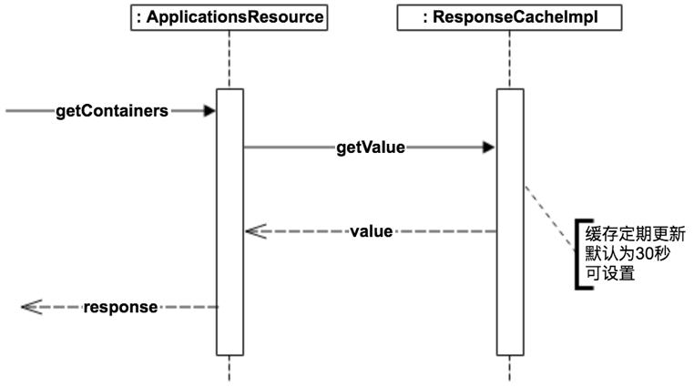
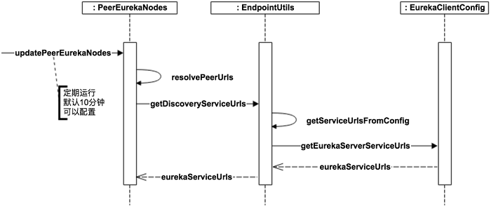

[深度剖析服务发现组件Netflix Eureka](https://blog.csdn.net/qiansg123/article/details/80127590)

[微服务注册中心 Eureka 架构深入解读](https://www.infoq.cn/article/jlDJQ*3wtN2PcqTDyokh)

[Eureka 源码解析](http://www.iocoder.cn/categories/Eureka/)

[SpringCloud源码阅读](https://juejin.im/post/5dd367ce5188254eed5b279)

# eureka 注册中心

spring boot中使用注解@EnableEurekaServer，开启一个eureka注册中心。

```java
@EnableEurekaServer
@SpringBootApplication
public class EurekaServerApplication {

    public static void main(String[] args) {
        SpringApplication.run(EurekaServerApplication.class, args);
    }

}
```

实际上`@EnableEurekaServer`仅仅是引入EurekaServerMarkerConfiguration，spring相关框架中有很多类似`xxxMarkerxxx`这样的注解.其实他们的意思就是一个**开关**。会在其他地方进行开关的判断，有对应`xxxMarkerxxx`类就表示打开，没有表示关闭。

```java
@Target(ElementType.TYPE)
@Retention(RetentionPolicy.RUNTIME)
@Documented
@Import(EurekaServerMarkerConfiguration.class)
public @interface EnableEurekaServer {

}

/**
 * Responsible for adding in a marker bean to activate
 * {@link EurekaServerAutoConfiguration}.
 *
 * @author Biju Kunjummen
 */
@Configuration(proxyBeanMethods = false)
public class EurekaServerMarkerConfiguration {

	@Bean
	public Marker eurekaServerMarkerBean() {
		return new Marker();
	}

	class Marker {

	}

}
```

`org.springframework.cloud.netflix.eureka.server`项目spring.factories资源文件中自动注入类`EurekaServerAutoConfiguration`，此类在自动注入的过程中，会判断开关是否打开来决定是否自动注入相关类

## EurekaServerAutoConfiguration

下面我们看看`EurekaServerAutoConfiguration`配置了什么东西。

```java
@Configuration
@Import(EurekaServerInitializerConfiguration.class)
@ConditionalOnBean(EurekaServerMarkerConfiguration.Marker.class)
@EnableConfigurationProperties({ EurekaDashboardProperties.class,
		InstanceRegistryProperties.class })
@PropertySource("classpath:/eureka/server.properties")
public class EurekaServerAutoConfiguration extends WebMvcConfigurerAdapter {
	...
}
```
(1.先看注解上相关配置
- 引入`EurekaServerInitializerConfiguration`类,此类继承了`SmartLifecycle`接口，所以会在spring启动完毕时回调此类的start()方法
- EurekaDashboardProperties 表示Euerka面板相关配置属性。例如：是否打开面板；面板的访问路径
- InstanceRegistryProperties 表示实例注册相关配置属性。例如：每分钟最大的续约数量，默认打开的通信数量 等
- 加载`/eureka/server.properties`的配置属性。

(2.再看类内部相关配置寻找类中的Bean

- HasFeatures 注册HasFeatures表示Eureka特征，
- EurekaServerConfigBean配置类，表示EurekaServer的配置信息。通过`@ConfigurationProperties(“eureka.server”)`映射我们的配置文件中的`eureka.server.xxxx`格式的配置信息（此类很重要啊，我们想修改EurekaServer的配置信息,可以配置`eureka.server.xxxx`覆盖此类中的默认配置）
- EurekaController： 面板的访问配置默认是“/”
- 注册编码器`(ServerCodecs)CloudServerCodecs`
- PeerAwareInstanceRegistry：对等节点同步器。 多个节点下复制相关。 与注册中心高可用有关的组件。此处注册的是 `InstanceRegistry`(**注意PeerAwareInstanceRegistry实现了AbstractInstanceRegistry，这里准确的说是 对等节点+当前节点同步器**）
- PeerEurekaNodes： Eureka-Server 集群节点的集合。存储了集群下各个节点信息。也是与高可用有关。
- EurekaServerContext : 上下文。默认注册的`DefaultEurekaServerContext`
- EurekaServerBootstrap: EurekaServer启动器。EurekaServerBootstrap
- FilterRegistrationBean： 注册 Jersey filter过滤器。这里有必要讲一下。Eureka也是servlet应用。不过他是通过Jersey 框架来提供接口的。Jersey 框架是一个类Springmvc的web框架。我们项目中大多都是使用springmvc来处理。所以注册 Jersey filter过滤器，把`/eureka`开头的请求都交给Jersey 框架去解析。容器是`com.sun.jersey.spi.container.servlet.ServletContainer`
- ApplicationResource： 暴漏`com.netflix.discovery","com.netflix.eureka"`包路径下的接口。通常我们再springmvc中通过Controller概念来表示接口，Jersey框架下用ApplicationResource的概念来表示接口。暴露的接口其实就是eureka各个应用通信的接口。(下面再说这些接口)

`EurekaServerAutoConfiguration`基本上就做了这些工作。我们来归类总结下

针对当前Eureka实例的相关组件：

- EurekaDashboardProperties：面板属性
- EurekaController: 面板的访问的处理器。
- InstanceRegistryProperties：实例注册相关属性
- (EurekaServerConfig)EurekaServerConfigBean：当前ErekekaServer相关配置
- EurekaServerContext ： 当前Eureka 注册中心上下文
- 请求相关组件：注册`/eureka`路径的相关接口，注册拦截`/eureka`的拦截器，注册`com.sun.jersey.spi.container.servlet.ServletContainer`容器来处理对应的请求

两个针对集群下相关组件：

- PeerAwareInstanceRegistry：用于集群下的节点相关复制信息用
- PeerEurekaNodes：集群下的所有节点信息

两个针对启动相关类：

- EurekaServerInitializerConfiguration： 对接spring，再spring启动完成后，调用
- EurekaServerBootstrap：启动器，用于启动当前Eureak实例的上下文

至此：我们也可以大致了解了一个EurekaServer大致长什么样子了。


## Eureka架构图及描述


 

 

 

1.**服务注册**(register)：Eureka Client会通过发送REST请求的方式向Eureka Server注册自己的服务，提供自身的元数据，比如ip地址、端口、运行状况指标的url、主页地址等信息。Eureka Server接收到注册请求后，就会把这些元数据信息存储在一个双层的Map中。  

2.**服务续约**(renew)：在服务注册后，Eureka Client会维护一个心跳来持续通知Eureka Server，说明服务一直处于可用状态，防止被剔除。Eureka Client在默认的情况下会每隔30秒(eureka.instance.leaseRenewallIntervalInSeconds)发送一次心跳来进行服务续约。  

3.**服务同步**(replicate)：Eureka Server之间会互相进行注册，构建Eureka Server集群，不同Eureka Server之间会进行服务同步，用来保证服务信息的一致性。 

4.**获取服务**(get registry)：服务消费者（Eureka Client）在启动的时候，会发送一个REST请求给Eureka Server，获取上面注册的服务清单，并且缓存在Eureka Client本地，默认缓存30秒(eureka.client.registryFetchIntervalSeconds)。同时，为了性能虑，Eureka Server也会维护一份只读的服务清单缓存，该缓存每隔30秒更新一次。  

5.**服务调用**：服务消费者在获取到服务清单后，就可以根据清单中的服务列表信息，查找到其他服务的地址，从而进行远程调用。Eureka有Region和Zone的概念，一个Region可以包含多个Zone，在进行服务调用时，优先访问处于同一个Zone中的服务提供者。 

6.**服务下线**(cancel)：当Eureka Client需要关闭或重启时，就不希望在这个时间段内再有请求进来，所以，就需要提前先发送REST请求给Eureka Server，告诉Eureka Server自己要下线了，Eureka Server在收到请求后，就会把该服务状态置为下线（DOWN），并把该下线事件传播出去。  

7.**服务剔除**(evict)：有时候，服务实例可能会因为网络故障等原因导致不能提供服务，而此时该实例也没有发送请求给Eureka Server来进行服务下线，所以，还需要有服务剔除的机制。Eureka Server在启动的时候会创建一个定时任务，每隔一段时间（默认60秒），从当前服务清单中把超时没有续约（默认90秒，eureka.instance.leaseExpirationDurationInSeconds）的服务剔除。

8.**自我保护**：既然Eureka Server会定时剔除超时没有续约的服务，那就有可能出现一种场景，网络一段时间内发生了异常，所有的服务都没能够进行续约，Eureka Server就把所有的服务都剔除了，这样显然不太合理。所以，就有了自我保护机制，当短时间内，统计续约失败的比例，如果达到一定阈值，则会触发自我保护的机制，在该机制下，Eureka Server不会剔除任何的微服务，等到正常后，再退出自我保护机制。自我保护开关(eureka.server.enable-self-preservation: false)

## 接口

Eureka是一个基于REST(Representational State Transfer)服务，我们从官方文档中可以看到其对外提供的接口： [官方文档](https://github.com/Netflix/eureka/wiki/Eureka-REST-operations)

**appID** 是应用名 

**instanceID** 是应用实例的唯一id 

| **Operation**                                                | **HTTP action**                                              | **Description**                                              |
| ------------------------------------------------------------ | ------------------------------------------------------------ | ------------------------------------------------------------ |
| Register new application instance                            | POST /eureka/v2/apps/**appID**                               | Input: JSON/XML payload HTTP Code: 204 on success            |
| De-register application instance                             | DELETE /eureka/v2/apps/**appID**/**instanceID**              | HTTP Code: 200 on success                                    |
| Send application instance heartbeat                          | PUT /eureka/v2/apps/**appID**/**instanceID**                 | HTTP Code:  * 200 on success  * 404 if **instanceID** doesn’t exist |
| Query for all instances                                      | GET /eureka/v2/apps                                          | HTTP Code: 200 on success Output: JSON/XML                   |
| Query for all **appID** instances                            | GET /eureka/v2/apps/**appID**                                | HTTP Code: 200 on success Output: JSON/XML                   |
| Query for a specific **appID**/**instanceID**                | GET /eureka/v2/apps/**appID**/**instanceID**                 | HTTP Code: 200 on success Output: JSON/XML                   |
| Query for a specific **instanceID**                          | GET /eureka/v2/instances/**instanceID**                      | HTTP Code: 200 on success Output: JSON/XML                   |
| Take instance out of service                                 | PUT /eureka/v2/apps/**appID**/**instanceID**/status?value=OUT_OF_SERVICE | HTTP Code:  * 200 on success  * 500 on failure               |
| Move instance back into service (remove override)            | DELETE /eureka/v2/apps/**appID**/**instanceID**/status?value=UP  (The value=UP is optional, it is used as a suggestion for the fallback status due to removal of the override) | HTTP Code:  * 200 on success  * 500 on failure               |
| Update metadata                                              | PUT /eureka/v2/apps/**appID**/**instanceID**/metadata?key=value | HTTP Code:  * 200 on success  * 500 on failure               |
| Query for all instances under a particular **vip address**   | GET /eureka/v2/vips/**vipAddress**                           | * HTTP Code: 200 on success Output: JSON/XML   * 404 if the **vipAddress** does not exist. |
| Query for all instances under a particular **secure vip address** | GET /eureka/v2/svips/**svipAddress**                         | * HTTP Code: 200 on success Output: JSON/XML   * 404 if the **svipAddress** does not exist. |

# EurekaServerContext初始化

EurekaServerContext作为上下文，应该是核心所在。上文讲过注册`DefaultEurekaServerContext`。此类中有`@Inject,@PostConstruct, @PreDestroy`注解的方法，重点来看看。

## 构造函数

`@Inject`注解的方法，参数由IOC容器注入。`serverConfig ,serverCodecs ,registry ,peerEurekaNodes`我们已经认识了。ApplicationInfoManager 是用来管理应用信息的，也就是实例注册信息，由ApplicationInfoManager统一管理。

```java
@Inject
public DefaultEurekaServerContext(EurekaServerConfig serverConfig,
                               ServerCodecs serverCodecs,
                               PeerAwareInstanceRegistry registry,
                               PeerEurekaNodes peerEurekaNodes,
                               ApplicationInfoManager applicationInfoManager) {
        this.serverConfig = serverConfig;
        this.serverCodecs = serverCodecs;
        this.registry = registry;
        this.peerEurekaNodes = peerEurekaNodes;
        this.applicationInfoManager = applicationInfoManager;
}
```

## initialize()方法

`@PostConstruct`修饰的方法会在服务器加载Servle的时候运行，并且只会被服务器执行一次，被`@PostConstruct`修饰的方法会在构造函数之后，init()方法之前运行.

```java
@PostConstruct
@Override
public void initialize() {
    
    	//完成新配置的eureka集群信息的初始化更新工作
        peerEurekaNodes.start();
        try {
            registry.init(peerEurekaNodes);
        } catch (Exception e) {
            throw new RuntimeException(e);
        }
    
}
```


# ----------------------------


# 服务注册-register

首先来看Register（服务注册），这个接口会在Service Provider启动时被调用来实现服务注册。同时，当Service Provider的服务状态发生变化时（如自身检测认为Down的时候），也会调用来更新服务状态。

接口实现比较简单，如下图所示。


1. ApplicationResource类接收Http服务请求，调用PeerAwareInstanceRegistryImpl的register方法
1. PeerAwareInstanceRegistryImpl完成服务注册后，调用replicateToPeers向其它Eureka Server节点（Peer）做状态同步（异步操作）

注册的服务列表保存在一个嵌套的hash map中：

1. 第一层hash map的key是app name，也就是应用名字
1. 第二层hash map的key是instance name，也就是实例名字
```java
private final ConcurrentHashMap<String, Map<String, Lease<InstanceInfo>>> registry =
new ConcurrentHashMap<String, Map<String, Lease<InstanceInfo>>>();
```

## ApplicationResource

```java
@POST
@Produces({"application/xml", "application/json"})
public class ApplicationResource {

    @POST
    @Consumes({"application/json", "application/xml"})
    public Response addInstance(InstanceInfo info,
                                @HeaderParam(PeerEurekaNode.HEADER_REPLICATION) String isReplication) {
        // 校验参数是否合法
        logger.debug("Registering instance {} (replication={})", info.getId(), isReplication);
        // validate that the instanceinfo contains all the necessary required fields
        if (isBlank(info.getId())) {
            return Response.status(400).entity("Missing instanceId").build();
        } else if (isBlank(info.getHostName())) {
            return Response.status(400).entity("Missing hostname").build();
        } else if (isBlank(info.getIPAddr())) {
            return Response.status(400).entity("Missing ip address").build();
        } else if (isBlank(info.getAppName())) {
            return Response.status(400).entity("Missing appName").build();
        } else if (!appName.equals(info.getAppName())) {
            return Response.status(400).entity("Mismatched appName, expecting " + appName + " but was " + info.getAppName()).build();
        } else if (info.getDataCenterInfo() == null) {
            return Response.status(400).entity("Missing dataCenterInfo").build();
        } else if (info.getDataCenterInfo().getName() == null) {
            return Response.status(400).entity("Missing dataCenterInfo Name").build();
        }

        // AWS 相关，跳过
        ......

        // 注册应用实例信息
        registry.register(info, "true".equals(isReplication));

        // 返回 204 成功
        return Response.status(204).build();  // 204 to be backwards compatible
    }

}
```

## PeerAwareInstanceRegistryImpl

```java
@Override
public void register(final InstanceInfo info, final boolean isReplication) {
   // 租约过期时间
   int leaseDuration = Lease.DEFAULT_DURATION_IN_SECS;
   if (info.getLeaseInfo() != null && info.getLeaseInfo().getDurationInSecs() > 0) {
       leaseDuration = info.getLeaseInfo().getDurationInSecs();
   }
   // 注册应用实例信息
   super.register(info, leaseDuration, isReplication);
   // Eureka-Server 复制
   replicateToPeers(Action.Register, info.getAppName(), info.getId(), info, null, isReplication);
}
```

### 租约-Lease

```java
public class Lease<T> {

    /**
     * 实体 租约的持有者。在 Eureka-Server 里，暂时只有 InstanceInfo 使用。
     */
    private T holder;
    /**
     * 注册时间戳 注册( 创建 )租约时间戳。在构造方法里可以看租约对象的创建时间戳即为注册租约时间戳。
     */
    private long registrationTimestamp;
    /**
     * 开始服务时间戳
     */
    private long serviceUpTimestamp;
    /**
     * 取消注册时间戳
     */
    private long evictionTimestamp;
    /**
     * 最后更新时间戳
     */
    // Make it volatile so that the expiration task would see this quicker
    private volatile long lastUpdateTimestamp;
    /**
     * 租约持续时长，单位：毫秒
     */
    private long duration;

    public Lease(T r, int durationInSecs) {
        holder = r;
        registrationTimestamp = System.currentTimeMillis();
        lastUpdateTimestamp = registrationTimestamp;
        duration = (durationInSecs * 1000);
    }
    
}
```

### super.register

```java
  public void register(InstanceInfo registrant, int leaseDuration, boolean isReplication) {
      try {
          // 获取读锁
          read.lock();
          Map<String, Lease<InstanceInfo>> gMap = registry.get(registrant.getAppName());
          // 增加 注册次数 到 监控
          REGISTER.increment(isReplication);
          // 获得 应用实例信息 对应的 租约
          if (gMap == null) {
             final ConcurrentHashMap<String, Lease<InstanceInfo>> gNewMap = new ConcurrentHashMap<String, Lease<InstanceInfo>>();
             gMap = registry.putIfAbsent(registrant.getAppName(), gNewMap); // 添加 应用
             if (gMap == null) { // 添加 应用 成功
                 gMap = gNewMap;
             }
         }
         Lease<InstanceInfo> existingLease = gMap.get(registrant.getId());
         // Retain the last dirty timestamp without overwriting it, if there is already a lease
         if (existingLease != null && (existingLease.getHolder() != null)) { // 已存在时，使用数据不一致的时间大的应用注册信息为有效的
             Long existingLastDirtyTimestamp = existingLease.getHolder().getLastDirtyTimestamp(); // Server 注册的 InstanceInfo
             Long registrationLastDirtyTimestamp = registrant.getLastDirtyTimestamp(); // Client 请求的 InstanceInfo
             logger.debug("Existing lease found (existing={}, provided={}", existingLastDirtyTimestamp, registrationLastDirtyTimestamp);
 
             // this is a > instead of a >= because if the timestamps are equal, we still take the remote transmitted
             // InstanceInfo instead of the server local copy.
             if (existingLastDirtyTimestamp > registrationLastDirtyTimestamp) {
                 logger.warn("There is an existing lease and the existing lease's dirty timestamp {} is greater" +
                         " than the one that is being registered {}", existingLastDirtyTimestamp, registrationLastDirtyTimestamp);
                 logger.warn("Using the existing instanceInfo instead of the new instanceInfo as the registrant");
                 registrant = existingLease.getHolder();
             }
         } else {
             // The lease does not exist and hence it is a new registration
             // 【自我保护机制】增加 `numberOfRenewsPerMinThreshold` 、`expectedNumberOfRenewsPerMin`
             synchronized (lock) {
                 if (this.expectedNumberOfRenewsPerMin > 0) {
                     // Since the client wants to cancel it, reduce the threshold
                     // (1
                     // for 30 seconds, 2 for a minute)
                     this.expectedNumberOfRenewsPerMin = this.expectedNumberOfRenewsPerMin + 2;
                     this.numberOfRenewsPerMinThreshold =
                             (int) (this.expectedNumberOfRenewsPerMin * serverConfig.getRenewalPercentThreshold());
                 }
             }
             logger.debug("No previous lease information found; it is new registration");
         }
         // 创建 租约
         Lease<InstanceInfo> lease = new Lease<InstanceInfo>(registrant, leaseDuration);
         if (existingLease != null) { // 若租约已存在，设置 租约的开始服务的时间戳
             lease.setServiceUpTimestamp(existingLease.getServiceUpTimestamp());
         }
         // 添加到 租约映射
         gMap.put(registrant.getId(), lease);
         // 添加到 最近注册的调试队列
         synchronized (recentRegisteredQueue) {
             recentRegisteredQueue.add(new Pair<Long, String>(
                     System.currentTimeMillis(),
                     registrant.getAppName() + "(" + registrant.getId() + ")"));
         }
         // 添加到 应用实例覆盖状态映射（Eureka-Server 初始化使用）
         // This is where the initial state transfer of overridden status happens
         if (!InstanceStatus.UNKNOWN.equals(registrant.getOverriddenStatus())) {
             logger.debug("Found overridden status {} for instance {}. Checking to see if needs to be add to the "
                             + "overrides", registrant.getOverriddenStatus(), registrant.getId());
             if (!overriddenInstanceStatusMap.containsKey(registrant.getId())) {
                 logger.info("Not found overridden id {} and hence adding it", registrant.getId());
                 overriddenInstanceStatusMap.put(registrant.getId(), registrant.getOverriddenStatus());
             }
         }
         InstanceStatus overriddenStatusFromMap = overriddenInstanceStatusMap.get(registrant.getId());
         if (overriddenStatusFromMap != null) {
             logger.info("Storing overridden status {} from map", overriddenStatusFromMap);
             registrant.setOverriddenStatus(overriddenStatusFromMap);
         }
 
         // 获得应用实例最终状态，并设置应用实例的状态
         // Set the status based on the overridden status rules
         InstanceStatus overriddenInstanceStatus = getOverriddenInstanceStatus(registrant, existingLease, isReplication);
         registrant.setStatusWithoutDirty(overriddenInstanceStatus);
 
         // 设置 租约的开始服务的时间戳（只有第一次有效）
         // If the lease is registered with UP status, set lease service up timestamp
         if (InstanceStatus.UP.equals(registrant.getStatus())) {
             lease.serviceUp();
         }
         // 设置 应用实例信息的操作类型 为 添加
         registrant.setActionType(ActionType.ADDED);
         // 添加到 最近租约变更记录队列
         recentlyChangedQueue.add(new RecentlyChangedItem(lease));
         // 设置 租约的最后更新时间戳
         registrant.setLastUpdatedTimestamp();
         // 设置 响应缓存 过期
         invalidateCache(registrant.getAppName(), registrant.getVIPAddress(), registrant.getSecureVipAddress());
         logger.info("Registered instance {}/{} with status {} (replication={})",
                 registrant.getAppName(), registrant.getId(), registrant.getStatus(), isReplication);
     } finally {
         // 释放锁
         read.unlock();
     }
 }
```

## 客户端

Service Provider要对外提供服务，一个很重要的步骤就是把自己注册到Eureka Server上。

这部分的实现比较简单，只需要在启动时和实例状态变化时调用Eureka Server的接口注册即可。需要注意的是，需要确保配置eureka.client.registerWithEureka=true。


# 服务续租-renew

Renew（服务续约）操作由Service Provider定期调用，类似于heartbeat。主要是用来告诉Eureka Server Service Provider还活着，避免服务被剔除掉。接口实现如下图所示。

可以看到，接口实现方式和register基本一致：首先更新自身状态，再同步到其它Peer。


## 客户端

Renew操作会在Service Provider端定期发起，用来通知Eureka Server自己还活着。这里有两个比较重要的配置需要注意一下：

1. eureka.instance.leaseRenewalIntervalInSeconds
    Renew频率。默认是30秒，也就是每30秒会向Eureka Server发起Renew操作；
1. eureka.instance.leaseExpirationDurationInSeconds
    服务失效时间。默认是90秒，也就是如果Eureka Server在90秒内没有接收到来自Service Provider的Renew操作，就会把Service Provider剔除。


# 服务下线-Cancel

Cancel（服务下线）一般在Service Provider shut down的时候调用，用来把自身的服务从Eureka Server中删除，以防客户端调用不存在的服务。接口实现如下图所示。


## 客户端

在Service Provider服务shut down的时候，需要及时通知Eureka Server把自己剔除，从而避免客户端调用已经下线的服务。

逻辑本身比较简单，通过对方法标记@PreDestroy，从而在服务shut down的时候会被触发。


# 获取注册信息-Fetch Registries

Fetch Registries由Service Consumer调用，用来获取Eureka Server上注册的服务。

为了提高性能，服务列表在Eureka Server会缓存一份，同时每30秒更新一次。



## 客户端

Service Consumer在启动时会从Eureka Server获取所有服务列表，并在本地缓存。需要注意的是，需要确保配置`eureka.client.shouldFetchRegistry`=true。


## 定期更新

由于在本地有一份缓存，所以需要定期更新，定期更新频率可以通过`eureka.client.registryFetchIntervalSeconds`配置。


# 失效服务剔除-Eviction

Eviction（失效服务剔除）用来定期（默认为每60秒）在Eureka Server检测失效的服务，检测标准就是超过一定时间没有Renew的服务。

默认失效时间为90秒，也就是如果有服务超过90秒没有向Eureka Server发起Renew请求的话，就会被当做失效服务剔除掉。

失效时间可以通过eureka.instance.leaseExpirationDurationInSeconds进行配置，定期扫描时间可以通过eureka.server.evictionIntervalTimerInMs进行配置。

接口实现逻辑见下图：


# 集群

## 集群同步

在前面的Register、Renew、Cancel接口实现中，我们看到了都会有replicateToPeers操作，这个就是用来做Peer之间的状态同步。

通过这种方式，Service Provider只需要通知到任意一个Eureka Server后就能保证状态会在所有的Eureka Server中得到更新。

具体实现方式其实很简单，就是接收到Service Provider请求的Eureka Server，把请求再次转发到其它的Eureka Server，调用同样的接口，传入同样的参数，除了会在header中标记isReplication=true，从而避免重复的replicate。

1. Peer之间的状态是采用**异步**方式同步的，所以不保证节点间的状态一定是一致的，不过基本能保证最终状态是一致的。
   
1. 结合服务发现的场景，实际上也并不需要节点间的状态强一致。在一段时间内（比如30秒），节点A比节点B多一个服务实例或少一个服务实例，在业务上也是完全可以接受的（Service Consumer侧一般也会实现错误重试和负载均衡机制）。
   
1. 所以按照CAP理论，Eureka的选择就是放弃C，选择AP，最终一致性。
## 节点发现

那大家可能会有疑问，Eureka Server是怎么知道有多少Peer的呢？

Eureka Server在启动后会调用EurekaClientConfig.getEurekaServerServiceUrls来获取所有的Peer节点，并且会定期更新。定期更新频率可以通过eureka.server.peerEurekaNodesUpdateIntervalMs配置。

这个方法的默认实现是从配置文件读取，所以如果Eureka Server节点相对固定的话，可以通过在配置文件中配置来实现。

如果希望能更灵活的控制Eureka Server节点，比如动态扩容/缩容，那么可以override getEurekaServerServiceUrls方法，提供自己的实现，比如我们的项目中会通过数据库读取Eureka Server列表。

具体实现如下图所示：




## 节点初始化

最后再来看一下一个新的Eureka Server节点加进来，或者Eureka Server重启后，如何来做初始化，从而能够正常提供服务。

具体实现如下图所示，简而言之就是启动时把自己当做是Service Consumer从其它Peer Eureka获取所有服务的注册信息。然后对每个服务，在自己这里执行Register，isReplication=true，从而完成初始化。


