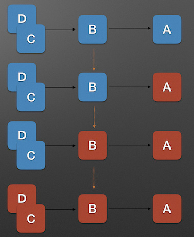
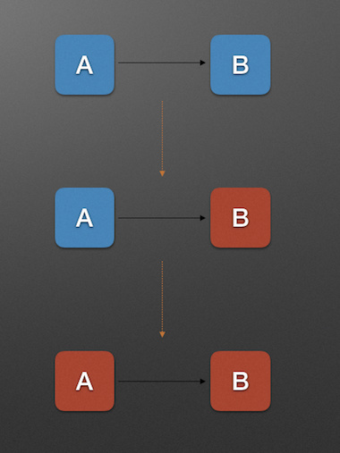
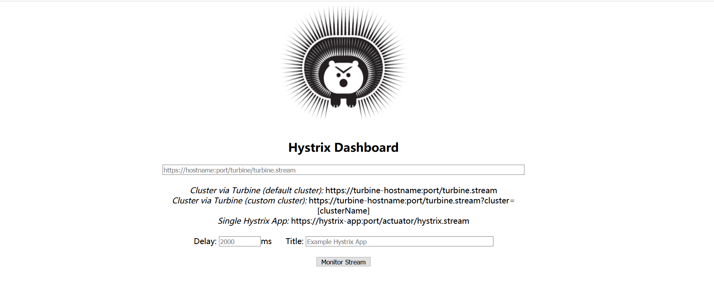
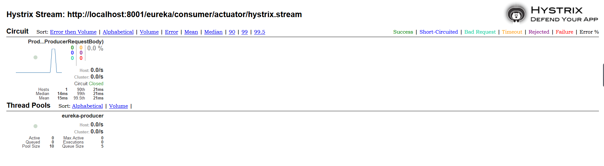
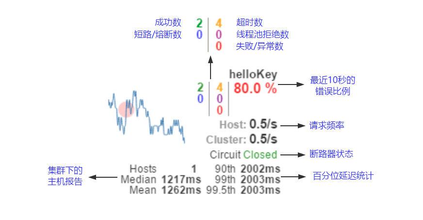
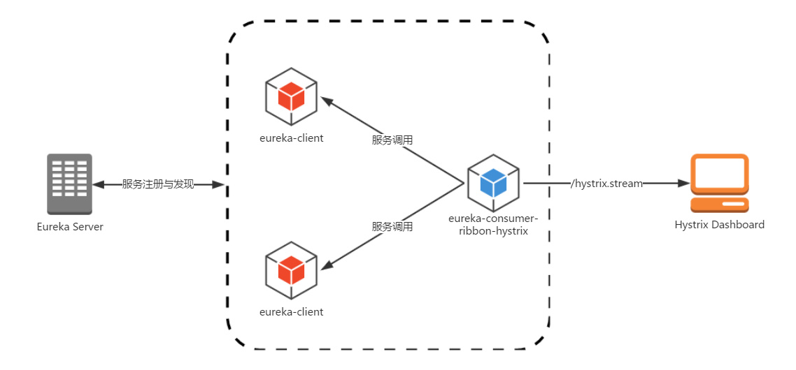
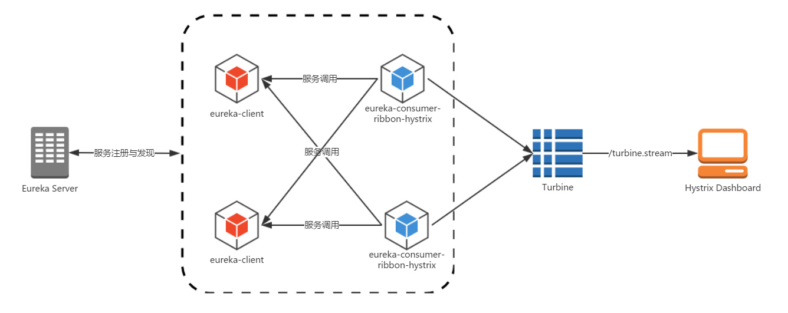

 分布式系统中经常会出现某个基础服务不可用造成整个系统不可用的情况，这种现象被称为服务雪崩效应。为了应对服务雪崩，一种常见的做法是手动服务降级。而 Hystrix 的出现，给我们提供了另一种选择。

[](https://src.windmt.com/img/006tNc79ly1fqdrcb4m2rj30hs069mz8.jpg)

> Hystrix [hɪst’rɪks] 的中文含义是 “豪猪”，豪猪周身长满了刺，能保护自己不受天敌的伤害，代表了一种防御机制，这与 Hystrix 本身的功能不谋而合，因此 Netflix 团队将该框架命名为 Hystrix，并使用了对应的卡通形象做作为 logo。

# 服务雪崩效应

## 定义

服务雪崩效应是一种因 **服务提供者** 的不可用导致 **服务调用者** 的不可用，并将不可用 **逐渐放大** 的过程。如果所示:
[](https://src.windmt.com/img/006tNc79ly1fqdrhznd6yj30ak0cyaep.jpg)
上图中，A 为服务提供者，B 为 A 的服务调用者，C 和 D 是 B 的服务调用者。当 A 的不可用，引起 B 的不可用，并将不可用逐渐放大 C 和 D 时，服务雪崩就形成了。

## 形成的原因

我把服务雪崩的参与者简化为 **服务提供者** 和 **服务调用者**，并将服务雪崩产生的过程分为以下三个阶段来分析形成的原因:

1. 服务提供者不可用
2. 重试加大流量
3. 服务调用者不可用

[](https://src.windmt.com/img/006tNc79ly1fqdriwoonkj30ak0e3gpl.jpg)

服务雪崩的每个阶段都可能由不同的原因造成，比如造成 **服务不可用** 的原因有:

- 硬件故障
- 程序 Bug
- 缓存击穿
- 用户大量请求

硬件故障可能为硬件损坏造成的服务器主机宕机，网络硬件故障造成的服务提供者的不可访问。
缓存击穿一般发生在缓存应用重启，所有缓存被清空时，以及短时间内大量缓存失效时。大量的缓存不命中，使请求直击后端，造成服务提供者超负荷运行，引起服务不可用。
在秒杀和大促开始前，如果准备不充分，用户发起大量请求也会造成服务提供者的不可用。

而形成 **重试加大流量** 的原因有:

- 用户重试
- 代码逻辑重试

在服务提供者不可用后，用户由于忍受不了界面上长时间的等待，而不断刷新页面甚至提交表单。
服务调用端的会存在大量服务异常后的重试逻辑。
这些重试都会进一步加大请求流量。

最后，**服务调用者不可用** 产生的主要原因是:

- 同步等待造成的资源耗尽

当服务调用者使用 **同步调用** 时，会产生大量的等待线程占用系统资源。一旦线程资源被耗尽，服务调用者提供的服务也将处于不可用状态，于是服务雪崩效应产生了。

## 应对策略

针对造成服务雪崩的不同原因，可以使用不同的应对策略:

1. 流量控制
2. 改进缓存模式
3. 服务自动扩容
4. 服务调用者降级服务

**流量控制** 的具体措施包括:

- 网关限流
- 用户交互限流
- 关闭重试

因为 Nginx 的高性能，目前一线互联网公司大量采用 Nginx+Lua 的网关进行流量控制，由此而来的 OpenResty 也越来越热门。

用户交互限流的具体措施有: 1. 采用加载动画，提高用户的忍耐等待时间。2. 提交按钮添加强制等待时间机制。

**改进缓存模式** 的措施包括:

- 缓存预加载
- 同步改为异步刷新

**服务自动扩容** 的措施主要有:

- AWS 的 auto scaling

**服务调用者降级服务** 的措施包括:

- 资源隔离
- 对依赖服务进行分类
- 不可用服务的调用快速失败

资源隔离主要是对调用服务的线程池进行隔离。

我们根据具体业务，将依赖服务分为：强依赖和若依赖。强依赖服务不可用会导致当前业务中止，而弱依赖服务的不可用不会导致当前业务的中止。

不可用服务的调用快速失败一般通过 **超时机制** , **熔断器** 和熔断后的 **降级方法** 来实现。

# 使用 Hystrix 预防服务雪崩

## 服务降级（Fallback）

对于查询操作，我们可以实现一个 fallback 方法，当请求后端服务出现异常的时候，可以使用 fallback 方法返回的值。fallback 方法的返回值一般是设置的默认值或者来自缓存。

## 资源隔离

货船为了进行防止漏水和火灾的扩散，会将货仓分隔为多个，如下图所示:

[](https://src.windmt.com/img/006tNc79ly1fqdrrru8tcj30ja08ytgf.jpg)

这种资源隔离减少风险的方式被称为: Bulkheads (舱壁隔离模式)。
Hystrix 将同样的模式运用到了服务调用者上。

在 Hystrix 中，主要通过线程池来实现资源隔离。通常在使用的时候我们会根据调用的远程服务划分出多个线程池。例如调用产品服务的 Command 放入 A 线程池，调用账户服务的 Command 放入 B 线程池。这样做的主要优点是运行环境被隔离开了。这样就算调用服务的代码存在 bug 或者由于其他原因导致自己所在线程池被耗尽时，不会对系统的其他服务造成影响。
通过对依赖服务的线程池隔离实现，可以带来如下优势：

- 应用自身得到完全的保护，不会受不可控的依赖服务影响。即便给依赖服务分配的线程池被填满，也不会影响应用自身的额其余部分。
- 可以有效的降低接入新服务的风险。如果新服务接入后运行不稳定或存在问题，完全不会影响到应用其他的请求。
- 当依赖的服务从失效恢复正常后，它的线程池会被清理并且能够马上恢复健康的服务，相比之下容器级别的清理恢复速度要慢得多。
- 当依赖的服务出现配置错误的时候，线程池会快速的反应出此问题（通过失败次数、延迟、超时、拒绝等指标的增加情况）。同时，我们可以在不影响应用功能的情况下通过实时的动态属性刷新（后续会通过 Spring Cloud Config 与 Spring Cloud Bus 的联合使用来介绍）来处理它。
- 当依赖的服务因实现机制调整等原因造成其性能出现很大变化的时候，此时线程池的监控指标信息会反映出这样的变化。同时，我们也可以通过实时动态刷新自身应用对依赖服务的阈值进行调整以适应依赖方的改变。
- 除了上面通过线程池隔离服务发挥的优点之外，每个专有线程池都提供了内置的并发实现，可以利用它为同步的依赖服务构建异步的访问。

总之，通过对依赖服务实现线程池隔离，让我们的应用更加健壮，不会因为个别依赖服务出现问题而引起非相关服务的异常。同时，也使得我们的应用变得更加灵活，可以在不停止服务的情况下，配合动态配置刷新实现性能配置上的调整。

虽然线程池隔离的方案带了如此多的好处，但是很多使用者可能会担心为每一个依赖服务都分配一个线程池是否会过多地增加系统的负载和开销。对于这一点，使用者不用过于担心，因为这些顾虑也是大部分工程师们会考虑到的，Netflix 在设计 Hystrix 的时候，认为线程池上的开销相对于隔离所带来的好处是无法比拟的。同时，Netflix 也针对线程池的开销做了相关的测试，以证明和打消 Hystrix 实现对性能影响的顾虑。

下图是 Netflix Hystrix 官方提供的一个 Hystrix 命令的性能监控，该命令以每秒 60 个请求的速度（QPS）向一个单服务实例进行访问，该服务实例每秒运行的线程数峰值为 350 个。

[](https://src.windmt.com/img/006tNc79ly1fqdppn9wwgj30pr0fymyd.jpg)

从图中的统计我们可以看到，使用线程池隔离与不使用线程池隔离的耗时差异如下表所示：

| 比较情况  | 未使用线程池隔离 | 使用了线程池隔离 | 耗时差距 |
| :-------- | :--------------- | :--------------- | :------- |
| 中位数    | 2ms              | 2ms              | 2ms      |
| 90 百分位 | 5ms              | 8ms              | 3ms      |
| 99 百分位 | 28ms             | 37ms             | 9ms      |

在 99% 的情况下，使用线程池隔离的延迟有 9ms，对于大多数需求来说这样的消耗是微乎其微的，更何况为系统在稳定性和灵活性上所带来的巨大提升。虽然对于大部分的请求我们可以忽略线程池的额外开销，而对于小部分延迟本身就非常小的请求（可能只需要 1ms），那么 9ms 的延迟开销还是非常昂贵的。实际上 Hystrix 也为此设计了另外的一个解决方案：信号量（Semaphores）。

Hystrix 中除了使用线程池之外，还可以使用信号量来控制单个依赖服务的并发度，信号量的开销要远比线程池的开销小得多，但是它不能设置超时和实现异步访问。所以，只有在依赖服务是足够可靠的情况下才使用信号量。在 HystrixCommand 和 HystrixObservableCommand 中 2 处支持信号量的使用：

- 命令执行：如果隔离策略参数 execution.isolation.strategy 设置为 SEMAPHORE，Hystrix 会使用信号量替代线程池来控制依赖服务的并发控制。
- 降级逻辑：当 Hystrix 尝试降级逻辑时候，它会在调用线程中使用信号量。

信号量的默认值为 10，我们也可以通过动态刷新配置的方式来控制并发线程的数量。对于信号量大小的估算方法与线程池并发度的估算类似。仅访问内存数据的请求一般耗时在 1ms 以内，性能可以达到 5000rps，这样级别的请求我们可以将信号量设置为 1 或者 2，我们可以按此标准并根据实际请求耗时来设置信号量。

## 断路器模式

断路器模式源于 Martin Fowler 的 [Circuit Breaker](https://martinfowler.com/bliki/CircuitBreaker.html) 一文。“断路器” 本身是一种开关装置，用于在电路上保护线路过载，当线路中有电器发生短路时，“断路器” 能够及时的切断故障电路，防止发生过载、发热、甚至起火等严重后果。

在分布式架构中，断路器模式的作用也是类似的，当某个服务单元发生故障（类似用电器发生短路）之后，通过断路器的故障监控（类似熔断保险丝），直接切断原来的主逻辑调用。但是，在 Hystrix 中的断路器除了切断主逻辑的功能之外，还有更复杂的逻辑，下面我们来看看它更为深层次的处理逻辑。

断路器开关相互转换的逻辑如下图：

[](https://src.windmt.com/img/006tNc79ly1fqdp243wfbj30dv06zwgz.jpg)

当 Hystrix Command 请求后端服务失败数量超过一定阈值，断路器会切换到开路状态 (Open)。这时所有请求会直接失败而不会发送到后端服务。

> 这个阈值涉及到三个重要参数：快照时间窗、请求总数下限、错误百分比下限。这个参数的作用分别是：
> 快照时间窗：断路器确定是否打开需要统计一些请求和错误数据，而统计的时间范围就是快照时间窗，默认为最近的 10 秒。
> 请求总数下限：在快照时间窗内，必须满足请求总数下限才有资格进行熔断。默认为 20，意味着在 10 秒内，如果该 Hystrix Command 的调用此时不足 20 次，即时所有的请求都超时或其他原因失败，断路器都不会打开。
> 错误百分比下限：当请求总数在快照时间窗内超过了下限，比如发生了 30 次调用，如果在这 30 次调用中，有 16 次发生了超时异常，也就是超过 50% 的错误百分比，在默认设定 50% 下限情况下，这时候就会将断路器打开。

断路器保持在开路状态一段时间后 (默认 5 秒)，自动切换到半开路状态 (HALF-OPEN)。这时会判断下一次请求的返回情况，如果请求成功，断路器切回闭路状态 (CLOSED)，否则重新切换到开路状态 (OPEN)。

# 使用 Feign Hystrix

因为熔断只是作用在服务调用这一端，因此我们根据上一篇的示例代码只需要改动 eureka-consumer-feign 项目相关代码就可以。

**属性配置**

```yml
feign:
  hystrix:
    enabled: true
```

**降级回调**

```java
@Component
public class ProducerServiceFallback implements ProducerService {

    private static final Producer PRODUCER=new Producer();

    static {
        PRODUCER.setData("服务降级");
    }

    @Override
    public Producer get(@RequestBody ProducerRequestBody body) {
        return PRODUCER;
    }

}

@FeignClient(name = "eureka-producer" , fallback = ProducerServiceFallback.class)
public interface ProducerService {

    @PostMapping("/eureka/producer/get")
    Producer get(@RequestBody ProducerRequestBody body);

}
```

**正常访问**

```json
{
    "name": "lcm",
    "data": "test",
    "time": "2020-06-27 09:23:02"
}
```

**服务降级**

```json
{
    "name": null,
    "data": "服务降级",
    "time": null
}
```


# Hystrix 监控面板

我们提到断路器是根据一段时间窗内的请求情况来判断并操作断路器的打开和关闭状态的。而这些请求情况的指标信息都是 HystrixCommand 和 HystrixObservableCommand 实例在执行过程中记录的重要度量信息，它们除了 Hystrix 断路器实现中使用之外，对于系统运维也有非常大的帮助。这些指标信息会以 “滚动时间窗” 与 “桶” 结合的方式进行汇总，并在内存中驻留一段时间，以供内部或外部进行查询使用，Hystrix Dashboard 就是这些指标内容的消费者之一。

## 创建Hystrix Dashboard

```xml
<dependency>
    <groupId>org.springframework.cloud</groupId>
    <artifactId>spring-cloud-starter-netflix-hystrix</artifactId>
</dependency>
<dependency>
    <groupId>org.springframework.cloud</groupId>
    <artifactId>spring-cloud-starter-netflix-hystrix-dashboard</artifactId>
</dependency>
```

```java
@EnableHystrixDashboard
@SpringBootApplication
public class HystrixDashboardApplication {

    public static void main(String[] args) {
        SpringApplication.run(HystrixDashboardApplication.class, args);
    }

}
```

```yml
server:
  port: 11000

spring:
  application:
    name: hystrix-dashboard
```

http://localhost:11000/hystrix页面



通过 Hystrix Dashboard 主页面的文字介绍，我们可以知道，Hystrix Dashboard 共支持三种不同的监控方式：

- 默认的集群监控：通过 URL：<http://turbine-hostname:port/turbine.stream> 开启，实现对默认集群的监控。
- 指定的集群监控：通过 URL：<http://turbine-hostname:port/turbine.stream?cluster=[clusterName]> 开启，实现对 clusterName 集群的监控。
- 单体应用的监控： 通过 URL：http://hystrix-app:port/actuator/hystrix.stream 开启 ，实现对具体某个服务实例的监控。

前两者都对集群的监控，需要整合 Turbine 才能实现。

## 服务实例添加 endpoint

既然 Hystrix Dashboard 监控单实例节点需要通过访问实例的 `/actuator/hystrix.stream` 接口来实现，自然我们需要为服务实例添加这个 endpoint。

在服务实例 `pom.xml` 中的 `dependencies` 节点中新增 `spring-boot-starter-actuator` 监控模块以开启监控相关的端点，并确保已经引入断路器的依赖 `spring-cloud-starter-netflix-hystrix`

```xml
<dependency>
    <groupId>org.springframework.cloud</groupId>
    <artifactId>spring-cloud-starter-netflix-hystrix</artifactId>
</dependency>
<dependency>
    <groupId>org.springframework.boot</groupId>
    <artifactId>spring-boot-starter-actuator</artifactId>
</dependency>
```
为启动类添加 @EnableCircuitBreaker 或 @EnableHystrix 注解，开启断路器功能。
```java
@EnableHystrix
@EnableFeignClients
@SpringBootApplication
public class EurekaConsumerApplication {

    public static void main(String[] args) {
        SpringApplication.run(EurekaConsumerApplication.class, args);
    }

}
```

配置文件

```yml
management:
  endpoints:
    web:
      exposure:
        include: hystrix.stream
```

## 测试

在 Hystrix-Dashboard 的主界面上输入 eureka-consumer-feign-hystrix 对应的地址 http://localhost:8001/eureka/consumer/actuator/hystrix.stream 然后点击 Monitor Stream 按钮，进入页面。

如果没有请求会一直显示 “Loading…”

访问一下接口，显示：



以上图来说明其中各元素的具体含义：

- 实心圆：它有颜色和大小之分，分别代表实例的监控程度和流量大小。如上图所示，它的健康度从绿色、黄色、橙色、红色递减。通过该实心圆的展示，我们就可以在大量的实例中快速的发现故障实例和高压力实例。
- 曲线：用来记录 2 分钟内流量的相对变化，我们可以通过它来观察到流量的上升和下降趋势。
- 其他一些数量指标如下图所示
  [](https://src.windmt.com/img/006tNc79ly1fqeflypfdaj30o80cldhq.jpg)

# Hystrix 聚合 Turbine

[解决 Spring Cloud 的服务应用配置 context-path 后 Spring Cloud Hystrix Turbine 监控不到信息的问题](https://blog.csdn.net/hubo_88/article/details/82255725)

[Spring Cloud Turbine(集群监控)](https://www.jianshu.com/p/590bad4c8947)

使用 Hystrix Dashboard 来展示 Hystrix 用于熔断的各项度量指标。通过 Hystrix Dashboard，我们可以方便的查看服务实例的综合情况，比如：服务调用次数、服务调用延迟等。但是仅通过 Hystrix Dashboard 我们只能实现对服务当个实例的数据展现，在生产环境我们的服务是肯定需要做高可用的，那么**对于多实例的情况，我们就需要将这些度量指标数据进行聚合**。下面，在本篇中，我们就来介绍一下另外一个工具：Turbine。

在开始使用 Turbine 之前，我们先回顾一下上一篇中实现的架构，如下图所示：

[](https://src.windmt.com/img/006tNc79ly1fqekbdszlgj30vm0eq75c.jpg)

## http收集聚合



1.添加依赖

```xml
<dependency>
    <groupId>org.springframework.cloud</groupId>
    <artifactId>spring-cloud-starter-netflix-turbine</artifactId>
</dependency>
```

2.开启聚合

```java
@EnableTurbine
@SpringBootApplication
public class TurbineApplication {

    public static void main(String[] args) {
        SpringApplication.run(TurbineApplication.class, args);
    }

}
```

3.1 Turbine属性配置

```yml
server:
  port: 8080

spring:
  application:
    name: turbine

management:
  port: 8081
eureka:
  client:
    service-url:
      defaultZone: http://localhost:7000/eureka/

turbine:
  #参数指定了需要收集监控信息的服务名
  app-config: eureka-consumer
  aggregator:
    cluster-config: eureka-consumer
  #参数指定了集群名称为 default
  cluster-name-expression: metadata['cluster']
  combine-host-port: true
  #instanceUrlSuffix: eureka/consumer/actuator/hystrix.stream
  instanceUrlSuffix:
    eureka-consumer: eureka/consumer/actuator/hystrix.stream
```

turbine.aggregator.cluster-config: 指定聚合哪些集群,多个使用","分割，默认为default。 

turbine.app-config: 配置监控服务的列表，表明监控哪些服务多个使用","分割 

turbine.cluster-name-expression: 用于指定集群名称，当服务数量非常多的时候，可以启动多个Turbine服务来构建不同的聚合集群，而该参数可以用来区分这些不同的聚合集群，同时该参数值可以再Hystrix仪表盘中用来定位不同的聚合集群， 只需在Hystrix Stream的URL中通过cluster参数来指定当clusterNameExpression: metadata['cluster']时，假设想要监控的应用配置了eureka.instance.metadata-map.cluster: ABC，则需要配置，同时turbine.aggregator.clusterConfig: ABC

turbine.combine-host-port参数设置为true，可以让同一主机上的服务通过主机名与端口号的组合来进行区分，默认情况下会以host来区分不同的服务，这会使得在本机调试的时候，本机上的不同服务聚合成一个服务来统计。

3.2 服务属性配置

```yml
eureka:
  client:
    service-url:
      defaultZone: http://localhost:7000/eureka/
  instance:
    metadata-map:
      cluster: eureka-consumer
```

查看 http://localhost:8080/turbine.stream?cluster=eureka-consumer

## 消息代理收集聚合

