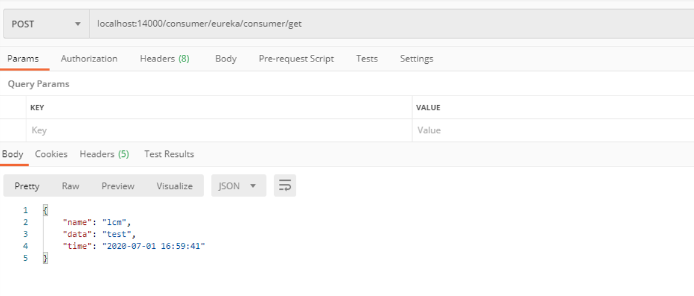
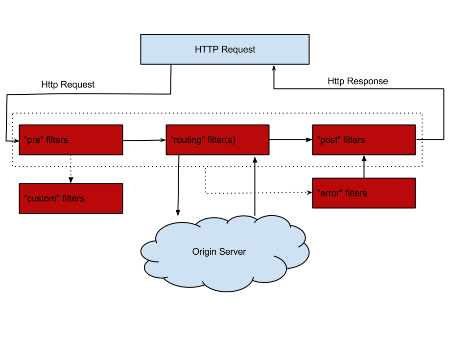
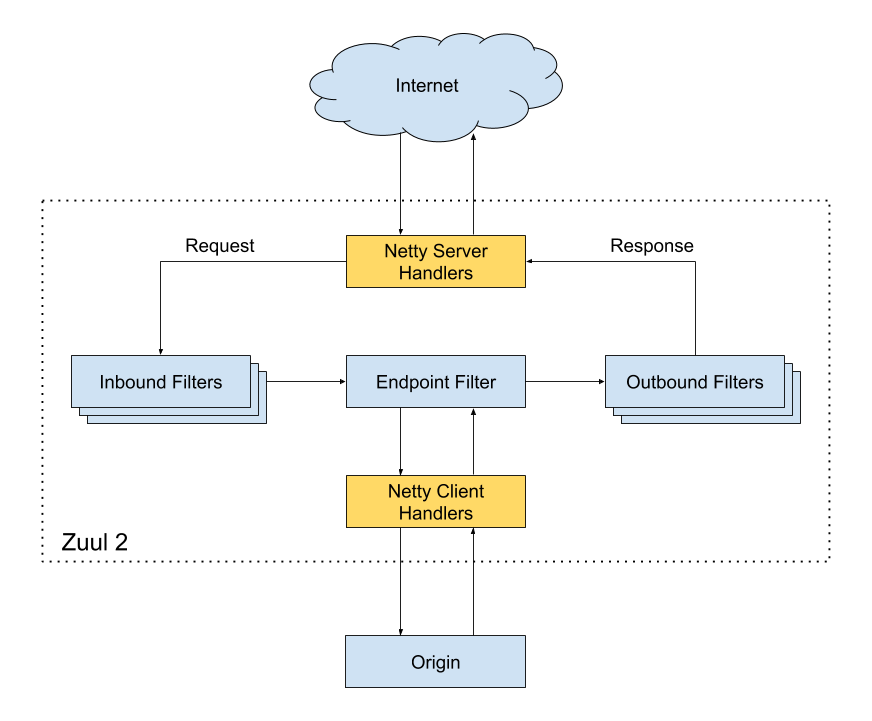
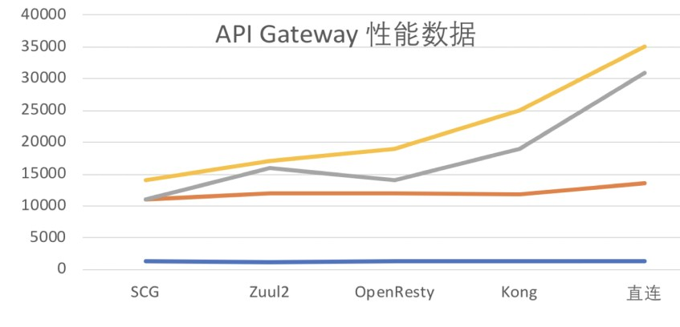

通过之前几篇 Spring Cloud 中几个核心组件的介绍，我们已经可以构建一个简略的微服务架构了，可能像下图这样：


我们使用 Spring Cloud Netflix 中的 Eureka 实现了服务注册中心以及服务注册与发现；而服务间通过 Ribbon 或 Feign 实现服务的消费以及均衡负载；通过 Spring Cloud Config 实现了应用多环境的外部化配置以及版本管理。为了使得服务集群更为健壮，使用 Hystrix 的融断机制来避免在微服务架构中个别服务出现异常时引起的故障蔓延。似乎一个微服务框架已经完成了。

我们还是少考虑了一个问题，外部的应用如何来访问内部各种各样的微服务呢？在微服务架构中，后端服务往往不直接开放给调用端，而是通过一个 API 网关根据请求的 URL，路由到相应的服务。当添加 API 网关后，在第三方调用端和服务提供方之间就创建了一面墙，这面墙直接与调用方通信进行权限控制，后将请求均衡分发给后台服务端。


# 为什么需要 API Gateway

[百亿流量 API 网关设计与实践](https://blog.csdn.net/oooo_mumuxi/article/details/96477324)

[Zuul【基础配置】](https://www.cnblogs.com/idoljames/p/11729561.html)

**1、简化客户端调用复杂度**
在微服务架构模式下后端服务的实例数一般是动态的，对于客户端而言很难发现动态改变的服务实例的访问地址信息。因此在基于微服务的项目中为了简化前端的调用逻辑，通常会引入 API Gateway 作为轻量级网关，同时 API Gateway 中也会实现相关的认证逻辑从而简化内部服务之间相互调用的复杂度。


**2、数据裁剪以及聚合**
通常而言不同的客户端对于显示时对于数据的需求是不一致的，比如手机端或者 Web 端又或者在低延迟的网络环境或者高延迟的网络环境。

因此为了优化客户端的使用体验，API Gateway 可以对通用性的响应数据进行裁剪以适应不同客户端的使用需求。同时还可以将多个 API 调用逻辑进行聚合，从而减少客户端的请求数，优化客户端用户体验

**3、多渠道支持**
当然我们还可以针对不同的渠道和客户端提供不同的 API Gateway, 对于该模式的使用由另外一个大家熟知的方式叫 Backend for front-end, 在 Backend for front-end 模式当中，我们可以针对不同的客户端分别创建其 BFF，进一步了解 BFF 可以参考这篇文章：[Pattern: Backends For Frontends](http://samnewman.io/patterns/architectural/bff/)

[](https://src.windmt.com/img/006tNc79ly1fqmdulzjxuj30ke0dc0tp.jpg)

**4、遗留系统的微服务化改造**
对于系统而言进行微服务改造通常是由于原有的系统存在或多或少的问题，比如技术债务，代码质量，可维护性，可扩展性等等。API Gateway 的模式同样适用于这一类遗留系统的改造，通过微服务化的改造逐步实现对原有系统中的问题的修复，从而提升对于原有业务响应力的提升。通过引入抽象层，逐步使用新的实现替换旧的实现。

[](https://src.windmt.com/img/006tNc79ly1fqmduv84imj30v20hejta.jpg)

在 Spring Cloud 体系中， Spring Cloud Zuul 就是提供负载均衡、反向代理、权限认证的一个 API Gateway。


# 使用

## 依赖

```xml
<dependency>
    <groupId>org.springframework.cloud</groupId>
    <artifactId>spring-cloud-starter-netflix-zuul</artifactId>
</dependency>

<dependency>
    <groupId>org.springframework.cloud</groupId>
    <artifactId>spring-cloud-starter-netflix-eureka-client</artifactId>
</dependency>
```

## 开启 Zuul 

使用 `@EnableZuulProxy` 注解开启 Zuul 的功能

```java
@EnableZuulProxy
@SpringBootApplication
public class ZuulGatewayApplication {

    public static void main(String[] args) {
        SpringApplication.run(ZuulGatewayApplication.class, args);
    }

}
```

## 配置文件

```yml
server:
  port: 14000

spring:
  application:
    name: zuul-gateway

eureka:
  client:
    service-url:
      defaultZone: http://localhost:7000/eureka/

zuul:
  routes:
    consumer:
      path: /consumer/**
      serviceId: eureka-consumer
    producer:
      path: /producer/**
      serviceId: eureka-producer
```

## 测试




# Zuul/Zuul2

> 项目地址：<https://github.com/Netflix/zuul>
>
> Zuul 是 Netflix 开源的 API 网关系统，它的主要设计目标是动态路由、监控、弹性和安全。
>
> Zuul 的内部原理可以简单看做是很多不同功能 filter 的集合（PS：作为对比，ESB  也可以简单被看做是管道（channel）和过滤器（filter）的集合），这些 filter 可以使用 Groovy 或其他基于 JVM  的脚本编写（当然 Java 也可以编写），放置在指定的位置，然后可以被 Zuul Server 轮询发现变动后动态加载并实时生效。

Zuul 目前有两个大的版本，1.x 和 2.x，这两个版本差别很大。

## Zuul 1.x

Zuul 1.x 基于同步 IO，也是 Spring Cloud 全家桶的一部分，可以方便的配合 Spring Boot/Spring Cloud 配置和使用。

在 Zuul 1.x 里，filter 的种类和处理流程可以参见下图，最主要的就是 pre、routing、post 这三种过滤器，分别作用于调用业务服务 API 之前的请求处理、直接响应、调用业务服务 API 之后的响应处理。

## Zuul 2.x

Zuul 2.x 最大的改进就是基于 Netty Server 实现了异步 IO 来接入请求，同时基于 Netty Client  实现了到后端业务服务 API 的请求。这样就可以实现更高的性能、更低的延迟。此外也调整了 filter 类型，将原来的三个核心 filter  显式命名为：Inbound Filter、Endpoint Filter 和 Outbound Filter。



Zuul 2.x 核心功能：

- Service Discovery
- Load Balancing
- Connection Pooling
- Status Categories
- Retries
- Request Passport
- Request Attempts
- Origin Concurrency Protection
- HTTP/2
- Mutual TLS
- Proxy Protocol
- GZip
- WebSockets

# 网关选型

**OpenResty/Kong/Zuul2/SpringCloudGateway 重要特性对比**

| 网关                 | 限流                                                         | 鉴权                                  | 监控                                                         | 易用性                                               | 可维护性                              | 成熟度                                 |
| -------------------- | ------------------------------------------------------------ | ------------------------------------- | ------------------------------------------------------------ | ---------------------------------------------------- | ------------------------------------- | -------------------------------------- |
| Spring Cloud Gateway | 可以通过IP，用户，集群限流，提供了相应的接口进行扩展         | 普通鉴权、auth2.0                     | Gateway Metrics Filter                                       | 简单易用                                             | spring系列可扩展强，易配置 可维护性好 | spring社区成熟，但gateway资源较少      |
| Zuul2                | 可以通过配置文件配置集群限流和单服务器限流亦可通过filter实现限流扩展 | filter中实现                          | filter中实现                                                 | 参考资料较少                                         | 可维护性较差                          | 开源不久，资料少                       |
| OpenResty            | 需要lua开发                                                  | 需要lua开发                           | 需要开发                                                     | 简单易用，但是需要进行的lua开发很多                  | 可维护性较差，将来需要维护大量lua脚本 | 很成熟资料很多                         |
| Kong                 | 根据秒，分，时，天，月，年，根据用户进行限流。可在原码的基础上进行开发 | 普通鉴权，Key Auth鉴权，HMAC，auth2.0 | 可上报datadog，记录请求数量，请求数据量，应答数据量，接收于发送的时间间隔，状态码数量，kong内运行时间 | 简单易用，api转发通过管理员接口配置，开发需要lua脚本 | "可维护性较差，将来需要维护大量lua库  | 相对成熟，用户问题汇总，社区，插件开源 |

**OpenResty/Kong/Zuul2/SpringCloudGateway 性能测试对比**

分别使用 3 台 4Core16G 内存的机器，作为 API 服务提供者、Gateway、压力机，使用 wrk 作为性能测试工具，对 OpenResty/Kong/Zuul2/SpringCloudGateway 进行简单小报文的情况进行性能测试。

（Spring Cloud Gateway、Zuul2、OpenResty、Kong 的性能对比）

上图中 y 轴坐标是 QPS，x 轴是一个 Gateway 的数据，每根线是一个场景下的不同网关数据，测试结论如下：

- 实测情况是性能 SCG~Zuul2 << OpenResty ~< Kong << Direct（直连）；
- Spring Cloud Gateway、Zuul2 的性能差不多，大概是直连的40%；
- OpenResty、Kong 差不多，大概是直连的 60-70%；
- 大并发下，例如模拟 200 并发用户、1000 并发用户时，Zuul2 会有很大概率返回出错。