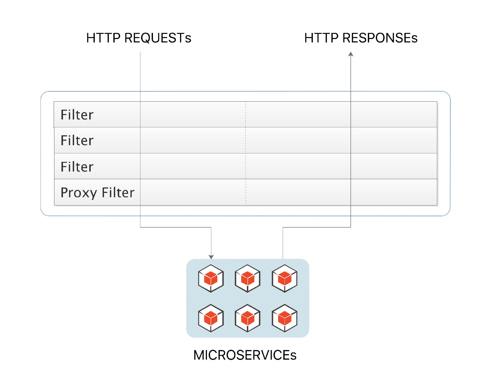

# Spring Cloud Gateway

[](https://src.windmt.com/img/006tKfTcly1fr2rzagnmzj318g0ip760.jpg)


Spring Cloud Gateway 是 Spring Cloud 的一个全新项目，该项目是基于 Spring 5.0，Spring Boot 2.0 和 Project Reactor 等技术开发的网关，它旨在为微服务架构提供一种简单有效的统一的 API 路由管理方式。

Spring Cloud Gateway 作为 Spring Cloud 生态系统中的网关，目标是替代 Netflix Zuul，其不仅提供统一的路由方式，并且基于 Filter 链的方式提供了网关基本的功能，例如：安全、监控、埋点和限流等。

Spring Cloud Gateway 的特征：

- 基于 Spring Framework 5，Project Reactor 和 Spring Boot 2.0
- 动态路由
- Predicates 和 Filters 作用于特定路由
- 集成 Hystrix 断路器
- 集成 Spring Cloud DiscoveryClient
- 易于编写的 Predicates 和 Filters
- 限流
- 路径重写


## 术语

- **Route（路由）**：这是网关的基本构建块。它由一个 ID，一个目标 URI，一组断言和一组过滤器定义。如果断言为真，则路由匹配。
- **Predicate（断言）**：这是一个 [Java 8 的 Predicate](http://docs.oracle.com/javase/8/docs/api/java/util/function/Predicate.html)。输入类型是一个 [`ServerWebExchange`](https://docs.spring.io/spring/docs/5.0.x/javadoc-api/org/springframework/web/server/ServerWebExchange.html)。我们可以使用它来匹配来自 HTTP 请求的任何内容，例如 headers 或参数。
- **Filter（过滤器）**：这是 `org.springframework.cloud.gateway.filter.GatewayFilter` 的实例，我们可以使用它修改请求和响应。

## 流程

[](https://src.windmt.com/img/006tKfTcly1fr2q2m5jq7j30cb0gjmxm.jpg)

客户端向 Spring Cloud Gateway 发出请求。然后在 Gateway Handler Mapping 中找到与请求相匹配的路由，将其发送到 Gateway Web Handler。Handler 再通过指定的过滤器链来将请求发送到我们实际的服务执行业务逻辑，然后返回。
过滤器之间用虚线分开是因为过滤器可能会在发送代理请求之前（“pre”）或之后（“post”）执行业务逻辑。


# 路由

Predicate 来源于 Java 8，是 Java 8 中引入的一个函数，Predicate  接受一个输入参数，返回一个布尔值结果。该接口包含多种默认方法来将 Predicate  组合成其他复杂的逻辑（比如：与，或，非）。可以用于接口请求参数校验、判断新老数据是否有变化需要进行更新操作。

在 Spring Cloud Gateway 中 Spring 利用 Predicate 的特性实现了各种路由匹配规则，有通过  Header、请求参数等不同的条件来进行作为条件匹配到对应的路由。网上有一张图总结了 Spring Cloud 内置的几种 Predicate  的实现。


## 依赖

```xml
<dependency>
    <groupId>org.springframework.cloud</groupId>
    <artifactId>spring-cloud-starter-gateway</artifactId>
</dependency>

<dependency>
    <groupId>org.springframework.cloud</groupId>
    <artifactId>spring-cloud-starter-netflix-eureka-client</artifactId>
</dependency>
```

## 属性配置

```yml
server:
  port: 10000

eureka:
  client:
    service-url:
      defaultZone: http://localhost:7000/eureka/

spring:
  application:
    name: cloud-gateway
  cloud:
    gateway:
      discovery:
        locator:
          #是否与服务注册于发现组件进行结合，通过 serviceId 转发到具体的服务实例。
          #默认为 false，设为 true 便开启通过服务中心的自动根据 serviceId 创建路由的功能。
          enabled: true
          lowerCaseServiceId: true
      routes:
        - id: eureka-consumer
          uri: lb://EUREKA-CONSUMER
          predicates:
            - Path=/api/consumer/**
          filters:
            - StripPrefix=2
```


## 默认路由

```javascript
http://网关地址：端口/服务中心注册 serviceId/具体的url
```


## 自定义路由


# 过滤器


## Filter 的作用

其实前边在介绍 Zuul 的的时候已经介绍过 Zuul 的 Filter 的作用了，同作为网关服务，Spring Cloud Gateway 的 Filter 作用也类似。

这里就简单用两张图来解释一下吧。


当使用微服务构建整个 API 服务时，一般有许多不同的应用在运行，如上图所示的 `mst-user-service`、`mst-good-service` 和 `mst-order-service`，这些服务都需要对客户端的请求的进行 Authentication。最简单粗暴的方法就是像上图一样，为每个微服务应用都实现一套用于校验的过滤器或拦截器。

对于这样的问题，更好的做法是通过前置的网关服务来完成这些非业务性质的校验，就像下图

[](https://src.windmt.com/img/006tKfTcly1fr43dop520j31j60ni413.jpg)

## Filter 的生命周期

Spring Cloud Gateway 的 Filter 的生命周期不像 Zuul 的那么丰富，它只有两个：“pre” 和 “post”。



“pre” 和 “post” 分别会在请求被执行前调用和被执行后调用，和 Zuul Filter 或 Spring Interceptor 中相关生命周期类似，但在形式上有些不一样。

Zuul 的 Filter 是通过 `filterType()` 方法来指定，一个 Filter 只能对应一种类型，要么是 “pre” 要么是 “post”。Spring Interceptor 是通过重写 `HandlerInterceptor` 中的三个方法来实现的。而 Spring Cloud Gateway 基于 Project Reactor 和 WebFlux，采用响应式编程风格，打开它的 Filter 的接口 `GatewayFilter` 你会发现它只有一个方法 `filter`。

仅通过这一个方法，怎么来区分是 “pre” 还是 “post” 呢？我们下边就通过自定义过滤器来看看。

## 过滤器

### 自定义过滤器

自定义过滤器需要实现 `GatewayFilter` 和 `Ordered`。其中 `GatewayFilter` 中的这个方法就是用来实现你的自定义的逻辑的

```
Mono<Void> filter(ServerWebExchange exchange, GatewayFilterChain chain);
```

而 `Ordered` 中的 `int getOrder()` 方法是来给过滤器设定优先级别的，值越大则优先级越低。

用于统计接口请求时间的自定义过滤器

```java
@Slf4j
public class RequestTimeFilter  implements GatewayFilter, Ordered {

    private static final String BEGIN_TIME_STAMP="beginTimeStamp";

    @Override
    public Mono<Void> filter(ServerWebExchange exchange, GatewayFilterChain chain) {
        exchange.getAttributes().put(BEGIN_TIME_STAMP, System.currentTimeMillis());
        return chain.filter(exchange).then(
                Mono.fromRunnable(() -> {
                    Long startTime = exchange.getAttribute(BEGIN_TIME_STAMP);
                    if (startTime != null) {
                        log.info(exchange.getRequest().getURI().getRawPath() + ": " + (System.currentTimeMillis() - startTime) + "ms");
                    }
                })
        );
    }

    @Override
    public int getOrder() {
        return Ordered.LOWEST_PRECEDENCE;
    }

}
```

为EUREKA-CONSUMER添加过滤器

```java
@Configuration
public class RouteLocatorConfig {

    @Bean
    public RouteLocator customerRouteLocator(RouteLocatorBuilder builder) {
        return builder.routes()
                .route(r -> r.path("/api/consumer/**")
                        .filters(f -> f.stripPrefix(2).filter(new RequestTimeFilter()))
                        .uri("lb://EUREKA-CONSUMER")
                        .order(0)
                        .id("customer_filter_router")
                )
                .build();
    }

}
```

### 自定义全局过滤器

有了前边的基础，我们创建全局过滤器就简单多了。只需要把实现的接口 `GatewayFilter` 换成 `GlobalFilter`，就完事大吉了。比如下面的 Demo 就是从请求参数中获取 `token` 字段，如果能获取到就 pass，获取不到就直接返回 `401` 错误，虽然简单，但足以说明问题了。

```java
public class TokenFilter implements GlobalFilter, Ordered {

    @Override
    public Mono<Void> filter(ServerWebExchange exchange, GatewayFilterChain chain) {
        String token = exchange.getRequest().getQueryParams().getFirst("token");
        if (token == null || token.isEmpty()) {
            exchange.getResponse().setStatusCode(HttpStatus.UNAUTHORIZED);
            return exchange.getResponse().setComplete();
        }
        return chain.filter(exchange);
    }

    @Override
    public int getOrder() {
        return -100;
    }
}
```

然后在 Spring Config 中配置这个 Bean

```java
@Bean
public TokenFilter tokenFilter(){
    return new TokenFilter();
}
```

### 自定义过滤器工厂

权限验证过滤器工厂

```java
@Slf4j
@Component
public class MyAuthGatewayFilterFactory extends AbstractGatewayFilterFactory<MyAuthGatewayFilterFactory.Config> {

    private static final String KEY1="global_config";
    private static final String KEY2="lcm_config";

    private static final String ERROR_RESULT="{\"code\":\"500\",\"mes\":\"not have permission\"}";

    public MyAuthGatewayFilterFactory() {
        super(Config.class);
    }


    @Override
    public List<String> shortcutFieldOrder() {
        return Arrays.asList(KEY1,KEY2);
    }

    @Override
    public GatewayFilter apply(Config config) {
        return new GatewayFilter() {
            @Override
            public Mono<Void> filter(ServerWebExchange exchange, GatewayFilterChain chain) {
                log.info("配置：{{}}",config);
                String auth = exchange.getRequest().getHeaders().getFirst("Authorization");
                if(auth==null||!auth.equals("lcm")){
                    ServerHttpResponse response = exchange.getResponse();
                    HttpHeaders httpHeaders = response.getHeaders();
                    httpHeaders.add("Content-Type", "application/json; charset=UTF-8");
                    httpHeaders.add("Cache-Control", "no-store, no-cache, must-revalidate, max-age=0");
                    DataBuffer wrap = response.bufferFactory().wrap(ERROR_RESULT.getBytes());
                    return response.writeWith(Mono.just(wrap));
                }else{
                    //
                    return chain.filter(exchange);
                }
            }
        };
    }

    @Data
    public static class Config {
        private String global_config;
        private String lcm_config;
    }

}
```

属性配置

```yml
spring:
  application:
    name: cloud-gateway
  cloud:
    gateway:
      discovery:
        locator:
          #是否与服务注册于发现组件进行结合，通过 serviceId 转发到具体的服务实例。
          #默认为 false，设为 true 便开启通过服务中心的自动根据 serviceId 创建路由的功能。
          enabled: true
          lowerCaseServiceId: true
      routes:
        - id: eureka-consumer
          uri: lb://EUREKA-CONSUMER
          predicates:
            - Path=/api/consumer/**
          filters:
            - MyAuth=abcd,efg
            - StripPrefix=2
```

请求header无Authorization结果


请求header中Authorization=lcm结果


## 内置过滤器

| 过滤器工厂                  | 作用                                                         | 参数                                                         |
| :-------------------------- | :----------------------------------------------------------- | :----------------------------------------------------------- |
| AddRequestHeader            | 为原始请求添加Header                                         | Header的名称及值                                             |
| AddRequestParameter         | 为原始请求添加请求参数                                       | 参数名称及值                                                 |
| AddResponseHeader           | 为原始响应添加Header                                         | Header的名称及值                                             |
| DedupeResponseHeader        | 剔除响应头中重复的值                                         | 需要去重的Header名称及去重策略                               |
| Hystrix                     | 为路由引入Hystrix的断路器保护                                | `HystrixCommand`的名称                                       |
| FallbackHeaders             | 为fallbackUri的请求头中添加具体的异常信息                    | Header的名称                                                 |
| PrefixPath                  | 为原始请求路径添加前缀                                       | 前缀路径                                                     |
| PreserveHostHeader          | 为请求添加一个preserveHostHeader=true的属性，路由过滤器会检查该属性以决定是否要发送原始的Host | 无                                                           |
| RequestRateLimiter          | 用于对请求限流，限流算法为令牌桶                             | keyResolver、rateLimiter、statusCode、denyEmptyKey、emptyKeyStatus |
| RedirectTo                  | 将原始请求重定向到指定的URL                                  | http状态码及重定向的url                                      |
| RemoveHopByHopHeadersFilter | 为原始请求删除IETF组织规定的一系列Header                     | 默认就会启用，可以通过配置指定仅删除哪些Header               |
| RemoveRequestHeader         | 为原始请求删除某个Header                                     | Header名称                                                   |
| RemoveResponseHeader        | 为原始响应删除某个Header                                     | Header名称                                                   |
| RewritePath                 | 重写原始的请求路径                                           | 原始路径正则表达式以及重写后路径的正则表达式                 |
| RewriteResponseHeader       | 重写原始响应中的某个Header                                   | Header名称，值的正则表达式，重写后的值                       |
| SaveSession                 | 在转发请求之前，强制执行`WebSession::save`操作               | 无                                                           |
| SecureHeaders               | 为原始响应添加一系列起安全作用的响应头                       | 无，支持修改这些安全响应头的值                               |
| SetPath                     | 修改原始的请求路径                                           | 修改后的路径                                                 |
| SetResponseHeader           | 修改原始响应中某个Header的值                                 | Header名称，修改后的值                                       |
| SetStatus                   | 修改原始响应的状态码                                         | HTTP 状态码，可以是数字，也可以是字符串                      |
| StripPrefix                 | 用于截断原始请求的路径                                       | 使用数字表示要截断的路径的数量                               |
| Retry                       | 针对不同的响应进行重试                                       | retries、statuses、methods、series                           |
| RequestSize                 | 设置允许接收最大请求包的大小。如果请求包大小超过设置的值，则返回 `413 Payload Too Large` | 请求包大小，单位为字节，默认值为5M                           |
| ModifyRequestBody           | 在转发请求之前修改原始请求体内容                             | 修改后的请求体内容                                           |
| ModifyResponseBody          | 修改原始响应体的内容                                         | 修改后的响应体内容                                           |
| Default                     | 为所有路由添加过滤器                                         | 过滤器工厂名称及值                                           |

# Hystrix熔断

在前面学习 Hystrix 的时候，我们知道 Hystrix 有服务降级的能力，即如果服务调用出现了异常，则执行指定的 fallback 方法。Spring Cloud Gateway 也融合了 Hystrix，可以为我们提供路由层面服务降级。我们就来看看如何来做。

依赖

```xml
<dependency>
    <groupId>org.springframework.cloud</groupId>
    <artifactId>spring-cloud-starter-netflix-hystrix</artifactId>
</dependency>
```

熔断降级

```java
@RestController
public class HystrixController {

    private static final Result FALLBACK_RESULT=new Result();

    {
        FALLBACK_RESULT.setCode((short) 500);
        FALLBACK_RESULT.setMes("服务不可用");
    }

    @RequestMapping("/fallback")
    public Result fallback() {
        return FALLBACK_RESULT;
    }

}
```

配置

```yml
- name: Hystrix
  args:
    name: fallbackcmd
    fallbackUri: forward:/fallback
```


# 限流

## 限流算法

### 计数器法

算法维护一个counter，规定时间不能超过最大值，每隔固定时间清零。如果counter大于阈值，拒绝请求。

计数器限流方式比较粗暴,一次访问设置一次计数,在系统内设置每秒的访问量,超过访问量的访问直接丢弃,实现访问限流.这种算法的弊端就是,在开始的时间,访问量被使用完后,1S内会有长时间的真空期是处于接口不可用的状态的.

实现方式和拓展方式很多.比如可以使用redis进行1S的100次访问计数,来一个流量100-1当数量到达0时,拒绝后续的访问.也可以不拒绝而是将请求放入缓存队列,根据实际业务情况选择不同的实现方式.

### 漏桶算法

在计数器算法中我们看到,当使用了所有的访问量后,接口会完全处于不可用状态.有些系统不喜欢这样的处理方式,可以选择漏斗算法进行限流.  漏斗算法的原理就像名字,是一个漏斗,访问量从漏斗的大口进入,从漏斗的小口进入系统.这样不管是多大的访问量进入漏斗,最后进入系统的访问量都是固定的.漏斗的好处就是,大批量访问进入时,漏斗有容量,不超过容量(容量的设计=固定处理的访问量*可接受等待时长)的数据都可以排队等待处理,超过的才会丢弃.

实现方式可以使用队列,队列设置容量,访问可以大批量塞入队列,满队列后丢弃后续访问量.队列的出口以固定速率拿去访问量处理.

这种方案由于出口速率是固定的,那么当就无法应对短时间的突发流量.

维护一个固定容量的桶，把请求比作是水，水来了都先放进桶里，并以限定的速度出水，当水来得过猛而出水不够快时就会导致水直接溢出，即拒绝服务。


可见这里有两个变量，一个是桶的大小，支持流量突发增多时可以存多少的水（burst），另一个是水桶漏洞的大小（rate）。因为漏桶的漏出速率是固定的参数，所以，即使网络中不存在资源冲突（没有发生拥塞），漏桶算法也不能使流突发（burst）到端口速率。因此，**漏桶算法对于存在突发特性的流量来说缺乏效率**。

### 令牌桶算法

令牌桶算法的原理是系统以恒定的速率产生令牌，然后把令牌放到令牌桶中，令牌桶有一个容量，当令牌桶满了的时候，再向其中放令牌，那么多余的令牌会被丢弃；当想要处理一个请求的时候，需要从令牌桶中取出一个令牌，如果此时令牌桶中没有令牌，那么则拒绝该请求。

这种算法的好处就是便于控制系统的处理速度，甚至可以通过统计信息实时优化令牌桶的大小。


令牌桶算法算是漏斗算法的改进版,为了处理短时间的突发流量而做了优化,令牌桶算法主要由三部分组成`令牌流`、`数据流`、`令牌桶`.

名词释义:

- 令牌流:流通令牌的管道,用于生成的令牌的流通,放入令牌桶中.
- 数据流:进入系统的数据流量
- 令牌桶:保存令牌的区域,可以理解为一个缓存区.令牌保存在这里用于使用.

算法原理   令牌桶算法会按照一定的速率生成令牌放入令牌桶,访问要进入系统时,需要从令牌桶获取令牌,有令牌的可以进入,没有的被抛弃.由于令牌桶的令牌是源源不断生成的,当访问量小时,可以留存令牌达到令牌桶的上限,这样当短时间的突发访问量来时,积累的令牌数可以处理这个问题.当访问量持续大量流入时,由于生成令牌的速率是固定的,最后也就变成了类似漏斗算法的固定流量处理.

实现方式和漏斗也比较类似,可以使用一个队列保存令牌,一个定时任务用等速率生成令牌放入队列,访问量进入系统时,从队列获取令牌再进入系统.


## RequestRateLimiter

[Gateway 源码解析 —— RequestRateLimiterGatewayFilterFactory 请求限流](http://www.iocoder.cn/Spring-Cloud-Gateway/filter-request-rate-limiter/)

在Spring Cloud Gateway中，有Filter过滤器，因此可以在“pre”类型的Filter中自行实现上述三种过滤器。但是限流作为网关最基本的功能，Spring Cloud Gateway官方就提供了RequestRateLimiterGatewayFilterFactory这个类，适用Redis和lua脚本实现了令牌桶的方式。具体实现逻辑在RequestRateLimiterGatewayFilterFactory类中

### 简单使用

需要redis依赖

```xml
<dependency>
    <groupId>org.springframework.boot</groupId>
    <artifactId>spring-boot-starter-data-redis-reactive</artifactId>
</dependency>
```

使用url作为限流键

```java
@Component
public class UriKeyResolver implements KeyResolver {

    @Override
    public Mono<String> resolve(ServerWebExchange exchange) {
        return Mono.just(exchange.getRequest().getURI().getPath());
    }

}
```

配置

```yml
spring:
  application:
    name: cloud-gateway
  redis:
    host: 119.29.246.230
    port: 6379
    password: lcming123
    database: 2
  cloud:
    gateway:
      discovery:
        locator:
          #是否与服务注册于发现组件进行结合，通过 serviceId 转发到具体的服务实例。
          #默认为 false，设为 true 便开启通过服务中心的自动根据 serviceId 创建路由的功能。
          enabled: true
          lowerCaseServiceId: true
      routes:
        - id: eureka-consumer
          uri: lb://EUREKA-CONSUMER
          predicates:
            - Path=/api/consumer/**
          filters:
            - MyAuth=abcd,efg
            - StripPrefix=2
            - name: RequestRateLimiter
              args:
                #用于限流的键的解析器的 Bean 对象的名字。
                #它使用 SpEL 表达式根据#{@beanName}从 Spring 容器中获取 Bean 对象。
                #默认使用 PrincipalNameKeyResolver，请求认证java.security.Principal为限流键。
                key-resolver: '#{@uriKeyResolver}'
                #令牌桶每秒填充平均速率
                redis-rate-limiter.replenishRate: 1
                #令牌桶总容量
                redis-rate-limiter.burstCapacity: 1
```


### 源码


#### RequestRateLimiterGatewayFilterFactory

```java
@ConfigurationProperties("spring.cloud.gateway.filter.request-rate-limiter")
public class RequestRateLimiterGatewayFilterFactory extends
      AbstractGatewayFilterFactory<RequestRateLimiterGatewayFilterFactory.Config> {

   /**
    * Key-Resolver key.
    */
   public static final String KEY_RESOLVER_KEY = "keyResolver";

   private static final String EMPTY_KEY = "____EMPTY_KEY__";

   private final RateLimiter defaultRateLimiter;

   private final KeyResolver defaultKeyResolver;

   /**
    * Switch to deny requests if the Key Resolver returns an empty key, defaults to true.
    */
   private boolean denyEmptyKey = true;

   /** HttpStatus to return when denyEmptyKey is true, defaults to FORBIDDEN. */
   private String emptyKeyStatusCode = HttpStatus.FORBIDDEN.name();

   public RequestRateLimiterGatewayFilterFactory(RateLimiter defaultRateLimiter,
         KeyResolver defaultKeyResolver) {
      super(Config.class);
      this.defaultRateLimiter = defaultRateLimiter;
      this.defaultKeyResolver = defaultKeyResolver;
   }

   public KeyResolver getDefaultKeyResolver() {
      return defaultKeyResolver;
   }

   public RateLimiter getDefaultRateLimiter() {
      return defaultRateLimiter;
   }

   @SuppressWarnings("unchecked")
   @Override
   public GatewayFilter apply(Config config) {
      // 获得配置的KeyResolver，无则使用默认限流键解析器PrincipalNameKeyResolver 
      KeyResolver resolver = getOrDefault(config.keyResolver, defaultKeyResolver);
      RateLimiter<Object> limiter = getOrDefault(config.rateLimiter,
            defaultRateLimiter);
      boolean denyEmpty = getOrDefault(config.denyEmptyKey, this.denyEmptyKey);
      HttpStatusHolder emptyKeyStatus = HttpStatusHolder
            .parse(getOrDefault(config.emptyKeyStatus, this.emptyKeyStatusCode));

      return (exchange, chain) -> resolver.resolve(exchange).defaultIfEmpty(EMPTY_KEY)
            .flatMap(key -> {
               if (EMPTY_KEY.equals(key)) {
                  if (denyEmpty) {
                     setResponseStatus(exchange, emptyKeyStatus);
                     return exchange.getResponse().setComplete();
                  }
                  return chain.filter(exchange);
               }
               String routeId = config.getRouteId();
               if (routeId == null) {
                  Route route = exchange
                        .getAttribute(ServerWebExchangeUtils.GATEWAY_ROUTE_ATTR);
                  routeId = route.getId();
               }
               return limiter.isAllowed(routeId, key).flatMap(response -> {

                  for (Map.Entry<String, String> header : response.getHeaders()
                        .entrySet()) {
                     exchange.getResponse().getHeaders().add(header.getKey(),
                           header.getValue());
                  }

                  // 允许访问，调用下一个过滤器
                  if (response.isAllowed()) {
                     return chain.filter(exchange);
                  }

                  // 被限流，不允许访问，设置http响应码429
                  setResponseStatus(exchange, config.getStatusCode());
                  return exchange.getResponse().setComplete();
               });
            });
   }

   private <T> T getOrDefault(T configValue, T defaultValue) {
      return (configValue != null) ? configValue : defaultValue;
   }

   public static class Config implements HasRouteId {

      private KeyResolver keyResolver;

      private RateLimiter rateLimiter;

      private HttpStatus statusCode = HttpStatus.TOO_MANY_REQUESTS;

      private Boolean denyEmptyKey;

      private String emptyKeyStatus;

      private String routeId;

   }

}
```


#### 限流键-KeyResolver

请求键解析器接口，通过实现 KeyResolver 接口，实现获得不同的请求的限流键，例如URL / 用户 / IP 等。

目前版本，Spring Cloud Gateway 提供的 KeyResolver 实现类只有 PrincipalNameKeyResolver 。

```java
public interface KeyResolver {
	Mono<String> resolve(ServerWebExchange exchange);
}
```

##### PrincipalNameKeyResolver

```java
public class PrincipalNameKeyResolver implements KeyResolver {

	public static final String BEAN_NAME = "principalNameKeyResolver";

	@Override
	public Mono<String> resolve(ServerWebExchange exchange) {
		return exchange
                .getPrincipal()
                .map(Principal::getName)
                .switchIfEmpty(Mono.empty());
	}
}
```

#### 限流器-RateLimiter

```java
public interface RateLimiter {

	Mono<Response> isAllowed(String id, Tuple args);

}
```


#### GatewayRedisAutoConfiguration

1.加载bean`RedisScript`，加载 META-INF/scripts/request_rate_limiter.lua 路径下的 Redis Lua 脚本。

2.加载bean`ReactiveRedisTemplate`，响应式的RedisTemplate

3.加载bean`RedisRateLimiter` ，基于 Redis 的分布式限流器**实现类**

```java
@Configuration(proxyBeanMethods = false)
@AutoConfigureAfter(RedisReactiveAutoConfiguration.class)
@AutoConfigureBefore(GatewayAutoConfiguration.class)
@ConditionalOnBean(ReactiveRedisTemplate.class)
@ConditionalOnClass({ RedisTemplate.class, DispatcherHandler.class })
class GatewayRedisAutoConfiguration {

   //创建 org.springframework.data.redis.core.script.RedisScript Bean 对象
   //加载 META-INF/scripts/request_rate_limiter.lua 路径下的 Redis Lua 脚本。
   @Bean
   @SuppressWarnings("unchecked")
   public RedisScript redisRequestRateLimiterScript() {
      DefaultRedisScript redisScript = new DefaultRedisScript<>();
      redisScript.setScriptSource(new ResourceScriptSource(
            new ClassPathResource("META-INF/scripts/request_rate_limiter.lua")));
      redisScript.setResultType(List.class);
      return redisScript;
   }

   @Bean
   @ConditionalOnMissingBean
   public RedisRateLimiter redisRateLimiter(ReactiveStringRedisTemplate redisTemplate,
         @Qualifier(RedisRateLimiter.REDIS_SCRIPT_NAME) RedisScript<List<Long>> redisScript,
         ConfigurationService configurationService) {
      return new RedisRateLimiter(redisTemplate, redisScript, configurationService);
   }

}
```

#### RedisRateLimiter

执行 Redis Lua 脚本，获取令牌。返回结果为 `[是否获取令牌成功, 剩余令牌数]` ，其中，`1` 代表获取令牌**成功**，`0` 代表令牌获取**失败**。

当 Redis Lua 脚本过程中发生**异常**，忽略异常，返回 `Flux.just(Arrays.asList(1L, -1L))` ，即认为**获取令牌成功**。为什么？在 Redis 发生故障时，我们不希望限流器对 Reids 是**强依赖**，并且 Redis 发生故障的概率本身就很低。

```java
@Override
@SuppressWarnings("unchecked")
public Mono<Response> isAllowed(String routeId, String id) {
   if (!this.initialized.get()) {
      throw new IllegalStateException("RedisRateLimiter is not initialized");
   }

   Config routeConfig = loadConfiguration(routeId);

   // How many requests per second do you want a user to be allowed to do?
   int replenishRate = routeConfig.getReplenishRate();

   // How much bursting do you want to allow?
   int burstCapacity = routeConfig.getBurstCapacity();

   // How many tokens are requested per request?
   int requestedTokens = routeConfig.getRequestedTokens();

   try {
      // 使用两个redis key 记录令牌桶
      List<String> keys = getKeys(id);

      // The arguments to the LUA script. time() returns unixtime in seconds.
      List<String> scriptArgs = Arrays.asList(replenishRate + "",
            burstCapacity + "", Instant.now().getEpochSecond() + "",
            requestedTokens + "");
      // allowed, tokens_left = redis.eval(SCRIPT, keys, args)
      Flux<List<Long>> flux = this.redisTemplate.execute(this.script, keys,
            scriptArgs);
      // .log("redisratelimiter", Level.FINER);
      return flux.onErrorResume(throwable -> Flux.just(Arrays.asList(1L, -1L)))
            .reduce(new ArrayList<Long>(), (longs, l) -> {
               longs.addAll(l);
               return longs;
            }).map(results -> {
               boolean allowed = results.get(0) == 1L;
               Long tokensLeft = results.get(1);

               Response response = new Response(allowed,
                     getHeaders(routeConfig, tokensLeft));

               if (log.isDebugEnabled()) {
                  log.debug("response: " + response);
               }
               return response;
            });
   }
   catch (Exception e) {
      /*
       * We don't want a hard dependency on Redis to allow traffic. Make sure to set
       * an alert so you know if this is happening too much. Stripe's observed
       * failure rate is 0.01%.
       */
      log.error("Error determining if user allowed from redis", e);
   }
   return Mono.just(new Response(true, getHeaders(routeConfig, -1L)));
}

static List<String> getKeys(String id) {

    String prefix = "request_rate_limiter.{" + id;
    
    //request_rate_limiter.${id}.tokens ：令牌桶剩余令牌数。
    String tokenKey = prefix + "}.tokens";
    //request_rate_limiter.${id}.timestamp ：令牌桶最后填充令牌时间，单位：秒。
    String timestampKey = prefix + "}.timestamp";
    return Arrays.asList(tokenKey, timestampKey);
}
```
#### request_rate_limiter.lua

调用 `get` 命令，获得令牌桶**剩余**令牌数( `last_tokens` ) ，令牌桶**最后**填充令牌时间(`last_refreshed`) 。

填充令牌，计算**新**的令牌桶**剩余**令牌数( `filled_tokens` )。填充不超过令牌桶令牌**上限**。

获取令牌是否成功。

- 若**成功**，令牌桶**剩余**令牌数(`new_tokens`) **减**消耗令牌数( `requested` )，并设置获取成功( `allowed_num = 1` ) 。
- 若**失败**，设置获取失败( `allowed_num = 0` ) 。

```lua
local tokens_key = KEYS[1]
local timestamp_key = KEYS[2]
--redis.log(redis.LOG_WARNING, "tokens_key " .. tokens_key)

local rate = tonumber(ARGV[1])
local capacity = tonumber(ARGV[2])
local now = tonumber(ARGV[3])
local requested = tonumber(ARGV[4])

local fill_time = capacity/rate
local ttl = math.floor(fill_time*2)

--redis.log(redis.LOG_WARNING, "rate " .. ARGV[1])
--redis.log(redis.LOG_WARNING, "capacity " .. ARGV[2])
--redis.log(redis.LOG_WARNING, "now " .. ARGV[3])
--redis.log(redis.LOG_WARNING, "requested " .. ARGV[4])
--redis.log(redis.LOG_WARNING, "filltime " .. fill_time)
--redis.log(redis.LOG_WARNING, "ttl " .. ttl)

local last_tokens = tonumber(redis.call("get", tokens_key))
if last_tokens == nil then
  last_tokens = capacity
end
--redis.log(redis.LOG_WARNING, "last_tokens " .. last_tokens)

local last_refreshed = tonumber(redis.call("get", timestamp_key))
if last_refreshed == nil then
  last_refreshed = 0
end
--redis.log(redis.LOG_WARNING, "last_refreshed " .. last_refreshed)

local delta = math.max(0, now-last_refreshed)
local filled_tokens = math.min(capacity, last_tokens+(delta*rate))
local allowed = filled_tokens >= requested
local new_tokens = filled_tokens
local allowed_num = 0
if allowed then
  new_tokens = filled_tokens - requested
  allowed_num = 1
end

--redis.log(redis.LOG_WARNING, "delta " .. delta)
--redis.log(redis.LOG_WARNING, "filled_tokens " .. filled_tokens)
--redis.log(redis.LOG_WARNING, "allowed_num " .. allowed_num)
--redis.log(redis.LOG_WARNING, "new_tokens " .. new_tokens)

redis.call("setex", tokens_key, ttl, new_tokens)
redis.call("setex", timestamp_key, ttl, now)

return { allowed_num, new_tokens }
```