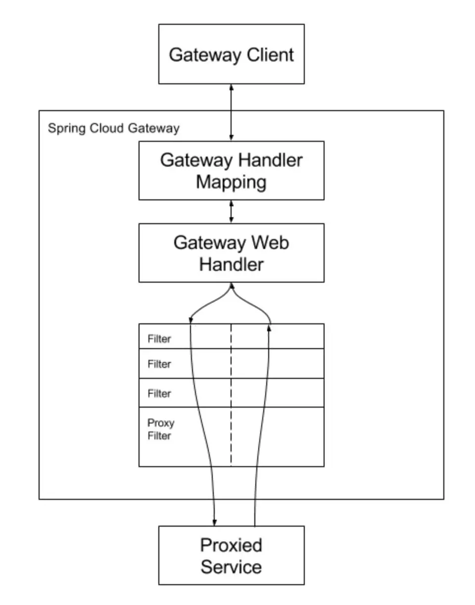
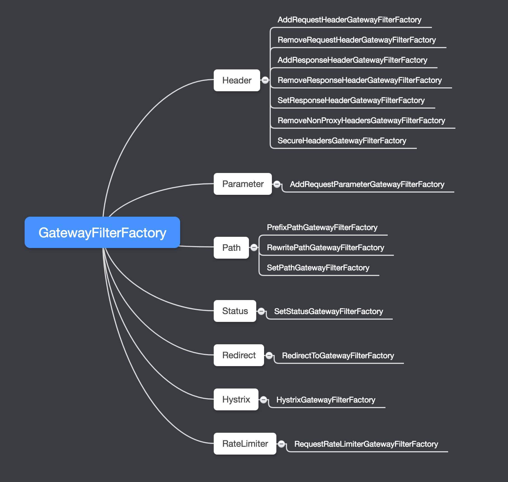
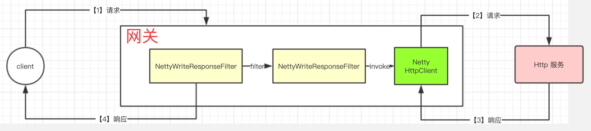

# 核心组件构建原理

Spring cloud gateway 的工作机制大体如下：

① Gateway 接收客户端请求。

② 客户端请求与路由信息进行匹配，匹配成功的才能够被发往相应的下游服务。

③ 请求经过 Filter 过滤器链，执行 pre 处理逻辑，如修改请求头信息等。

④ 请求被转发至下游服务并返回响应。

⑤ 响应经过 Filter 过滤器链，执行 post 处理逻辑。

⑥ 向客户端响应应答。

Gateway 工作机制可参考下图（图片来自官方文档）：



这里提到了路由、匹配、过滤器等概念，下文将作详细介绍 ，这也是本文需要阐述的重点。

## 基本组件

### 路由-Route

```java
public class Route implements Ordered {

    private final String id;

    //路由指向的目的地 uri
    private final URI uri; 

    //用于多个 Route 之间的排序，数值越小排序越靠前，匹配优先级越高。
    private final int order; 

    //谓语，表示匹配该 Route 的前置条件，即满足相应的条件才会被路由到目的地 uri。
    private final AsyncPredicate<ServerWebExchange> predicate; 

    //过滤器用于处理切面逻辑，如路由转发前修改请求头等。
    private final List<GatewayFilter> gatewayFilters; 
}
```

### 断言-Predicate 

```java
public interface AsyncPredicate<T> extends Function<T, Publisher<Boolean>> {

    //与操作，即两个 Predicate 组成一个，需要同时满足。
    default AsyncPredicate<T> and(AsyncPredicate<? super T> other) { 
        Objects.requireNonNull(other, "other must not be null");
        return t -> Flux.zip(apply(t), other.apply(t))
                .map(tuple -> tuple.getT1() && tuple.getT2());
    }

    //取反操作，即对 Predicate 匹配结果取反。
    default AsyncPredicate<T> negate() { 
        return t -> Mono.from(apply(t)).map(b -> !b);
    }

    //或操作，即两个 Predicate 组成一个，只需满足其一。
    default AsyncPredicate<T> or(AsyncPredicate<? super T> other) {
        Objects.requireNonNull(other, "other must not be null");
        return t -> Flux.zip(apply(t), other.apply(t))
                .map(tuple -> tuple.getT1() || tuple.getT2());
    }
}
```

### 过滤器-Filter

```java
public interface GatewayFilter extends ShortcutConfigurable {

    String NAME_KEY = "name";
    String VALUE_KEY = "value";

    Mono<Void> filter(ServerWebExchange exchange, GatewayFilterChain chain);
}
```

Filter 最终是通过 filter chain 来形成链式调用的，每个 filter 处理完 pre filter 逻辑后委派给  filter chain，filter chain 再委派给下一下 filter。

#### 过滤器链-FilterChain

```java
public interface GatewayFilterChain {

    Mono<Void> filter(ServerWebExchange exchange);

}
```

## 构造源码

### GatewayProperties 

```java
@ConfigurationProperties("spring.cloud.gateway") // ①
@Validated
public class GatewayProperties {

    @NotNull
    @Valid
    private List<RouteDefinition> routes = new ArrayList<>(); 

    //用于定义默认的 Filter 列表，默认的 Filter 会应用到每一个 Route 上
    private List<FilterDefinition> defaultFilters = new ArrayList<>(); 
}
```

### RouteDefinition

RouteDefinition 中所定义的属性与 Route 本身是一一对应的

```java
public class RouteDefinition {
    @NotEmpty
    private String id = UUID.randomUUID().toString(); 

    @NotEmpty
    @Valid
    private List<PredicateDefinition> predicates = new ArrayList<>(); 

    @Valid
    private List<FilterDefinition> filters = new ArrayList<>();  

    @NotNull
    private URI uri;  

    private int order = 0; 
}
```


### PredicateDefinition

```java
public class PredicateDefinition {
    
    //Predicate 的名称，它们要符固定的命名规范，为对应的工厂名称
    @NotNull
    private String name; 
    
    private Map<String, String> args = new LinkedHashMap<>();
}
```

####  RoutePredicateFactory

RoutePredicateFactory 是所有 predicate factory 的顶级接口，职责就是生产 Predicate。

创建一个用于配置用途的对象（config），以其作为参数应用到 `apply`方法上来生产一个 Predicate 对象，再将 Predicate 对象包装成 AsyncPredicate。

```java
//函数式接口
@FunctionalInterface 
public interface RoutePredicateFactory<C> extends ShortcutConfigurable,
    Configurable<C> { 

    Predicate<ServerWebExchange> apply(C config); 

    default AsyncPredicate<ServerWebExchange> applyAsync(C config) { 
        return toAsyncPredicate(apply(config));
    }
}

// RoutePredicateFactory 扩展了 Configurable
public interface Configurable<C> {
    Class<C> getConfigClass();  
    C newConfig(); 
}
```
### FilterDefinition

```java
public class FilterDefinition {
    @NotNull
    private String name;
    private Map<String, String> args = new LinkedHashMap<>(); 
}
```

外部配置到 FilterDefinition 对象绑定

```yml
spring:
  cloud:
    gateway:
      routes:
      - id: add_request_header_route
        uri: http://example.org
        filters:
        - AddRequestHeader=X-Request-Foo, Bar 
```

这一行配置被 spring 解析后会绑定到一个 FilterDefinition 对象。

**AddRequestHeader** ，对应 FilterDefinition 中的 `name` 属性，是AddRequestHeaderGatewayFilterFactory 的**类名前缀**。

**X-Request-Foo, Bar** ，会被解析成 FilterDefinition 中的 Map 类型属性 `args`。此处会被解析成两组键值对，以英文逗号将`=`后面的字符串分隔成数组，`key`是固定字符串 `_genkey_`  + 数组元素下标，`value`为数组元素自身。

还有一种方式

```yml
spring:
  cloud:
    gateway:
      routes:
      - id: add_request_header_route
        uri: http://example.org
        filters:
        - name: AddRequestHeader
          args: 
          	name: X-Request-Foo
          	value: Bar 
```

####  GatewayFilterFactory

```java
//继承了 ShortcutConfigurable 和 Configurable 接口，支持配置。
@FunctionalInterface
public interface GatewayFilterFactory<C> extends ShortcutConfigurable,
    Configurable<C> {
        
    String NAME_KEY = "name";
    String VALUE_KEY = "value";

    //核心方法，用于生产 GatewayFilter，接收一个范型参数 config 。
    GatewayFilter apply(C config); 
}
```

## 路由源码浅析

① 结合上文内容，可得知这一行配置会被绑定至 PredicateDefinition 对象

```yml
spring:
  cloud:
    gateway:
      routes:
      - id: after_route
        uri: http://example.org
        predicates:
        #匹配发生在 2017-01-20 17:42 北美山区时区 (Denver) 之后的请求。
        - After=2017-01-20T17:42:47.789-07:00[America/Denver]
```


### 路由定位器-RouteLocator

```java
public interface RouteLocator {
    
    //获取 Route
    Flux<Route> getRoutes(); 
}
```

#### RouteDefinitionRouteLocator

```java
public class RouteDefinitionRouteLocator implements RouteLocator, BeanFactoryAware, ApplicationEventPublisherAware {
    
    //一个 RouteDefinitionLocator 对象
    private final RouteDefinitionLocator routeDefinitionLocator;
    //Predicate 工厂列表
    private final Map<String, RoutePredicateFactory> predicates = new LinkedHashMap<>();
    //Filter 工厂列表
    private final Map<String, GatewayFilterFactory> gatewayFilterFactories = new HashMap<>(); 
    //外部化配置类
    private final GatewayProperties gatewayProperties;
    
    private final SpelExpressionParser parser = new SpelExpressionParser();
    private BeanFactory beanFactory;
    private ApplicationEventPublisher publisher;

    public RouteDefinitionRouteLocator(RouteDefinitionLocator routeDefinitionLocator,
        List<RoutePredicateFactory> predicates, 
        List<GatewayFilterFactory> gatewayFilterFactories, 
        GatewayProperties gatewayProperties) { 
        this.routeDefinitionLocator = routeDefinitionLocator;
        initFactories(predicates);
        gatewayFilterFactories.forEach(factory -> this.gatewayFilterFactories.put(factory.name(), factory));
        this.gatewayProperties = gatewayProperties;
}
```

##### 获取路由-getRoutes

```java
// 实现 RouteLocator 的 getRoutes() 方法
@Override
public Flux<Route> getRoutes() {
    return this.routeDefinitionLocator.getRouteDefinitions()
        // 将 RouteDefinition 转换成 Route。
        .map(this::convertToRoute) 
        .map(route -> {
            if (logger.isDebugEnabled()) {
                logger.debug("RouteDefinition matched: " + route.getId());
            }
            return route;
        });
}

private Route convertToRoute(RouteDefinition routeDefinition) {
    // 将 PredicateDefinition 转换成 AsyncPredicate。
    AsyncPredicate<ServerWebExchange> predicate = combinePredicates(routeDefinition);
    // 将 FilterDefinition 转换成 GatewayFilter。
    List<GatewayFilter> gatewayFilters = getFilters(routeDefinition); 

    //生成 Route 对象
    return Route.async(routeDefinition) 
        .asyncPredicate(predicate)
        .replaceFilters(gatewayFilters)
        .build();
}

private AsyncPredicate<ServerWebExchange> combinePredicates(
    RouteDefinition  routeDefinition) {
    List<PredicateDefinition> predicates = routeDefinition.getPredicates();
    //调用 lookup 方法，将列表中第一个 PredicateDefinition 转换成 AsyncPredicate。
    AsyncPredicate<ServerWebExchange> predicate =
        lookup(routeDefinition, predicates.get(0)); 
    for (PredicateDefinition andPredicate : predicates.subList(1, predicates.size())) {
        //循环调用，将列表中每一个 PredicateDefinition 都转换成 AsyncPredicate。
        AsyncPredicate<ServerWebExchange> found = lookup(routeDefinition,
                                                         andPredicate); 
        //应用and操作，将所有的 AsyncPredicate 组合成一个 AsyncPredicate 对象。
        predicate = predicate.and(found);
    }

    return predicate;
}

private List<GatewayFilter> getFilters(RouteDefinition routeDefinition) {
    List<GatewayFilter> filters = new ArrayList<>();
    if (!this.gatewayProperties.getDefaultFilters().isEmpty()) {
        // 处理 GatewayProperties 中定义的默认的 FilterDefinition，转换成 GatewayFilter。
        filters.addAll(loadGatewayFilters("defaultFilters",
                                          this.gatewayProperties.getDefaultFilters()));
    }
    if (!routeDefinition.getFilters().isEmpty()) { 
        //将 RouteDefinition 中定义的 FilterDefinition 转换成 GatewayFilter。
        filters.addAll(loadGatewayFilters(
            routeDefinition.getId(), routeDefinition.getFilters()));
    }
    //对 GatewayFilter 进行排序，排序的详细逻辑请查阅 spring 中的 `Ordered` 接口。
    AnnotationAwareOrderComparator.sort(filters); 
    return filters;
}
```

#### GatewayAutoConfiguration 

```java
@Bean
@ConditionalOnMissingBean
public PropertiesRouteDefinitionLocator propertiesRouteDefinitionLocator(
    GatewayProperties properties) {
    //RouteDefinitionLocator 的实现类，RouteDefinition 信息来自 GatewayProperties
    return new PropertiesRouteDefinitionLocator(properties); 
}

@Bean
@Primary 
public RouteDefinitionLocator routeDefinitionLocator(List<RouteDefinitionLocator> routeDefinitionLocators) { 
    //声明 beanrouteDefinitionLocator，使用 CompositeRouteDefinitionLocator 实现，它组合了多个 RouteDefinitionLocator 实例。这给用户（开发者）提供了可扩展的余地，用户可以根据需要扩展自己的 RouteDefinitionLocator，比如 RouteDefinition 可源自数据库。
    return new CompositeRouteDefinitionLocator(
        Flux.fromIterable(routeDefinitionLocators));
}
```


# 过滤器

## 过滤器链

```java
public interface GatewayFilterChain {

	/**
	 * Delegate to the next {@code WebFilter} in the chain.
	 * @param exchange the current server exchange
	 * @return {@code Mono<Void>} to indicate when request handling is complete
	 */
	Mono<Void> filter(ServerWebExchange exchange);

}
```

默认实现

```java
private static class DefaultGatewayFilterChain implements GatewayFilterChain {

	private int index;
	private final List<GatewayFilter> filters;

	public DefaultGatewayFilterChain(List<GatewayFilter> filters) {
		this.filters = filters;
	}

	@Override
	public Mono<Void> filter(ServerWebExchange exchange) {
		if (this.index < filters.size()) {
			GatewayFilter filter = filters.get(this.index++);
			return filter.filter(exchange, this);
		} else {
			return Mono.empty(); // complete
		}
	}
}
```

## 自带过滤器

### 过滤器




### 全局过滤器

| GlobalFilter                 | 顺序                |
| ---------------------------- | ------------------- |
| NettyWriteResponseFilter     | -1                  |
| WebClientWriteResponseFilter | -1                  |
| RouteToRequestUrlFilter      | 10000               |
| LoadBalancerClientFilter     | 10100               |
| ForwardRoutingFilter         | `Integer.MAX_VALUE` |
| NettyRoutingFilter           | `Integer.MAX_VALUE` |
| WebClientHttpRoutingFilter   | `Integer.MAX_VALUE` |
| WebsocketRoutingFilter       | `Integer.MAX_VALUE` |

#### NettyRoutingFilter 

NettyRoutingFilter ，Netty **路由**网关过滤器。其根据 `http://` 或 `https://` 前缀( Scheme )过滤处理，使用基于 Netty 实现的 HttpClient 请求后端 Http 服务。

NettyWriteResponseFilter ，与 NettyRoutingFilter **成对使用**的网关过滤器。其将 NettyRoutingFilter 请求后端 Http 服务的**响应**写回客户端。

大体流程如下 ：



另外，Spring Cloud Gateway 实现了 WebClientHttpRoutingFilter /  WebClientWriteResponseFilter ，功能上和 NettyRoutingFilter /  NettyWriteResponseFilter **相同**，差别在于基于 `org.springframework.cloud.gateway.filter.WebClient` 实现的 HttpClient 请求后端 Http 服务。


```java
public class NettyRoutingFilter implements GlobalFilter, Ordered {

    //不是apache的那个，而是基于 Netty 实现的响应式的 HttpClient
	private final HttpClient httpClient;

	public NettyRoutingFilter(HttpClient httpClient) {
		this.httpClient = httpClient;
	}

    @Override
    public Mono<Void> filter(ServerWebExchange exchange, GatewayFilterChain chain) {
        // 获得 requestUrl
        URI requestUrl = exchange.getRequiredAttribute(GATEWAY_REQUEST_URL_ATTR);

        // 判断是否能够处理
        String scheme = requestUrl.getScheme();
        if (isAlreadyRouted(exchange) || (!scheme.equals("http") && !scheme.equals("https"))) {
            return chain.filter(exchange);
        }

        // 设置已经路由
        setAlreadyRouted(exchange);

        ServerHttpRequest request = exchange.getRequest();

        // Request Method
        final HttpMethod method = HttpMethod.valueOf(request.getMethod().toString());

        // 获得 url
        final String url = requestUrl.toString();

        // Request Header
        final DefaultHttpHeaders httpHeaders = new DefaultHttpHeaders();
        request.getHeaders().forEach(httpHeadersset);

        // 请求
        return this.httpClient.request(method, url, req -> {
            final HttpClientRequest proxyRequest = req.options(NettyPipeline.SendOptionsflushOnEach)
                .failOnClientError(false) // // 是否请求失败，抛出异常
                .headers(httpHeaders);

            // Request Form
            if (MediaType.APPLICATION_FORM_URLENCODED.includes(request.getHeaders().getContentType())) {
                return exchange.getFormData()
                    .flatMap(map -> proxyRequest.sendForm(form -> {
                        for (Map.Entry<String, List<String>> entry map.entrySet()) {
                            for (String value  entry.getValue()) {
                                form.attr(entry.getKey(), value);
                            }
                        }
                    }).then())
                    .then(chain.filter(exchange));
            }

            // Request Body
            return proxyRequest.sendHeaders() //I shouldn't need this
                .send(request.getBody()
                      .map(DataBufferasByteBuffer) // Flux<DataBuffer> => ByteBuffer
                      .map(UnpooledwrappedBuffer)); // ByteBuffer => Flux<DataBuffer>
        }).doOnNext(res -> {
            ServerHttpResponse response = exchange.getResponse();
            // Response Header
            // put headers and status so filters can modify the response
            HttpHeaders headers = new HttpHeaders();
            res.responseHeaders().forEach(entry -> headers.add(entry.getKey(), entry.getValue()));
            response.getHeaders().putAll(headers);

            // Response Status
            response.setStatusCode(HttpStatus.valueOf(res.status().code()));

            // 设置 Response 到 CLIENT_RESPONSE_ATTR
            exchange.getAttributes().put(CLIENT_RESPONSE_ATTR, res);
        }).then(chain.filter(exchange));
    } 
 }
```

#### NettyWriteResponseFilter

Netty 回写**响应**网关过滤器
```java
  @Override
  public Mono<Void> filter(ServerWebExchange exchange, GatewayFilterChain chain) {
  	// NOTICE nothing in "pre" filter stage as CLIENT_RESPONSE_ATTR is not added
  	// until the WebHandler is run
  	return chain.filter(exchange).then(Mono.defer(() -> {
  	    // 获得 Response
  		HttpClientResponse clientResponse = exchange.getAttribute(CLIENT_RESPONSE_ATTR);
  		// HttpClientResponse clientResponse = getAttribute(exchange, CLIENT_RESPONSE_ATTR, HttpClientResponse.class);
  		if (clientResponse == null) {
 			return Mono.empty();
 		}
 		log.trace("NettyWriteResponseFilter start");
 		ServerHttpResponse response = exchange.getResponse();

 		// 将 Netty Response 写回给客户端。
 		NettyDataBufferFactory factory = (NettyDataBufferFactory) response.bufferFactory();
 		//TODO what if it's not netty
 		final Flux<NettyDataBuffer> body = clientResponse.receive()
 				.retain() // ByteBufFlux => ByteBufFlux
 				.map(factorywrap); // ByteBufFlux  => Flux<NettyDataBuffer>
 		return response.writeWith(body);
 	}));
 }
```