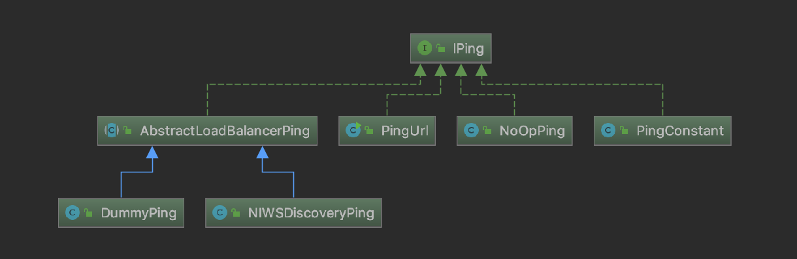

# Spring Cloud

​	许多这些功能都由[Spring Boot](http://projects.spring.io/spring-boot)覆盖，我们在Spring Cloud中建立。更多的由Spring Cloud提供为两个库：Spring Cloud Context和Spring Cloud Commons。

Spring Cloud  Context为Spring Cloud应用程序（引导上下文，加密，刷新范围和环境端点）的`ApplicationContext`提供实用程序和特殊服务。

Spring Cloud Commons是一组在不同的Spring Cloud实现中使用的抽象和常用类（例如Spring Cloud Netflix vs. Spring Cloud Consul）。

# Spring Cloud Context：应用程序上下文服务

[深入理解SpringCloud之引导程序应用上下文](https://www.cnblogs.com/niechen/p/8968204.html)


# Spring Cloud Commons：普通抽象

## @EnableDiscoveryClient

[SpringCloud（三）：@EnableDiscoveryClient 注解如何实现服务注册与发现](https://blog.csdn.net/z694644032/article/details/96706593)

Commons提供`@EnableDiscoveryClient`注释。这通过`META-INF/spring.factories`查找`DiscoveryClient`接口的实现。Discovery Client的实现将在`org.springframework.cloud.client.discovery.EnableDiscoveryClient`键下的`spring.factories`中添加一个配置类。`DiscoveryClient`实现的示例是[Spring Cloud Netflix Eureka](http://cloud.spring.io/spring-cloud-netflix/)，[Spring Cloud Consul发现](http://cloud.spring.io/spring-cloud-consul/)和[Spring Cloud Zookeeper发现](http://cloud.spring.io/spring-cloud-zookeeper/)。

默认情况下，`DiscoveryClient`的实现将使用远程发现服务器自动注册本地Spring Boot服务器。可以通过在`@EnableDiscoveryClient`中设置`autoRegister=false`来禁用此功能。


```java
public class EnableDiscoveryClientImportSelector extends SpringFactoryImportSelector<EnableDiscoveryClient> {
    public EnableDiscoveryClientImportSelector() {
    }

    public String[] selectImports(AnnotationMetadata metadata) {
        String[] imports = super.selectImports(metadata);
        AnnotationAttributes attributes = AnnotationAttributes.fromMap(metadata.getAnnotationAttributes(this.getAnnotationClass().getName(), true));
        boolean autoRegister = attributes.getBoolean("autoRegister");
        if (autoRegister) {
            List<String> importsList = new ArrayList(Arrays.asList(imports));
            importsList.add("org.springframework.cloud.client.serviceregistry.AutoServiceRegistrationConfiguration");
            imports = (String[])importsList.toArray(new String[0]);
        } else {
            Environment env = this.getEnvironment();
            if (ConfigurableEnvironment.class.isInstance(env)) {
                ConfigurableEnvironment configEnv = (ConfigurableEnvironment)env;
                LinkedHashMap<String, Object> map = new LinkedHashMap();
                map.put("spring.cloud.service-registry.auto-registration.enabled", false);
                MapPropertySource propertySource = new MapPropertySource("springCloudDiscoveryClient", map);
                configEnv.getPropertySources().addLast(propertySource);
            }
        }

        return imports;
    }

    protected boolean isEnabled() {
        return (Boolean)this.getEnvironment().getProperty("spring.cloud.discovery.enabled", Boolean.class, Boolean.TRUE);
    }

    protected boolean hasDefaultFactory() {
        return true;
    }
}
```


## ribbon

### 简单使用

```java
@Bean
@LoadBalanced
public RestTemplate restTemplate() {
    return new RestTemplate();
}
```


```java
@Autowired
RestTemplate restTemplate;

@GetMapping("restTemplate")
public String restTemplate(){
    String str = restTemplate.getForObject("http://third-auth-bind/auth/service/test/redirect", String.class);
    return str;
}
```


### 源码分析

#### 1.标记负载均衡

```java
/**
 * Annotation to mark a RestTemplate bean to be configured to use a LoadBalancerClient.
 * 这个注解是用来给RestTemplate做标记，以使用负载均衡客户端（LoadBalancerClient）来配置它
 * @author Spencer Gibb
 */
@Target({ ElementType.FIELD, ElementType.PARAMETER, ElementType.METHOD })
@Retention(RetentionPolicy.RUNTIME)
@Documented
@Inherited
@Qualifier
public @interface LoadBalanced {

}
```

#### 2.注入负载均衡器

```java
/**
 * 客户端负载均衡器
 * @author Spencer Gibb
 */
public interface LoadBalancerClient extends ServiceInstanceChooser {

   /**
    * 执行请求内容。
    */
   <T> T execute(String serviceId, LoadBalancerRequest<T> request) throws IOException;

   <T> T execute(String serviceId, ServiceInstance serviceInstance,
         LoadBalancerRequest<T> request) throws IOException;

   /**
    * 重新构建一个URI，http://service/path => http://host:port/path
    */
   URI reconstructURI(ServiceInstance instance, URI original);

}

public interface ServiceInstanceChooser {

	/**
	 * 根据传入的serviceId（服务名），从负载均衡器中选择一个服务实例，服务实例通过ServiceInstance类来      * 表示
	 */
	ServiceInstance choose(String serviceId);

}
```

##### 2.1RibbonLoadBalancerClient

唯一实现RibbonLoadBalancerClient。

```java
public <T> T execute(String serviceId, LoadBalancerRequest<T> request, Object hint)
    throws IOException {
    ILoadBalancer loadBalancer = getLoadBalancer(serviceId);
    //获取服务实例
    Server server = getServer(loadBalancer, hint);
    if (server == null) {
        throw new IllegalStateException("No instances available for " + serviceId);
    }
    //拦截器处理
    RibbonServer ribbonServer = new RibbonServer(serviceId, server,
                                                 isSecure(server, serviceId),
                                                 serverIntrospector(serviceId).getMetadata(server));

    return execute(serviceId, ribbonServer, request);
}

@Override
public <T> T execute(String serviceId, ServiceInstance serviceInstance,
      LoadBalancerRequest<T> request) throws IOException {
   Server server = null;
   if (serviceInstance instanceof RibbonServer) {
      server = ((RibbonServer) serviceInstance).getServer();
   }
   if (server == null) {
      throw new IllegalStateException("No instances available for " + serviceId);
   }

   RibbonLoadBalancerContext context = this.clientFactory
         .getLoadBalancerContext(serviceId);
   RibbonStatsRecorder statsRecorder = new RibbonStatsRecorder(context, server);

   try {
      T returnVal = request.apply(serviceInstance);
      statsRecorder.recordStats(returnVal);
      return returnVal;
   }
   // catch IOException and rethrow so RestTemplate behaves correctly
   catch (IOException ex) {
      statsRecorder.recordStats(ex);
      throw ex;
   }
   catch (Exception ex) {
      statsRecorder.recordStats(ex);
      ReflectionUtils.rethrowRuntimeException(ex);
   }
   return null;
}
```


##### 2.2ILoadBalancer

```java
public interface ILoadBalancer {

    public void addServers(List<Server> newServers);

    public Server chooseServer(Object key);

    public void markServerDown(Server server);

    public List<Server> getReachableServers();

    public List<Server> getAllServers();
}
```


- NoOpLoadBalancer：啥都不做
- BaseLoadBalancer：
- 一个负载均衡器的基本实现，其中有一个任意列表，可以将服务器设置为服务器池。
- 可以设置一个ping来确定服务器的活力。
- 在内部，该类维护一个“all”服务器列表，以及一个“up”服务器列表，并根据调用者的要求使用它们。
- DynamicServerListLoadBalancer：
- 通过动态的获取服务器的候选列表的负载平衡器。
- 可以通过筛选标准来传递服务器列表，以过滤不符合所需条件的服务器。
- ZoneAwareLoadBalancer：
- 用于测量区域条件的关键指标是平均活动请求，它根据每个rest客户机和每个区域聚合。这是区域内未完成的请求总数除以可用目标实例的数量(不包括断路器跳闸实例)。当在坏区上缓慢发生超时时，此度量非常有效。
- 该负载均衡器将计算并检查所有可用区域的区域状态。如果任何区域的平均活动请求已达到配置的阈值，则该区域将从活动服务器列表中删除。如果超过一个区域达到阈值，则将删除每个服务器上活动请求最多的区域。一旦去掉最坏的区域，将在其余区域中选择一个区域，其概率与其实例数成正比。服务器将使用给定的规则从所选区域返回。对于每个请求，将重复上述步骤。也就是说，每个与区域相关的负载平衡决策都是实时做出的，最新的统计数据可以帮助进行选择。

```java
//RibbonClientConfiguration
@Bean
@ConditionalOnMissingBean
public ILoadBalancer ribbonLoadBalancer(IClientConfig config, ServerList<Server> serverList, ServerListFilter<Server> serverListFilter, IRule rule, IPing ping, ServerListUpdater serverListUpdater) {
    return (ILoadBalancer)(this.propertiesFactory
    .isSet(ILoadBalancer.class, this.name) ? (ILoadBalancer)this.propertiesFactory
    .get(ILoadBalancer.class, config, this.name) : new ZoneAwareLoadBalancer(config, rule, ping, serverList, serverListFilter, serverListUpdater));
}
```

整合时默认采用了ZoneAwareLoadBalancer来实现负载均衡器。

负载均衡器所需的主要配置项是IClientConfig, ServerList, ServerListFilter, IRule, IPing, ServerListUpdater。下面逐一分析他们。

#### 负载均衡器

##### IClientConfig

IClientConfig 用于对客户端或者负载均衡的配置，它的默认实现类为 DefaultClientConfigImpl。

##### IRule

为LoadBalancer定义“负载均衡策略”的接口。

```java
public interface IRule{

    public Server choose(Object key);
    
    public void setLoadBalancer(ILoadBalancer lb);
    
    public ILoadBalancer getLoadBalancer();    
}
```

IRule 的实现 依赖关系示意图如下：


- BestAvailableRule：选择具有最低并发请求的服务器。
- ClientConfigEnabledRoundRobinRule：轮询。
- RandomRule：随机选择一个服务器。
- RoundRobinRule：轮询选择服务器。
- RetryRule：具备重试机制的轮询。
- WeightedResponseTimeRule：根据使用平均响应时间去分配一个weight（权重） ，weight越低，被选择的可能性就越低。
- ZoneAvoidanceRule：根据区域和可用性筛选，再轮询选择服务器。

##### IPing

定义如何 “ping” 服务器以检查其是否存活。

```java
public interface IPing {
    public boolean isAlive(Server server);
}
```

IPing 的实现 依赖关系示意图如下：



- PingUrl：真实的去ping 某个url，判断其是否alive。
- PingConstant：固定返回某服务是否可用，默认返回true，即可用
- NoOpPing：不去ping,直接返回true,即可用。
- DummyPing：继承抽象类AbstractLoadBalancerPing，认为所以服务都是存活状态，返回true，即可用。
- NIWSDiscoveryPing：结合eureka使用时，如果Discovery Client在线，则认为心跳检测通过。

##### ServerList

定义获取所有的服务实例清单。

```java
public interface ServerList<T extends Server> {
    public List<T> getInitialListOfServers();
    public List<T> getUpdatedListOfServers();   
}
```

ServerList 的实现 依赖关系示意图如下：


- DomainExtractingServerList：代理类，根据传入的ServerList的值，实现具体的逻辑。
- ConfigurationBasedServerList：从配置文件中加载服务器列表。
- DiscoveryEnabledNIWSServerList：从Eureka注册中心中获取服务器列表。
- StaticServerList：通过静态配置来维护服务器列表。

##### ServerListFilter

允许根据过滤配置动态获得的具有所需特性的候选服务器列表。

```java
public interface ServerListFilter<T extends Server> {
    public List<T> getFilteredListOfServers(List<T> servers);
}
```

ServerListFilter 的实现 依赖关系示意图如下：


- DefaultNIWSServerListFilter：完全继承自ZoneAffinityServerListFilter。
- ZonePreferenceServerListFilter：EnableZoneAffinity 或  EnableZoneExclusivity  开启状态使用，默认关闭。处理基于区域感知的过滤服务器，过滤掉不和客户端在相同zone的服务，若不存在相同zone，则不进行过滤。
- ServerListSubsetFilter：服务器列表筛选器，它将负载平衡器使用的服务器数量限制为所有服务器的子集。如果服务器机群很大(例如数百个)，并且不需要使用每一个机群并将连接保存在http客户机的连接池中，那么这是非常有用的。它还可以通过比较总的网络故障和并发连接来驱逐相对不健康的服务器。

##### ServerListUpdater

用于执行动态服务器列表更新。

```java
public interface ServerListUpdater {

    public interface UpdateAction {
        void doUpdate();
    }

    void start(UpdateAction updateAction);

    void stop();

    String getLastUpdate();

    long getDurationSinceLastUpdateMs();

    int getNumberMissedCycles();

    int getCoreThreads();
}
```

ServerListUpdater 的实现 依赖关系示意图如下：


- PollingServerListUpdater：默认的实现策略，会启动一个定时线程池，定时执行更新策略。

- ##### EurekaNotificationServerListUpdater：利用Eureka的事件监听器来驱动服务列表的更新操作。


#### 3.自动配置

##### LoadBalancerAutoConfiguration

spring-cloud-common包下的META-INF/spring.factories会自动配置LoadBalancerAutoConfiguration

```java
@Configuration
//当前classpath中存在类RestTemplate
@ConditionalOnClass(RestTemplate.class)
//spring中注入了LoadBalancerClient
@ConditionalOnBean(LoadBalancerClient.class)
@EnableConfigurationProperties(LoadBalancerRetryProperties.class)
public class LoadBalancerAutoConfiguration {

   @LoadBalanced
   @Autowired(required = false)
   private List<RestTemplate> restTemplates = Collections.emptyList();

   @Autowired(required = false)
   private List<LoadBalancerRequestTransformer> transformers = Collections.emptyList();

   @Bean
   public SmartInitializingSingleton loadBalancedRestTemplateInitializerDeprecated(
         final ObjectProvider<List<RestTemplateCustomizer>> restTemplateCustomizers) {
      return () -> restTemplateCustomizers.ifAvailable(customizers -> {
         for (RestTemplate restTemplate : LoadBalancerAutoConfiguration.this.restTemplates) {
            for (RestTemplateCustomizer customizer : customizers) {
               customizer.customize(restTemplate);
            }
         }
      });
   }

   @Bean
   @ConditionalOnMissingBean
   public LoadBalancerRequestFactory loadBalancerRequestFactory(
         LoadBalancerClient loadBalancerClient) {
      return new LoadBalancerRequestFactory(loadBalancerClient, this.transformers);
   }

   @Configuration
   @ConditionalOnMissingClass("org.springframework.retry.support.RetryTemplate")
   static class LoadBalancerInterceptorConfig {

       //负载均衡拦截器，对客户端请求拦截
      @Bean
      public LoadBalancerInterceptor ribbonInterceptor(
            LoadBalancerClient loadBalancerClient,
            LoadBalancerRequestFactory requestFactory) {
         return new LoadBalancerInterceptor(loadBalancerClient, requestFactory);
      }

       //RestTemplate定制器，为每个restTemplate设置拦截器
      @Bean
      @ConditionalOnMissingBean
      public RestTemplateCustomizer restTemplateCustomizer(
            final LoadBalancerInterceptor loadBalancerInterceptor) {
         return restTemplate -> {
            List<ClientHttpRequestInterceptor> list = new ArrayList<>(
                  restTemplate.getInterceptors());
            list.add(loadBalancerInterceptor);
            restTemplate.setInterceptors(list);
         };
      }

   }

   /**
    * Auto configuration for retry mechanism.
    */
   @Configuration
   @ConditionalOnClass(RetryTemplate.class)
   public static class RetryAutoConfiguration {

      @Bean
      @ConditionalOnMissingBean
      public LoadBalancedRetryFactory loadBalancedRetryFactory() {
         return new LoadBalancedRetryFactory() {
         };
      }

   }

   /**
    * Auto configuration for retry intercepting mechanism.
    */
   @Configuration
   @ConditionalOnClass(RetryTemplate.class)
   public static class RetryInterceptorAutoConfiguration {

      @Bean
      @ConditionalOnMissingBean
      public RetryLoadBalancerInterceptor ribbonInterceptor(
            LoadBalancerClient loadBalancerClient,
            LoadBalancerRetryProperties properties,
            LoadBalancerRequestFactory requestFactory,
            LoadBalancedRetryFactory loadBalancedRetryFactory) {
         return new RetryLoadBalancerInterceptor(loadBalancerClient, properties,
               requestFactory, loadBalancedRetryFactory);
      }

      @Bean
      @ConditionalOnMissingBean
      public RestTemplateCustomizer restTemplateCustomizer(
            final RetryLoadBalancerInterceptor loadBalancerInterceptor) {
         return restTemplate -> {
            List<ClientHttpRequestInterceptor> list = new ArrayList<>(
                  restTemplate.getInterceptors());
            list.add(loadBalancerInterceptor);
            restTemplate.setInterceptors(list);
         };
      }

   }

}
```


##### RibbonAutoConfiguration

spring-cloud-netflix-ribbon包下的META-INF/spring.factories会自动配置RibbonAutoConfiguration

```java
@Configuration
@Conditional(RibbonAutoConfiguration.RibbonClassesConditions.class)
@RibbonClients
@AutoConfigureAfter(name = "org.springframework.cloud.netflix.eureka.EurekaClientAutoConfiguration")
@AutoConfigureBefore({ LoadBalancerAutoConfiguration.class,
      AsyncLoadBalancerAutoConfiguration.class })
@EnableConfigurationProperties({ RibbonEagerLoadProperties.class,
      ServerIntrospectorProperties.class })
public class RibbonAutoConfiguration {

   @Autowired(required = false)
   private List<RibbonClientSpecification> configurations = new ArrayList<>();

   @Autowired
   private RibbonEagerLoadProperties ribbonEagerLoadProperties;

   @Bean
   public HasFeatures ribbonFeature() {
      return HasFeatures.namedFeature("Ribbon", Ribbon.class);
   }

   @Bean
   public SpringClientFactory springClientFactory() {
      SpringClientFactory factory = new SpringClientFactory();
      factory.setConfigurations(this.configurations);
      return factory;
   }

   @Bean
   @ConditionalOnMissingBean(LoadBalancerClient.class)
   public LoadBalancerClient loadBalancerClient() {
      return new RibbonLoadBalancerClient(springClientFactory());
   }

   @Bean
   @ConditionalOnClass(name = "org.springframework.retry.support.RetryTemplate")
   @ConditionalOnMissingBean
   public LoadBalancedRetryFactory loadBalancedRetryPolicyFactory(
         final SpringClientFactory clientFactory) {
      return new RibbonLoadBalancedRetryFactory(clientFactory);
   }

   @Bean
   @ConditionalOnMissingBean
   public PropertiesFactory propertiesFactory() {
      return new PropertiesFactory();
   }

   @Bean
   @ConditionalOnProperty("ribbon.eager-load.enabled")
   public RibbonApplicationContextInitializer ribbonApplicationContextInitializer() {
      return new RibbonApplicationContextInitializer(springClientFactory(),
            ribbonEagerLoadProperties.getClients());
   }

   @Configuration
   @ConditionalOnClass(HttpRequest.class)
   @ConditionalOnRibbonRestClient
   protected static class RibbonClientHttpRequestFactoryConfiguration {

      @Autowired
      private SpringClientFactory springClientFactory;

      @Bean
      public RestTemplateCustomizer restTemplateCustomizer(
            final RibbonClientHttpRequestFactory ribbonClientHttpRequestFactory) {
         return restTemplate -> restTemplate
               .setRequestFactory(ribbonClientHttpRequestFactory);
      }

      @Bean
      public RibbonClientHttpRequestFactory ribbonClientHttpRequestFactory() {
         return new RibbonClientHttpRequestFactory(this.springClientFactory);
      }

   }

   // TODO: support for autoconfiguring restemplate to use apache http client or okhttp

   @Target({ ElementType.TYPE, ElementType.METHOD })
   @Retention(RetentionPolicy.RUNTIME)
   @Documented
   @Conditional(OnRibbonRestClientCondition.class)
   @interface ConditionalOnRibbonRestClient {

   }

   private static class OnRibbonRestClientCondition extends AnyNestedCondition {

      OnRibbonRestClientCondition() {
         super(ConfigurationPhase.REGISTER_BEAN);
      }

      @Deprecated // remove in Edgware"
      @ConditionalOnProperty("ribbon.http.client.enabled")
      static class ZuulProperty {

      }

      @ConditionalOnProperty("ribbon.restclient.enabled")
      static class RibbonProperty {

      }

   }

   /**
    * {@link AllNestedConditions} that checks that either multiple classes are present.
    */
   static class RibbonClassesConditions extends AllNestedConditions {

      RibbonClassesConditions() {
         super(ConfigurationPhase.PARSE_CONFIGURATION);
      }

      @ConditionalOnClass(IClient.class)
      static class IClientPresent {

      }

      @ConditionalOnClass(RestTemplate.class)
      static class RestTemplatePresent {

      }

      @ConditionalOnClass(AsyncRestTemplate.class)
      static class AsyncRestTemplatePresent {

      }

      @ConditionalOnClass(Ribbon.class)
      static class RibbonPresent {

      }

   }

}
```


#### 4.负载均衡拦截器

```java
//负载均衡拦截器
public class LoadBalancerInterceptor implements ClientHttpRequestInterceptor {

   private LoadBalancerClient loadBalancer;

   private LoadBalancerRequestFactory requestFactory;

   public LoadBalancerInterceptor(LoadBalancerClient loadBalancer,
         LoadBalancerRequestFactory requestFactory) {
      this.loadBalancer = loadBalancer;
      this.requestFactory = requestFactory;
   }

   public LoadBalancerInterceptor(LoadBalancerClient loadBalancer) {
      // for backwards compatibility
      this(loadBalancer, new LoadBalancerRequestFactory(loadBalancer));
   }

   @Override
   public ClientHttpResponse intercept(final HttpRequest request, final byte[] body,
         final ClientHttpRequestExecution execution) throws IOException {
      final URI originalUri = request.getURI();
      String serviceName = originalUri.getHost();
      Assert.state(serviceName != null,
            "Request URI does not contain a valid hostname: " + originalUri);
      return this.loadBalancer.execute(serviceName,
            this.requestFactory.createRequest(request, body, execution));
   }

}
```


## feign


### 使用okhttp

#### 1.添加依赖

```xml
<dependency>
    <groupId>io.github.openfeign</groupId>
    <artifactId>feign-okhttp</artifactId>
    <version>10.2.3</version>
</dependency>
```

#### 2.修改配置

```yaml
feign:
  httpclient:
    enabled: false
  okhttp:
    enabled: true
```

#### 3.源码

```java
@Configuration
@ConditionalOnClass(OkHttpClient.class)
@ConditionalOnProperty("feign.okhttp.enabled")
class OkHttpFeignLoadBalancedConfiguration {

   @Bean
   @ConditionalOnMissingBean(Client.class)
   public Client feignClient(CachingSpringLoadBalancerFactory cachingFactory,
         SpringClientFactory clientFactory, okhttp3.OkHttpClient okHttpClient) {
      OkHttpClient delegate = new OkHttpClient(okHttpClient);
      return new LoadBalancerFeignClient(delegate, cachingFactory, clientFactory);
   }

   @Configuration
   //当spring中没有OkHttpClient这个bean时进行配置
   @ConditionalOnMissingBean(okhttp3.OkHttpClient.class)
   protected static class OkHttpFeignConfiguration {

      private okhttp3.OkHttpClient okHttpClient;

      @Bean
      @ConditionalOnMissingBean(ConnectionPool.class)
      public ConnectionPool httpClientConnectionPool(
            FeignHttpClientProperties httpClientProperties,
            OkHttpClientConnectionPoolFactory connectionPoolFactory) {
         Integer maxTotalConnections = httpClientProperties.getMaxConnections();
         Long timeToLive = httpClientProperties.getTimeToLive();
         TimeUnit ttlUnit = httpClientProperties.getTimeToLiveUnit();
         return connectionPoolFactory.create(maxTotalConnections, timeToLive, ttlUnit);
      }

      @Bean
      public okhttp3.OkHttpClient client(OkHttpClientFactory httpClientFactory,
            ConnectionPool connectionPool,
            FeignHttpClientProperties httpClientProperties) {
         Boolean followRedirects = httpClientProperties.isFollowRedirects();
         Integer connectTimeout = httpClientProperties.getConnectionTimeout();
         this.okHttpClient = httpClientFactory
               .createBuilder(httpClientProperties.isDisableSslValidation())
               .connectTimeout(connectTimeout, TimeUnit.MILLISECONDS)
               .followRedirects(followRedirects).connectionPool(connectionPool)
               .build();
         return this.okHttpClient;
      }

      @PreDestroy
      public void destroy() {
         if (this.okHttpClient != null) {
            this.okHttpClient.dispatcher().executorService().shutdown();
            this.okHttpClient.connectionPool().evictAll();
         }
      }

   }

}
```


