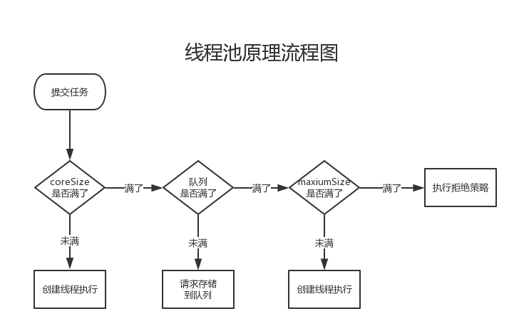

# 微服务学习笔记

高可用可伸缩微服务架构

## CAP理论

[分布式系统的CAP理论](https://www.hollischuang.com/archives/666)

一个分布式系统最多只能同时满足一致性（Consistency）、可用性（Availability）和分区容错性（Partition tolerance）这三项中的两项。

**一致性（Consistency）** 

 一致性指“all nodes see the same data at the same time”，即更新操作成功并返回客户端完成后，所有节点在同一时间的数据完全一致。 

 **可用性（Availability）** 

 可用性指“Reads and writes always succeed”，即服务一直可用，而且是正常响应时间。 

**分区容错性（Partition tolerance）** 

 分区容错性指“the system continues to operate despite arbitrary message  loss or failure of part of the  system”，即分布式系统在遇到某节点或网络分区故障的时候，仍然能够对外提供满足一致性和可用性的服务。 


### base理论

**基本可用（Basically Available）** 

 基本可用是指分布式系统在出现故障的时候，允许损失部分可用性，即保证核心可用。  

 电商大促时，为了应对访问量激增，部分用户可能会被引导到降级页面，服务层也可能只提供降级服务。这就是损失部分可用性的体现。 

**软状态（ Soft State）** 

 软状态是指允许系统存在中间状态，而该中间状态不会影响系统整体可用性。分布式存储中一般一份数据至少会有三个副本，允许不同节点间副本同步的延时就是软状态的体现。mysql replication的异步复制也是一种体现。 

 **最终一致性（ Eventual Consistency）** 

 最终一致性是指系统中的所有数据副本经过一定时间后，最终能够达到一致的状态。弱一致性和强一致性相反，最终一致性是弱一致性的一种特殊情况。  


## 微服务的稳定性

### 高可用

#### 限流算法

##### 计数器法

算法维护一个counter，规定时间不能超过最大值，每隔固定时间清零。如果counter大于阈值，拒绝请求。

##### 漏桶算法

维护一个固定容量的桶，把请求比作是水，水来了都先放进桶里，并以限定的速度出水，当水来得过猛而出水不够快时就会导致水直接溢出，即拒绝服务。


##### 令牌桶算法

令牌桶算法的原理是系统以恒定的速率产生令牌，然后把令牌放到令牌桶中，令牌桶有一个容量，当令牌桶满了的时候，再向其中放令牌，那么多余的令牌会被丢弃；当想要处理一个请求的时候，需要从令牌桶中取出一个令牌，如果此时令牌桶中没有令牌，那么则拒绝该请求。

这种算法的好处就是便于控制系统的处理速度，甚至可以通过统计信息实时优化令牌桶的大小。


##### 限流实践：RateLimiter

RateLimiter是guava中的一个限流工具类，使用了令牌桶算法。支持两种令牌获取接口：

1.获取不到一直阻塞。

2.指定时间内获取不到就阻塞，超时则返回获取失败。

RateLimiter不会记录最后一个请求的执行时间，而是记录下一个请求的期望执行时间。

https://segmentfault.com/a/1190000012875897


#### 断路器


##### Hystrix


##### Sentinel


#### 超时重试


### 高并发

异步-提高业务过程中可异步部分的占比，提高异步部分的执行效率。

缓存-将频繁访问的数据存储在离业务处理逻辑更近的地方。

池化-对于创建起来比较消耗资源的对象进行缓存。


#### 异步

单体：线程池或异步回调机制。

多实例：消息队列、redis队列等中间件。

##### 线程池



```java
public ThreadPoolExecutor(int corePoolSize,
                          int maximumPoolSize,
                          long keepAliveTime,
                          TimeUnit unit,
                          BlockingQueue<Runnable> workQueue)
public ThreadPoolExecutor(int corePoolSize,
                          int maximumPoolSize,
                          long keepAliveTime,
                          TimeUnit unit,
                          BlockingQueue<Runnable> workQueue,
                          ThreadFactory threadFactory,
                          RejectedExecutionHandler handler) 
```

###### 队列

ThreadPoolExecutor要求的队列类型是阻塞队列BlockingQueue，比如：

- LinkedBlockingQueue：基于链表的阻塞队列，可以指定最大长度，但默认是无界的。
- ArrayBlockingQueue：基于数组的有界阻塞队列
- PriorityBlockingQueue：基于堆的无界阻塞优先级队列
- SynchronousQueue：没有实际存储空间的同步阻塞队列

如果用的是无界队列，需要强调的是，线程个数最多只能达到corePoolSize，到达corePoolSize后，新的任务总会排队，参数maximumPoolSize也就没有意义了。

另一面，对于SynchronousQueue，我们知道，它没有实际存储元素的空间，当尝试排队时，只有正好有空闲线程在等待接受任务时，才会入队成功，否则，总是会创建新线程，直到达到maximumPoolSize。


###### 任务拒绝策略

如果队列有界，且maximumPoolSize有限，则当队列排满，线程个数也达到了maximumPoolSize，这时，新任务来了，如何处理呢？此时，会触发线程池的任务拒绝策略。

默认情况下，提交任务的方法如execute/submit/invokeAll等会抛出异常，类型为RejectedExecutionException。

不过，拒绝策略是可以自定义的，ThreadPoolExecutor实现了四种处理方式：

- ThreadPoolExecutor.AbortPolicy：这就是**默认的方式，抛出异常**
- ThreadPoolExecutor.DiscardPolicy：静默处理，**忽略新任务，不抛异常，也不执行**
- ThreadPoolExecutor.DiscardOldestPolicy：将**等待时间最长的任务扔掉，然后自己排队**
- ThreadPoolExecutor.CallerRunsPolicy：在**任务提交者线程中执行任务，而不是交给线程池中的线程执行**

我们需要强调下，拒绝策略只有在队列有界，且maximumPoolSize有限的情况下才会触发。

如果队列无界，服务不了的任务总是会排队，但这不见得是期望的，因为请求处理队列可能会消耗非常大的内存，甚至引发内存不够的异常。

如果队列有界但maximumPoolSize无限，可能会创建过多的线程，占满CPU和内存，使得任何任务都难以完成。

所以，在任务量非常大的场景中，让拒绝策略有机会执行是保证系统稳定运行很重要的方面。


###### **线程工厂**

线程池还可以接受一个参数，ThreadFactory，它是一个接口，定义为：

```
public interface ThreadFactory {
    Thread newThread(Runnable r);
}
```

这个接口根据Runnable创建一个Thread，ThreadPoolExecutor的默认实现是Executors类中的静态内部类DefaultThreadFactory，主要就是创建一个线程，给线程设置一个名称，设置daemon属性为false，设置线程优先级为标准默认优先级，线程名称的格式为：  pool-<线程池编号>-thread-<线程编号>。

如果需要自定义一些线程的属性，比如名称，可以实现自定义的ThreadFactory。


###### **核心线程的特殊配置**

线程个数小于等于corePoolSize时，我们称这些线程为核心线程，默认情况下：

- 核心线程不会预先创建，只有当有任务时才会创建
- 核心线程不会因为空闲而被终止，keepAliveTime参数不适用于它

不过，ThreadPoolExecutor有如下方法，可以改变这个默认行为。

```java
//预先创建所有的核心线程
public int prestartAllCoreThreads()
//创建一个核心线程，如果所有核心线程都已创建，返回false
public boolean prestartCoreThread()
//如果参数为true，则keepAliveTime参数也适用于核心线程
public void allowCoreThreadTimeOut(boolean value)
```


##### 异步回调机制


##### 消息队列


#### 缓存

[redis缓存击穿、缓存穿透、缓存雪崩](https://my.oschina.net/u/3434392/blog/3012132)

##### 缓存穿透

缓存穿透，是指查询一个数据库一定不存在的数据。正常的使用缓存流程大致是，数据查询先进行缓存查询，如果key不存在或者key已经过期，再对数据库进行查询，并把查询到的对象，放进缓存。如果数据库查询对象为空，则不放进缓存。

想象一下这个情况，如果传入的参数为-1，会是怎么样？这个-1，就是一定不存在的对象。就会每次都去查询数据库，而每次查询都是空，每次又都不会进行缓存。假如有恶意攻击，就可以利用这个漏洞，对数据库造成压力，甚至压垮数据库。即便是采用UUID，也是很容易找到一个不存在的KEY，进行攻击。

##### 缓存雪崩

缓存雪崩，是指在某一个时间段，缓存集中过期失效。

产生雪崩的原因之一，比如在写本文的时候，马上就要到双十二零点，很快就会迎来一波抢购，这波商品时间比较集中的放入了缓存，假设缓存一个小时。那么到了凌晨一点钟的时候，这批商品的缓存就都过期了。而对这批商品的访问查询，都落到了数据库上，对于数据库而言，就会产生周期性的压力波峰。

小编在做电商项目的时候，一般是采取不同分类商品，缓存不同周期。在同一分类中的商品，加上一个随机因子。这样能尽可能分散缓存过期时间，而且，热门类目的商品缓存时间长一些，冷门类目的商品缓存时间短一些，也能节省缓存服务的资源。

其实集中过期，倒不是非常致命，比较致命的缓存雪崩，是缓存服务器某个节点宕机或断网。因为自然形成的缓存雪崩，一定是在某个时间段集中创建缓存，那么那个时候数据库能顶住压力，这个时候，数据库也是可以顶住压力的。无非就是对数据库产生周期性的压力而已。而缓存服务节点的宕机，对数据库服务器造成的压力是不可预知的，很有可能瞬间就把数据库压垮。

##### 热点缓存

缓存击穿，是指一个key非常热点，在不停的扛着大并发，大并发集中对这一个点进行访问，当这个key在失效的瞬间，持续的大并发就穿破缓存，直接请求数据库，就像在一个屏障上凿开了一个洞。

[如果20万用户同时访问一个热点缓存，如何优化你的缓存架构？](<https://www.jianshu.com/p/6e37a1a9c160>)

**基于流式计算技术的缓存热点自动发现**

**热点缓存自动加载为JVM本地缓存**

**限流熔断保护**