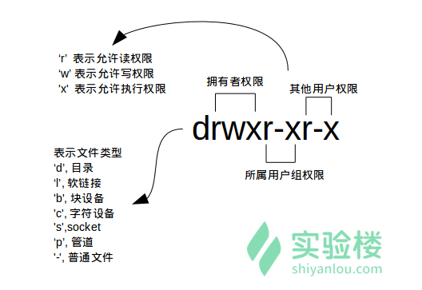
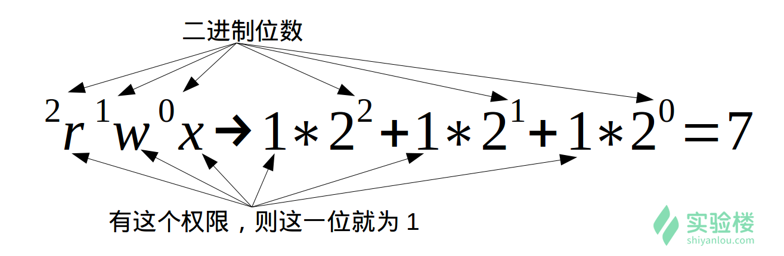
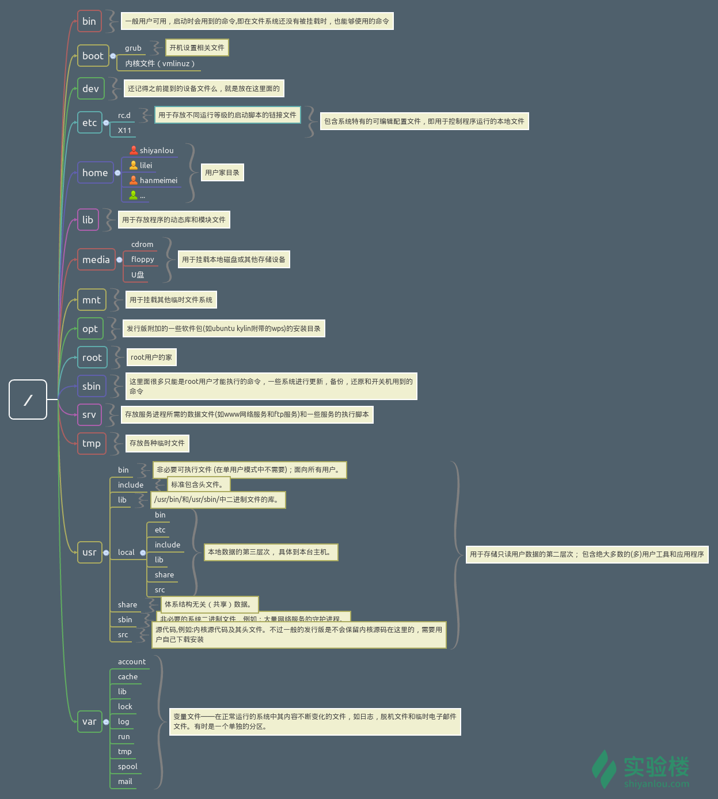
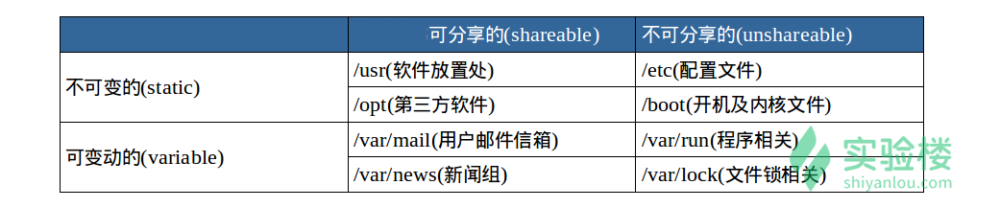

# linux常用命令
```
mkdir -p /test/test 递归创建多个目录
```
```java
//查看端口占用
netstat -tln | grep 8080 
//进程名称查询
ps -ef | grep nginx
//杀死进程
kill -9 进程id  
```


# 用户管理

## 查看用户

```shell
[root@iZwz9669tqw1uyogm8fha2Z ~]# who am i
root     pts/0        2020-07-17 09:34 (183.62.18.98)
```

输出的第一列表示打开当前伪终端的用户的用户名（要查看当前登录用户的用户名，去掉空格直接使用 `whoami` 即可），第二列的 `pts/0` 中 `pts` 表示伪终端，所谓伪是相对于 `/dev/tty` 设备而言的，还记得上一节讲终端时的那七个使用 `[Ctrl]`+`[Alt]`+`[F1]～[F7]` 进行切换的 `/dev/tty` 设备么，这是“真终端”，伪终端就是当你在图形用户界面使用 `/dev/tty7` 时每打开一个终端就会产生一个伪终端，`pts/0` 后面那个数字就表示打开的伪终端序号，你可以尝试再打开一个终端，然后在里面输入 `who am i`，看第二列是不是就变成 `pts/1` 了，第三列则表示当前伪终端的启动时间。

`who` 命令其它常用参数

| 参数 | 说明                       |
| ---- | -------------------------- |
| `-a` | 打印能打印的全部           |
| `-d` | 打印死掉的进程             |
| `-m` | 同`am i`，`mom likes`      |
| `-q` | 打印当前登录用户数及用户名 |
| `-u` | 打印当前登录用户登录信息   |
| `-r` | 打印运行等级               |

## 创建用户

在 Linux 系统里， `root` 账户拥有整个系统至高无上的权限，比如新建和添加用户。

> root 权限，系统权限的一种，与 SYSTEM 权限可以理解成一个概念，但高于 Administrator 权限，root 是  Linux 和 UNIX  系统中的超级管理员用户帐户，该帐户拥有整个系统至高无上的权力，所有对象他都可以操作，所以很多黑客在入侵系统的时候，都要把权限提升到 root  权限，这个操作等同于在 Windows 下就是将新建的非法帐户添加到 Administrators 用户组。更比如安卓操作系统中（基于  Linux 内核）获得 root  权限之后就意味着已经获得了手机的最高权限，这时候你可以对手机中的任何文件（包括系统文件）执行所有增、删、改、查的操作。

大部分 Linux 系统在安装时都会建议用户新建一个用户而不是直接使用 root 用户进行登录，当然也有直接使用 root 登录的例如  Kali（基于 Debian 的 Linux  发行版，集成大量工具软件，主要用于数字取证的操作系统）。一般我们登录系统时都是以普通账户的身份登录的，要创建用户需要 root  权限，这里就要用到 `sudo` 这个命令了。不过使用这个命令有两个大前提，一是你要知道当前登录用户的密码，二是当前用户必须在 `sudo` 用户组。shiyanlou 用户也属于 sudo 用户组（稍后会介绍如何查看和添加用户组）。

**su，su- 与 sudo**

**需要注意 Linux 环境下输入密码是不会显示的。**

`su <user>` 可以切换到用户 user，执行时需要输入目标用户的密码，`sudo <cmd>` 可以以特权级别运行 cmd 命令，需要当前用户属于 sudo 组，且需要输入当前用户的密码。`su - <user>` 命令也是切换用户，但是同时用户的环境变量和工作目录也会跟着改变成目标用户所对应的。

```shell
# 创建用户
[root@iZwz9669tqw1uyogm8fha2Z ~]# sudo adduser lcm
# 设置密码
[root@iZwz9669tqw1uyogm8fha2Z ~]# sudo passwd lcm
Changing password for user lcm.
New password: 
Retype new password: 
passwd: all authentication tokens updated successfully.
# 查看新用户在 /home 目录下创建一个工作目录
[root@iZwz9669tqw1uyogm8fha2Z ~]# ls /home
gitlab-runner  lcm
# 切换用户
[root@iZwz9669tqw1uyogm8fha2Z ~]# su -l lcm
# 输出当前伪终端的用户
[lcm@iZwz9669tqw1uyogm8fha2Z ~]$ who am i
root     pts/0        2020-07-17 09:34 (183.62.18.98)
# 当前登录用户
[lcm@iZwz9669tqw1uyogm8fha2Z ~]$ whoami
lcm
# 退出当前用户跟退出终端一样，可以使用 exit 命令或者使用快捷键 Ctrl+D
[lcm@iZwz9669tqw1uyogm8fha2Z ~]$ exit
logout
[root@iZwz9669tqw1uyogm8fha2Z ~]# 
```
`adduser` 和 `useradd` 的区别是什么

答：`useradd` 只创建用户，不会创建用户密码和工作目录，创建完了需要使用 `passwd <username>` 去设置新用户的密码。`adduser` 在创建用户的同时，会创建工作目录和密码（提示你设置），做这一系列的操作。其实 `useradd`、`userdel` 这类操作更像是一种命令，执行完了就返回。而 `adduser` 更像是一种程序，需要你输入、确定等一系列操作。

## 用户组

在 Linux 里面每个用户都有一个归属（用户组），用户组简单地理解就是一组用户的集合，它们共享一些资源和权限，同时拥有私有资源，就跟家的形式差不多，你的兄弟姐妹（不同的用户）属于同一个家（用户组），你们可以共同拥有这个家（共享资源），爸妈对待你们都一样（共享权限），你偶尔写写日记，其他人未经允许不能查看（私有资源和权限）。当然一个用户是可以属于多个用户组的，正如你既属于家庭，又属于学校或公司。

在 Linux 里面如何知道自己属于哪些用户组呢？

**方法一：使用 groups 命令**

**方法二：查看 `/etc/group` 文件**

`/etc/group` 文件格式说明

/etc/group 的内容包括用户组（Group）、用户组口令、GID（组 ID） 及该用户组所包含的用户（User），每个用户组一条记录。格式如下：

> group_name:password:GID:user_list

你看到上面的 password 字段为一个 `x`，并不是说密码就是它，只是表示密码不可见而已。

这里需要注意，如果用户的 GID 等于用户组的 GID，那么最后一个字段 `user_list` 就是空的，这里的 GID 是指用户默认所在组的 GID，可以使用 `id` 命令查看。比如 shiyanlou 用户，在 `/etc/group` 中的 shiyanlou 用户组后面是不会显示的。lilei 用户，在 `/etc/group` 中的 lilei 用户组后面是不会显示的。

```shell
# 查看用户组，其中冒号之前表示用户，后面表示该用户所属的用户组
[root@iZwz9669tqw1uyogm8fha2Z ~]# groups lcm
lcm : lcm
[root@iZwz9669tqw1uyogm8fha2Z ~]# groups root
root : root
[root@iZwz9669tqw1uyogm8fha2Z ~]# cat /etc/group | sort
adm:x:4:
kmem:x:9:
lcm:x:1000:
...
[root@iZwz9669tqw1uyogm8fha2Z ~]# cat /etc/group | grep -E "lcm"
lcm:x:1000:
[root@iZwz9669tqw1uyogm8fha2Z ~]# sudo ls
gitlab-runner-10.5.0-1.x86_64.rpm  nohup.out
[root@iZwz9669tqw1uyogm8fha2Z ~]# su -l lcm
Last login: Fri Jul 17 09:47:33 CST 2020 on pts/0
# 不在sudo用户组，没有root权限
[lcm@iZwz9669tqw1uyogm8fha2Z ~]$ sudo ls

We trust you have received the usual lecture from the local System
Administrator. It usually boils down to these three things:

    #1) Respect the privacy of others.
    #2) Think before you type.
    #3) With great power comes great responsibility.

[sudo] password for lcm: 
lcm is not in the sudoers file.  This incident will be reported.
[lcm@iZwz9669tqw1uyogm8fha2Z ~]$ exit
logout
# centos中没有sudo用户组，而是wheel用户组
[root@iZwz9669tqw1uyogm8fha2Z ~]# sudo usermod -G sudo lcm
usermod: group 'sudo' does not exist
# 给lcm用户加入到wheel用户组
[root@iZwz9669tqw1uyogm8fha2Z ~]# sudo usermod -G wheel lcm
[root@iZwz9669tqw1uyogm8fha2Z ~]# su -l lcm
Last login: Fri Jul 17 09:57:51 CST 2020 on pts/0
[lcm@iZwz9669tqw1uyogm8fha2Z ~]$ sudo ls /
[sudo] password for lcm: 
bin   dev     etc   lib    lost+found  mnt  proc  run   srv  tmp  var
boot  docker  home  lib64  media       opt  root  sbin  sys  usr
```

## 删除用户和用户组

```shell
# centos中使用userdel
[root@iZwz9669tqw1uyogm8fha2Z etc]# sudo userdel lcm --remove
```

删除用户组可以使用 `groupdel` 命令，倘若该群组中仍包括某些用户，则必须先删除这些用户后，才能删除群组。


# 权限管理

文件权限就是文件的访问控制权限，即哪些用户和组群可以访问文件以及可以执行什么样的操作。

Unix/Linux  系统是一个典型的多用户系统，不同的用户处于不同的地位，对文件和目录有不同的访问权限。为了保护系统的安全性，Unix/Linux  系统除了对用户权限作了严格的界定外，还在用户身份认证、访问控制、传输安全、文件读写权限等方面作了周密的控制。

在 Unix/Linux 中的每一个文件或目录都包含有访问权限，这些访问权限决定了谁能访问和如何访问这些文件和目录。

## 查看文件权限
```shell
[root@iZwz9669tqw1uyogm8fha2Z etc]# ls -l
total 1388
-rw-r--r--.  1 root root       18 Jul 11  2019 adjtime
-rw-r--r--.  1 root root     1518 Jun  7  2013 aliases
-rw-r--r--   1 root root    12288 Jul 11  2019 aliases.db
drwxr-xr-x.  2 root root     4096 Jul 11  2019 alternative
```

你可能除了知道最后面那一项是文件名之外，其它项就不太清楚了，那么到底是什么意思呢：



可能你还是不太明白，比如第一项文件类型和权限那一堆东西具体指什么，链接又是什么，何为最后修改时间，下面一一道来：


- 文件类型

关于文件类型，这里有一点你必需时刻牢记 **Linux 里面一切皆文件**，正因为这一点才有了设备文件（ `/dev` 目录下有各种设备文件，大都跟具体的硬件设备相关）这一说。 `socket`：网络套接字，具体是什么，感兴趣的用户可以去学习实验楼的后续相关课程。`pipe` 管道，这个东西很重要，我们以后将会讨论到，这里你先知道有它的存在即可。`软链接文件`：链接文件是分为两种的，另一种当然是“硬链接”（硬链接不常用，具体内容不作为本课程讨论重点，而软链接等同于 Windows 上的快捷方式,你记住这一点就够了）。

- 文件权限

r 读权限，表示你可以使用 `cat <file name>` 之类的命令来读取某个文件的内容；

w 写权限，表示你可以编辑和修改某个文件的内容； 

x 执行权限，通常指可以运行的二进制程序文件或者脚本文件，如同 Windows 上的 `exe` 后缀的文件，不过 Linux 上不是通过文件后缀名来区分文件的类型。

你需要注意的一点是，**一个目录同时具有读权限和执行权限才可以打开并查看内部文件，而一个目录要有写权限才允许在其中创建其它文件**，这是因为目录文件实际保存着该目录里面的文件的列表等信息。

所有者权限，这一点相信你应该明白了，至于所属用户组权限，是指你所在的用户组中的所有其它用户对于该文件的权限，比如，你有一个 iPad，那么这个用户组权限就决定了你的兄弟姐妹有没有权限使用它破坏它和占有它。

- 链接数

> 链接到该文件所在的 inode 结点的文件名数目（关于这个概念涉及到 Linux 文件系统的相关概念知识，不在本课程的讨论范围，感兴趣的用户可以查看 [硬链接和软链接的联系与区别](https://www.ibm.com/developerworks/cn/linux/l-cn-hardandsymb-links/index.html#major2)）。

- 文件大小

> 以 inode 结点大小为单位来表示的文件大小，你可以给 ls 加上 `-lh` 参数来更直观的查看文件的大小。


## 变更文件所有者

```bash
# 创建test文件，文件所有者root
[root@iZwz9669tqw1uyogm8fha2Z home]# touch test
[root@iZwz9669tqw1uyogm8fha2Z home]# ll
total 4
drwx------ 3 gitlab-runner gitlab-runner 4096 Nov 15  2019 gitlab-runner
-rw-r--r-- 1 root          root             0 Jul 17 13:50 test
# 变更文件所有者为lcm
[root@iZwz9669tqw1uyogm8fha2Z home]# sudo chown lcm test
[root@iZwz9669tqw1uyogm8fha2Z home]# ll
total 8
drwx------ 3 gitlab-runner gitlab-runner 4096 Nov 15  2019 gitlab-runner
drwx------ 2 lcm           lcm           4096 Jul 17 13:52 lcm
-rw-r--r-- 1 lcm           root             0 Jul 17 13:50 test
```

## 修改文件权限

如果你有一个自己的文件不想被其他用户读、写、执行，那么就需要对文件的权限做修改。文件的权限有两种表示方式：

- 方式一：二进制数字表示



每个文件有三组固定的权限，分别对应拥有者，所属用户组，其他用户，**记住这个顺序是固定的**。文件的读写执行对应字母 `rwx`，以二进制表示就是 `111`，用十进制表示就是 `7`，对进制转换不熟悉的同学可以看看 [进制转换](https://baike.baidu.com/item/%E8%BF%9B%E5%88%B6%E8%BD%AC%E6%8D%A2/3117222)。例如我们刚刚新建的文件 iphone11 的权限是 `rw-rw-rw-`，换成对应的十进制表示就是 666，这就表示这个文件的拥有者，所属用户组和其他用户具有读写权限，不具有执行权限。
```bash
[root@iZwz9669tqw1uyogm8fha2Z home]# chmod 600 test
[root@iZwz9669tqw1uyogm8fha2Z home]# ll
total 12
drwx------ 3 gitlab-runner gitlab-runner 4096 Nov 15  2019 gitlab-runner
drwx------ 2 lcm           lcm           4096 Jul 17 13:52 lcm
-rw------- 1 lcm           root             3 Jul 17 14:01 test
```

- 方式二：加减赋值操作

要完成上述实验相同的效果，你可以：
```bash
[root@iZwz9669tqw1uyogm8fha2Z home]# chmod gou+rw test
[root@iZwz9669tqw1uyogm8fha2Z home]# ll
total 12
drwx------ 3 gitlab-runner gitlab-runner 4096 Nov 15  2019 gitlab-runner
drwx------ 2 lcm           lcm           4096 Jul 17 14:06 lcm
-rw-rw-rw- 1 root          root             6 Jul 17 14:02 test
```
`g`、`o` 还有 `u` 分别表示 group（用户组）、others（其他用户） 和 user（用户），`+` 和 `-` 分别表示增加和去掉相应的权限。


# 文件目录操作

在讲 Linux 目录结构之前，你首先要清楚一点，那就是 Linux 的目录与 Windows 的目录的区别，或许对于一般操作上的感受来说没有多大不同，但从它们的实现机制来说是完全不同的。

一种不同是体现在目录与存储介质（磁盘，内存，DVD 等）的关系上，以往的 Windows 一直是以存储介质为主的，主要以盘符（C 盘，D  盘...）及分区来实现文件管理，然后之下才是目录，目录就显得不是那么重要，除系统文件之外的用户文件放在任何地方任何目录也是没有多大关系。所以通常  Windows 在使用一段时间后，磁盘上面的文件目录会显得杂乱无章（少数善于整理的用户除外吧）。然而 UNIX/Linux 恰好相反，UNIX  是以目录为主的，Linux 也继承了这一优良特性。 Linux  是以树形目录结构的形式来构建整个系统的，可以理解为树形目录是一个用户可操作系统的骨架。虽然本质上无论是目录结构还是操作系统内核都是存储在磁盘上的，但从逻辑上来说  Linux  的磁盘是“挂在”（挂载在）目录上的，每一个目录不仅能使用本地磁盘分区的文件系统，也可以使用网络上的文件系统。举例来说，可以利用网络文件系统（Network  File System，NFS）服务器载入某特定目录等。


Linux  的目录结构说复杂很复杂，说简单也很简单。复杂在于，因为系统的正常运行是以目录结构为基础的，对于初学者来说里面大部分目录都不知道其作用，重要与否，特别对于那些曾经的重度  Windows 用户，他们会纠结很长时间，关于我安装的软件在哪里这类问题。说它简单是因为，其中大部分目录结构是规定好了的（FHS  标准），是死的，当你掌握后，你在里面的一切操作都会变得井然有序。

> FHS（英文：Filesystem Hierarchy Standard 中文：文件系统层次结构标准），多数 Linux 版本采用这种文件组织形式，FHS 定义了系统中每个区域的用途、所需要的最小构成的文件和目录同时还给出了例外处理与矛盾处理。

FHS 定义了两层规范，第一层是， `/` 下面的各个目录应该要放什么文件数据，例如 `/etc` 应该放置设置文件，`/bin` 与 `/sbin` 则应该放置可执行文件等等。

第二层则是针对 `/usr` 及 `/var` 这两个目录的子目录来定义。例如 `/var/log` 放置系统日志文件，`/usr/share` 放置共享数据等等。

[FHS_3.0 标准文档](https://refspecs.linuxfoundation.org/FHS_3.0/fhs-3.0.pdf)



关于上面提到的  FHS，这里还有个很重要的内容你一定要明白，FHS 是根据以往无数 Linux 用户和开发者的经验总结出来的，并且会维持更新，FHS  依据文件系统使用的频繁与否以及是否允许用户随意改动（注意，不是不能，学习过程中，不要怕这些），将目录定义为四种交互作用的形态，如下表所示：




## 路径

 有人可能不明白这路径是指什么，有什么用。顾名思义，路径就是你要去哪儿的路线嘛。如果你想进入某个具体的目录或者想获得某个目录的文件（目录本身也是文件）那就得用路径来找到了。

使用 `cd` 命令可以切换目录，在 Linux 里面使用 `.` 表示当前目录，`..` 表示上一级目录（**注意，我们上一节介绍过的，以 . 开头的文件都是隐藏文件，所以这两个目录必然也是隐藏的，你可以使用 ls -a 命令查看隐藏文件**）, `-` 表示上一次所在目录，`～` 通常表示当前用户的 `home` 目录。使用 `pwd` 命令可以获取当前所在路径（绝对路径）。

进入上一级目录：

```bash
$ cd ..
```

进入你的 `home` 目录：

```bash
$ cd ~
# 或者 cd /home/<你的用户名>
```

使用 `pwd` 获取当前路径：

```bash
$ pwd
/home
```

**绝对路径**

关于绝对路径，简单地说就是以根" / "目录为起点的完整路径，以你所要到的目录为终点，表现形式如： `/usr/local/bin`，表示根目录下的 `usr` 目录中的 `local` 目录中的 `bin` 目录。

**相对路径**

相对路径，也就是相对于你当前的目录的路径，相对路径是以当前目录 `.` 为起点，以你所要到的目录为终点，表现形式如： `usr/local/bin` （这里假设你当前目录为根目录）。你可能注意到，我们表示相对路径实际并没有加上表示当前目录的那个 `.` ，而是直接以目录名开头，因为这个 `usr` 目录为 `/` 目录下的子目录，是可以省略这个 `.` 的（以后会讲到一个类似不能省略的情况）；如果是当前目录的上一级目录，则需要使用 `..` ，比如你当前目录为 `/home/shiyanlou` 目录下，根目录就应该表示为 `../../` ，表示上一级目录（ `home` 目录）的上一级目录（ `/` 目录）。

下面我们以你的 `home` 目录为起点，分别以绝对路径和相对路径的方式进入 `/usr/local/bin` 目录：

```bash
# 绝对路径
$ cd /usr/local/bin
# 相对路径
$ cd ../../usr/local/bin
```


## 新建

### 新建空白文件

使用 `touch` 命令创建空白文件，关于 `touch` 命令，其主要作用是来更改已有文件的时间戳的（比如，最近访问时间，最近修改时间），但其在不加任何参数的情况下，只指定一个文件名，则可以创建一个指定文件名的空白文件（不会覆盖已有同名文件），当然你也可以同时指定该文件的时间戳，更多关于 `touch` 命令的用法，会在下一讲文件搜索中涉及。

创建名为 test 的空白文件，因为在其它目录没有权限，所以需要先 `cd ~` 切换回 shiyanlou 用户的 Home 目录：

```bash
$ touch test
```

### 新建目录

使用 `mkdir`（make directories）命令可以创建一个空目录，也可同时指定创建目录的权限属性。

创建名为“ mydir ”的空目录：

```bash
$ mkdir mydir
```

使用 `-p` 参数，同时创建父目录（如果不存在该父目录），如下我们同时创建一个多级目录（这在安装软件、配置安装路径时非常有用）：

```bash
$ mkdir -p father/son/grandson
```

这里使用的路径是相对路径，代表在当前目录下生成，当然我们直接以绝对路径的方式表示也是可以的。

## 复制

### 复制文件

使用 `cp` 命令（copy）复制一个文件到指定目录。

将之前创建的 `test` 文件复制到 `/home/shiyanlou/father/son/grandson` 目录中：

```bash
$ cp test father/son/grandson
```

是不是很方便啊，如果在图形界面则需要先在源目录复制文件，再进到目的目录粘贴文件，而命令行操作步骤就一步到位了嘛。

### 复制目录

如果直接使用 `cp` 命令复制一个目录的话，会出现如下错误

要成功复制目录需要加上 `-r` 或者 `-R` 参数，表示递归复制，就是说有点“株连九族”的意思：

```bash
[root@iZwz9669tqw1uyogm8fha2Z ~]# cp test lcm/
[root@iZwz9669tqw1uyogm8fha2Z ~]# cd lcm
[root@iZwz9669tqw1uyogm8fha2Z lcm]# ll
total 0
-rw-r--r-- 1 root root 0 Jul 17 15:00 test
[root@iZwz9669tqw1uyogm8fha2Z lcm]# cd ..
[root@iZwz9669tqw1uyogm8fha2Z ~]# mkdir abc
[root@iZwz9669tqw1uyogm8fha2Z ~]# ll
total 25964
drwxr-xr-x 2 root root     4096 Jul 17 15:01 abc
-rw-r--r-- 1 root root 26575821 Feb 22  2018 gitlab-runner-10.5.0-1.x86_64.rpm
drwxr-xr-x 2 root root     4096 Jul 17 15:00 lcm
-rw------- 1 root root        0 Jul 15 14:34 nohup.out
-rw-r--r-- 1 root root        0 Jul 17 15:00 test
[root@iZwz9669tqw1uyogm8fha2Z ~]# cp lcm abc
cp: omitting directory ‘lcm’
[root@iZwz9669tqw1uyogm8fha2Z ~]# cp -r lcm abc
[root@iZwz9669tqw1uyogm8fha2Z ~]# cd abc
[root@iZwz9669tqw1uyogm8fha2Z abc]# ll
total 4
drwxr-xr-x 2 root root 4096 Jul 17 15:02 lcm
[root@iZwz9669tqw1uyogm8fha2Z abc]#
```

## 删除
```bash
# 删除文件，删除一些为只读权限的文件，直接使用 rm 删除会显示一个提示
[root@iZwz9669tqw1uyogm8fha2Z ~]# rm test
rm: remove regular empty file ‘test’? y
[root@iZwz9669tqw1uyogm8fha2Z ~]# ll
total 25964
drwxr-xr-x 3 root root     4096 Jul 17 15:02 abc
-rw-r--r-- 1 root root 26575821 Feb 22  2018 gitlab-runner-10.5.0-1.x86_64.rpm
drwxr-xr-x 2 root root     4096 Jul 17 15:00 lcm
-rw------- 1 root root        0 Jul 15 14:34 nohup.out
# 删除文件，忽略这提示，可以使用 -f 参数强制删除
[root@iZwz9669tqw1uyogm8fha2Z ~]# touch test
[root@iZwz9669tqw1uyogm8fha2Z ~]# rm -f test
# 删除目录，跟复制目录一样，也需要加上 -r 或 -R 参数：
[root@iZwz9669tqw1uyogm8fha2Z ~]# rm -r abc
rm: descend into directory ‘abc’? y
rm: descend into directory ‘abc/lcm’? y
rm: remove regular empty file ‘abc/lcm/test’? y
rm: remove directory ‘abc/lcm’? y
rm: remove directory ‘abc’? y
# 遇到权限不足删除不了的目录也可以和删除文件一样加上 -f 参数：
[root@iZwz9669tqw1uyogm8fha2Z ~]# rm -rf lcm
```


## 移动文件和重命名

```bash
# 移动文件
[root@iZwz9669tqw1uyogm8fha2Z ~]# mv test lcm
[root@iZwz9669tqw1uyogm8fha2Z ~]# ll
total 25960
-rw-r--r-- 1 root root 26575821 Feb 22  2018 gitlab-runner-10.5.0-1.x86_64.rpm
drwxr-xr-x 2 root root     4096 Jul 17 15:14 lcm
-rw------- 1 root root        0 Jul 15 14:34 nohup.out
[root@iZwz9669tqw1uyogm8fha2Z ~]# cd lcm
[root@iZwz9669tqw1uyogm8fha2Z lcm]# ll
total 0
-rw-r--r-- 1 root root 0 Jul 17 15:13 test
# 重命名文件
[root@iZwz9669tqw1uyogm8fha2Z lcm]# mv test test2
[root@iZwz9669tqw1uyogm8fha2Z lcm]# ll
total 0
-rw-r--r-- 1 root root 0 Jul 17 15:13 test2
```

### 批量重命名

要实现批量重命名，`mv` 命令就有点力不从心了，我们可以使用一个看起来更专业的命令 `rename` 来实现。不过它要用 perl 正则表达式来作为参数。


