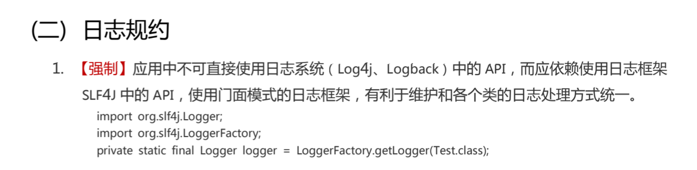
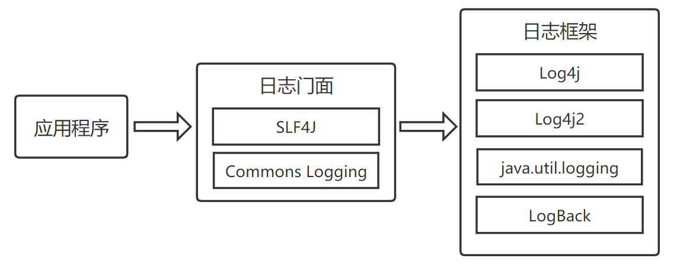

[Spring Boot 2.x 实战--日志打印与输出到文件](https://developer.aliyun.com/article/757562)

[芋道 Spring Boot 日志集成 Logging 入门](http://www.iocoder.cn/Spring-Boot/Logging/)

# 日志介绍

在 Java 生态中，日志方面的技术主要分为日志框架和日志门面两大方面。日志框架是日志功能的具体实现，日志门面在日志框架的上面再做一层封装，对应用程序屏蔽底层日志框架的实现及细节。这里简要介绍 Java 常用的日志框架和日志门面。

## 日志框架

**java.util.logging :** 是从 JDK 1.4 开始引入的 Java 原生日志框架，定义了七个日志级别，分别是：SEVERE、WARNING、INFO、CONFIG、FINE、FINER、FINEST。

**Log4j ：** 是 Apache 的开源项目，出自 Ceki Gülcü 之手，我们可以灵活地控制日志的输出格式、控制日志输出到控制台还文件，而这些无需对代码进行更改，只需要简单地更改一下配置文件即可。同样定义了七个日志级别：OFF、FATAL、ERROR、WARN、INFO、DEBUG、TRACE。

**LogBack ：** 同样是出自 Ceki Gülcü 之手的成熟日志框架，可以看做是 Log4j 的改良加强版本。

**Log4j2 ：** 不仅仅是 Log4j 升级版本，从头到尾被重写了，性能有着极大的提升，感兴趣的读者可以自行搜索 Log4j2 和其他日志框架的性能评析。

## 日志门面

在阿里巴巴《Java开发手册》中，在日志规范的第一条中，就是禁止直接使用上面所列的日志框架的 API，而应该使用像 SLF4J 日志门面的 API。

上面所列的几种常用的日志框架，不同的框架有着不同的 API，这大大增加了代码与日志框架的耦合性，当需要更换日志框架的时候，我们几乎要把日志框架相关的代码重新修改一遍。

为了解决这个问题，可以通过在程序和日志框架在搭一个中间层实现，这就是日志门面，通过日志门面屏蔽日志框架的具体实现，即使我们更改了底层日志框架，也无需对程序进行大修改，顶多就是改改一些配置即可。

日志门面并不涉及具体的日志实现，还需依赖 Log4j、Logback 等日志框架，它仅仅是对程序屏蔽了不同日志框架的 API 差异，降低程序和日志框架之间的耦合度。

**SLF4J ：** Java 简易日志门面（Simple Logging Facade for Java）的缩写，也是出自 Log4j 、 LogBack 的作者Ceki Gülcü 之手。支持 Java Logging API、Log4j、logback等日志框架。根据作者的说法，SLF4J 效率更高，比起 Apache Commons Logging (JCL) 更简单、更稳定。

**Commons Logging ：** Apache Commons Logging (JCL) 是基于Java的日志记录程序。

