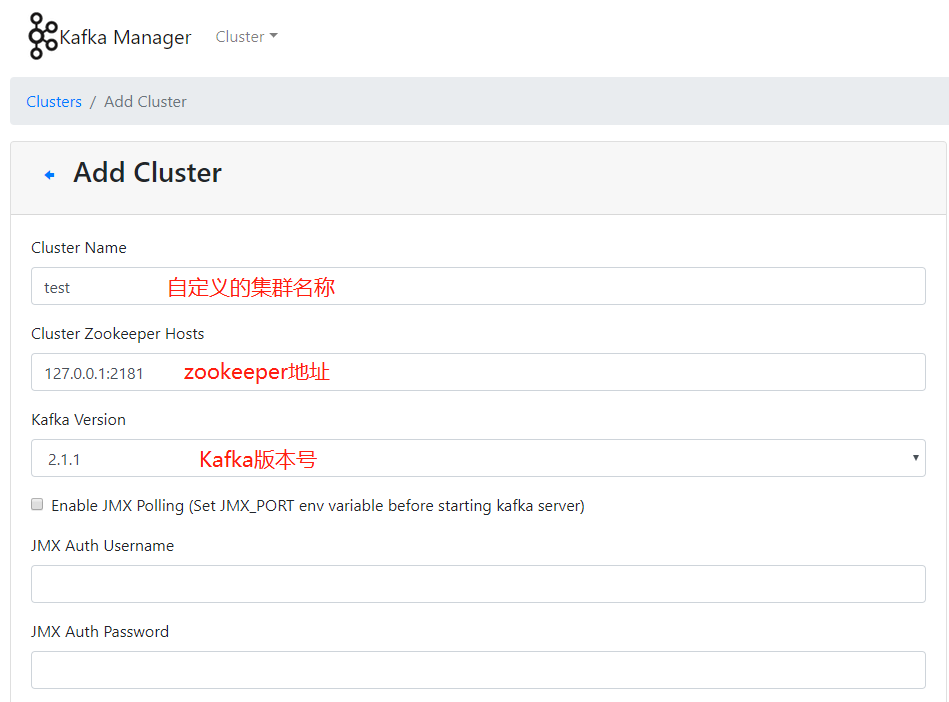
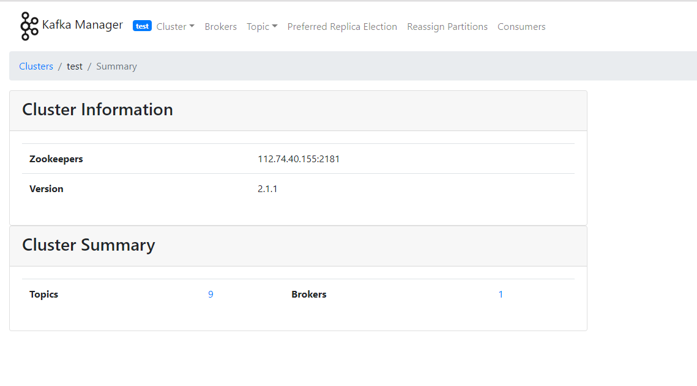

[芋道 Spring Boot 消息队列 Kafka 入门](http://www.iocoder.cn/Spring-Boot/Kafka/)

[Kafka 事务](http://matt33.com/2018/11/04/kafka-transaction/)

[使用Kafka事务的两种方式](https://www.jianshu.com/p/59891ede5f90)

# 简单使用

## 依赖

```xml
<dependency>
    <groupId>org.springframework.boot</groupId>
    <artifactId>spring-boot-starter-json</artifactId>
</dependency>

<dependency>
    <groupId>org.springframework.kafka</groupId>
    <artifactId>spring-kafka</artifactId>
</dependency>

<dependency>
    <groupId>org.projectlombok</groupId>
    <artifactId>lombok</artifactId>
    <optional>true</optional>
</dependency>
```

## 属性配置

```yml
spring:
  profiles:
    active: lcm
  # Kafka 配置项，对应 KafkaProperties 配置类
  kafka:
    producer:
      acks: 1 # 0-不应答。1-leader 应答。all-所有 leader 和 follower 应答。
      retries: 3 # 发送失败时，重试发送的次数
      key-serializer: org.apache.kafka.common.serialization.StringSerializer # 消息的 key 的序列化
      value-serializer: org.springframework.kafka.support.serializer.JsonSerializer # 消息的 value 的序列化
    consumer:
      auto-offset-reset: earliest # 设置消费者分组最初的消费进度为 earliest 。可参考博客 https://blog.csdn.net/lishuangzhe7047/article/details/74530417 理解
      key-deserializer: org.apache.kafka.common.serialization.StringDeserializer
      value-deserializer: org.springframework.kafka.support.serializer.JsonDeserializer
      properties:
        spring:
          json:
            trusted:
              packages: com.lcm.test.kafkatest.*
    listener:
      missing-topics-fatal: false # 消费监听接口监听的主题不存在时，默认会报错。所以通过设置为 false ，解决报错
```

## 生产者

```java
@Component
public class EasyProducer {

    @Autowired
    private KafkaTemplate<Object, Object> kafkaTemplate;

    /**
     * 同步发送
     * @param id
     * @return
     * @throws ExecutionException
     * @throws InterruptedException
     */
    public SendResult syncSend(Integer id) throws ExecutionException, InterruptedException {
        MyMessage message = new MyMessage();
        message.setId(id);
        return kafkaTemplate.send(MyMessage.TOPIC, message).get();
    }

    /**
     * 异步发送
     * @param id
     * @return
     */
    public ListenableFuture<SendResult<Object, Object>> asyncSend(Integer id) {
        MyMessage message = new MyMessage();
        message.setId(id);
        return kafkaTemplate.send(MyMessage.TOPIC, message);
    }

}
```

## 消费者

```java
@Component
@Slf4j
public class EasyConsumer {

    @KafkaListener(topics = MyMessage.TOPIC, groupId =  MyMessage.TOPIC+"-group-1")
    public void onMessage1(MyMessage mes) {
        log.info("消费组:{} 消息内容：{}]", 1, mes);
    }

    @KafkaListener(topics = MyMessage.TOPIC, groupId =  MyMessage.TOPIC+"-group-2")
    public void onMessage2(MyMessage mes) {
        log.info("消费组:{} 消息内容：{}]", 2, mes);
    }

}
```

### @KafkaListener

```java
public @interface KafkaListener {

   /**
    * 唯一标识
    */
   String id() default "";

   /**
    * 使用的 KafkaListenerContainerFactory Bean 的名字。
	* 若未设置，则使用默认的 KafkaListenerContainerFactory Bean 。
    */
   String containerFactory() default "";

   /**
    * 监听的 Topic 数组
    */
   String[] topics() default {};

   /**
    * 监听的 Topic 表达式
    */
   String topicPattern() default "";

   /**
    * @TopicPartition 注解的数组。
    * 每个 @TopicPartition 注解，可配置监听的 Topic、队列、消费的开始位置
    */
   TopicPartition[] topicPartitions() default {};

   /**
    *  所属 MessageListenerContainer Bean 的名字。
    */
   String containerGroup() default "";

   /**
    * 使用消费异常处理器 KafkaListenerErrorHandler 的 Bean 名字
    */
   String errorHandler() default "";

   /**
    * 消费者分组
    */
   String groupId() default "";

   /**
    * 当 groupId 未设置时，是否使用 id 作为 groupId
    */
   boolean idIsGroup() default true;

   /**
    * id 唯一标识的前缀
    */
   String clientIdPrefix() default "";

   /**
    * 真实监听容器的 Bean 名字，需要在名字前加 "__" 。
    * Default '__listener'.
    * Example: {@code topics = "#{__listener.topicList}"}.
    */
   String beanRef() default "__listener";

   /**
    * 自定义消费者监听器的并发数
    */
   String concurrency() default "";

   /**
    * 是否自动启动监听器。默认情况下，为 true 自动启动。
    */
   String autoStartup() default "";

   /**
    * Kafka Consumer 拓展属性。
    */
   String[] properties() default {};

   /**
    * When false and the return type is a {@link Iterable} return the result as the value
    * of a single reply record instead of individual records for each element. Default
    * true. Ignored if the reply is of type {@code Iterable<Message<?>>}.
    * @return false to create a single reply record.
    * @since 2.3.5
    */
   boolean splitIterables() default true;

}
```

# 批量处理

## 批量发送

Kafka 提供的批量发送消息，它提供了一个 [RecordAccumulator](http://people.apache.org/~nehanarkhede/kafka-0.9-producer-javadoc/doc/org/apache/kafka/clients/producer/internals/RecordAccumulator.html) 消息收集器，将发送给相同 Topic 的相同 Partition 分区的消息们，“**偷偷**”收集在一起，当满足条件时候，一次性批量发送提交给 Kafka Broker 。如下是三个条件，满足**任一**即会批量发送：

- 【数量】`batch-size` ：超过收集的消息数量的最大条数。
- 【空间】`buffer-memory` ：超过收集的消息占用的最大内存。
- 【时间】`linger.ms` ：超过收集的时间的最大等待时长，单位：毫秒。

配置文件

```yml
spring:
  kafka:
    producer:
      batch-size: 16 # 每次批量发送消息的最大数量
      buffer-memory: 1024 # 每次批量发送消息的最大内存
      properties:
        linger:
          ms: 1000 # 批处理延迟时间上限。
```

## 批量消费

配置文件

```yml
spring:
  kafka:
    consumer:
      fetch-max-wait: 10000 # poll 一次拉取的阻塞的最大时长，单位：毫秒。这里指的是阻塞拉取需要满足至少 fetch-min-size 大小的消息
      fetch-min-size: 10 # poll 一次消息拉取的最小数据量，单位：字节
      max-poll-records: 100 # poll 一次消息拉取的最大数量
    listener:
      type: BATCH # 监听器类型，默认为 SINGLE ，只监听单条消息。这里我们配置 BATCH ，监听多条消息，批量消费
```

批量消费

```java
@Slf4j
@Component
public class BatchConsumer {

    @KafkaListener(topics = MyMessage.TOPIC, groupId =  MyMessage.TOPIC+"-group-3")
    public void onMessage3(List<MyMessage> list) {
        log.info("消费组:{} ,消费数量:{},消息内容：{}]", 3,list.size(), list);
    }

}
```

# 重试机制

## 生产重试

```yml
spring:
  kafka:
    producer:
      retries: 3 # 发送失败时，重试发送的次数
```

## 消费重试

Spring-Kafka 提供**消费重试**的机制。在消息**消费失败**的时候，Spring-Kafka 会通过**消费重试**机制，重新投递该消息给 Consumer ，让 Consumer 有机会重新消费消息，实现消费成功。

当然，Spring-Kafka 并不会无限重新投递消息给 Consumer 重新消费，而是在默认情况下，达到 N 次重试次数时，Consumer 还是消费失败时，该消息就会进入到**死信队列**。

> 死信队列用于处理无法被正常消费的消息。当一条消息初次消费失败，Spring-Kafka 会自动进行消息重试；达到最大重试次数后，若消费依然失败，则表明消费者在正常情况下无法正确地消费该消息，此时，Spring-Kafka 不会立刻将消息丢弃，而是将其发送到该消费者对应的特殊队列中。
>
> Spring-Kafka 将这种正常情况下无法被消费的消息称为死信消息（Dead-Letter Message），将存储死信消息的特殊队列称为死信队列（Dead-Letter Queue）。后续，我们可以通过对死信队列中的消息进行重发，来使得消费者实例再次进行消费。

使用

```java
//配置
@Bean
@Primary
public ErrorHandler kafkaErrorHandler(KafkaTemplate<?, ?> template) {
    // <1> 创建 DeadLetterPublishingRecoverer 对象
    ConsumerRecordRecoverer recoverer = new DeadLetterPublishingRecoverer(template);
    // <2> 创建 FixedBackOff 对象
    BackOff backOff = new FixedBackOff(1000L, 3L);
    // <3> 创建 SeekToCurrentErrorHandler 对象
    return new SeekToCurrentErrorHandler(recoverer, backOff);
}

//消费者
@Slf4j
@Component
public class RetryConsumer {

    @KafkaListener(topics = MyMessage.TOPIC_RETRY, groupId =  MyMessage.TOPIC_RETRY+"-group-4")
    public void onMessage4(MyMessage mes) {
        log.info("消费组:{} 消息内容：{}]", 4, mes);
        throw new RuntimeException("消费组:4,测试消费重试");
    }

    @KafkaListener(topics = MyMessage.TOPIC_RETRY+".DLT", groupId =  MyMessage.TOPIC_RETRY+"-group-4")
    public void onDLTMessage4(MyMessage mes) {
        log.info("死信队列-消费组:{} 消息内容：{}]", 4, mes);
    }

}
```

- Spring-Kafka 的消费重试功能，通过实现自定义的SeekToCurrentErrorHandler，在 Consumer 消费消息异常的时候，进行拦截处理：
  - 在重试小于最大次数时，重新投递该消息给 Consumer ，让 Consumer 有机会重新消费消息，实现消费成功。
  - 在重试到达最大次数时，Consumer 还是消费失败时，该消息就会发送到死信队列。即在原有 Topic 加上 `.DLT` 后缀，就是其死信队列的 Topic 。
- `<1>` 处，创建 [DeadLetterPublishingRecoverer](https://github.com/spring-projects/spring-kafka/blob/master/spring-kafka/src/main/java/org/springframework/kafka/listener/DeadLetterPublishingRecoverer.java) 对象，它负责实现，在重试到达最大次数时，Consumer 还是消费失败时，该消息就会发送到死信队列。
- `<2>` 处，创建 [FixedBackOff](https://github.com/spring-projects/spring-framework/blob/master/spring-core/src/main/java/org/springframework/util/backoff/FixedBackOff.java) 对象。这里，我们配置了重试 3 次，每次固定间隔 1 秒。当然，胖友可以选择 [BackOff](https://github.com/spring-projects/spring-framework/blob/master/spring-core/src/main/java/org/springframework/util/backoff/BackOff.java) 的另一个子类 [ExponentialBackOff](https://github.com/spring-projects/spring-framework/blob/master/spring-core/src/main/java/org/springframework/util/backoff/ExponentialBackOff.java) 实现，提供[指数递增的间隔时间](http://note.huangz.me/algorithm/arithmetic/exponential-backoff.html)。
- `<3>` 处，创建 SeekToCurrentErrorHandler 对象，负责处理异常，串联整个消费重试的整个过程。

这里，我们来简单说说 SeekToCurrentErrorHandler 是怎么提供消费重试的功能的。

- 在消息消费失败时，SeekToCurrentErrorHandler 会将 调用 Kafka Consumer 的 [`#seek(TopicPartition partition, long offset)`](https://github.com/axbaretto/kafka/blob/master/clients/src/main/java/org/apache/kafka/clients/consumer/Consumer.java#L124-L132) 方法，将 Consumer 对于该消息对应的 TopicPartition 分区的**本地**进度设置成**该消息的位置**。这样，Consumer 在下次从 Kafka Broker 拉取消息的时候，又能重新拉取到这条消费失败的消息，并且是第一条。
- 同时，Spring-Kafka 使用 [FailedRecordTracker](https://github.com/spring-projects/spring-kafka/blob/master/spring-kafka/src/main/java/org/springframework/kafka/listener/FailedRecordTracker.java) 对每个 Topic 的每个 TopicPartition 消费失败次数进行**计数**，这样相当于对该 TopicPartition 的**第一条**消费失败的消息的消费失败次数进行**计数**。
- 另外，在 FailedRecordTracker 中，会调用 [BackOff](https://github.com/spring-projects/spring-framework/blob/master/spring-core/src/main/java/org/springframework/util/backoff/BackOff.java) 来进行计算，该消息的**下一次重新消费的时间**，通过 `Thread#sleep(...)` 方法，实现重新消费的时间间隔。
- 有一点需要注意，FailedRecordTracker 提供的计数是**客户端**级别的，重启 JVM 应用后，计数是会丢失的。所以，如果想要计数进行持久化，需要自己重新实现下 FailedRecordTracker 类，通过 ZooKeeper 存储计数。

### 批量重试

SeekToCurrentErrorHandler 是只**针对**消息的**单条**消费失败的消费重试处理。如果胖友想要有消息的**批量**消费失败的消费重试处理，可以使用 [SeekToCurrentBatchErrorHandler](https://github.com/spring-projects/spring-kafka/blob/master/spring-kafka/src/main/java/org/springframework/kafka/listener/SeekToCurrentBatchErrorHandler.java) 。配置方式如下：

```java
@Bean
@Primary
public BatchErrorHandler kafkaBatchErrorHandler() {
    // 创建 SeekToCurrentBatchErrorHandler 对象
    SeekToCurrentBatchErrorHandler batchErrorHandler = new SeekToCurrentBatchErrorHandler();
    // 创建 FixedBackOff 对象
    BackOff backOff = new FixedBackOff(1000L, 3L);
    batchErrorHandler.setBackOff(backOff);
    // 返回
    return batchErrorHandler;
}
```

SeekToCurrentBatchErrorHandler 暂时不支持死信队列的机制。


# 并发消费

 `@KafkaListener` 注解有 `concurrency` 属性，它可以指定并发消费的线程数。例如说，如果设置 `concurrency=4` 时，Spring-Kafka 就会为**该** `@KafkaListener` 创建 4 个线程，进行并发消费。

考虑到让胖友能够更好的理解 `concurrency` 属性，我们来简单说说 Spring-Kafka 在这块的实现方式。我们来举个例子：

- 1，创建一个 Topic，`"lcm.topic"` ，并且设置其 Partition 分区数为 **10** 。
- 2，创建一个消费者，并在其消费方法上，添加 `@KafkaListener(concurrency=2)` 注解。
- 3，启动项目。Spring-Kafka 会根据 `@KafkaListener(concurrency=2)` 注解，创建 **2** 个 Kafka Consumer 。每个 Consumer 会被**单独**分配到一个线程中，进行拉取消息，消费消息。
- 4，Kafka Broker 会将 Topic 为 `"lcm.topic"` 分配给创建的 **2** 个 Kafka Consumer 各 **5** 个 Partition 。
- 5，因为 `@KafkaListener(concurrency=2)` 注解，创建 **2** 个 Kafka Consumer ，就在**各自的线程中**，拉取各自的 Topic 为 `"lcm.topic"` 的 Partition 的消息，各自**串行**消费。从而，实现**多线程**的并发消费。

要注意，不要配置 `concurrency` 属性大于分区数，则创建的 Kafka Consumer 分配不到消费 Topic 的 Partition 分区，导致不断的空轮询。

使用

```java
@KafkaListener(topics = MyMessage.TOPIC, groupId =  MyMessage.TOPIC+"-group-1" , concurrency = "2")
public void onMessage1(MyMessage mes) {
    log.info("消费组:{} 消息内容：{}]", 1, mes);
}
```


# 顺序消费

我们先来一起了解下顺序消息的**顺序消息**的定义：

- 普通顺序消息 ：Producer 将相关联的消息发送到相同的消息队列。
- 完全严格顺序 ：在【普通顺序消息】的基础上，Consumer 严格顺序消费。

在上述的示例中，我们看到 Spring-Kafka 在 Consumer 消费消息时，**天然**就支持按照 Topic 下的 Partition 下的消息，**顺序消费**。

那么此时，我们只需要考虑将 Producer 将相关联的消息发送到 Topic 下的相同的 Partition 即可。只要我们发送消息时，指定了消息的 key ，Producer 则会根据 key 的哈希值取模来获取到其在 Topic 下对应的 Partition 。 

## 消息分区选择策略

[《Kafka 发送消息分区选择策略详解》](https://leokongwq.github.io/2017/02/27/mq-kafka-producer-partitioner.html) 

分区选择策略分为两种：

- 消息的key为null

如果key为null，则先根据topic名获取上次计算分区时使用的一个整数并加一。然后判断topic的可用分区数是否大于0，如果大于0则使用获取的`nextValue`的值和可用分区数进行取模操作。 如果topic的可用分区数小于等于0，则用获取的`nextValue`的值和总分区数进行取模操作（其实就是随机选择了一个不可用分区）。

- 消息的key不为null

不为null的选择策略很简单，就是根据hash算法`murmur2`就算出key的hash值，然后和分区数进行取模运算。


# 事务消息

Kafka 内置提供事务消息的支持。对事务消息的概念不了解的胖友，可以看看 [《事务消息组件的套路》](http://www.iocoder.cn/Fight/longyb-transaction_mq/?self) 文章。

不过 Kafka 提供的并不是**完整的**的事务消息的支持，缺少了**回查机制**。关于这一点，刚推荐的文章也有讲到。目前，常用的分布式消息队列，只有 RocketMQ 提供了完整的事务消息的支持，

```yml
`spring:  # Kafka 配置项，对应 KafkaProperties 配置类  kafka:    bootstrap-servers: 127.0.0.1:9092 # 指定 Kafka Broker 地址，可以设置多个，以逗号分隔    # Kafka Producer 配置项    producer:      acks: all # 0-不应答。1-leader 应答。all-所有 leader 和 follower 应答。      retries: 3 # 发送失败时，重试发送的次数      key-serializer: org.apache.kafka.common.serialization.StringSerializer # 消息的 key 的序列化      value-serializer: org.springframework.kafka.support.serializer.JsonSerializer # 消息的 value 的序列化      transaction-id-prefix: demo. # 事务编号前缀    # Kafka Consumer 配置项    consumer:      auto-offset-reset: earliest # 设置消费者分组最初的消费进度为 earliest 。可参考博客 https://blog.csdn.net/lishuangzhe7047/article/details/74530417 理解      key-deserializer: org.apache.kafka.common.serialization.StringDeserializer      value-deserializer: org.springframework.kafka.support.serializer.JsonDeserializer      properties:        spring:          json:            trusted:              packages: cn.iocoder.springboot.lab03.kafkademo.message        isolation:          level: read_committed # 读取已提交的消息    # Kafka Consumer Listener 监听器配置    listener:      missing-topics-fatal: false # 消费监听接口监听的主题不存在时，默认会报错。所以通过设置为 false ，解决报错`
```

- 修改 `spring.kafka.producer.acks=all` 配置，不然在启动时会报 `"Must set acks to all in order to use the idempotent producer. Otherwise we cannot guarantee idempotence."` 错误。因为，Kafka 的事务消息需要基于幂等性来实现，所以必须保证所有节点都写入成功。
- 增加 `transaction-id-prefix=demo.` 配置，事务编号的前缀。需要保证相同应用配置相同，不同应用配置不同。具体可以看看[《How to choose Kafka transaction id for several applications》](https://stackoverflow.com/questions/57179169/how-to-choose-kafka-transaction-id-for-several-applications-hosted-in-kubernete)的讨论。
- 增加 `spring.kafka.consumer.properties.isolation.level=read_committed` 配置，Consumer **仅**读取已提交的消息。

**Kafka使用事务的两种方式**

（一）配置Kafka事务管理器并使用@Transactional注解
（二）使用KafkaTemplate的executeInTransaction方法


# 消费提交机制

原生 Kafka Consumer 消费端，有两种消费进度提交的提交机制：

- 【默认】自动提交，通过配置 `enable.auto.commit=true` ，每过 `auto.commit.interval.ms` 时间间隔，都会自动提交消费消费进度。而提交的时机，是在 Consumer 的 `#poll(...)` 方法的逻辑里完成，在每次从 Kafka Broker 拉取消息时，会检查是否到达自动提交的时间间隔，如果是，那么就会提交上一次轮询拉取的位置。
- 手动提交，通过配置 `enable.auto.commit=false` ，后续通过 Consumer 的 `#commitSync(...)` 或 `#commitAsync(...)` 方法，同步或异步提交消费进度。

Spring-Kafka Consumer 消费端，提供了更丰富的消费者进度的提交机制，更加灵活。当然，也是分成自动提交和手动提交两个大类。在 [AckMode](https://github.com/spring-projects/spring-kafka/blob/master/spring-kafka/src/main/java/org/springframework/kafka/listener/ContainerProperties.java#L44-L93) 枚举类中，可以看到每一种具体的方式。代码如下：

```java
// ContainerProperties#AckMode.java

public enum AckMode {

// ========== 自动提交 ==========

	RECORD, // 每条消息被消费完成后，自动提交

	BATCH, // 每一次消息被消费完成后，在下次拉取消息之前，自动提交

	TIME, // 达到一定时间间隔后，自动提交。ContainerProperties#setAckTime(long) ackTime
	      // 不过要注意，它并不是一到就立马提交，如果此时正在消费某一条消息，需要等这条消息被消费完成，才能提交消费进度。

	COUNT, // 消费成功的消息数到达一定数量后，自动提交。ContainerProperties#setAckCount(int) ackCount
	      // 不过要注意，它并不是一到就立马提交，如果此时正在消费某一条消息，需要等这条消息被消费完成，才能提交消费进度。

	COUNT_TIME, // TIME 和 COUNT 的结合体，满足任一都会自动提交。

// ========== 手动提交 ==========

	/**
	 * User takes responsibility for acks using an
	 * {@link AcknowledgingMessageListener}.
	 */
	MANUAL, // 调用时，先标记提交消费进度。等到当前消息被消费完成，然后在提交消费进度。

	/**
	 * User takes responsibility for acks using an
	 * {@link AcknowledgingMessageListener}. The consumer
	 * immediately processes the commit.
	 */
	MANUAL_IMMEDIATE, // 调用时，立即提交消费进度。

}
```

## 设置提交机制

- 使用原生 Kafka 的方式，通过配置 `spring.kafka.consumer.enable-auto-commit=true` 。然后，通过 `spring.kafka.consumer.auto-commit-interval` 设置自动提交的频率。
- 使用 Spring-Kafka 的方式，通过配置 `spring.kafka.consumer.enable-auto-commit=false` 。然后通过 `spring.kafka.listener.ack-mode` 设置具体模式。另外，还有 `spring.kafka.listener.ack-time` 和 `spring.kafka.listener.ack-count` 可以设置自动提交的时间间隔和消息条数。

**默认什么都不配置的情况下，使用 Spring-Kafka 的 BATCH 模式：每一次消息被消费完成后，在下次拉取消息之前，自动提交**。


# 属性配置

## 生产者

### 1、重要配置

```properties
# 高优先级配置
# 以逗号分隔的主机：端口对列表，用于建立与Kafka群集的初始连接
spring.kafka.producer.bootstrap-servers=TopKafka1:9092,TopKafka2:9092,TopKafka3:9092
 
# 设置大于0的值将使客户端重新发送任何数据，一旦这些数据发送失败。注意，这些重试与客户端接收到发送错误时的重试没有什么不同。允许重试将潜在的改变数据的顺序，如果这两个消息记录都是发送到同一个partition，则第一个消息失败第二个发送成功，则第二条消息会比第一条消息出现要早。
spring.kafka.producer.retries=0
 
# 每当多个记录被发送到同一分区时，生产者将尝试将记录一起批量处理为更少的请求，
# 这有助于提升客户端和服务端之间的性能，此配置控制默认批量大小（以字节为单位），默认值为16384
spring.kafka.producer.batch-size=16384
 
# producer可以用来缓存数据的内存大小。如果数据产生速度大于向broker发送的速度，producer会阻塞或者抛出异常，以“block.on.buffer.full”来表明。这项设置将和producer能够使用的总内存相关，但并不是一个硬性的限制，因为不是producer使用的所有内存都是用于缓存。一些额外的内存会用于压缩（如果引入压缩机制），同样还有一些用于维护请求。
spring.kafka.producer.buffer-memory=33554432
 
# key的Serializer类，实现了org.apache.kafka.common.serialization.Serializer接口
spring.kafka.producer.key-serializer=org.apache.kafka.common.serialization.StringSerializer
 
# 值的Serializer类，实现了org.apache.kafka.common.serialization.Serializer接口
spring.kafka.producer.value-serializer=org.apache.kafka.common.serialization.StringSerializer
 
# procedure要求leader在考虑完成请求之前收到的确认数，用于控制发送记录在服务端的持久化，其值可以为如下：
# acks = 0 如果设置为零，则生产者将不会等待来自服务器的任何确认，该记录将立即添加到套接字缓冲区并视为已发送。在这种情况下，无法保证服务器已收到记录，并且重试配置将不会生效（因为客户端通常不会知道任何故障），为每条记录返回的偏移量始终设置为-1。
# acks = 1 这意味着leader会将记录写入其本地日志，但无需等待所有副本服务器的完全确认即可做出回应，在这种情况下，如果leader在确认记录后立即失败，但在将数据复制到所有的副本服务器之前，则记录将会丢失。
# acks = all 这意味着leader将等待完整的同步副本集以确认记录，这保证了只要至少一个同步副本服务器仍然存活，记录就不会丢失，这是最强有力的保证，这相当于acks = -1的设置。
# 可以设置的值为：all, -1, 0, 1
spring.kafka.producer.acks=-1
 
# 当向server发出请求时，这个字符串会发送给server。目的是能够追踪请求源头，以此来允许ip/port许可列表之外的一些应用可以发送信息。这项应用可以设置任意字符串，因为没有任何功能性的目的，除了记录和跟踪
spring.kafka.producer.client-id=1
 
# producer用于压缩数据的压缩类型。默认是无压缩。正确的选项值是none、gzip、snappy。压缩最好用于批量处理，批量处理消息越多，压缩性能越好
spring.kafka.producer.compression-type=none
```
### 2、其他配置

```properties
# 中优先级配置
# 以毫秒为单位的时间，是在我们强制更新metadata的时间间隔。即使我们没有看到任何partition leadership改变。默认值：5 * 60 * 1000 = 300000
spring.kafka.producer.properties.metadata.max.age.ms=300000
 
# producer组将会汇总任何在请求与发送之间到达的消息记录一个单独批量的请求。通常来说，这只有在记录产生速度大于发送速度的时候才能发生。然而，在某些条件下，客户端将希望降低请求的数量，甚至降低到中等负载一下。这项设置将通过增加小的延迟来完成–即，不是立即发送一条记录，producer将会等待给定的延迟时间以允许其他消息记录发送，这些消息记录可以批量处理。这可以认为是TCP种Nagle的算法类似。这项设置设定了批量处理的更高的延迟边界：一旦我们获得某个partition的batch.size，他将会立即发送而不顾这项设置，然而如果我们获得消息字节数比这项设置要小的多，我们需要“linger”特定的时间以获取更多的消息。 这个设置默认为0，即没有延迟。设定linger.ms=5，例如，将会减少请求数目，但是同时会增加5ms的延迟。
spring.kafka.producer.properties.linger.ms=0
 
# 发送数据时的缓存空间大小，默认：128 * 1024 = 131072
spring.kafka.producer.properties.send.buffer.bytes=131072
 
# socket的接收缓存空间大小,当阅读数据时使用，默认：32 * 1024 = 32768
spring.kafka.producer.properties.receive.buffer.bytes=32768
 
# 请求的最大字节数。这也是对最大记录尺寸的有效覆盖。注意：server具有自己对消息记录尺寸的覆盖，这些尺寸和这个设置不同。此项设置将会限制producer每次批量发送请求的数目，以防发出巨量的请求。默认：1 * 1024 * 1024 = 1048576
spring.kafka.producer.properties.max.request.size=1048576
 
# 连接失败时，当我们重新连接时的等待时间。这避免了客户端反复重连，默认值：50
spring.kafka.producer.properties.reconnect.backoff.ms=50
 
# producer客户端连接一个kafka服务（broker）失败重连的总时间，每次连接失败，重连时间都会指数级增加，每次增加的时间会存在20%的随机抖动，以避免连接风暴。默认：1000
# spring.kafka.producer.properties.reconnect.backoff.max.ms=1000
 
# 控制block的时长,当buffer空间不够或者metadata丢失时产生block，默认：60 * 1000 = 60000
spring.kafka.producer.properties.max.block.ms=60000
 
# 在试图重试失败的produce请求之前的等待时间。避免陷入发送-失败的死循环中，默认：100
spring.kafka.producer.properties.retry.backoff.ms=100
 
# metrics系统维护可配置的样本数量，在一个可修正的window size。这项配置配置了窗口大小，例如。我们可能在30s的期间维护两个样本。当一个窗口退出后，我们会擦除并重写最老的窗口，默认：30000
spring.kafka.producer.properties.metrics.sample.window.ms=30000
 
# 用于维护metrics的样本数，默认：2
spring.kafka.producer.properties.metrics.num.samples=2
 
# 用于metrics的最高纪录等级。
# spring.kafka.producer.properties.metrics.recording.level=Sensor.RecordingLevel.INFO.toString()
 
# 类的列表，用于衡量指标。实现MetricReporter接口，将允许增加一些类，这些类在新的衡量指标产生时就会改变。JmxReporter总会包含用于注册JMX统计
#spring.kafka.producer.properties.metric.reporters=Collections.emptyList()
 
# kafka可以在一个connection中发送多个请求，叫作一个flight,这样可以减少开销，但是如果产生错误，可能会造成数据的发送顺序改变,默认是5 (修改）
spring.kafka.producer.properties.max.in.flight.requests.per.connection=5
 
# 关闭连接空闲时间，默认：9 * 60 * 1000 = 540000
spring.kafka.producer.properties.connections.max.idle.ms=540000
 
# 分区类，默认：org.apache.kafka.clients.producer.internals.DefaultPartitioner
spring.kafka.producer.properties.partitioner.class=org.apache.kafka.clients.producer.internals.DefaultPartitioner
 
# 客户端将等待请求的响应的最大时间,如果在这个时间内没有收到响应，客户端将重发请求;超过重试次数将抛异常，默认：30 * 1000 = 30000
spring.kafka.producer.properties.request.timeout.ms=30000
 
# 用户自定义interceptor。
#spring.kafka.producer.properties.interceptor.classes=none
 
# 是否使用幂等性。如果设置为true，表示producer将确保每一条消息都恰好有一份备份；如果设置为false，则表示producer因发送数据到broker失败重试使，可能往数据流中写入多分重试的消息。
#spring.kafka.producer.properties.enable.idempotence=false
 
# 在主动中止正在进行的事务之前，事务协调器将等待生产者的事务状态更新的最长时间（以ms为单位）。
#spring.kafka.producer.properties.transaction.timeout.ms=60000
 
# 用于事务传递的TransactionalId。 这使得可以跨越多个生产者会话的可靠性语义，因为它允许客户端保证在开始任何新事务之前使用相同的TransactionalId的事务已经完成。 如果没有提供TransactionalId，则生产者被限制为幂等传递。请注意，如果配置了TransactionalId，则必须启用enable.idempotence。默认值为空，这意味着无法使用事务。
#spring.kafka.producer.properties.transactional.id=null
连接风暴

应用启动的时候，经常可能发生各应用服务器的连接数异常飙升的情况。假设连接数的设置为：min值3,max值10，正常的业务使用连接数在5个左右，当重启应用时，各应用连接数可能会飙升到10个，瞬间甚至还有可能部分应用会报取不到连接。启动完成后接下来的时间内，连接开始慢慢返回到业务的正常值。这就是所谓的连接风暴。
```
## 消费者

### 1、重要配置

```properties
# 以逗号分隔的主机：端口对列表，用于建立与Kafka群集的初始连接
spring.kafka.consumer.bootstrap-servers=TopKafka1:9092,TopKafka2:9092,TopKafka3:9092
 
# 用来唯一标识consumer进程所在组的字符串，如果设置同样的group id，表示这些processes都是属于同一个consumer group，默认：""
spring.kafka.consumer.group-id=TyyLoveZyy
 
# max.poll.records条数据需要在session.timeout.ms这个时间内处理完，默认：500
spring.kafka.consumer.max-poll-records=500
 
# 消费超时时间，大小不能超过session.timeout.ms，默认：3000
spring.kafka.consumer.heartbeat-interval=3000
 
# 如果为真，consumer所fetch的消息的offset将会自动的同步到zookeeper。这项提交的offset将在进程挂掉时，由新的consumer使用，默认：true
spring.kafka.consumer.enable-auto-commit=true
 
# consumer自动向zookeeper提交offset的频率，默认：5000
spring.kafka.consumer.auto-commit-interval=5000
 
# 没有初始化的offset时，可以设置以下三种情况：（默认：latest）
# earliest
# 当各分区下有已提交的offset时，从提交的offset开始消费；无提交的offset时，从头开始消费
# latest
# 当各分区下有已提交的offset时，从提交的offset开始消费；无提交的offset时，消费新产生的该分区下的数据
# none
# topic各分区都存在已提交的offset时，从offset后开始消费；只要有一个分区不存在已提交的offset，则抛出异常
spring.kafka.consumer.auto-offset-reset=earliest
 
# 每次fetch请求时，server应该返回的最小字节数。如果没有足够的数据返回，请求会等待，直到足够的数据才会返回。默认：1
spring.kafka.consumer.fetch-min-size=1
 
# Fetch请求发给broker后，在broker中可能会被阻塞的（当topic中records的总size小于fetch.min.bytes时），此时这个fetch请求耗时就会比较长。这个配置就是来配置consumer最多等待response多久。
spring.kafka.consumer.fetch-max-wait=500
 
# 消费者进程的标识。如果设置一个人为可读的值，跟踪问题会比较方便。。默认：""
spring.kafka.consumer.client-id=1
 
# key的反序列化类。实现了org.apache.kafka.common.serialization.Deserializer接口
spring.kafka.consumer.key-deserializer=org.apache.kafka.common.serialization.StringDeserializer
 
# 值的反序列化类。实现了org.apache.kafka.common.serialization.Deserializer接口
spring.kafka.consumer.value-deserializer=org.apache.kafka.common.serialization.StringDeserializer
```
### 2、其他配置

```properties
# consumer是通过拉取的方式向服务端拉取数据，当超过指定时间间隔max.poll.interval.ms没有向服务端发送poll()请求，而心跳heartbeat线程仍然在继续，会认为该consumer锁死，就会将该consumer退出group，并进行再分配。默认：300000
spring.kafka.consumer.properties.max.poll.interval.ms=300000
 
# 会话的超时限制。如果consumer在这段时间内没有发送心跳信息，则它会被认为挂掉了，并且reblance将会产生，必须在[group.min.session.timeout.ms, group.max.session.timeout.ms]范围内。默认：10000
spring.kafka.consumer.properties.session.timeout.ms=10000
 
# 在“range”和“roundrobin”策略之间选择一种作为分配partitions给consumer 数据流的策略； 循环的partition分配器分配所有可用的partitions以及所有可用consumer 线程。它会将partition循环的分配到consumer线程上。如果所有consumer实例的订阅都是确定的，则partitions的划分是确定的分布。循环分配策略只有在以下条件满足时才可以：（1）每个topic在每个consumer实例上都有同样数量的数据流。（2）订阅的topic的集合对于consumer group中每个consumer实例来说都是确定的。
spring.kafka.consumer.properties.partition.assignment.strategy=range
 
# 一次fetch请求，从一个broker中取得的records最大大小。如果在从topic中第一个非空的partition取消息时，如果取到的第一个record的大小就超过这个配置时，仍然会读取这个record，也就是说在这片情况下，只会返回这一条record。默认：50 * 1024 * 1024 = 52428800
spring.kafka.consumer.properties.fetch.max.bytes=52428800
 
# Metadata数据的刷新间隔。即便没有任何的partition订阅关系变更也能执行。默认：5 * 60 * 1000 = 300000
spring.kafka.consumer.properties.metadata.max.age.ms=300000
 
# 一次fetch请求，从一个partition中取得的records最大大小。如果在从topic中第一个非空的partition取消息时，如果取到的第一个record的大小就超过这个配置时，仍然会读取这个record，也就是说在这片情况下，只会返回这一条record。broker、topic都会对producer发给它的message size做限制。所以在配置这值时，可以参考broker的message.max.bytes 和 topic的max.message.bytes的配置。默认：1 * 1024 * 1024 = 1048576
spring.kafka.consumer.properties.max.partition.fetch.bytes=1048576
 
# 最大发送的TCP大小。默认：128 * 1024 = 131072，如果设置为 -1 则为操作系统默认大小
spring.kafka.consumer.properties.send.buffer.bytes=131072
 
# 消费者接受缓冲区的大小。这个值在创建Socket连接时会用到。取值范围是：[-1, Integer.MAX]。默认值是：65536 （64 KB），如果值设置为-1，则会使用操作系统默认的值。默认：64 * 1024 = 65536
spring.kafka.consumer.properties.receive.buffer.bytes=65536
 
# 连接失败时，当我们重新连接时的等待时间。这避免了客户端反复重连，默认：50
spring.kafka.consumer.properties.reconnect.backoff.ms=50
 
# producer客户端连接一个kafka服务（broker）失败重连的总时间，每次连接失败，重连时间都会指数级增加，每次增加的时间会存在20%的随机抖动，以避免连接风暴。默认：1000
spring.kafka.consumer.properties.reconnect.backoff.max.ms=1000
 
# 在试图重试失败的produce请求之前的等待时间。避免陷入发送-失败的死循环中，默认：100
spring.kafka.consumer.properties.retry.backoff.ms=100
 
# metrics系统维护可配置的样本数量，在一个可修正的window size。这项配置配置了窗口大小，例如。我们可能在30s的期间维护两个样本。当一个窗口退出后，我们会擦除并重写最老的窗口，默认：30000
spring.kafka.consumer.properties.metrics.sample.window.ms=30000
 
# 用于维护metrics的样本数，默认：2
spring.kafka.consumer.properties.metrics.num.samples=2
 
# 用于metrics的最高纪录等级。默认：Sensor.RecordingLevel.INFO.toString()
#spring.kafka.consumer.properties.metrics.recording.level=Sensor.RecordingLevel.INFO.toString()
 
# 类的列表，用于衡量指标。实现MetricReporter接口，将允许增加一些类，这些类在新的衡量指标产生时就会改变。JmxReporter总会包含用于注册JMX统计。默认：Collections.emptyList()
#spring.kafka.consumer.properties.metric.reporters=Collections.emptyList()
 
# 自动检查所消耗记录的CRC32。这可以确保没有线上或磁盘损坏的消息发生。此检查会增加一些开销，因此在寻求极高性能的情况下可能会被禁用。默认：true
spring.kafka.consumer.properties.check.crcs=true
 
# 连接空闲超时时间。因为consumer只与broker有连接（coordinator也是一个broker），所以这个配置的是consumer到broker之间的。默认：9 * 60 * 1000 = 540000
spring.kafka.consumer.properties.connections.max.idle.ms=540000
 
# 客户端将等待请求的响应的最大时间,如果在这个时间内没有收到响应，客户端将重发请求;超过重试次数将抛异常，默认：30000
spring.kafka.consumer.properties.request.timeout.ms=30000
 
# 用于阻止的KafkaConsumer API的默认超时时间。KIP还为这样的阻塞API添加了重载，以支持指定每个阻塞API使用的特定超时，而不是使用default.api.timeout.ms设置的默认超时。特别是，添加了一个新的轮询（持续时间）API，它不会阻止动态分区分配。旧的poll（long）API已被弃用，将在以后的版本中删除。还为其他KafkaConsumer方法添加了重载，例如partitionsFor，listTopics，offsetsForTimes，beginningOffsets，endOffsets和close，它们接收持续时间。默认：60 * 1000 = 60000
spring.kafka.consumer.properties.default.api.timeout.ms=60000
 
# 用户自定义interceptor。默认：Collections.emptyList()
#spring.kafka.consumer.properties.interceptor.classes=Collections.emptyList()
 
# 是否将内部topics的消息暴露给consumer。默认：true
spring.kafka.consumer.properties.exclude.internal.topics=true
 
# 默认：true
spring.kafka.consumer.properties.internal.leave.group.on.close=true
 
# 默认：IsolationLevel.READ_UNCOMMITTED.toString().toLowerCase(Locale.ROOT)
#spring.kafka.consumer.properties.isolation.level=IsolationLevel.READ_UNCOMMITTED.toString().toLowerCase(Locale.ROOT)
```


# Kafka manager 使用

**1.安装部署**

<https://github.com/yahoo/kafka-manager/tags>

官网下载需要，自己进行编译。


**2.修改配置文件**

编辑 `conf/application.conf` 配置文件，修改配置项为 `kafka-manager.zkhosts="127.0.0.1:2181"` 。此处，填写的是Kafka使用的 ZooKeeper 地址。


**3.启动**

启动时可能会报下面的异常。

```
D:\kafka-manager-2.0.0.2\bin>kafka-manager
输入行太长。
命令语法不正确。
```

是因为文件名太长了

```
D:\kafka-manager\bin>kafka-manager.bat
```

**4.打开web界面**

打开浏览器，输入：http://127.0.0.1:9000


**5.添加集群**




**6.查看集群**

