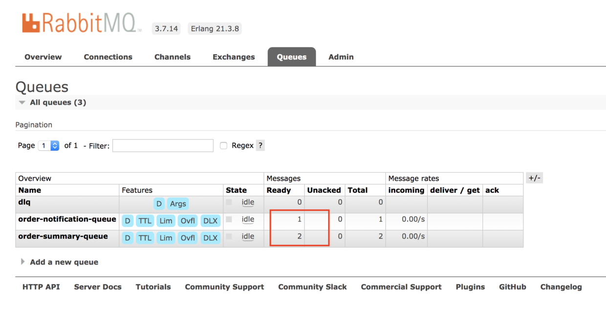

# [RabbitMQ最佳实践](https://www.cnblogs.com/davenkin/p/rabbitmq-best-practices.html)


在使用消息机制时，我们通常需要考虑以下几个问题:

- 消息不能丢失
- 保证消息一定能投递到目的地
- 保证业务处理和消息发送/消费的一致性

本文以RabbitMQ为例，讨论如何解决以上问题。

### 消息持久化

如果希望RabbitMQ重启之后消息不丢失，那么需要对以下3种实体均配置持久化：

- exchange
- queue
- message

声明exchange时设置持久化（`durable = true`）并且不自动删除(autoDelete = false)：

```java
boolean durable = true;
boolean autoDelete = false;
channel.exchangeDeclare("dlx", TOPIC, durable, autoDelete, null)
```

声明queue时设置持久化（`durable = true`）并且不自动删除(autoDelete = false)：

```java
boolean durable = true;
boolean autoDelete = false;
channel.queueDeclare("order-summary-queue", durable, false, autoDelete, queueArguments);
```

发送消息时通过设置`deliveryMode=2`持久化消息：

```java
AMQP.BasicProperties properties = new AMQP.BasicProperties.Builder()
                    .contentType("application/json")
                    .deliveryMode(2)
                    .priority(0)
                    .build();
channel.basicPublish("order", "order.created", false, properties, "sample-data".getBytes())
```

### 发送确认

有时，业务处理成功，消息也发了，但是我们并不知道消息是否成功到达了rabbitmq，如果由于网络等原因导致业务成功而消息发送失败，那么发送方将出现不一致的问题，此时可以使用rabbitmq的发送确认功能，即要求rabbitmq显式告知我们消息是否已成功发送。

首先需要在channel上设置`ConfirmListener`:

```java
channel.addConfirmListener(new ConfirmListener() {
                public void handleAck(long seqNo, boolean multiple) {
                    if (multiple) {
                        logger.info(seqNo + "号及其以前的所有消息发送成功，当消息发送成功后执行相应逻辑，比如标记事件为已发送或者删除原来事件");
                    } else {
                        logger.info(seqNo + "号发送成功，当消息发送成功后执行相应逻辑，比如标记事件为已发送或者删除原来事件");
                    }
                }

                public void handleNack(long seqNo, boolean multiple) {
                    if (multiple) {
                        logger.info(seqNo + "号及其以前的所有消息发送失败，当消息发送失败后执行相应逻辑，比如重试或者标记事件发送失败");
                    } else {
                        logger.info(seqNo + "号发送失败，当消息发送失败后执行相应逻辑，比如重试或者标记事件发送失败");

                    }
                }
            });
```

然后在发送消息直线需要开启发送确认模式：

```java
//开启发送者确认
channel.confirmSelect();
```

然后发送消息：

```java
channel.basicPublish("order", "order.created", false, properties, "sample-data".getBytes());
```

当消息正常投递时，rabbitmq客户端将异步调用`handleAck()`表示消息已经成功投递，此时程序可以自行处理投递成功之后的逻辑，比如在数据库中将消息设置为`已发送`。当消息投递出现异常时，`handleNack()`将被调用。

通常来讲，发送端只需要保证消息能够发送到exchange即可，而无需关注消息是否被正确地投递到了某个queue，这个是rabbitmq和消息的接收方需要考虑的事情。基于此，如果rabbitmq找不到任何需要投递的queue，那么rabbitmq依然会ack给发送方，此时发送方可以认为消息已经正确投递，而不好用关系消息没有queue接收的问题。但是，对于rabbitmq而言，这种消息是需要记录下来的，否则rabbitmq将直接丢弃该消息。此时可以为exchange设置`alternate-exchange`，即表示rabbitmq将把无法投递到任何queue的消息发送到`alternate-exchange`指定的exchange中，通常来说可以设置一个死信交换（DLX）。

事实上，对于exchange存在但是却找不到任何接收queue时，如果发送是设置了`mandatory=true`，那么在消息被ack前将return给客户端，此时客户端可以创建一个`ReturnListener`用于接收返回的消息：

```java
channel.addReturnListener(new ReturnListener() {
                @Override
                public void handleReturn(int replyCode, String replyText, String exchange, String routingKey, AMQP.BasicProperties properties, byte[] body) throws IOException {
                    logger.warn("消息无法正确投递，已返回。");
                }
            });
```

但是需要注意的是，在return之后，消息依然会被ack而不是nack，还不如不设置madatory呢，因此return有时并不见得有用。

需要注意的是，在发送消息时如果exchange不存在，rabbitmq直接丢弃该消息，并且不会ack或者nack操作，但是在Spring中，会nack。

综合起来，要完成发送方确认，需要做以下几个点：

- 设置ConfirmListener
- 通过`confirmSelect()`开启
- 为exchange设置`alternate-exchange`到DLX
- 发送时没有必要设置mandotory
- 发送方将消息记录在数据库中，收到ack时在数据库中标记消息为`已发送`状态
- 如果收到reject或者由于网络原因没有收到ack，那么消息状态不会改变，下次发送时再次发送，此时可能导致消息重复，解决重复问题请参考“保证至少一次投递，并且消费端幂”小节。

### 手动消费确认

有时，消息被正确投递到消费方，但是消费方处理失败，那么便会出现消费方的不一致问题。比如`订单已创建`的消息发送到用户积分子系统中用于增加用户积分，但是积分消费法处理却都失败了，用户就会问：我购买了东西为什么积分并没有增加呢？

要解决这个问题，需要引入消费方确认，即只有消息被成功处理之后才告知rabbitmq以ack，否则告知rabbitmq以nack，此时的处理流程如下：

1. 接收消息，不作ack，处理消息成功则ack，不成功nack
2. 对于nack的消息，可以配置rabbitmq要么重新投递，要么直接扔掉，要么传到死信交换（DLX）
3. 如果处理成功，但是由于网络等问题导致确认（无论是ack还是nack）不成功，那么rabbitmq会重新投递消息，但是此时由于消息已经成功，重新投递便导致了消费重复的消息，此时请参考“保证至少一次投递，并且消费端幂”小节。

在rabbitmq中，消息默认是字段ack的，即消息到达消费方立即ack，而不管消费方业务处理是否成功，为此可以开启手动确认模式，即有消费方自行决定何时应该ack，通过设置`autoAck=false`开启手动确认模式：

```java
        boolean autoAck = false;
        channel.basicConsume("order-summary-queue", autoAck,
                new DefaultConsumer(channel) {
                    @Override
                    public void handleDelivery(String consumerTag,
                                               Envelope envelope,
                                               AMQP.BasicProperties properties,
                                               byte[] body)
                            throws IOException {
                        long deliveryTag = envelope.getDeliveryTag();
                        if (success()) {
                            logger.info("成功消费消息" + deliveryTag);
                            channel.basicAck(deliveryTag, false);
                        } else {
                            if (!envelope.isRedeliver()) {
                                logger.warn("首次消费消息" + deliveryTag + "不成功，尝试重试");
                                boolean requeue = true;
                                channel.basicNack(deliveryTag, false, requeue);
                            } else {
                                logger.warn("第二次消费消息" + deliveryTag + "不成功，扔到DLX");
                                boolean requeue = false;
                                channel.basicNack(deliveryTag, false, requeue);
                            }
                        }
                    }
                });
```

可以看到，在`autoAck=false`情况下，通过业务处理的是否成功(`success()`)来判断应该ack还是nack。

另外，为了避免消息反复requeue的情况，如果消息第一次消费不成功，则在nack时设置`requeue=true`，表示告知rabbitmq将reject的消息重新投递，如果第二次消费依然不成功，那么nack时设置`requeue=false`，告知rabbitmq不要重新投递了，此时rabbitmq将根据自己的配置要么直接扔掉消息，要么将消息发送到DLX中，具体配置请参考“设置死信交换（DLX）和死信队列（DLQ）”。

### 保证至少一次投递，并且消费端幂等

通常来说，程序中会先完成写数据库的操作，然后发送消息，此时一个重要的点是保证这两者的一致性，即一旦数据库保存成功消息必须也能够发送成功。要保证发送发一致性，一种做法是使用全局事务，即将数据库操作和消息发送放到一个事务中，比如JTA，但是全局事务是很重的，并且rabbitmq目前并不支持全局事务。

要解决发送发的一致性问题，可以实现将消息保存到数据库的事件表中，此时业务处理的数据库操作和保存消息到数据库属于同一个本地数据库事务，那么到此可以保证业务处理和消息产生的原子性，然后有一个异步的后台任务从数据库的事件表中一次读取未发送的消息发送至rabbitmq，发送成功后更新消息的状态为`已发布`。

然而，此时我们依然无法保证发送消息和更新消息状态之间的原子性，因为可能发生消息发送成功但是数据库状态更新不成功的情况，为了解决这种极端情况，可以多次重试消息发送，步骤如下：

1. 读取时间表中未发送消息，发送到rabbitmq
2. 如果发送成功，事件表中消息状态也更新成功，皆大欢喜
3. 如果消息发送不成功，那么消息状态也不作改变，下次重试
4. 如果消息发送成功而状态更新不成功，下次重试

不断重试，总有一个能够达到发送消息和状态更新的原子性。

那么问题也来了：rabbitmq中可能出现多条重复消息，此时消费端就懵了。为了解决这个问题，消费方应该设计为幂等的，即对相同消息的多次消费与单次消费结果相同。有些消费方的业务逻辑本身便是幂等的，而对于本身不幂等的消费方，需要在数据库中记录已经被正确消费的消息，当重复消息来时，判断该消息是否已经被消费，如果没有则执行消费逻辑，如果已经消费则直接忽略。此时消费方的处理步骤如下：

1. 接收到消息，判断消息是否已经消费，如果是，则直接忽略，此时已然需要做消费成功确认
2. 如果消息还未被消费，则处理业务逻辑，记录消息，业务逻辑本身和记录消息在同一个数据库事务中，如果都成功，则皆大欢喜；如果失败，那么消费方业务回滚，消息也不记录，此时reject消息，等下次重发

### 设置消息的TTL和消息队列的max-length

为了保证消息的时效性，可以设置队列中消息的TTL(`x-message-ttl`)，而为了保证消息队列不至于太大而影响性能，可以设置队列的最大消息数(`x-max-length`)。在创建队列时设置如下：

```java
ImmutableMap<String, Object> orderSummaryQueueArguments = of(
                    "x-max-length",
                    300,
                    "x-message-ttl",
                    24 * 60 * 60 * 1000);
channel.queueDeclare("order-summary-queue", true, false, false, orderSummaryQueueArguments);
```

### 设置死信交换（DLX）和死信队列（DLQ）

对于无法投递的消息，我们需要将其记录下来便于后续跟踪排查，此时可以将这样的消息放入DLX和DLQ中。默认情况下，queue中被抛弃的消息将被直接丢掉，但是可以通过设置queue的`x-dead-letter-exchange`参数，将被抛弃的消息发送到`x-dead-letter-exchange`做指定的exchange中，这样的exchange成为DLX。

设置了`x-dead-letter-exchange`之后，在以下三种情况下消息将被扔到DLX中：

1. 消费方nack时指定了`requeue=false`
2. 消息的TTL已到
3. 消息队列的max-length已到

在声明queue时定义`x-dead-letter-exchange`：

```java
ImmutableMap<String, Object> orderNotificationQueueArguments = of("x-dead-letter-exchange", "dlx");
channel.queueDeclare("order-notification-queue", true, false, false, orderNotificationQueueArguments);
```

- 设置DLQ为lazy，并且没有TTL，并且没有max-length
  在以下3种情况下，消息会被投递到DLX中：

需要注意的是，在发送消息时，当已经达到queue的上限，而当queue定义为x-overflow=reject-publish时，rabbitmq将nack。当有多个queue同时绑定到exchange时，如果有些queue设置了reject-publish，而有些却没有，那么依然会nack，这对发送方来说不好处理。因此，还是那句话，发送方只需要保证正确地投递到了exchange即可，而不用关系exchange后面有哪些queue。

### 设置Prefetch count

Prefetch count表示消费方一次性从rabbitmq读取的消息数量，如果设置过大，那么消费方可能始终处于高负荷运转状态，而如果太小又会增加网络开销，通常设置为20-50。另外，有时为了保证多个消费方均衡地分摊消息处理任务，通常设置prefetch count为1。

### 异常处理

在以上设置的情况下，我们来看看当各种异常发生时，rabbitmq是如何运作的：

- broker不可达：直接抛出异常；
- 发送方自己始终发送不出去：消息状态始终处于“未发送”，不会破坏一致性，但是对于事件表中累计太多的事件需要关注；
- exchange不存在：消息被丢掉，rabbitmq不会ack，消息状态始终处于“未发送”，下次将重新发送，不会破坏一致性，但是当exchange持续不存在下去，那么事件表中事件也会累计太多；
- exchange存在但是没有接受queue：消息将被ack并标记为“已发送”，但由于设置了alternative exchange为dlx，那么消息将发送到dlx对应的dlq中保存以便后续处理；
- consumer不在线，而累积消息太多：消息一致性没有问题，但是当累计到了max-length上限，消息队列头部的消息将被放置dlq中以便后续处理；
- consumer临时性失败：通过redelivered判断是否为重复投递，如果是，则nack并且requeue=false，表示如果重复投递的一次的消息如果再失败，那么直接扔到dlx中，也即消息最多重复投递一次；
- consumer始终失败：所有消息均被投入dlq以便后续处理，此时可能需要关注dlq的长度是否太长。

### 路由策略

系统中往往会发布多种类型的消息，在发送时有几种路由策略：

- 所有类型的消息都发送到同一个exchange中
- 每种类型的消息都单独配置一个exchange
- 对消息类型进行归类，同一类型的消息对应一个exchange

笔者建议采用最后一种，并且结合DDD中的聚合划分，路由策略建议如下：

> 每一个聚合根下发布的所有类型的事件对应一个exchange，exchange设置为topic，queue可以配置接收某一种类型的事件，也可以配置接收所有某种聚合相关的事件，还可以配置接收所有事件。

### 案例

假设有个订单(Order)系统，用户下单后需要向用户发送短信通知，而所有对订单的数据显示采用了CQRS架构，即将订单的读模型和写模型分离，即所有订单的更新都通过事件发到rabbitmq，然后专门有个consumer接收这些消息用于更新订单的读模型。

订单相关有两个事件：order.created和order.updated，所有与订单相关的事件都发布到同一个 topic exchange中，exchange名为“order"，设置短信通知queue（order-notification-queue）只接收order.created消息，因为只有订单在新建时才会发出通知，即order-notification-queue的routing key为`order.created`，设置读模型的queue（order-summary-queue）接收所有与Order相关的消息，即配置order-summary-queue的routing key为`order.#`，示例代码如下：

```java
package com.ecommerce.order.spike.rabbitmq;

import com.ecommerce.order.common.logging.AutoNamingLoggerFactory;
import com.google.common.collect.ImmutableMap;
import com.rabbitmq.client.*;
import org.slf4j.Logger;

import java.io.IOException;
import java.util.concurrent.TimeoutException;

import static com.google.common.collect.ImmutableMap.of;
import static com.rabbitmq.client.BuiltinExchangeType.TOPIC;

public class RabbitMQSender {
    private static final Logger logger = AutoNamingLoggerFactory.getLogger();

    public static void main(String[] args) throws IOException, TimeoutException, InterruptedException {
        ConnectionFactory factory = new ConnectionFactory();
        factory.setHost("localhost");
        factory.setUsername("rabbitmq-user");
        factory.setPassword("rabbitmq-password");
        factory.setVirtualHost("/");
        factory.setPort(5672);

        try (Connection conn = factory.newConnection(); Channel channel = conn.createChannel();) {
            //设置死信交换,Topic类型，持久化
            channel.exchangeDeclare("dlx", TOPIC, true, false, null);

            //设置死信队列，持久化，lazy型
            channel.queueDeclare("dlq", true, false, false, of("x-queue-mode", "lazy"));

            //接收所有发给dlx的消息，另外可以定义其他queue接收指定类型的消息
            channel.queueBind("dlq", "dlx", "#");


            //定义与order相关的事件exchange，如果无法路由，则路由到死信交换dlx
            channel.exchangeDeclare("order", TOPIC, true, false, of("alternate-exchange", "dlx"));


            //定义用于异步更新order读模型的queue，设置死信交换为dlx，队列满(x-overflow)时将头部消息发到dlx
            //定义queue的最大消息数(x-max-length)为300，满后发到dlx，另外定义消息的存活时间(x-message-ttl)为1天，1天后发送到dlx
            ImmutableMap<String, Object> orderSummaryQueueArguments = of("x-dead-letter-exchange",
                    "dlx",
                    "x-overflow",
                    "drop-head",
                    "x-max-length",
                    300,
                    "x-message-ttl",
                    24 * 60 * 60 * 1000);
            channel.queueDeclare("order-summary-queue", true, false, false, orderSummaryQueueArguments);
            channel.queueBind("order-summary-queue", "order", "order.#");


            //定义用于order创建时向用户发出通知的queue，设置死信交换为dlx
            ImmutableMap<String, Object> orderNotificationQueueArguments = of("x-dead-letter-exchange",
                    "dlx",
                    "x-overflow",
                    "drop-head",
                    "x-max-length",
                    300,
                    "x-message-ttl",
                    24 * 60 * 60 * 1000);
            channel.queueDeclare("order-notification-queue", true, false, false, orderNotificationQueueArguments);
            channel.queueBind("order-notification-queue", "order", "order.created");


            //设置发送端确认
            channel.addConfirmListener(new ConfirmListener() {
                public void handleAck(long seqNo, boolean multiple) {
                    if (multiple) {
                        logger.info(seqNo + "号及其以前的所有消息发送成功，当消息发送成功后执行相应逻辑，比如标记事件为已发送或者删除原来事件");
                    } else {
                        logger.info(seqNo + "号发送成功，当消息发送成功后执行相应逻辑，比如标记事件为已发送或者删除原来事件");

                    }
                }

                public void handleNack(long seqNo, boolean multiple) {
                    if (multiple) {
                        logger.info(seqNo + "号及其以前的所有消息发送失败，当消息发送失败后执行相应逻辑，比如重试或者标记事件发送失败");
                    } else {
                        logger.info(seqNo + "号发送失败，当消息发送失败后执行相应逻辑，比如重试或者标记事件发送失败");

                    }
                }
            });

            //开启发送者确认
            channel.confirmSelect();

            //设置消息持久化
            AMQP.BasicProperties properties = new AMQP.BasicProperties.Builder()
                    .contentType("application/json")
                    .deliveryMode(2)
                    .priority(0)
                    .build();


            //发送时没有必要设置mandatory，因为无法路由的消息会记录在dlq中
            //达到queue的上限时，queue头部消息将被放入dlx中
            try {
                channel.basicPublish("order", "order.created", false, properties, "create order data".getBytes());
                channel.basicPublish("order", "order.updated", false, properties, "update order data".getBytes());
            } catch (IOException e) {
                e.printStackTrace();
            }
            Thread.sleep(5000);
        }

    }
}
```

以上，我们发送了一条order.created消息和一条order.updated消息，基于routing key设置，两条消息都会到达order-summary-queue，但是只有order.created消息到达了order-notification-queue：


在consumer端，开启手动ack，并且对于处理失败的场景，只允许重新投递一次，否则扔到DLX中：

```java
package com.ecommerce.order.spike.rabbitmq;

import com.ecommerce.order.common.logging.AutoNamingLoggerFactory;
import com.rabbitmq.client.*;
import org.slf4j.Logger;

import java.io.IOException;
import java.util.Random;
import java.util.concurrent.TimeoutException;

public class RabbitMQReceiver {
    private static final Logger logger = AutoNamingLoggerFactory.getLogger();

    public static void main(String[] args) throws IOException, TimeoutException, InterruptedException {
        ConnectionFactory factory = new ConnectionFactory();
        factory.setHost("localhost");
        factory.setUsername("rabbitmq-user");
        factory.setPassword("rabbitmq-password");
        factory.setVirtualHost("/");
        factory.setPort(5672);

        Connection conn = factory.newConnection();
        Channel channel = conn.createChannel();
        channel.basicQos(1, true);

        boolean autoAck = false;
        channel.basicConsume("order-summary-queue", autoAck,
                new DefaultConsumer(channel) {
                    @Override
                    public void handleDelivery(String consumerTag,
                                               Envelope envelope,
                                               AMQP.BasicProperties properties,
                                               byte[] body)
                            throws IOException {
                        long deliveryTag = envelope.getDeliveryTag();

                        //用Random来模拟有时处理成功有时处理失败的场景
                        if (new Random().nextBoolean()) {
                            logger.info("成功消费消息" + deliveryTag);
                            channel.basicAck(deliveryTag, false);
                        } else {
                            if (!envelope.isRedeliver()) {
                                logger.warn("首次消费消息" + deliveryTag + "不成功，尝试重试");
                                channel.basicNack(deliveryTag, false, true);
                            } else {
                                logger.warn("第二次消费消息" + deliveryTag + "不成功，扔到DLX");
                                channel.basicNack(deliveryTag, false, false);
                            }
                        }
                    }
                });
    }
}
```

