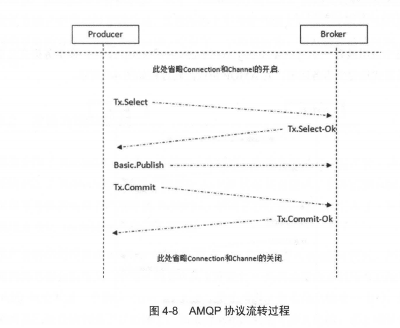

# 客户端开发向导

## 连接rabbitmq

下面的代码用来在给定的参数(lp 地址、端口号、用户名、密码等)下连接 RabbitMQ: 

```java
ConnectionFactory factory = new ConnectionFactory();
factory.setUsername(USERNAME);
factory.setPassword(PASSWORD);
factory.setVirtualHost(virtualHost) ;
factory.setHost(IP ADDRESS);
factory.setPort(PORT) ;
Connection conn = factory.newConnection(); 
```

也可以选择使用 URI 的方式来实现:
```java
ConnectionFactory factory = new ConnectionFactory();
factory.setUri( "amqp:lluserName :password@ipAddress:portNumber/virtualHost");
Connection conn = factory.newConnection();
//Connection 接口被用来创建一个 Channel:
Channel channel = conn.createChannel();
//在创建之后， Channel 可以用来发送或者接收消息了。 
```

Channel是线程不安全的：

Connection 可以 用来创建多个 Channel 实例，但是 Channel 实例不能在线程问共享，应用程序应该为每一个线程开辟一个 Channel 。某些情况下 Channel 的操作可以并发运行，但是在其他情况下会导致在网络上出现错误的通信帧交错，同时也会影响友送方确认( publisher confrrm)机制的运行(详细可以参考 4.8 节)，所以多线程问共享 Channel 实例是非线程安全的 。 

Channel 或者 Connection 中有个 isOpen 方法可以用来检测其是否己处于开启状态(关于 Channel 或者 Connectio口的状态可以参考 3.6 节)。但并不推荐在生产环境的代码上使用工 isOpen方法，这个方法的返回值依赖于 shutdownCause (参考下面的代码)的存在，有可能会产生竞争。
```java
public boolean isOpen() {
    synchronized(this.mononitor) {
    	return this.shutdownCause == null ;
    }
}
    
public void brokenMethod(Channel channel)
    if (channel.isOpen()){
        // The following code depends on the chan口 el being in opeηstate .
        // However there is a possibility of the change in the channel state
        // between isOpen() and basicQos(l) call
        channel.basicQos(1);
	}
}
```

通常情况下，在调用 createXXX 或者 newXXX 方法之后，我们可以简单地认为Connection 或者 Channel 已经成功地处于开启状态，而并不会在代码中使用 isOpen 这个检测方法。如果在使用 Channel 的时候其己经处于关闭状态，那么程序会抛出一个com.rabbitmq . client.ShutdownSignalException ，我们只需捕获这个异常即可。当
然同时也要试着捕获 IOExceptio口或者 SocketException ，以防 Connection 意外关闭。
```java
public void validMethod(Channel channel)
    try (
        ...
    	channel.basicQos(1);
    } catch (ShutdownSignalException sse) {
        // possibly check if channel was closed
        // by the time we started action and reasons for
        // closing it
        ...
    } catch (I OException ioe) {
        // check why connection was closed 
        ...
    }
}
```

## 使用交换机和队列

交换器和队列是 AMQP 中 high也vel 层面的构建模块，应用程序需确保在使用它们的时候就已经存在了，在使用之前需要先声明 ( declare ) 它们。 
```java
//创建了一个持久化的、非自动删除的、绑定类型为 direct 的交换器
channel.exchangeDeclare(exchangeName, "direct" , true) ;
//创建了一个非持久化的、排他的、自动删除的队列(此队列的名称由 RabbitMQ 自动生成)
String queueName = channel.queueDeclare() .getQueue();
//将队列和交换器绑定起来
channel.queueBind (queueName , exchangeName , routingKey);
```
上面声明的队列具备如下特性 : 只对当前应用中同一个 Connection 层面可用，同一个 Connection 的不同 Channel可共用，并且也会在应用连接断开时自动删除。 

### exchangeDeclare

```java
Exchange.DeclareOk exchangeDeclare(String exchange ,
                                   String type, boolean durable,
                                   boolean autoDelete , boolean internal ,
                                   Map<String, Object> arguments) throws IOException ; 
```
这个方法的返回值是 Exchange . DeclareOK ， 用来标识成功声明了一个交换器。

各个参数详细说明如下所述:

exchange : 交换器的名称。

type : 交换器的类型，常见的如 fanout、 direct 、 topic ， 详情参见 2. 1.4 节。

durable: 设置是否持久化 。 durab l e 设置为 true 表示持久化， 反之是非持久化 。持久化可以将交换器存盘，在服务器重启 的时候不会丢失相关信息。

autoDelete : 设置是否自动删除。 autoDelete 设置为 true 则表示自动删除。自动删除的前提是至少有一个队列或者交换器与这个交换器绑定 ， 之后所有与这个交换器绑定的队列或者交换器都与此解绑。注意不能错误地把这个参数理解为 : "当与此交换器连接的客户端都断开时 ， RabbitMQ 会自动删除本交换器 "。

internal : 设置是否是内置的。如果设置为 true ，则表示是内置的交换器，客户端程序无法直接发送消息到这个交换器中，只能通过交换器路由到交换器这种方式。

argument : 其他一些结构化参数，比如 alternate - exchange (有关 alternateexchange 的详情可以参考 4. 1.3 节)。 

### queueDeclare
```java
//默认创建一个由 RabbitMQ 命名的(类似这种amq.gen-LhQzlgv3GhDOv8PIDabOXA 名称
//这种队列也称之为匿名队列)、排他的、自动删除的、非持久化的队列。
Queue.DeclareOk queueDeclare() throws IOException;

Queue.DeclareOk queueDeclare(String queue , boolean durable , boolean exclusive,
boolean autoDelete, Map<Str工 ng ， Object> arguments) throws IOException; 
```

方法的参数详细说明如下所述。

queue : 队列的名称。

durable: 设置是否持久化。为 true 则设置队列为持久化。持久化的队列会存盘，在服务器重启的时候可以保证不丢失相关信息。

exclusive : 设置是否排他。为 true 则设置队列为排他的。如果一个队列被声明为排他队列，该队列仅对首次声明它的连接可见，并在连接断开时自动删除。这里需要注意三点:

1.排他队列是基于连接( Connection) 可见的，同一个连接的不同信道 (Channel)是可以同时访问同一连接创建的排他队列; 
2."首次"是指如果一个连接己经声明了 一个排他队列，其他连接是不允许建立同名的排他队列的，这个与普通队列不同;
3.即使该队列是持久化的，一旦连接关闭或者客户端退出，该排他队列都会被自动删除，这种队列适用于一个客户端同时发送和读取消息的应用场景。

autoDelete: 设置是否自动删除。为 true 则设置队列为自动删除。自动删除的前提是:
至少有一个消费者连接到这个队列，之后所有与这个队列连接的消费者都断开时，才会自动删除。不能把这个参数错误地理解为: "当连接到此队列的所有客户端断开时，这个队列自动删除"，因为生产者客户端创建这个队列，或者没有消费者客户端与这个队列连接时，都不会自动删除这个队列。

argurnents: 设置队列的其他一些参数，如 x-rnessage-ttl 、 x-expires 、x -rnax-length 、 x-rnax-length-bytes 、 x-dead-letter-exchange 、 x-deadletter-routing-key, x-rnax-priority 等。 


### queueBind

```java
Queue.BindOk queueBind(String queue , String exchange , String routingKey,
Map<String, Object> arguments) throws IOException ;

void queueBindNoWait(String queue , String exchange, String routingKey,
Map<String, Object> arguments) throws IOException ; 
```

方法中涉及的参数详解。
queue: 队列名称:
exchange: 交换器的名称:
routingKey: 用来绑定队列和交换器的路由键;
argument: 定义绑定的一些参数。 

### exchangeBind
```java
Exchange.BindOk exchangeBind(String destination , String source , String
routingKey) throws IOException;

Exchange.BindOk exchangeBind(String destination , String source, String
routingKey, Map<String, Object> arguments) throws IOException ; 

void exchangeBindNoWait(String destination, String sour ce , String routingKey,
Map<String, Object> arguments) throws IOException; 
```

方法中的参数可以参考exchangeDeclare 方法。绑定之后 ， 消息从 source 交换器转发到 destination 交换器，某种程度上来说 destination 交换器可以看作一个队列 。

## 发送消息
```java
void basicPublish (String exchange , String routingKey, BasicProperties props ,
byte[] body) throws IOException ;
     
void basicPub1ish(String exchange , String routingKey, boo1ean mandatory, 
BasicProperties props , byte[] body) throws IOException;
     
void basicPublish(Stri 口 g exchange, String routingKey, boolean mandatory,
boolean immediate , BasicProperties props , byte[] body) throws IOException ; 
```

对应的具体参数解释如下所述。
~ exchange: 交换器的名称，指明消息需要发送到哪个交换器中 。 如果设置为空字符串，则消息会被发送到 RabbitMQ 默认的交换器中。

~ routingKey : 路由键，交换器根据路由键将消息存储到相应的队列之中 。

~ props : 消息的基本属性集，其包含 14 个属性成员，分别有 contentType 、content E ncoding 、 headers ( Map<String ， Object>) 、 deliveryMode 、 priority 、correlationld 、 replyTo 、 expiration 、 messageld、 timestamp 、 type 、 userld 、appld 、 clusterld。其中常用的几种都在上面的示例中进行了演示 。

~ byte [ ] body : 消息体 ( payload ) ，真正需要发送的消息 。

~ mandatory 和immediate 的详细内容请参考 4.1 节 。 

## 消费消息

RabbitMQ 的消费模式分两种 : 推 ( Push )模式和拉 ( Pull )模式 。 推模式采用 Basic.Consume进行消费，而拉模式则是调用 Basic.Get 进行消费。 

### 推模式
```java
boolean autoAck = false ;
    channel.basicQos(64);
    channel.basicConsume(queueName , autoAck, "myConsumerTag" ,
        new DefaultConsumer(channel) {
            @Override
            public void handleDelivery(String consumerTag,
                                       Envelope envelope,
                                       AMQP.BasicProperties properties ，
                                       byte [] body)
                                             throws IOException
                String routingKey = envelope.getRoutingKey( );
                String contentType = properties.getContentType() ;
                long deliveryTag = envelope.getDeliveryTag() ;
                // (process the message components here . .. )
                channel.basicAck(deliveryTag, false );
        }
});
```
注意 ， 上面代码中显式地设置 autoAck 为 false ， 然后在接收到消息后进行显式 ack 操作 (channel .basicAck)， 对于消费者来说这个设置是非常必要的， 可以防止消息不必要地丢失。 
```java
String basicConsume(String queue , boolean autoAck, String consumerTag,
boolean noLocal , boolean exclusive, Map<String ， Object> arguments , Consumer callback)
throws IOException ; 
```

~ queue : 队列的名称:
~ autoAck : 设置是否自动确认。建议设成 false ，即不自动确认:
~ consumerTag: 消费者标签，用来区分多个消费者:
~ noLocal : 设置为 true 则表示不能将同一个 Connection中生产者发送的消息传送给这个 Connection 中的消费者:
~ exclusive : 设置是否排他 :
~ arguments : 设置消费者的其他参数:
~ callback : 设置消费者的回调函数。用来处理 RabbitMQ 推送过来的消息，比如DefaultConsumer ， 使用时需要客户端重写 (override) 其中的方法。 

对于消费者客户端来说重写 handleDelivery 方法是十分方便的。更复杂的消费者客户端会重写更多的方法 ， 具体如下 :

void handleConsumeOk(String consumerTag) ;
void handleCancelOk(String consumerTag);
void handleCancel(String consumerTag) throws IOException;
void handleShutdownSignal(String consumerTag, ShutdownSignalException sig) ;
void handleRecoverOk(String consumerTag);

比如 handleShutdownSignal 方法，当 Channel 或者 Connection 关闭的时候会调用。
再者， handleConsumeOk 方法会在其他方法之前调用，返回消费者标签。
重写 handleCancelOk 和 handleCancel 方法，这样消费端可以在显式地或者隐式地取消订阅的时候调用。也可以通过 channel . basicCancel 方法来显式地取消一个消费者的订阅:channel . basicCancel(consumerTag) ;
注意上面这行代码会首先触发 handleConsumerOk 方法，之后触发 handleDelivery方法，最后才触发 handleCancelOk 方法。 


### 拉模式


这里讲一下拉模式的消费方式。通过 channel . basicGet 方法可以单条地获取消息，其返回值是 GetResponeo Channel 类的 basicGet 方法没有其他重载方法，只有 :
```java
GetResponse basicGet(String queue , boolean autoAck) throws IOException;
```
其中 queue 代表队列的名称，如果设置 autoAck 为 false ， 那么同样需要调用channel . basicAck 来确认消息己被成功接收。 
```java
GetResponse response = channel.basicGet(QUEUE NAME , false) ;
System.out.println(new String(response.getBody()));
channel .basicAck(response . getEnvelope() .getDeliveryTag() , false); 
```

Basic.Consume 将信道 (Channel) 直为接收模式，直到取消队列的订阅为止。在接收模式期间， RabbitMQ 会不断地推送消息给消费者，当然推送消息的个数还是会受到 Basic.Qos的限制.如果只想从队列获得单条消息而不是持续订阅，建议还是使用 Basic.Get 进行消费.但是不能将 Basic.Get 放在一个循环里来代替 Basic.Consume ，这样做会严重影响 RabbitMQ的性能.如果要实现高吞吐量，消费者理应使用 Basic.Consume 方法。 


## 消费者的确认和拒绝

​	为了保证消息从队列可靠地达到消费者， RabbitMQ 提供了消息确认机制( message acknowledgement) 。 消费者在订阅队列时，可以指定 autoAck 参数，当 autoAck 等于 false时， RabbitMQ 会等待消费者显式地回复确认信号后才从内存(或者磁盘)中移去消息(实质上是先打上删除标记，之后再删除) 。当 autoAck 等于 true 时， RabbitMQ 会自动把发送出去的消息置为确认，然后从内存(或者磁盘)中删除，而不管消费者是否真正地消费到了这些消息 。

​	采用消息确认机制后，只要设置 autoAck 参数为 false，消费者就有足够的时间处理消息(任务) ，不用担心处理消息过程中消费者进程挂掉后消息丢失的问题 ， 因为 RabbitMQ 会一直等待持有消息直到消费者显式调用Basic.Ack 命令为止 。当 autoAck 参数置为 false ，对于 RabbitMQ 服务端而言 ，队列中的消息分成了两个部分 :
一部分是等待投递给消费者的消息:一部分是己经投递给消费者，但是还没有收到消费者确认信号的消息。 如果 RabbitMQ 一直没有收到消费者的确认信号，并且消费此消息的消费者己经断开连接，则 RabbitMQ 会安排该消息重新进入队列，等待投递给下一个消费者，当然也有可能还是原来的那个消费者。 

Web 管理平台(详细参考第 5. 3 节)上可以看到当前队列中的 " Ready" 状态和 "Unacknowledged" 状态的消息数 


在消费者接收到消息后，如果想明确拒绝当前的消息而不是确认，那么应该怎么做呢?
在 2 .0.0 版本开始引入了 Basic.Reject 这个命令，消费者客户端可以调用与其对应的 channel.basicReject 方法来告诉 RabbitMQ 拒绝这个消息 。 

```java
void basicReject(long deliveryTag, boolean requeue) throws IOException; 
```

1.deliveryTag ：可以看作消息的编号 ，它是 一个 64 位的长整型值，最大值是9223372036854775807 。

2.requeue ：如果设置为 true ，则 RabbitMQ 会重新将这条消息存入队列，以便可以发送给下一个订阅的消费者;如果设置为 false，则 RabbitMQ立即会把消息从队列中移除，而不会把它发送给新的消费者。 

**Basic.Reject 命令一次只能拒绝一条消息 ，如果想要批量拒绝消息 ，则可以使用Basic.Nack 这个命令 。**

消费者客户端可以调用 channel.basicNack 方法来实现，方法定义如下: 

```java
void basicNack(long deliveryTag, boolean multiple, boolean requeue) throws IOException; 
```

multiple 参数设置为 false 则表示拒绝编号为 deliveryTag的这 一条消息，这时候 basicNack 和 basicReject 方法一样; multiple 参数设置为 true 则表示拒绝 deliveryTag 编号之前所有未被当前消费者确认的消息。 

**死信队列**：

将 channel.basicReject 或者 channel.basicNack 中的 requeue 设直为 false ，可以启用"死信队列"的功能。死信队列可以通过检测被拒绝或者未送达的消息来追踪问题。 详细内容可以参考 4.3 节。 

## 关闭连接

在应用程序使用完之后，需要关闭连接，释放资源:
```java
channel.close();
conn.close() ;
```
显式地关闭 Channel 是个好习惯，但这不是必须的，在 Connection 关闭的时候，Channel 也会自动关闭。 

AMQP 协议中的 C onnection 和 Channel 采用 同样的方式来管理网络失败、内部错误和显式地关闭连接。 Connection 和 Channel 所具备的生命周期如下所述。

~ Open : 开启状态，代表当前对象可以使用。

~ Closing : 正在关闭状态。当前对象被显式地通知调用关闭方法( shutdown) ，这样就产生了一个关闭请求让其内部对象进行相应的操作， 并等待这些关闭操作的完成。

~ Closed : 已经关闭状态。当前对象己经接收到所有的内部对象己完成关闭动作的通知，并且其也关闭了自身。

Connection 和 Channel 最终都是会成为 Closed 的状态，不论是程序正常调用的关闭方法，或者是客户端的异常，再或者是发生了网络异常。 

在 Connection 和 Channel 中，与关闭相关的方法有 addShutdownListener(ShutdownListener listener) 和 removeShutdownListener (ShutdownListner listener) 。当 Connection 或者 Channe l 的状 态转变为 Closed 的时候会调用ShutdownListener 。而且如果将一个 ShutdownListener 注册到一个己经处于 Closed状态的对象(这里特指 Connection 和 Channel 对象)时，会立刻调用 ShutdownListener 。

getCloseReason 方法可以让你知道对象关闭的原因 ;

isOpen 方法检测对象当前是否处于开启状态; 

close(int closeCode , String closeMessage ) 方法显式地通知当前对象执行关闭操作 。

```java
connection.addShutdownListener(new ShutdownListener() {
    public void shutdownCompleted (ShutdownS 工 gnalExcepti on cause){
        ...
    }
});
```
当触发 ShutdownListener 的时候，就可以获取到 ShutdownSignalException ，这个 ShutdownSignalException 包含了关闭 的原因 ，这里原因 也可以通过调用前面所提及的 getCloseReason 方法获取。 


# RabbitMQ进阶

## 消息何去何从

### mandatory 参数

当 mandatory 参数设为 true 时，交换器无法根据自身的类型和路由键找到一个符合条件的队列，那么 RabbitMQ 会调用 Basic.Return 命令将消息返回给生产者 。当 mandatory 参数设置为 false 时，出现上述情形，则消息直接被丢弃 。

那么生产者如何获取到没有被正确路由到合适队列的消息呢?这时候可以通过调用channel.addReturnListener 来添加 ReturnListener 监昕器实现。 

```java
channel.basicPublish(EXCHANGE NAME , "", true,MessageProperties.PERSISTENT TEXT PLAIN,
"mandatory test" . getBytes());
channel.addReturnListener(new ReturnListener() (
    public void handleReturn(int replyCode , String replyText ,
                            String exchange , String routingKey,
                            AMQP.BasicProperties basicProperties ,
                            byte[] body) throws IOException {
        String message = new String(body);
        System.out.println( "Basic.Return 返回的结果是: "+message );
    }
});    
```

上面代码中生产者没有成功地将消息路由到队列，此时 RabbitMQ 会通过 Basic.Return返回 " mandatory test " 这条消息，之后生产者客户端通过 ReturnListener 监昕到了这个事件，上面代码的最后输出应该是" Basic.Retum 返回的结果是 : mandatory test " 


### immediate 参数

当 immediate 参数设为 true 时，如果交换器在将消息路由到队列时发现队列上并不存在任何消费者，那么这条消息将不会存入队列中。当与路由键匹配的所有队列都没有消费者时 ，该消息会通过 Basic.Return 返回至生产者。

mandatory 参数告诉服务器至少将该消息路由到一个队列 中， 否则将消息返回给生产者。 

immediate 参数告诉服务器 ， 如果该消息关联的队列上有消费者， 则立刻投递:如果所有匹配的队列上都没有消费者，则直接将消息返还给生产者 ， 不用将消息存入队列而等待消费者了。

RabbitMQ 3 .0 版本开始去掉了对 imrnediate 参数的支持，对此 RabbitMQ 官方解释是 :
imrnediate 参数会影响镜像队列的性能 ， 增加了 代码复杂性 ， 建议采用 TTL 和 DLX 的方法替代。(有关 TTL 和 DLX 的介绍请分别参考 4.2 节和 4.3 节。) 


### 备份交换机

备份交换器，英文名称为 Altemate Exchange，简称庙，或者更直白地称之为"备胎交换器"。生产者在发送消息的时候如果不设置 mandatory 参数 ， 那么消息在未被路由的情况下将会丢失 :如果设置了 mandatory 参数，那么需要添加 ReturnListener 的编程逻辑，生产者的代码将变得复杂。如果既不想复杂化生产者的编程逻辑，又不想消息丢失，那么可以使用备份交换器，这样可以将未被路由的消息存储在 RabbitMQ 中，再在需要的时候去处理这些消息。可以通过在声明交换器(调用 channel.exchangeDeclare 方法)的时候添加alternate-exchange 参数来实现，也可以通过策略 CPolicy，详细参考 6.3 节〉的方式实现。如果两者同时使用，则前者的优先级更高，会覆盖掉 Policy 的设置 。 


## 过期时间（TTL）

### 消息的TTL

目前有两种方法可以设置消息的 TTL。

第一种方法是通过队列属性设置，队列中所有消息都有相同的过期时间。

第二种方法是对消息本身进行单独设置，每条消息的 TTL 可以不同。

如果两种方法一起使用，则消息的 TTL 以两者之间较小的那个数值为准。消息在队列中的生存时间一旦超过设置 的 TTL 值时，就会变成"死信" (Dead Message) ，消费者将无法再收到该消息(这点不是绝对的 ，可以参考 4.3 节) 。
通过队列属性设置消息 TTL 的方法是在 channel.queueDeclare 方法中加入x-message -ttl 参数实现的，这个参数的单位是毫秒。 
```java
Map<String, Object> argss = new HashMap<String , Object>();
argss.put("x-message-ttl " , 6000);
channel . queueDeclare(queueName , durable , exclusive , autoDelete , argss) ; 
```
针对每条消息设置 TTL 的方法是在 channel.basicPublish 方法中加入 expiration的属性参数，单位为毫秒。 
```java
AMQP.BasicProperties.Builder builder = new AMQP.BasicProperties . Builder();
builder.deliveryMode(2); // 持久化消息
builder.expiration("60000");// 设置 TTL=60000ms
AMQP.BasicProperties properties = builder . build() ;
channel.basicPublish(exchangeName,routingKey,mandatory,properties,
                     "ttlTestMessage".getBytes()); 
```


### 队列的TTL

通过 channel.queueDeclare 方法中的 x-expires 参数可以控制队列被自动删除前处于未使用状态的时间。未使用的意思是队列上没有任何的消费者，队列也没有被重新声明，并且在过期时间段内也未调用过Basic.Get 命令。
设置队列里的 TTL 可以应用于类似 RPC 方式的回复队列，在 RPC 中，许多队列会被创建出来，但是却是未被使用的。
RabbitMQ 会确保在过期时间到达后将队列删除，但是不保障删除的动作有多及时 。在RabbitMQ 重启后 ， 持久化的队列的过期时间会被重新计算。
用于表示过期时间的 x-expires 参数以毫秒为单位 ， 井且服从和 x-message-ttl 一样的约束条件，不过不能设置为 0。比如该参数设置为 1 000 ，则表示该队列如果在 1 秒钟之内未使用则会被删除。 
```java
//创建一个过期时间为 30 分钟的队列
Map<String, Object> args = new HashMap<String, Object>();
args.put( "x-expires" , 1800000); 
channel.queueDeclare("myqueue " , false , false , false , args) ; 
```


## 死信队列

DLX ，全称为 Dead-Letter-Exchange ，可以称之为死信交换器，也有人称之为死信邮箱。当消息在一个队列中变成死信 (dead message) 之后，它能被重新被发送到另一个交换器中，这个交换器就是 DLX，绑定 DLX 的队列就称之为死信队列。消息变成死信一般是由于以下几种情况:

1.消息被拒绝 (Basic.Reject/Basic .Nack) ，井且设置 requeue 参数为 false;

2.消息过期;

3.队列达到最大长度。 

DLX 也是一个正常的交换器，和一般的交换器没有区别，它能在任何的队列上被指定 ， 实际上就是设置某个队列的属性。当这个队列中存在死信时 ， RabbitMQ 就会自动地将这个消息重新发布到设置的 DLX 上去 ，进而被路由到另一个队列，即死信队列。可以监听这个队列中的消息、以进行相应的处理，这个特性与将消息的 TTL 设置为 0 配合使用可以弥补 imrnediate 参数的功能。 
```java
//创建 DLX: dlx_exchange
channel.exchangeDeclare("dlx_exchange" , "direct "); 
Map<String, Object> args = new HashMap<String, Object>();
args.put("x-dead-letter-exchange" , "dlx_exchange");
//为队列 myqueue 添加 DLX
channel.queueDeclare("myqueue" , false , false , false , args); 
//也可以为这个 DLX 指定路由键，如果没有特殊指定，则使用原队列的路由键:
//args.put("x-dead-letter-routing-key" , "dlx-routing-key");
```
创建了两个交换器 exchange.normal 和 exchange.dlx ， 分别绑定两个队列 queue.normal和 queue.dlx 。 

```java
channel.exchangeDeclare("exchange.dlx" , "direct " , true);
channel.exchangeDeclare( "exchange.normal " , " fanout " , true);
Map<String , Object> args = new HashMap<String, Object>( );
args.put("x-message-ttl" , 10000);
args.put( "x-dead-letter-exchange" , "exchange.dlx");
args.put( "x-dead-letter-routing-key", "routingkey");
channe1.queueDec1are( "queue.norma1" , true , fa1se , fa1se , args);
channe1.queueBind( "queue.normal" , "exchange.normal" , "");
channe1.queueDec1are( "queue.d1x " , true , false , false , null) ;
channel.queueBind( "queue.dlx " , "exchange.dlx " , "routingkey");
channel.basicPublish( "exchange.normal" , "rk" ,
					 MessageProperties.PERSISTENT_TEXT_PLAIN, "dlx" .getBytes()) ; 
```


## 延迟队列

延迟队列存储的对象是对应的延迟消息，所谓"延迟消息"是指当消息被发送以后，并不想让消费者立刻拿到消息，而是等待特定时间后，消费者才能拿到这个消息进行消费 。延迟队列的使用场景有很多，比如:

1.令在订单系统中， 一个用户下单之后通常有 3 0 分钟的时间进行支付，如果 30 分钟之内没有支付成功，那么这个订单将进行异常处理，这时就可以使用延迟队列来处理这些订单了 。

2.用户希望通过手机远程遥控家里的智能设备在指定的时间进行工作。这时候就可以将用户指令发送到延迟队列，当指令设定的时间到了再将指令推送到智能设备 。 

在 AMQP 协议中，或者 RabbitMQ 本身没有直接支持延迟队列的功能，但是可以通过前面
所介绍的 DLX 和 TTL 模拟出延迟队列的功能。 

在图 4-4 中，不仅展示的是死信队列的用法，也是延迟队列的用法，对于 queue.dlx 这个死信队列来说，同样可以看作延迟队列。假设一个应用中需要将每条消息都设置为 10 秒的延迟，生产者通过 exchange.normal 这个交换器将发送的消息存储在 queue.normal 这个队列中。消费者订阅的并非是 queue.normal 这个队列，而是 queue.dlx 这个队列 。当消息从 queue.normal 这个队列中过期之后被存入 queue.dlx 这个队列中，消费者就恰巧消费到了延迟 10 秒的这条消息 。

在真实应用中，对于延迟队列可以根据延迟时间的长短分为多个等级，一般分为 5 秒、 10秒、 30 秒、 1 分钟、 5 分钟、 10 分钟、 30 分钟、 1 小时这几个维度，当然也可以再细化一 下。 

参考图 4-5 ，为了简化说明，这里只设置了 5 秒、 10 秒、 30 秒、 l 分钟这四个等级。根据应用需求的不同，生产者在发送消息的时候通过设置不同的路由键，以此将消息发送到与交换器绑定的不同的队列中。这里队列分别设置了过期时间为 5 秒、 10 秒、 30 秒、 1 分钟，同时也分别配置了 DLX 和相应的死信队列。当相应的消息过期时，就会转存到相应的死信队列(即延迟队列〉中，这样消费者根据业务自身的情况，分别选择不同延迟等级的延迟队列进行消费 。 


## 优先级队列

优先级队列 ， 顾名思义，具有高优先级的队列具有高的优先权，优先级高的消息具备优先被消费的特权。
可以通过设置队列的 x-max-priority 参数来实现。 
```java
Map<String, Object> args = new HashMap<String, Object>() ;
args.put( "x-rnax-priority" , 10) ;
channel.queueDeclare( "queue.priority" , true, fa1se , false , args) ; 
```

上面的代码演示的是如何配置一个队列的最大优先级。在此之后 ， 需要在发送时在消息中设置消息当前的优先级。 
```java
AMQP.BasicProperties . Bui1der builder = new AMQP . BasicProperties . Builder() ;
builder.priority(5) ;
AMQP.BasicProperties properties = builder.build () ;
channel.basicPub1ish( "exchange_priority" , "rk_priority" , properties , 			 	    				   "mnessages".getBytes () ) ; 
```
上面的代码中设置消息的优先级为 5 。默认最低为 0 ，最高为队列设置的最大优先级。优先级高的消息可以被优先消费，这个也是有前提的 : 如果在消费者的消费速度大于生产者的速度且 Broker 中没有消息堆积的情况下 ， 对发送的消息设置优先级也就没有什么实际意义。因为生产者刚发送完一条消息就被消费者消费了，那么就相当于 Broker 中至多只有一条消息，对于单条消息来说优先级是没有什么意义的。 

通过 Web 管理页面可以看到 " Pri" 的标识 。

## RPC

RPC ， 是 Remote Procedure Call 的简称，即远程过程调用。它是一种通过网络从远程计算机上请求服务，而不需要了解底层网络的技术。 RPC 的主要功用是让构建分布式计算更容易，在提供强大的远程调用能力时不损失本地调用的语义简洁性。

通俗点来说，假设有两台服务器 A 和 B ， 一个应用部署在 A 服务器上，想要调用 B 服务器上应用提供的函数或者方法，由于不在同一个内存空间 ， 不能直接调用，需要通过网络来表达调用的语义和传达调用的数据。

RPC的协议有很多 ，比如最早的 CORBA、 Java RMI, WebService 的 RPC 风格、 Hessian、Thrift 甚至还有 Restful API 。

一般在 RabbitMQ 中进行 RPC 是很简单。客户端发送请求消息，服务端回复响应的消息 。为了接收响应的消息，我们需要在请求消息中发送一个回调队列(参考下面代码中的 replyTo) 。可以使用默认的队列 ，  
```java
String callbackQueueName = channel.queueDeclare().getQueue();
BasicProperties props = new
BasicProperties.Builder().replyTo(callbackQueueName).build();
channel.basicPublish( "" ， " rpc queue " , props , message.getBytes()) ;
// then code to read a respo口 se message from the callback_queue... 
```

对于代码中涉及的 BasicProperties 这个类 ， 在 3 .3 节中我们在阐述发送消息的时候讲解过，其包含 14 个属性，这里就用到两个属性。
~ replyTo: 通常用来设置一个回调队列。
~ correlationId : 用来关联请求 ( request) 和其调用 RPC 之后的回复 (response ) 。

如果像上面的代码中 一样，为每个 RPC 请求创建一个回调队列，则是非常低效的。但是幸运的是这里有一个通用的解决方案一一可以为每个客户端创建一个单一 的回调队列。 

我们应该为每一个请求设置一个唯一 的 correlationld。之后在回调队列接收到回复的消息时，可以根据这个属性匹配到相应的请求。如果回调队列接收到一条未知 correlationld 的回复消息 ，可以简单地将其丢弃 。 

RPC 的处理流程如下 :
(1)当客户端启动时，创建一个匿名的回调队列(名称由 RabbitMQ 自动创建，图 4-7 中的回调队列为 amq.gen-LhQzlgv3GhDOv8PIDabOXA ) 。
(2) 客户端为 RPC 请求设置 2 个属性 : replyTo 用来告知 RPC 服务端回复请求时的目的队列，即回调队列; correlationld 用来标记一个请求。
(3)请求被发送到 rpc_queue 队列中。
(4 )RPC服务端监听 rpc_queue 队列中的请求，当请求到来时 ， 服务端会处理并且把带有结果的消息发送给客户端 。 接收的队列就是 replyTo 设定 的 回调队列。 
( 5 ) 客户端监昕回调队列 ， 当有消息时 ，检查 correlationld 属性，如果与请求匹配，那就是结果了。 


```java
public class RPCServer {

    private static final String RPC_QUEUE_NAME = "rpc_queue";

    private static int fib(int n) {
        if (n == 0) return 0;
        if (n == 1) return 1;
        return fib(n - 1) + fib(n - 2);
    }

    public static void main(String[] argv) throws Exception {
        ConnectionFactory factory = new ConnectionFactory();
        factory.setHost("localhost");

        try (Connection connection = factory.newConnection();
             Channel channel = connection.createChannel()) {
            channel.queueDeclare(RPC_QUEUE_NAME, false, false, false, null);
            channel.queuePurge(RPC_QUEUE_NAME);

            channel.basicQos(1);

            System.out.println(" [x] Awaiting RPC requests");

            Object monitor = new Object();
            DeliverCallback deliverCallback = (consumerTag, delivery) -> {
                AMQP.BasicProperties replyProps = new AMQP.BasicProperties
                        .Builder()
                        .correlationId(delivery.getProperties().getCorrelationId())
                        .build();

                String response = "";

                try {
                    String message = new String(delivery.getBody(), "UTF-8");
                    int n = Integer.parseInt(message);

                    System.out.println(" [.] fib(" + message + ")");
                    response += fib(n);
                } catch (RuntimeException e) {
                    System.out.println(" [.] " + e.toString());
                } finally {
                    channel.basicPublish("", delivery.getProperties().getReplyTo(), replyProps, response.getBytes("UTF-8"));
                    channel.basicAck(delivery.getEnvelope().getDeliveryTag(), false);
                    // RabbitMq consumer worker thread notifies the RPC server owner thread
                    synchronized (monitor) {
                        monitor.notify();
                    }
                }
            };

            channel.basicConsume(RPC_QUEUE_NAME, false, deliverCallback, (consumerTag -> { }));
            // Wait and be prepared to consume the message from RPC client.
            while (true) {
                synchronized (monitor) {
                    try {
                        monitor.wait();
                    } catch (InterruptedException e) {
                        e.printStackTrace();
                    }
                }
            }
        }
    }
}
```

客户端
```java
public class RPCClient implements AutoCloseable {

    private Connection connection;
    private Channel channel;
    private String requestQueueName = "rpc_queue";

    public RPCClient() throws IOException, TimeoutException {
        ConnectionFactory factory = new ConnectionFactory();
        factory.setHost("localhost");

        connection = factory.newConnection();
        channel = connection.createChannel();
    }

    public static void main(String[] argv) {
        try (RPCClient fibonacciRpc = new RPCClient()) {
            for (int i = 0; i < 32; i++) {
                String i_str = Integer.toString(i);
                System.out.println(" [x] Requesting fib(" + i_str + ")");
                String response = fibonacciRpc.call(i_str);
                System.out.println(" [.] Got '" + response + "'");
            }
        } catch (IOException | TimeoutException | InterruptedException e) {
            e.printStackTrace();
        }
    }

    public String call(String message) throws IOException, InterruptedException {
        final String corrId = UUID.randomUUID().toString();

        String replyQueueName = channel.queueDeclare().getQueue();
        AMQP.BasicProperties props = new AMQP.BasicProperties
                .Builder()
                .correlationId(corrId)
                .replyTo(replyQueueName)
                .build();

        channel.basicPublish("", requestQueueName, props, message.getBytes("UTF-8"));

        final BlockingQueue<String> response = new ArrayBlockingQueue<>(1);

        String ctag = channel.basicConsume(replyQueueName, true, (consumerTag, delivery) -> {
            if (delivery.getProperties().getCorrelationId().equals(corrId)) {
                response.offer(new String(delivery.getBody(), "UTF-8"));
            }
        }, consumerTag -> {
        });

        String result = response.take();
        channel.basicCancel(ctag);
        return result;
    }

    public void close() throws IOException {
        connection.close();
    }
   }
```

## 持久化

"持久化"这个词汇在前面的篇幅中有多次提及，持久化可以提高 RabbitMQ 的可靠性， 以防在异常情况(重启、关闭、右机等)下的数据丢失 。本节针对这个概念做一个总结。 RabbitMQ的持久化分为三个部分:交换器的持久化、队列的持久化和消息的持久化 。

交换器的持久化是通过在声明队列是将 durable 参数置为 true 实现的，详细可以参考 3.2 .1节。如果交换器不设置持久化，那么在 RabbitMQ 服务重启之后，相关的交换器元数据会丢失，不过消息不会丢失，只是不能将消息发送到这个交换器中了。对一个长期使用的交换器来说，建议将其置为持久化的。

队列的持久化是通过在声明队列时将 durable 参数置为 true 实现的，详细内容可以参考3.2.2 节 。 如果队列不设置持久化，那么在 RabbitMQ 服务重启之后，相关队列的元数据会丢失，此时数据也会丢失。正所谓"皮之不存，毛将焉附"，队列都没有了，消息又能存在哪里呢?

队列的持久化能保证其本身的元数据不会因异常情况而丢失，但是并不能保证内部所存储的消息不会丢失。要确保消息不会丢失 ， 需要将其设置为持久化。通过将消息的投递模式(BasicProperties 中的 **deliveryMode** 属性)设置为 2 即可实现消息的持久化。前面示例中多次提及的 MessageProperties.PERSISTENT_TEXT_PLAIN 实际上是封装了这个属性 : 

```java
public static final BasicProperties PERSISTENT_TEXT_PLAIN =
    new BasicProperties("text/plain",
                        null,
                        null,
                        2,
                        0, null, null, null,
                        null, null, null, null,
                        null, null);
```

注意要点:
可以将所有的消息都设直为持久化，但是这样会严重影响 RabbitMQ 的性能(随机)。写入磁盘的速度比写入内存的速度慢得不只一点点。对于可靠性不是那么高的消息可以不采用持久化处理以提高整体的吞吐量。在选择是否要将消息持久化时，需要在可靠性和吐吞量之间做一个权衡。 

将交换器、队列、消息都设置了持久化之后就能百分之百保证数据不丢失了吗?答案是否定的 。

首先从消费者来说，如果在订阅消费队列时将 autoAck 参数设置为 true，那么当消费者接收到相关消息之后，还没来得及处理就宕机了，这样也算数据丢失。这种情况很好解决，将autoAck 参数设置为 false ， 并进行手动确认，详细可以参考 3.5 节 。

其次，在持久化的消息正确存入 RabbitMQ 之后，还需要有一段时间（虽然很短，但是不可忽视）才能存入磁盘之中。 RabbitMQ 并不会为每条消息都进行同步存盘(调用内核的 fsync 方法)的处理，可能仅仅保存到操作系统缓存之中而不是物理磁盘之中。如果在这段时间内RabbitMQ 服务节点发生了岩机、重启等异常情况，消息保存还没来得及落盘，那么这些消息将会丢失。

这个问题怎么解决呢?这里可以引入 RabbitMQ 的镜像队列机制(详细参考 9.4节)，相当于配置了副本，如果主节点 ( master ) 在此特殊时间内挂掉，可以自动切换到从节点 ( slave ),这样有效地保证了高可用性，除非整个集群都挂掉。虽然这样也不能完全保证 RabbitMQ 消息不丢失，但是配置了镜像队列要比没有配置镜像队列的可靠性要高很多，在实际生产环境中的关键业务队列一般都会设置镜像队列。 

还可以在发送端引入事务机制或者发送方确认机制来保证消息己经正确地发送并存储至RabbitMQ 中，前提还要保证在调用 channel.basicPublish 方法的时候交换器能够将消息正确路由到相应的队列之中。详细可以参考下节。 

## 生产者确认

在使用 RabbitMQ 的时候，可以通过消息持久化操作来解决因为服务器的异常崩溃而导致的消息丢失，除此之外，我们还会遇到一个问题，当消息的生产者将消息发送出去之后，消息到底有没有正确地到达服务器呢?如果不进行特殊配置，默认情况下发送消息的操作是不会返回任何信息给生产者的，也就是默认情况下生产者是不知道消息有没有正确地到达服务器。如果在消息到达服务器之前己经丢失，持久化操作也解决不了这个问题，因为消息根本没有到达服务器 ，何谈持久化?RabbitMQ 针对这个问题，提供了两种解决方式:

通过事务机制实现:
通过发送方确认 ( publisher confirm ) 机制实现。 

### 事务机制

RabbitMQ 客户端中与事务机制相关的方法有三个:

channel.txSelect 用于将当前的信道设置成事务模式. 

channel.txCommit 用于提交事务 . 

channel.txRollback 用于事务回滚。

在通过 channel.txSelect 方法开启事务之后，我们便可以发布消息给 RabbitMQ 了，如果事务提交成功，则消息一定到达了 RabbitMQ 中，如果在事务提交执行之前由于 RabbitMQ异常崩溃或者其他原因抛出异常，这个时候我们便可以将其捕获，进而通过执行channel . txRollback 方法来实现事务回夜。注意这里的 Rabb itMQ 中的事务机制与大多数数据库中的事务概念井不相同，需要注意区分。 
```java
channel.txSelect();
channel.basicPublish(EXCHANGE_NAME,ROUTING_KEY,MessageProperties.PERSISTENT_TEXT_PLAIN,
                     "transaction messages".getBytes());
channel.txCommit(); 
```



可以发现开启事务机制与不开启(参考图 2-10 ) 相比多了四个步骤: 

客户端发送 Tx.Select. 将信道置为事务模式;
Broker 回复 Tx. Select-Ok. 确认己将信道置为事务模式:
在发送完消息之后，客户端发送 Tx.Commit 提交事务;
Broker 回复 Tx.Commit-Ok. 确认事务提交 。 

使用事务回滚
```java
try {
    channel.txSelect() ;
    channel.basicPublish(exchange, routingKey ，MessageProperties . PERSISTENT_TEXT_PLAIN 						 , msg.getBytes());
    int result = 1 / 0 ;
    channel.txCommit() ;
} catch (Exception e) (
    e.printStackTrace();
    channel.txRollback();
}
```

如果要发送多条消息，则将 channel.basicPublish 和 channel.txCommit 等方法包裹进循环内即可，可以参考如下示例代码:
```java
channel.txSelect();
for (int i=O ; i<LOOP_TIMES;i++) {
try {
    channel.basicPublish ("exchange " , "routingKey" , null ,("messages"+i).getBytes());
    channel.txCommit( );
	} catch (IOException e) {
        e.printStackTrace() ;
        channel.txRollback() ;
	}
}
```
事务确实能够解决消息发送方和 RabbitMQ 之间消息确认的问题，只有消息成功被RabbitMQ 接收，事务才能提交成功，否则便可在捕获异常之后进行事务回滚 ，与此同时可以进行消息重发。但是使用事务机制会**"吸干" RabbitMQ 的性能**，那么有没有更好的方法既能保证消息发送方确认消息已经正确送达，又能基本上不带来性能上的损失呢?从 AMQP 协议层面来看并没有更好的办法，但是 RabbitMQ 提供了 一个改进方案，即发送方确认机制，详情请看下一节的介绍。 

### 发送方确认机制

前面介绍了 RabbitMQ 可能会遇到的一个问题，即消息发送方(生产者〉并不知道消息是否真正地到达了 RabbitMQ。随后了解到在 AMQP 协议层面提供了 事务机制来解决这个问题，但是采用事务机制实现会严重降低 RabbitMQ 的消息吞吐量，这里就引入了一种轻量级的方式一发送方确认 ( publisher confirm) 机制 。
生产者将信道设置成 confirm( 确认)模式，一旦信道进入 confirm 模式，所有在该信道上面发布的消息都会被指派一个唯一的 ID(从 1 开始)，一旦消息被投递到所有匹配的队列之后，RabbitMQ 就会发送一个确认 (Basic.Ack) 给生产者(包含消息的唯一 ID) ，这就使得生产者知晓消息已经正确到达了目的地了。**如果消息和队列是可持久化的，那么确认消息会在消息写入磁盘之后发出。** RabbitMQ 回传给生产者的确认消息中的 deliveryTag 包含了确认消息的序号，此外 RabbitMQ 也可以设置 channel.basicAck 方法中的 multiple 参数，表示到这个序号之前的所有消息都己经得到了处理，可以参考图 4-10。注意辨别这里的确认和消费时候的确认之间的异同。 


**事务机制在一条消息发送之后会使发送端阻塞**，以等待 RabbitMQ 的回应，之后才能继续发送下一条消息。相比之下 ， **发送方确认机制最大的好处在于它是异步的**，一旦发布一条消息，生产者应用程序就可以在等信道返回确认的同时继续发送下一条消息，当消息最终得到确认之后，生产者应用程序便可以通过回调方法来处理该确认消息，如果 RabbitMQ 因为自身内部错误导致消息丢失，就会发送一条 nack CBas i c . Nack) 命令，生产者应用程序同样可以在回调方法中处理该 nack 命令。 

生产者通过调用 channel . confirmSelect 方法(即 Confirm.Select 命令)将信道设置为 confrrm 模式，之后 RabbitMQ 会返回 Confirm . Select-Ok 命令表示同意生产者将当前信道设置为 confirm 模式。所有被发送的后续消息都被 ack 或者 nack 一次，不会出现一条消息既被 ack 又被 nack 的情况 ， 并且 RabbitMQ 也并没有对消息被 confrrm 的快慢做任何保证。 
```java
try {
    channel.confirmSelect() ; //将信道置为 publisher confirm 模式
    //之后正常发送消息
    channel .basicPublish( "exchange" , "routingKey" , null ,"publisher confirm test" .getBytes());
    if (!channel.waitForConfirms()) { 
        System.out .println( "send message failed " ) ;
        // do something else..
    }
} catch (InterruptedException e) (
	e.printStackTrace() ; 
}
```
批量 confirm 方法:每发送一批消息后，调用 channel.waitForConfirms 方法，等待服务器的确认返回 。
异步 confirm 方法:提供一个回调方法，服务端确认了一条或者多条消息后客户端会回调这个方法进行处理。 

在批量 confmn 方法中，客户端程序需要定期或者定量(达到多少条)，亦或者两者结合起来调用 channel .waitForConfirms 来等待 RabbitMQ 的确认返回。相比于前面示例中的普通 confmn 方法，批量极大地提升了 confmn 的效率，但是问题在于出现返回 Basic.Nack 或者超时情况时，客户端需要将这一批次的消息全部重发，这会带来明显的重复消息数量，并且当消息经常丢失时，批量 confirm 的性能应该是不升反降的。 
```java
channel.confirmSelect();
for(int i=0;i<batchCount;i++){
	channel.basicPublish(ConfirmConfig.exchangeName, ConfirmConfig.routingKey, MessageProperties.PERSISTENT_TEXT_PLAIN, ConfirmConfig.msg_10B.getBytes());
}
if(!channel.waitForConfirms()){
	System.out.println("send message failed.");
}
```

异步confirm模式的编程实现最复杂，Channel对象提供的ConfirmListener()回调方法只包含deliveryTag（当前Chanel发出的消息序号），我们需要自己为每一个Channel维护一个unconfirm的消息序号集合，每publish一条数据，集合中元素加1，每回调一次handleAck方法，unconfirm集合删掉相应的一条（multiple=false）或多条（multiple=true）记录。从程序运行效率上看，这个unconfirm集合最好采用有序集合SortedSet存储结构。实际上，SDK中的waitForConfirms()方法也是通过SortedSet维护消息序号的。
```java
SortedSet<Long> confirmSet = Collections.synchronizedSortedSet(new TreeSet<Long>());
 channel.confirmSelect();
        channel.addConfirmListener(new ConfirmListener() {
            public void handleAck(long deliveryTag, boolean multiple) throws IOException{
                if (multiple) {
                    confirmSet.headSet(deliveryTag + 1).clear();
                } else {
                    confirmSet.remove(deliveryTag);
                }
            }
            public void handleNack(long deliveryTag, boolean multiple) 
                										throws IOException{
            	System.out.println("Nack, SeqNo: " + deliveryTag + ", multiple: " + multiple);
                if (multiple) {
                    confirmSet.headSet(deliveryTag + 1).clear();
                } else {
                    confirmSet.remove(deliveryTag);
                }
            }
        });

        while (true) {
            long nextSeqNo = channel.getNextPublishSeqNo();
            channel.basicPublish(ConfirmConfig.exchangeName, ConfirmConfig.routingKey, MessageProperties.PERSISTENT_TEXT_PLAIN, ConfirmConfig.msg_10B.getBytes());
            confirmSet.add(nextSeqNo);
        }
```

性能测试

Client端机器和RabbitMQ机器配置：CPU:24核，2600MHZ, 64G内存，1TB硬盘。
Client端发送消息体大小10B，线程数为1即单线程，消息都持久化处理（deliveryMode:2）。
分别采用事务模式、普通confirm模式，批量confirm模式和异步confirm模式进行producer实验，比对各个模式下的发送性能。


## 消费者要点

### 消息分发

当 RabbitMQ 队列拥有多个消费者时 ，队列收到的消息将以轮询 (round-robin )的分发方式发送给消费者。每条消息只会发送给订阅列表里的一个消费者。这种方式非常适合扩展，而且它是专门为并发程序设计的。如果现在负载加重，那么只需要创建更多的消费者来消费处理消息即可。

很多时候轮询的分发机制也不是那么优雅。默认情况下，如果有 n 个消费者，那么 RabbitMQ会将第 m 条消息分发给第 m%n (取余的方式)个消费者， RabbitMQ 不管消费者是否消费并己经确认 (Basic.Ack) 了消息。试想一下，如果某些消费者任务繁重，来不及消费那么多的消息，而某些其他消费者由于某些原因(比如业务逻辑简单、机器性能卓越等)很快地处理完了所分配到的消息，进而进程空闲，这样就会造成整体应用吞吐量的下降。
那么该如何处理这种情况呢?这里就要用到 channel.basicQos(int prefetchCount)这个方法，如前面章节所述， channel.basicQos 方法允许限制信道上的消费者所能保持的最大未确认消息的数量。

举例说明，在订阅消费队列之前，消费端程序调用了 channel.basicQos(5) ，之后订阅了某个队列进行消费。 RabbitMQ 会保存一个消费者的列表，每发送一条消息都会为对应的消费者计数，如果达到了所设定的上限，那么 RabbitMQ 就不会向这个消费者再发送任何消息。直到消费者确认了某条消息之后 ， RabbitMQ 将相应的计数减1，之后消费者可以继续接收消息，直到再次到达计数上限。这种机制可以类比于 TCP!IP中的"滑动窗口"。 
```java
void basicQos(int prefetchCount) throws IOException;

void basicQos(int prefetchCount , boo1ean globa1) throws IOException;

void basicQos(int prefetchSize , int prefetchCount , boo1ean global) throws IOException; 
```
前面介绍的都只用到了 prefetchCount 这个参数，当 prefetchCount 设置为 0 则表示没有上限。还有 prefetchSize 这个参数表示消费者所能接收未确认消息的总体大小的上限，单位为 B ，设置为 0 则表示没有上限。对于一个信道来说，它可以同时消费多个队列，当设置了 prefetchCount 大于 0 时，这个信道需要和各个队列协调以确保发送的消息都没有超过所限定的 prefetchCount 的值，这样会使 RabbitMQ 的性能降低，尤其是这些队列分散在集群中的多个 Broker 节点之中。RabbitMQ 为了提升相关的性能，在 AMQPO-9-1 协议之上重新定义了 global 这个参数， 

| global 参数 | AMQP 0-9-1                                                   | RabbitMQ                                             |
| ----------- | ------------------------------------------------------------ | ---------------------------------------------------- |
| false       | 信道上所有的消费者都需要遵从 prefetchCount 的限定值          | 信道上新的消费者需要遵从 prefetchCount 的限定值      |
| true        | 当前通信链路( Connection) 上所有的消费者都需  要遵从 prefetchCount 的限定值 | 信道上所有的消费者都需要遵从 prefetchCount 的限 定值 |


### 消息顺序性

消息的顺序性是指消费者消费到的消息和发送者发布的消息的顺序是一致的。举个例子 ，不考虑消息重复的情况，如果生产者发布的消息分别为 msgl 、 msg2 、 msg3 ，那么消费者必然也是按照 msgl 、 msg2 、 msg3 的顺序进行消费的。

目前很多资料显示 RabbitMQ 的消息能够保障顺序性，这是不正确的，或者说这个观点有很大的局限性。在不使用任何 RabbitMQ 的高级特性 ，也没有消息丢失、网络故障之类异常的情况发生，并且只有一个消费者的情况下，最好也只有一个生产者的情况下可 以保证消息的顺序性。如果有多个生产者同时发送消息，无法确定消息到达 Broker 的前后顺序，也就无法验证消息的顺序性。

那么哪些情况下 RabbitMQ 的消息顺序性会被打破呢?下面介绍几种常见的情形。
如果生产者使用了事务机制，在发送消息之后遇到异常进行了事务回滚，那么需要重新补偿发送这条消息，如果补偿发送是在另一个线程实现的 ，那么消息在生产者这个源头就出现了错序。同样，如果启用 publisher confirrn 时，在发生超时、中断，又或者是收到 RabbitMQ 的Basic.Nack 命令时，那么同样需要补偿发送，结果与事务机制一样会错序。或者这种说法有些牵强，我们可以固执地认为消息的顺序性保障是从存入队列之后开始的，而不是在发迭的时候开始的。

考虑另一种情形，如果生产者发送的消息设置了不同的超时时间，井且也设置了死信队列，整体上来说相当于一个延迟队列，那么消费者在消费这个延迟队列的时候，消息的顺序必然不会和生产者发送消息的顺序一致。

再考虑一种情形，如果消息设置了优先级，那么消费者消费到的消息也必然不是顺序性的 。如果一个队列按照前后顺序分有 msg1 ， msg2 、 msg3 、 msg4 这 4 个消息，同时有 ConsumerA和 ConsumerB 这两个消费者同时订阅了这个队列。队列中的消息轮询分发到各个消费者之中，ConsumerA 中的消息为 msg1 和 msg3 ， ConsumerB 中的消息为 msg2 、 msg4 0 ConsumerA 收到消息 msg1 之后并不想处理而调用了 Basic.Nack/.Reject 将消息拒绝，与此同时将requeue 设置为 true ，这样这条消息就可以重新存入队列中 。 消息 msg1 之后被发送到了ConsumerB 中，此时 ConsumerB 己经消费了 msg2 、 msg4 ，之后再消费 msg 1.这样消息顺序性也就错乱了。或者消息 msg1 又重新发往 ConsumerA 中，此时 ConsumerA 己经消费了 msg3 ，
那么再消费 msg1 ，消息顺序性也无法得到保障。同样可以用在 Basic.Recover 这个 AMQP命令中 。

包括但不仅限于以上几种情形会使 RabbitMQ 消息错序 。 如果要保证消息的顺序性，需要业务方使用 RabbitMQ 之后做进一步的处理，比如在消息体内添加全局有序标识(类似 Sequence ID) 来实现 。 

## 消息传输保障

消息可靠传输一般是业务系统接入消息中间件时首要考虑的问题，一般消息中间件的消息传输保障分为三个层级。

At most once: 最多一次。消息可能会丢失 ，但绝不会重复传输 。
At least once: 最少一次。消息绝不会丢失，但可能会重复传输。
Exactly once: 恰好一次。每条消息肯定会被传输一次且仅传输一次。

RabbitMQ 支持其中的"最多 一次 "和"最少一次"。

"最少一次"投递实现需要考虑以下这个几个方面的内容:
(1) 消息生产者需要开启事务机制或者 publisher confirm 机制，以确保消 息可以可靠地传输到 RabbitMQ 中。
(2) 消息生产者需要配合使用 mandatory 参数或者备份交换器来确保消息能够从交换器路由到队列中，进而能够保存下来而不会被丢弃。
(3) 消息和队列都需要进行持久化处理，以确保 RabbitMQ 服务器在遇到异常情况时不会造成消息丢失 。
(4) 消费者在消费消息的同时需要将 autoAck 设置为 false ，然后通过手动确认的方式去确认己经正确消费的消息，以避免在消费端引起不必要的消息丢失。

"最多一次"就无须考虑以上那些方面，生产者随意发送，消费者随意消费，不过这样很难确保消息不会丢失 。 

"恰好一次"是 RabbitMQ 目前无法保障的。考虑这样一种情况，消费者在消费完一条消息之后向 RabbitMQ 发送确认 Basic.Ack 命令，此时由于网络断开或者其他原因造成 RabbitMQ并没有收到这个确认命令，那么 RabbitMQ 不会将此条消息标记删除。在重新建立连接之后，消费者还是会消费到这一条消息，这就造成了重复消费。再考虑 一种情况，生产者在使用publisher confirm 机制的时候，发送完一条消息等待 RabbitMQ 返回确认通知，此时网络断开，生产者捕获到异常情况，为了确保消息可靠性选择重新发送，这样 RabbitMQ 中就有两条同样的消息，在消费的时候，消费者就会重复消费 。

那么 RabbitMQ 有没有去重的机制来保证"恰好一次"呢?答案是并没有，不仅是 RabbitMQ ，目前大多数主流的消息中间件都没有消息去重机制，也不保障"恰好一次"。去重处理一般是在业务客户端实现，比如引入 GUID (Globally Unique Identifier) 的概念。针对 GUID ，如果从客户端的角度去重 ，那么 需要引入集中式缓存，必然会增加依赖复杂度，另外缓存的大小也难以界定 。 建议在实际生产环境中，业务方根据自身的业务特性进行去重，比如业务消息本身具备幂等性，或者借助 Redis 等其他产品进行去重处理。 