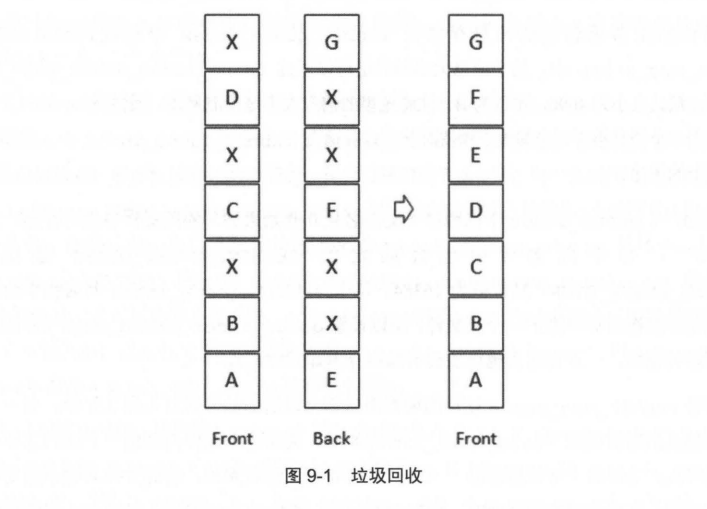
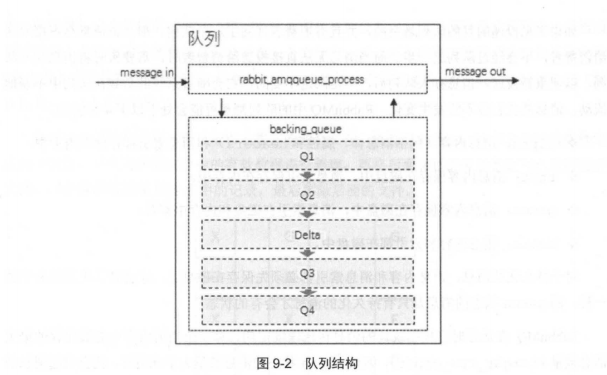
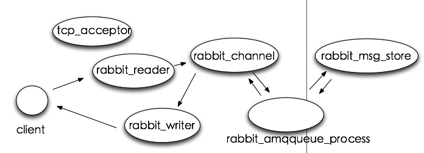
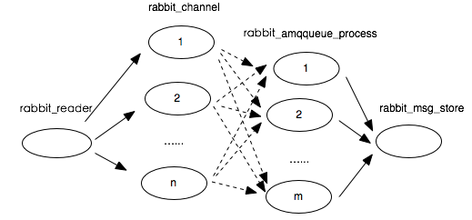
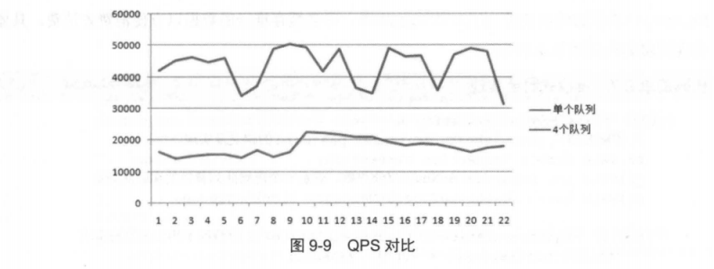
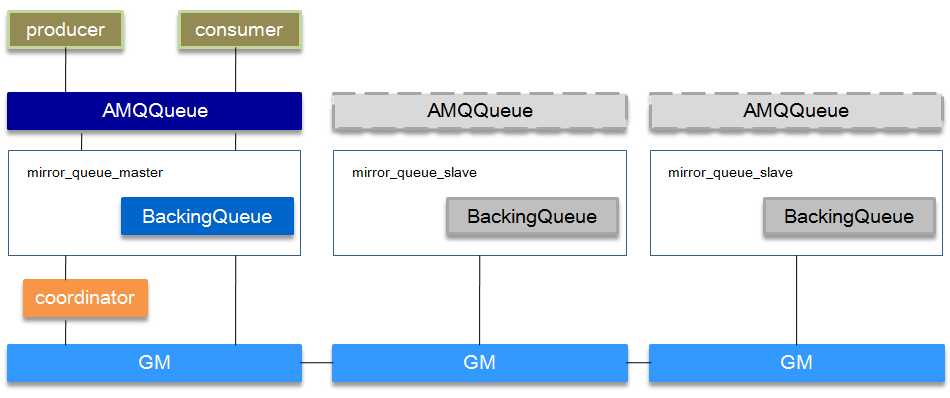
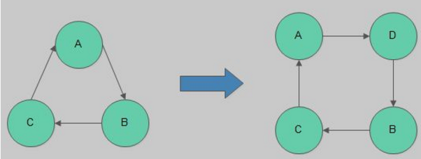

# 存储机制

不管是持久化的消息还是非持久化的消息都可以被写入到磁盘。持久化的消息在到达队列时就被写入到磁盘，并且如果可以，持久化的消息也会在内存中保存一份备份，这样可以提高一定的性能，当内存吃紧的时候会从内存中清除。非持久化的消息一般只保存在内存中 ，在内存吃紧的时候会被换入到磁盘中，以节省内存空间。这两种类型的消息的落盘处理都在RabbitMQ 的"持久层"中 完成。

持久层是一个逻辑上的概念，实际包含两个部分 : 

1. 队列索引 rabbit_queue_index 负责维护队列中落盘消息的信息，包括消息的存储地点、是否己被交付给消费者、是否己被消费者 ack 等。每个队列都有与之对应的一个 rabbit_queue_index。

2. 消息存储 rabbit_msg_store 以键值对的形式存储消息，它被所有队列共享，在每个节点中有且只有一个。从技术层面上来说， rabbit_msg_store 具体还可以分为msg store persistent 和 msg_store_transient。
   1. msg_store_persistent 负责持久化消息的持久化，重启后消息不会丢失;
   2. msg_store_transient 负责非持久化消息的持久化，重启后消息会丢失。

消息(包括消息体、属性和 headers) 可以直接存储在 rabbit_queue_index  中，也可以被保存在 rabbit_msg_store 中。默认在 $RABBITMQ HOME/var/lib/mnesia/rabbit@$HOSTNAME/路径下包含 queues 、 msg_store_persistent 、 msg_store_ transient 这 3 个文件夹，其分别存储对应的信息。 

最佳的配备是较小的消息存储在 rabbit_queue_index 中而较大的消息存储在rabbit_msg_store 中。这个消息大小的界定可以通过 queue_index_embed_msgs_below来配置 ， 默认大小为 4096，单位为 B。注意这里的消息大小是指消息体、属性及 headers 整体的大小。当一个消息小于设定的大小阈值时就可以存储在 rabbit_queue_index 中，这样可以得到性能上的优化。

rabbit_queue_index 中以顺序(文件名从 0 开始累加)的段文件来进行存储，后缀为" . idx " ，每个段文件中包含固定的 SEGMENT_ENTRY_COUNT 条记录，SEGMENT_ENTRY_COUNT 默认值为 16384 。每个 rabbit_queue_index 从磁盘中读取消息的时候至少要在内存中维护一个段文件，所以设置 queue index embed msgs below 值的时候要格外谨慎 ， 一点点增大也可能会引起内存爆炸式的增长。

经过 rabbit msg store 处理的所有消息都会以追加的方式写入到文件中，当一个文件的大小超过指定的限制 (file size limit) 后 ， 关闭这个文件再创建一个新的文件以供新的消息写入。文件名(文件后缀是". rdq") 从 0 开始进行累加 ， 因此文件名最小的文件也是最老的文件。在进行消息的存储时， Rabb itMQ 会在 ETS (Erlang Term Storage) 表中记录消息在文件中的位置映射 (Index) 和文件的相关信息 ( FileSummary )。

在读取消息的时候，先根据消息的 ID (msg id) 找到对应存储的文件，如果文件存在并且未被锁住，则直接打开文件，从指定位置读取消息的内容。如果文件不存在或者被锁住了，则发送请求由 rabbit_msg_store 进行处理。 

## 消息删除

消息的删除只是从 ETS 表删除指定消息的相关信息 ， 同时更新消息对应的存储文件的相关信息。执行消息删除操作时，井不立即对在文件中的消息进行删除，也就是说消息依然在文件中，仅仅是标记为垃圾数据而己。当一个文件中都是垃圾数据时可以将这个文件删除 。当检测到前后两个文件中的有效数据可以合并在一个文件中，井且所有的垃圾数据的大小和所有文件(至少有 3 个文件存在的情况下)的数据大小的比值超过设置的阈值GARBAGE_FRACTION (默认值为 0.5) 时才会触发垃圾回收将两个文件合井 。

执行合井的两个文件一定是逻辑上相邻的两个文件 。 如图 9- 1 所示，执行合并时首先锁定这两个文件，井先对前面文件中的有效数据进行整理，再将后面文件的有效数据写入到前面的文件，同时更新消息在 ETS 表中的记录，最后删除后面的文件。 




## 队列的结构

通常队列由 rabbit_amqqueue_process 和backing_queue 这两部分组成，.

rabbit＿amqqueue_process负责协议相关的消息处理， 即接收生产者发布的消息、 向消费者交付消息、 处理消息的确认（包括生产端的confirm和消费端的ack)等。 

backing_queue 是消息存储的具体形式和引擎，并向rabbit＿amqqueue_process提供相关的接口以供调用。

如果消息投递的目的队列是空的， 并且有消费者订阅了这个队列， 那么该消息会直接发送给消费者 ，不会经过队列这一步。 而当消息无法直接投递给消费者时， 需要暂时将消息存入队列， 以便重新投递。 

消息存入队列后，不是固定不变的， 它会随着系统的负载在队列中不断地流动， 消息的状态会不断发生变化。 RabbitMQ中的队列消息可能会处千以下4种状态。

1. alpha: 消息内容(包括消息体、属性和headers)和消息索引都存储在内存中。alpha状态最耗内存，但很少消耗 CPU。 
2. beta: 消息内容保存在磁盘中， 消息索引保存在内存中。
3. gamma: 消息内容保存在磁盘中， 消息索引在磁盘和内存中都有。beta和gamma状态都只需要 一次I/0操作就可以读取到 消息（从rabbit_msg_store中）。
4. delta: 消息内容和索引都在磁盘中。delta 状态基本不消耗内存， 但是需要消耗更多的 CPU和磁盘1/0操作。 delta状态需要执行两次I/0操作才能读取到消息， 一次是读消息索引（从rabbit_queue_index中）， 一次是读消息内容（从 rabbit_msg_store中）；

对于待久化的消息， 消息内容和消息索引都必须先保存在磁盘上，才会处于上述状态中的一种。而gamma状态的消息是只有持久化的消息才会有的状态。RabbitMQ在运行时会根据统计的消息传送速度定期计算一个当前内存中能够保存的最大消息数量(target_ram_count)，如果 alpha状态的消息数量大于此值时，就会引起消息的状态转换，多余的消息可能会转换到beta状态、 gamma状态或者dellta状态。 区分这4种状态的**主要作用是满足不同的内存和CPU需求**。

### 内存与cpu和IO的权衡

对于普通的没有设置优先级和镜像的队列来说， backing_queue 的默认实现是 rabbit＿variable_queue，其内部通过5个子队列 Q1、 Q2、 Delta、Q3和 Q4来体现消息 的各个状态。整个队列包括rabbit_amqqueue_process和backing_queue的各个子队列， 队列的结构可以参考图9-2。 其中Q1、Q4只包含alpha状态的消息，Q2和Q3包含beta和 gamma状态的消息，Delta只包含delta状态的消息。 

一般情况下， 消息按照Q1 ---Q2---Delta ---Q3---Q4这样的顺序步骤进行流动， 但并不是每一条消息都一定会经历所有的状态， 这个取决千当前系统的负载状况。从Ql至Q4基本经历内存到磁盘，再由磁盘到内存这样的一个过程， 如此可以在队列负载很高的情况下， 能够通过将一部分消息由磁盘保存来节省内存空间，而在负载降低的时候， 这部分消息又渐渐回到内存被消费者获取， 使得整个队列具有很好的弹性。





消费者获取消息也会引起消息的状态转换。当消费者获取消息时， 首先会从 Q4 中获取消息， 如果获取成功则返回。如果 Q4 为空， 则尝试从 Q3 中获取消息， 系统首先会判断 Q3 是否为空，如果为空则返回队列为空，即此时队列中无消息。如果 Q3 不为空，则取出 Q3 中的消息， 进而再判断此时 Q3 和 Delta 中的长度， 如果都为空， 则可以认为 Q2、Delta、Q3、Q4 全部为空， 此时将 Ql 中的消息直接转移至Q4, 下次直接从 Q4 中获取消息。如果 Q3 为空， Delta 不为空， 则将 Delta 的消息转移至Q3 中， 下次可以直接从 Q3 中获取消息。在将消息从 Delta 转移到 Q3 的过程中， 是按照索引分段读取的， 首先读取某一段， 然后判断读取的消息的个数与Delta 中消息的个数是否相等， 如果相等， 则可以判定此时 Delta 中已无消息， 则直接将 Q2 和刚读取到的消息一并放入到 Q3 中； 如果不相等， 仅将此次读取到的消息转移到Q3。

这里就有两处疑问，第一个疑问是： 为什么 Q3 为空则可以认定整个队列为空？ 试想一下， 如果 Q3 为空， Delta 不为空， 那么在 Q3 取出最后一条消息的时候， D e lta 上的消息就会被转移到 Q3, 这样与 Q3 为空矛盾； 如果 Delta 为空且 Q2 不为空， 则在 Q3 取出最后一条消息时会将Q2 的消息并入到Q3 中，这样也与 Q3 为空矛盾； 在 Q3 取出最后一条消息之后，如果 Q2、Delta、Q3 都为空， 且 Ql 不为空时， 则 Q1 的消息会被转移到 Q4 , 这与 Q4 为空矛盾。其实这一番论述也解释了另一个问题： 为什么 Q3 和 Delta 都为空时， 则可以认为 Q2、Delta、 Q3、Q4 全部为空？

通常在负载正常时，如果消息被消费的速度不小于接收新消息的速度，对千不需要保证可   靠不丢失的消息来说，极有可能只会处千 alpha 状态。对千 durable 属性设置为 true 的消息， 它一定会进入 gamma 状态， 并且在开启 publishe r confirm 机制时， 只有到了gamma 状态时才会确认该消息已被接收，若消息消费速度足够快、内存也充足，这些消息也不会继续走到下一 个状态。

在系统负载较高时，已接收到的消息若不能很快被消费掉，这些消息就会进入到很深的队列中去，这样会增加处理每个消息的平均开销。因为要花更多的时间和资源处理 ” 堆积＂的消息，如此用来处理新流入的消息的能力就会降低，使得后流入的消息又被积压到很深的队列中继续增大处理每个消息的平均开销，继而情况变得越来越恶化，使得系统的处理能力大大降低。

应对这一问题一般有 3 种措施：

( 1 ) 增加 prefetch_count 的值， 即一次发送多条消息给消费者 ， 加快消息被消费的速度， 详细用法可以参考 4.9.1 节；

( 2 ) 采用 multiple ack, 降低处理 ack 带来的开销， 详细用法可以参考 3.5 节；

( 3 ) 流量控制， 详细内容可以参考 9.3 节。


## 惰性队列

RabbitMQ 从 3.6.0 版本开始引入了惰性队列 ( Lazy Queue ) 的概念。**惰性队列会尽可能地将消息存入磁盘中，而在消费者消费到相应的消息时才会被加载到内存中，它的一个重要的设计目标是能够支待更长的队列，即支持更多的消息存储。**当消费者由于各种各样的原因（比如消费者下线、宅机，或者由于维护而关闭等）致使长时间内不能消费消息而造成堆积时，惰性队列就很有必要了。

默认情况下， **当生产者将消息发送到 RabbitMQ 的时候， 队列中的消息会尽可能地存储在内存之中，这样可以更加快速地将消息发送给消费者。**即使是待久化的消息，在被写入磁盘的同时也会在内存中驻留一份备份。当 RabbitMQ 需要释放内存的时候， 会将内存中的消息换页至磁盘中，这个操作会耗费较长的时间，也会阻塞队列的操作，进而无法接收新的消息。虽然RabbitMQ 的开发者们一直在升级相关的算法， 但是效果始终不太理想， 尤其是在消息量特别大的时候。

**惰性队列会将接收到的消息直接存入文件系统中，而不管是持久化的或者是非待久化的，   这样可以减少了内存的消耗 ， 但是会增加 I/0 的使用， 如果消息是持久化的， 那么这样的 I/0 操作不可避免，惰性队列和待久化的消息可谓是“最佳拍档＂。**注意如果惰性队列中存储的是非待久化的消息，内存的使用率会一直很稳定，但是重启之后消息一样会丢失。

队列具备两种模式： default 和 lazy。默认的为default 模式， 在 3.6.0 之前的版本无须做任何变更。 lazy模式即为惰性队列的模式， 可以通过调用channel.queueDeclare方法的时候在参数中设置， 也可以通过 Policy的方式设置， 如果一个队列同时使用这两种方式设置， 那么 Policy的方式具备更高的优先级。如果要通过声明的方式改变已有队列的模式，那么只能先删除队列，然后再重新声明一个新的。

在队列声明的时候可以通过x-queue-mode 参数来设置队列的模式， 取值为 default 和 lazy。下面示例演示了一个惰性队列的声明细节 ：
```java
Map <String , Object> args = new HashMap<>(); 
args.put( "x-queue-mode" , "lazy");
channel.queueDeclare("myqueue" , false, false, false, args);
```

惰性队列和普通队列相比，只有**很小的内存开销**。这里很难对每种情况给出一个具体的数值， 但是我们可以类比一下： 发送 1 千万条消息， 每条消息的大小为 1KB, 并且此时没有任何的消费者， 那么普通队列会消耗 1.2GB 的内存， 而惰性队列只消耗 1.5MB 的内存。

据官方测试数据显示， 对于普通队列， 如果要发送 1 于万条消息， 需要耗费 801 秒， 平均发送速度约为 13000 条／秒。如果使用惰性队列， 那么发送同样多的消息时， 耗时是 421 秒， 平均发送速度约为 24000 条／秒。出现性能偏差的原因是普通队列会由于内存不足而不得不将消息换页至磁盘。如果有消费者消费时， 惰性队列会耗费将近 40MB 的空间来发送消息， 对于一个消费者的情况， 平均的消费速度约为 14000 条／秒。

如果要将普通队列转变为惰性队列 ， 那么我们需要忍受同样的性能损耗， 首先需要将缓存中的消息换页至磁盘中，然后才能接收新的消息。反之，当将一个惰性队列转变为普通队列的   时候，和 恢复一个队列执行同样的操作， 会将磁盘中的消息批量地导入到内存中。

## 磁盘及磁盘告警

当**内存使用超过配置的阈值**或者**磁盘剩余空间低于配置的阈值**时，RabbitMQ  都会暂时阻塞 ( block) 客户端的连接 (Connection ) 并停止接收从客户端发来的消息，以此避免服务崩溃。与此同时， 客户端与服务端的心跳检测也会失效。可以通过 rabbitmqctl list_connections 命令或者 Web 管理界面来查看它的状态， 如图9-3 所示。


被阻塞的 Connection  的状态要么是 blocking ,  要么是 blocked。前者对应于并不试图发送消息的 Connection,    比如消费者关联的 Connection,    这种状态下的 Connection  可以继续运行。而后者对应千一直有消息发送的 Connection，这种状态下的 Connection 会被停止发送消息。 注意在一个集群中， 如果一个 Broker 节点的内存或者磁盘受限 ， 都会引起整个集群中所有的Connection 被阻塞。

理想的情况是当发生阻塞时可以在阻止生产者的同时而又不影响消费者的运行。但是在AMQP 协议中， 一个信道 ( Channel ) 上可以同时承载生产者和消费者 ， 同一个 Connection 中也可以同时承载若干个生产者的信道和消费者的信道 ， 这样就会使阻塞逻辑错乱， 虽然大多数情况下并不会发生任何问题， 但还是建议生产和消费的逻辑可以分摊到独立的 Connection 之上而不发生任何交集。客户端程序可以通过添加 BlockedListener 来监听相应连接的阻塞信息， 示例可以参考代码清单 7-11。

### 内存告警

RabbitMQ 服务器会在启动或者执行 rabbitmqctl set_vm_memory_high_watermark fraction命令时计算系统内存的大小。默认情况下 vm_memory_high_watermark 的值为 0 .4，即内存阈值为 0.4， 表示当 RabbitMQ 使用的内存超过 40%时，就会产生内存告警井阻塞所有生产者的连接。一旦告警被解除(有消息被消费或者从内存转储到磁盘等情况的发生)， 一切都会恢复正常。
默认情况下将 RabbitMQ 所使用内存的阔值设置为 40% ， 这并不意味着此时 RabbitMQ 不能使用超过 40%的内存，这仅仅只是限制了 RabbitMQ 的消息生产者。在最坏的情况下， Erlang的垃圾回收机制会导致两倍的内存消耗，也就是 80%的使用占比 。 

如果设置 fraction 为 0 ，所有的生产者都会被停止发送消息 。 这个功能可以适用于需要禁止集群中所有消息发布的情况。正常情况下建议 vm memory high watermark 取值在 0.4到 0.66 之间 ， 不建议取值超过 0.7 。 

假设机器的内存为 4GB ， 那么就代表 RabbitMQ 服 务的 内 存阔值的绝对值为4GB x 0 .4= 1.6GB 。 如果是 32 位的 Windows 操作系统，那么可用内存被限制为 2GB ，也就意味着 RabbitMQ 服务的内存阑值的绝对值为 820MB 左右。除了通过百分比的形式， RabbitMQ 也可以采用绝对值的形式来设置内存阑值 ， 默认单位为 B 。 下面示例设置了内存阔值的绝对值为1024MB ( 1024 x 1024 x 1024B= 1073741824B ) : 

在某个 Broker 节点触及内存井阻塞生产者之前，它会尝试将队列中的消息换页到磁盘以释放内存空间。持久化和非持久化的消息都会被转储到磁盘中，其中持久化的消息本身就在磁盘中有一份副本，这里会将持久化的消息从内存中清除掉。

默认情况下，在内存到达内存阐值的 50%时会进行换页动作。也就是说，在默认的内存阈值为 0.4 的情况下，当内存超过 0 .4 x 0 . 5=0.2 时会进行换页动作。可以通过在配置文件中配置vm memory high watermark paging ratio 项来修改此值 。 下面示例中将换页比率从默认的 0.5 修改为 0.75: 


```properties
#RabbitMQ 使用内存的阔值 默认40%
vm_memory_high_watermark.relative = 0.4

#RabbitMQ 使用内存的阔值 单位B字节
vm_memory_high_watermark.absolute = 1073741824

#带单位
vm_memory_high_watermark.absolute = 2GB
## Supported unit symbols:
##
## k, kiB: kibibytes (2^10 - 1,024 bytes)
## M, MiB: mebibytes (2^20 - 1,048,576 bytes)
## G, GiB: gibibytes (2^30 - 1,073,741,824 bytes)
## kB: kilobytes (10^3 - 1,000 bytes)
## MB: megabytes (10^6 - 1,000,000 bytes)
## GB: gigabytes (10^9 - 1,000,000,000 bytes)

# 换页阈值 默认50%
vm_memory_high_watermark_paging_ratio = 0.5
```


### 磁盘告警

当剩余磁盘空间低千确定的阅值时 ， RabbitMQ 同样会阻塞生产者， 这样可以避免因非持久化的消息持续换页而耗尽磁盘空间导致服务崩溃。默认情况下 ， 磁盘阈值为 50MB , 这意味着当磁盘剩余空间低于 50MB 时会阻塞生产者并停止内存中消息的换页动作。这个阙值的设置可以减小但不能完全消除因磁盘耗尽而导致崩溃的可能性，比如在两次磁盘空间检测期间内，磁盘空间从大于 50MB 被耗尽到 0MB。一个相对谨慎的做法是将磁盘阙值设置为与操作系统所显示的内存大小一致。

正常情况下，建议 disk_free_limit.relative 的取值为1.0 和 2.0 之间。 


```properties
disk_free_limit.absolute = 50000

## Or you can set it using memory units (same as in vm_memory_high_watermark)
## with RabbitMQ 3.6.0+.
# disk_free_limit.absolute = 500KB
# disk_free_limit.absolute = 50mb
# disk_free_limit.absolute = 5GB

## Alternatively, we can set a limit relative to total available RAM.
##
## Values lower than 1.0 can be dangerous and should be used carefully.
# disk_free_limit.relative = 2.0
```

## 流量控制

RabbitMQ 可以对内存和磁盘使用量设置阙值， 当达到阙值后， 生产者将被阻塞 ( block ) , 直到对应项恢复正常。除了这两个阙值，从2.8.0 版本开始，RabbitMQ 还引入了流控( Flow Control) 机制来确保稳定性。流控机制是用来避免消息的发送速率过快而导致服务器难以支撑的情形。内存和磁盘告警相当于全局的流控 ( Global Flow Control )， 一旦触发会阻塞集群中所有的Connection, 而本节的流控是针对单个 Connection 的， 可以称之为 Per-Connection Flow Control 或者 Internal Flow Control。

### RabbitMQ进程模型

RabbitMQ Server实现了AMQP模型中Broker部分，将Channel和Queue设计成了Erlang进程，并用Channel进程的运算实现Exchange的功能。



图2 RabbitMQ进程模型

图2中，tcp_acceptor进程接收客户端连接，创建rabbit_reader、rabbit_writer、rabbit_channel进程。

rabbit_reader接收客户端连接，解析AMQP帧；

rabbit_writer向客户端返回数据；

rabbit_channel解析AMQP方法，对消息进行路由，然后发给相应队列进程。

rabbit_amqqueue_process是队列进程，在RabbitMQ启动（恢复durable类型队列）或创建队列时创建。

rabbit_msg_store是负责消息持久化的进程。

在整个系统中，存在一个tcp_accepter进程，一个rabbit_msg_store进程，有多少个队列就有多少个rabbit_amqqueue_process进程，每个客户端连接对应一个rabbit_reader和rabbit_writer进程。


### 流控原理

Erlang 进程之间并不共享内存( binary 类型的除外）， 而是通过消息传递来通信，每个进程都有自己的进程邮箱 ( mailbox)。默认情况下， Erlang 并没有对进程邮箱的大小进行限制， 所以当有大朵消息持续发往某个 进程时， 会导致该进程 邮箱过大 ， 最终内存溢出并崩溃 。在RabbitMQ 中， 如果生产者待续高速发送 ， 而消费者消费速度较低时， 如果没有流控， 很快就会使内部进程邮箱的大小达到内存阐值 。

RabbitMQ 使用了一种基于信用证算法 ( credit-based algorithm ) 的流控机制来限制发送消息的速率以解决前面所提出的问题。它通过监控各个进程的进程邮箱 ， 当某个进程负载过高而来不及处理消息时， 这个进程的进程邮箱就会开始堆积消息 。当堆积到一定量时， 就会阻塞而不接收上游的新消息。从而 慢慢地 ， 上游进程的进程邮箱也会开始堆积消息。当堆积到一定量时也会阻塞而停止接收上游的消息，最后就会使负责网络数据包接收的进程阻塞而暂停接收新的数据。

就以图 9-4 为例，进程 A 接收消息井转发至进程 B ，进程 B 接收消息并转发至进程 C。每个进程中都有一对关于收发消息的 credit 值 。 以进程 B 为例， { {credit from , C} , value}表示能发送多少条消息给 C ，每发送一条消息该值减 1，当为 0 时，进程 B 不再往进程 C 发送消息也不再接收进程 A 的消息 。 {{credit to , A} , value} 表示再接收多少条消息就向进程 A 发送增加 credit 值的通知，进程 A 接收到该通知后就增加{ {credit from ,B} , value}所对应的值，这样进程 A 就能持续发送消息。

当上游发送速率高于下游接收速率时， credit值就会被逐渐耗光，这时进程就会被阻塞，阻塞的情况会一直传递到最上游。当上游进程收到来自下游进程的增加 credit 值的通知时，若此时上游进程处于阻塞状态则解除阻塞，开始接收更上游进程的消息，一个一个传导最终能够解除最上游的阻塞状态。由此可知，基于信用证的流控机制最终将消息发送进程的发送速率限制在消息处理进程的处理能力范围之内。 

为了解决该问题，RabbitMQ使用了一种基于信用证的流控机制。消息处理进程有一个信用组
{InitialCredit，MoreCreditAfter}，默认值为{200,50}。消息发送者进程A向接收者进程B发消息，每发一条消息，Credit数量减1，直到为0，A被block住；对于接收者B，每接收MoreCreditAfter条消息，会向A发送一条消息，给予A MoreCreditAfter个Credit，当A的Credit>0时，A可以继续向B发送消息。



### 打破队列性能

对流控可能比较好的优化方案是：用多个amqqueue进程来实现一个队列，这样可以降低rabbit_channel被单个amqqueue进程block的概率，同时在单队列的场景下也能更好利用多核的特性。

图 9-9 展示了封装后的逻辑队列(即 4 个物理队列)和单个独立队列之间的 QPS 对比，测试环境同本节开篇所述。可 以看到封装后的逻辑队列与原先的单个队列相比性能提升了不止一倍，可以得出打破单个队列进程的性能瓶颈的结论。 



## 镜像队列

如果RabbitMQ集群只有一个broker节点，那么该节点的失效将导致整个服务临时性的不可用，并且可能会导致message的丢失（尤其是在非持久化message存储于非持久化queue中的时候）。当然可以将所有的publish的message都设置为持久化的，并且使用持久化的queue，但是这样仍然无法避免由于缓存导致的问题：因为message在发送之后和被写入磁盘并执行fsync之间存在一个虽然短暂但是会产生问题的时间窗。通过publisher的confirm机制能够确保客户端知道哪些message已经存入磁盘，尽管如此，一般不希望遇到因单点故障导致的服务不可用。

如果RabbitMQ集群是由多个broker节点构成的，那么从服务的整体可用性上来讲，该集群对于单点失效是有弹性的，但是同时也需要注意：尽管exchange和binding能够在单点失效问题上幸免于难，但是queue和其上持有的message却不行，这是因为queue及其内容仅仅存储于单个节点之上，所以一个节点的失效表现为其对应的queue不可用。

引入RabbitMQ的镜像队列机制，将queue镜像到cluster中其他的节点之上。在该实现下，如果集群中的一个节点失效了，queue能自动地切换到镜像中的另一个节点以保证服务的可用性。在通常的用法中，针对每一个镜像队列都包含一个master和多个slave，分别对应于不同的节点。slave会准确地按照master执行命令的顺序进行命令执行，故slave与master上维护的状态应该是相同的。除了publish外所有动作都只会向master发送，然后由master将命令执行的结果广播给slave们，故看似从镜像队列中的消费操作实际上是在master上执行的。

一旦完成了选中的slave被提升为master的动作，发送到镜像队列的message将不会再丢失：publish到镜像队列的所有消息总是被直接publish到master和所有的slave之上。这样一旦master失效了，message仍然可以继续发送到其他slave上。

**RabbitMQ的镜像队列同时支持publisher confirm和事务两种机制。在事务机制中，只有当前事务在全部镜像queue中执行之后，客户端才会收到Tx.CommitOk的消息。同样的，在publisher confirm机制中，向publisher进行当前message确认的前提是该message被全部镜像所接受了。**

### 原理



镜像队列基本上就是一个特殊的BackingQueue，它内部包裹了一个普通的BackingQueue做本地消息持久化处理，在此基础上增加了将消息和ack复制到所有镜像的功能。所有对mirror_queue_master的操作，会通过组播GM（下面会讲到）的方式同步到各slave节点。GM负责消息的广播，mirror_queue_slave负责回调处理，而master上的回调处理是由coordinator负责完成。mirror_queue_slave中包含了普通的BackingQueue进行消息的存储，master节点中BackingQueue包含在mirror_queue_master中由AMQQueue进行调用。

消息的发布（除了Basic.Publish之外）与消费都是通过master节点完成。master节点对消息进行处理的同时将消息的处理动作通过GM广播给所有的slave节点，slave节点的GM收到消息后，通过回调交由mirror_queue_slave进行实际的处理。

**对于Basic.Publish，消息同时发送到master和所有slave上，如果此时master宕掉了，消息还发送slave上，这样当slave提升为master的时候消息也不会丢失。**

GM, Guarenteed Multicast. GM模块实现的一种**可靠的组播通讯协议**，该协议能够保证组播消息的**原子性**，即保证组中活着的节点要么都收到消息要么都收不到。它的实现大致如下：

将所有的节点形成一个循环链表，每个节点都会监控位于自己左右两边的节点，当有节点新增时，相邻的节点保证当前广播的消息会复制到新的节点上；当有节点失效时，相邻的节点会接管保证本次广播的消息会复制到所有的节点。在master节点和slave节点上的这些gm形成一个group，group（gm_group）的信息会记录在mnesia中。不同的镜像队列形成不同的group。消息从master节点对于的gm发出后，顺着链表依次传送到所有的节点，由于所有节点组成一个循环链表，master节点对应的gm最终会收到自己发送的消息，这个时候master节点就知道消息已经复制到所有的slave节点了。

#### 新增节点

新节点的加入过程如下图所示：


每当一个节点加入或者重新加入（例如从网络分区中恢复过来）镜像队列，之前保存的队列内容会被清空。

#### 节点的失效

如果某个slave失效了，系统处理做些记录外几乎啥都不做：master依旧是master，客户端不需要采取任何行动，或者被通知slave失效。
如果master失效了，那么slave中的一个必须被选中为master。被选中作为新的master的slave通常是最老的那个，因为最老的slave与前任master之间的同步状态应该是最好的。然而，需要注意的是，如果存在没有任何一个slave与master完全同步的情况，那么前任master中未被同步的消息将会丢失。

#### 消息的同步

将新节点加入已存在的镜像队列是，默认情况下ha-sync-mode=manual，镜像队列中的消息不会主动同步到新节点，除非显式调用同步命令。当调用同步命令后，队列开始阻塞，无法对其进行操作，直到同步完毕。当ha-sync-mode=automatic时，新加入节点时会默认同步已知的镜像队列。由于同步过程的限制，所以不建议在生产的active队列（有生产消费消息）中操作。

### 补充要点

镜像队列不能作为负载均衡使用，因为每个操作在所有节点都要做一遍。

ha-mode参数和durable declare对exclusive队列都并不生效，因为exclusive队列是连接独占的，当连接断开，队列自动删除。所以实际上这两个参数对exclusive队列没有意义。

当所有slave都出在（与master）未同步状态时，并且ha-promote-on-shutdown设置为when-synced(默认)时，如果master因为主动的原因停掉，比如是通过rabbitmqctl stop命令停止或者优雅关闭OS，那么slave不会接管master，也就是此时镜像队列不可用；但是如果master因为被动原因停掉，比如VM或者OS crash了，那么slave会接管master。这个配置项隐含的价值取向是保证消息可靠不丢失，放弃可用性。如果ha-promote-on-shutdown设置为always,那么不论master因为何种原因停止，slave都会接管master，优先保证可用性。

镜像队列中最后一个停止的节点会是master，启动顺序必须是master先启动，如果slave先启动，它会有30s的等待时间，等待master的启动，然后加入cluster中（如果30s内master没有启动，slave会自动停止）。当所有节点因故（断电等）同时离线时，每个节点都认为自己不是最后一个停止的节点。要恢复镜像队列，可以尝试在30s之内启动所有节点。

对于镜像队列，客户端Basic.Publish操作会同步到所有节点（消息同时发送到master和所有slave上，如果此时master宕掉了，消息还发送slave上，这样当slave提升为master的时候消息也不会丢失），而其他操作则是通过master中转，再由master将操作作用于slave。比如一个Basic.Get操作，假如客户端与slave建立了TCP连接，首先是slave将Basic.Get请求发送至master，由master备好数据，返回至slave，投递给消费者。

当slave宕掉了，除了与slave相连的客户端连接全部断开之外，没有其他影响。

当master宕掉时，会有以下连锁反应：

1. 与master相连的客户端连接全部断开；
2. 选举最老的slave节点为master。若此时所有slave处于未同步状态，则未同步部分消息丢失；
3. 新的master节点requeue所有unack消息，因为这个新节点无法区分这些unack消息是否已经到达客户端，亦或是ack消息丢失在老的master的链路上，亦或者是丢在master组播ack消息到所有slave的链路上。所以处于消息可靠性的考虑，requeue所有unack的消息。此时客户端可能有重复消息；
4. 如果客户端连着slave，并且Basic.Consume消费时指定了x-cancel-on-ha-failover参数，那么客户端会受到一个Consumer Cancellation Notification通知，Java SDK中会回调Consumer接口的handleCancel方法，故需覆盖此方法。如果未指定x-cancal-on-ha-failover参数，那么消费者就无法感知master宕机，会一直等待下去。
### 镜像队列的恢复

前提：两个节点A和B组成以镜像队列。

场景1：A先停，B后停
该场景下B是master，只要先启动B，再启动A即可。或者先启动A，再在30s之内启动B即可恢复镜像队列。（如果没有在30s内回复B，那么A自己就停掉自己）

场景2：A，B同时停
该场景下可能是由掉电等原因造成，只需在30s内联系启动A和B即可恢复镜像队列。

场景3：A先停，B后停，且A无法恢复。
因为B是master，所以等B起来后，在B节点上调用rabbitmqctl forget_cluster_node A以接触A的cluster关系，再将新的slave节点加入B即可重新恢复镜像队列。

场景4：A先停，B后停，且B无法恢复
该场景比较难处理，旧版本的RabbitMQ没有有效的解决办法，在现在的版本中，因为B是master，所以直接启动A是不行的，当A无法启动时，也就没版本在A节点上调用rabbitmqctl forget_cluster_node B了，新版本中forget_cluster_node支持-offline参数，offline参数允许rabbitmqctl在离线节点上执行forget_cluster_node命令，迫使RabbitMQ在未启动的slave节点中选择一个作为master。当在A节点执行rabbitmqctl forget_cluster_node -offline B时，RabbitMQ会mock一个节点代表A，执行forget_cluster_node命令将B提出cluster，然后A就能正常启动了。最后将新的slave节点加入A即可重新恢复镜像队列

场景5：A先停，B后停，且A和B均无法恢复，但是能得到A或B的磁盘文件
这个场景更加难以处理。将A或B的数据库文件（$RabbitMQ_HOME/var/lib目录中）copy至新节点C的目录下，再将C的hostname改成A或者B的hostname。如果copy过来的是A节点磁盘文件，按场景4处理，如果拷贝过来的是B节点的磁盘文件，按场景3处理。最后将新的slave节点加入C即可重新恢复镜像队列。

场景6：A先停，B后停，且A和B均无法恢复，且无法得到A和B的磁盘文件
无解。


# [RabbitMQ 配置详解](https://www.linuxidc.com/Linux/2019-03/157354.htm)

## 一 rabbitmq 生产部署

RabbitMQ 常用的三种自定义服务器的通用方法：

- 配置文件 rabbitmq.conf
- 环境变量文件 rabbitmq-env.conf
- 补充配置文件 advanced.config

rabbitmq.conf和rabbitmq-env.conf的位置

- 在二进制安装中路径是在 ：安装目录下的/etc/rabbitmq/
- rpm 安装： /etc/rabbitmq/

如果rabbitmq.conf和rabbitmq-env.conf 的两个文件不存在，那么我们可以创建该文件，然后我们可以通过环境变量
指定该文件的位置。

补充 ：

- rabbitmqctl rabbitmqctl 是管理虚拟主机和用户权限的工具
- rabbitmq-plugins 是管理插件的工具

### 1.1 rabbitmq.conf

在rabbitmq 3.7.0 之前，rabbitmq.conf 使用了Erlang语法配置格式，新的版本使用了sysctl 格式.

sysctl 语法：

- 单个信息都在一行里面
- 配置信息以key value 的形式保存。
- ‘#’开头表示注释。

配置示例文件：[rabbitmq.conf.example](https://github.com/rabbitmq/rabbitmq-server/blob/v3.7.x/docs/rabbitmq.conf.example)

配置属性和描述（[官网链接](http://www.rabbitmq.com/configure.html#config-items)）

| 属性                                                        | 描述                                                         | 默认值                                                       |
| ----------------------------------------------------------- | ------------------------------------------------------------ | ------------------------------------------------------------ |
| listeners                                                   | 要监听 AMQP 0-9-1 and AMQP 1.0 的端口                        | listeners.tcp.default = 5672                                 |
| num_acceptors.tcp                                           | 接受tcp连接的erlang 进程数                                   | num_acceptors.tcp = 10                                       |
| handshake_timeout                                           | AMQP 0-9-1 超时时间，也就是最大的连接时间，单位毫秒          | handshake_timeout = 10000                                    |
| listeners.ssl                                               | 启用TLS的协议                                                | 默认值为none                                                 |
| num_acceptors.ssl                                           | 接受基于TLS协议的连接的erlang 进程数                         | num_acceptors.ssl = 10                                       |
| ssl_options                                                 | TLS 配置                                                     | ssl_options =none                                            |
| ssl_handshake_timeout                                       | TLS 连接超时时间 单位为毫秒                                  | ssl_handshake_timeout = 5000                                 |
| vm_memory_high_watermark                                    | 触发流量控制的内存阈值，可以为相对值(0.5),或者绝对值 vm_memory_high_watermark.relative = 0.6 ,vm_memory_high_watermark.absolute = 2GB | 默认vm_memory_high_watermark.relative = 0.4                  |
| vm_memory_calculation_strategy                              | 内存使用报告策略，assigned：使用Erlang内存分配器统计信息  rss：使用操作系统RSS内存报告。这使用特定于操作系统的方法，并可能启动短期子进程。legacy：使用遗留内存报告（运行时认为将使用多少内存）。这种策略相当不准确。erlang  与legacy一样 是为了向后兼容 | vm_memory_calculation_strategy = allocated                   |
| vm_memory_high_watermark_paging_ratio                       | 当内存的使用达到了50%后,队列开始将消息分页到磁盘             | vm_memory_high_watermark_paging_ratio = 0.5                  |
| total_memory_available_override_value                       | 该参数用于指定系统的可用内存总量，一般不使用，适用于在容器等一些获取内存实际值不精确的环境 | 默认未设置                                                   |
| disk_free_limit                                             | Rabbitmq存储数据的可用空间限制，当低于该值的时候，将触发流量限制，设置可参考vm_memory_high_watermark参数 | disk_free_limit.absolute = 50MB                              |
| log.file.level                                              | 控制记录日志的等级，有info,error,warning,debug               | log.file.level = info                                        |
| channel_max                                                 | 最大通道数，但不包含协议中使用的特殊通道号0，设置为0表示无限制，不建议使用该值，容易出现channel泄漏 | channel_max = 2047                                           |
| channel_operation_timeout                                   | 通道操作超时，单位为毫秒                                     | channel_operation_timeout = 15000                            |
| heartbeat                                                   | 表示连接参数协商期间服务器建议的心跳超时的值。如果两端都设置为0，则禁用心跳,不建议禁用 | heartbeat = 60                                               |
| default_vhost                                               | rabbitmq安装后启动创建的虚拟主机                             | default_vhost = /                                            |
| default_user                                                | 默认创建的用户名                                             | default_user = guest                                         |
| default_pass                                                | 默认用户的密码                                               | default_pass = guest                                         |
| default_user_tags                                           | 默认用户的标签                                               | default_user_tags.administrator = true                       |
| default_permissions                                         | 在创建默认用户是分配给默认用户的权限                         | default_permissions.configure = .* default_permissions.read = .* default_permissions.write = .* |
| loopback_users                                              | 允许通过回环地址连接到rabbitmq的用户列表,如果要允许guest用户远程连接(不安全)请将该值设置为none,如果要将一个用户设置为仅localhost连接的话，配置loopback_users.username  =true(username要替换成用户名) | loopback_users.guest = true(默认为只能本地连接)              |
| cluster_formation.classic_config.nodes                      | 设置集群节点cluster_formation.classic_config.nodes.1 = rabbit@hostname1 |                                                              |
| cluster_formation.classic_config.nodes.2 = rabbit@hostname2 | 默认为空，未设置                                             |                                                              |
| collect_statistics                                          | 统计收集模式，none 不发出统计信息事件，coarse每个队列连接都发送统计一次,fine每发一条消息的统计数据 | collect_statistics = none                                    |
| collect_statistics_interval                                 | 统计信息收集间隔，以毫秒为单位                               | collect_statistics_interval = 5000                           |
| delegate_count                                              | 用于集群内通信的委托进程数。在多核的服务器上我们可以增加此值 | delegate_count = 16                                          |
| tcp_listen_options                                          | 默认的套接字选项                                             | tcp_listen_options.backlog = 128 .....                       |
| hipe_compile                                                | 设置为true以使用HiPE预编译RabbitMQ的部分，HiPE是Erlang的即时编译器,启用HiPE可以提高吞吐量两位数，但启动时会延迟几分钟。Erlang运行时必须包含HiPE支持。如果不是，启用此选项将不起作用。HiPE在某些平台上根本不可用，尤其是Windows。 | hipe_compile = false                                         |
| cluster_keepalive_interval                                  | 节点应该多长时间向其他节点发送keepalive消息(以毫秒为单位),keepalive的消息丢失不会被视为关闭 | cluster_keepalive_interval = 10000                           |
| queue_index_embed_msgs_below                                | 消息的字节大小,低于该大小，消息将直接嵌入队列索引中 bytes    | queue_index_embed_msgs_below = 4096                          |
| mnesia_table_loading_retry_timeout                          | 等待集群中Mnesia表可用的超时时间，单位毫秒                   | mnesia_table_loading_retry_timeout = 30000                   |
| mnesia_table_loading_retry_limit                            | 集群启动时等待Mnesia表的重试次数，不适用于Mnesia升级或节点删除。 | mnesia_table_loading_retry_limit = 10                        |
| mirroring_sync_batch_size                                   | 要在队列镜像之间同步的消息的批处理大小                       | mirroring_sync_batch_size = 4096                             |
| queue_master_locator                                        | 队列主节点的策略，有三大策略 min-masters，client-local，random | queue_master_locator = client-local                          |
| proxy_protocol                                              | 如果设置为true ,则连接需要通过反向代理连接，不能直连接       | proxy_protocol = false                                       |
| management.listener.port                                    | rabbitmq web管理界面使用的端口                               | management.listener.port = 15672                             |

查看rabbitmq的有效配置

```
rabbitmqctl environment
```

### 1.2 advanced.config

[示例文件](https://github.com/rabbitmq/rabbitmq-server/blob/master/docs/advanced.config.example)
某些配置设置不可用或难以使用sysctl格式进行配置。因此，可以使用Erlang术语格式的其他配置文件advanced.config
它将与rabbitmq.conf 文件中提供的配置合并。

配置属性和描述（[官网链接](http://www.rabbitmq.com/configure.html#config-items)）

| 属性                                           | 描述                                                         | 默认值                                                       |
| ---------------------------------------------- | ------------------------------------------------------------ | ------------------------------------------------------------ |
| msg_store_index_module                         | 设置队列索引使用的模块                                       | {rabbit，[ {msg_store_index_module，rabbit_msg_store_ets_index} ]} |
| backing_queue_module                           | 队列内容的实现模块。                                         | {rabbit，[ {backing_queue_module，rabbit_variable_queue} ]}  |
| msg_store_file_size_limit                      | 消息储存的文件大小,现有的节点更改是危险的，可能导致数据丢失  | 默认值16777216                                               |
| trace_vhosts                                   | 内部的tracer使用，不建议更改                                 | {rabbit，[ {trace_vhosts，[]} ]}                             |
| msg_store_credit_disc_bound                    | 设置消息储存库给队列进程的积分,默认一个队列进程被赋予4000个消息积分 | {rabbit, [{msg_store_credit_disc_bound, {4000, 800}}]}       |
| queue_index_max_journal_entries                | 队列的索引日志超过该阈值将刷新到磁盘                         | {rabbit, [{queue_index_max_journal_entries, 32768}]}         |
| lazy_queue_explicit_gc_run_operation_threshold | 在内存压力下为延迟队列设置的值，该值可以触发垃圾回收和减少内存使用，降低该值，会降低性能，提高该值，会导致更高的内存消耗 | {rabbit,[{lazy_queue_explicit_gc_run_operation_threshold, 1000}]} |
| queue_explicit_gc_run_operation_threshold      | 在内存压力下，正常队列设置的值，该值可以触发垃圾回收和减少内存使用，降低该值，会降低性能，提高该值，会导致更高的内存消耗 | {rabbit, [{queue_explicit_gc_run_operation_threshold, 1000}]} |

### 1.3 rabbitmq-env.conf

[官网链接](http://www.rabbitmq.com/man/rabbitmq-env.conf.5.html)
通过rabbitmq-env.conf 来定义环境变量
RABBITMQ_NODENAME 指定节点名称

| 属性                              | 描述                                                 | 默认值                                                       |
| --------------------------------- | ---------------------------------------------------- | ------------------------------------------------------------ |
| RABBITMQ_NODE_IP_ADDRESS          | 绑定的网络接口                                       | 默认为空字符串表示绑定本机所有的网络接口                     |
| RABBITMQ_NODE_PORT                | 端口                                                 | 默认为5672                                                   |
| RABBITMQ_DISTRIBUTION_BUFFER_SIZE | 节点之间通信连接的数据缓冲区大小                     | 默认为128000,该值建议不要使用低于64MB                        |
| RABBITMQ_IO_THREAD_POOL_SIZE      | 运行时用于io的线程数                                 | 建议不要低于32，linux默认为128 ，windows默认为64             |
| RABBITMQ_NODENAME                 | rabbitmq节点名称，集群中要注意节点名称唯一           | linux 默认节点名为 rabbit@$hostname                          |
| RABBITMQ_CONFIG_FILE              | rabbitmq 的配置文件路径，注意不要加文件的后缀(.conf) | 默认 $RABBITMQ_HOME/etc/rabbitmq/rabbitmq(二进制安装) /etc/rabbitmq/rabbitmq(rpm 安装) |
| RABBITMQ_ADVANCED_CONFIG_FILE     | advanced.config文件路径                              | 默认 $RABBITMQ_HOME/etc/rabbitmq/advanced(二进制安装) /etc/rabbitmq/advanced(rpm 安装) |
| RABBITMQ_CONF_ENV_FILE            | 环境变量配置文件路径                                 | 默认 $RABBITMQ_HOME/etc/rabbitmq/rabbitmq-env.conf(二进制安装) /etc/rabbitmq/rabbitmq-env.conf(rpm 安装) |
| RABBITMQ_SERVER_CODE_PATH         | 在使用HiPE 模块时需要使用                            | 默认为空                                                     |
| RABBITMQ_LOGS                     | 指定日志文件位置                                     | 默认为 $RABBITMQ_HOME/etc/var/log/rabbitmq/                  |

网络设置 http://www.rabbitmq.com/networking.html
RABBITMQ_DISTRIBUTION_BUFFER_SIZE 节点间通信缓冲区大小,默认值 128Mb,节点流量比较多的集群中，可以提升该值，建议该值不要低于64MB。

tcp 缓存区大小
下示例将AMQP 0-9-1连接的TCP缓冲区设置为192 KiB：

```
tcp_listen_options.backlog = 128
tcp_listen_options.nodelay = true
tcp_listen_options.linger.on = true
tcp_listen_options.linger.timeout = 0
tcp_listen_options.sndbuf = 196608
tcp_listen_options.recbuf = 196608
```

### 1.4 在生产环境中不适用的策略。

[官网链接](http://www.rabbitmq.com/production-checklist.html)

- **1.4.1 vhost**

在生产中，如果rabbitmq只为单个系统提供服务的时候，我们使用默认的(/)是可以的。在为多个系统提供的服务时，我们建议使用单独的vhost.

- **1.4.2 user**

对于生产环境，请删除默认用户(guest),默认用户只能从localhost 连接。
我们可以创建指定权限的单独用户为每个应用提供服务。对于开启权限用户来说，我们可以使用证书，和源ip地址过滤，和身份验证。来加强安全性。

- **1.4.3 最大打开文件限制**

在生产环境我们可能需要调整一些系统的默认限制，以便处理大量的并发连接和队列。
需要调整的值有打开的最大文件数。在生产环境为rabbitmq 运行的用户设定为65536，但是对于大多数开发环境来说，4096就已经足够了。

查看默认的打开文件的最大数量。

```
ulimit -n
```

**更改方式：**

- 1 临时修改

```
ulimit -n 65536
```

- 2 永久修改 

  - 2.1如果是systemed 来进行管理的话我们可以编辑systemed配置文件来进行控制

  ```
  [service]
  LimitNOFILE=300000
  ```

  - 2.2 如果不是systemed 来进行管理的话，我们可以更改rabbitmq的启动加载的环境配置文件 rabbitmq-env.conf。在里面开头添加ulimit -S -n 4096，但该值不能超过系统的默认值的最大值。

    ```
    ulimit -S -n 4096
    ```

  - 2.3 系统级别更改
    更改配置文件：/etc/security/limits.conf
    在文件末尾前面加入
    `rabbitmq(启动的用户名) - nofile 65536`
    如果更改前用户已经登录的话，需要重新登录下才能生效。

- **1.4.4 内存**
  当rabbitmq  检测到它使用的内存超过系统的40%，它将不会接受任何新的消息，这个值是由参数  vm_memory_high_watermark来控制的，默认值是一个安全的值，修改该值需要注意。 rabbitmq  的至少需要128MB,建议vm_memory_high_watermark 值为 0.4~0..66 ，不要使用大于0.7的值。

- **1.4.5 磁盘**
  磁盘默认的储存数据阈值是50MB,当低于该值的时候，将触发流量限制。50MB 只适用于开发环境，生产环境需要调高该值，不然容易由磁盘空间不足导致节点故障，也可能导致数据丢失。

  在生产环境中我们设置的值

  - 建议的最小值 {disk_free_limit, {mem_relative, 1.0}}

   它是基于mem_relative的值，例如在具有4GB内存的rabbitmq主机上，那么该磁盘的阈值就是4G,如果磁盘可用空间低于4G，所有生产者和消息都将拒绝。在允许恢复发布之前，通常需要消费者将队列消息消费完。 

  - 建议的更安全值 {disk_free_limit, {mem_relative, 1.5}}

   在具有4GB内存的RabbitMQ节点上，如果可用磁盘空间低于6GB，则所有新消息都将被阻止，但是如果我们在停止的时候rabbitmq需要储存4GB的数据到磁盘，再下一次启动的时候，就只有2G空间了。 

  - 建议的最大值 {disk_free_limit, {mem_relative, 2.0}}
    这个是最安全的值，如果你的磁盘有足够多的空间话，建议设置该值。但该值容易触发警告，因为在具有4GB内存的rabbitmq主机上，需要最低空间大于8G,如果你的磁盘空间比较少的话，不建议设置该值。

- **1.4.6 连接**
  少使用短连接，使用连接池或者长连接。

- **1.4.7 TLS**
  建议尽可能使用TLS连接，使用TLS会对传输的数据加密，但是对系统的吞吐量产生很大的影响

- **-1.4.8 更改默认端口**
  我们常用的web界面的端口 15672 和AMQP 0-9-1  协议端口 5672 ，建议更改，web界面更改，配置参数 management.listener.port ，AMQP 0-9-1  协议端口配置参数 listeners.tcp.default。