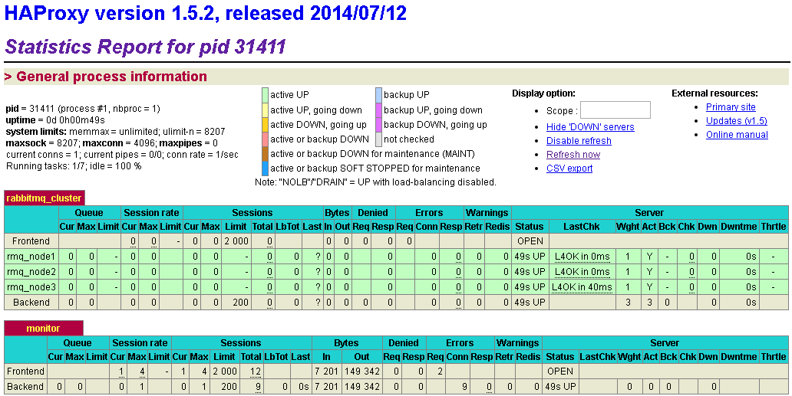

# 集群

试想一下，如果 RabbitMQ 服务器遇到内存崩溃 、 机器掉电或者主板故障等情况，该怎么办?单台 RabbitMQ 服务器可以满足每秒 1000 条消息 的吞吐量，那么如果应用需要 RabbitMQ 服务满足每秒 10 万条消息 的吞吐量呢?购买昂贵的服务器来增强单机RabbitMQ 服务的性能显得捉襟见肘 ， 搭建一个 RabbitMQ 集群才是解决实际问题的关键。

RabbitMQ 集群允许消费者和生产者在 RabbitMQ 单个节点崩惯的情况下继续运行 ， 它可以通过添加更多的节点来线性地扩展消息通信的吞吐量。当失去一个 RabbitMQ 节点时 ， 客户端能够重新连接到集群中的任何其他节点并继续生产或者消费。

不过 RabbitMQ 集群不能保证消息的万无一失 ， 即将消息 、 队列 、 交换器等都设置为可持久化 ， 生产端和消费端都正确地使用了确认方式。当集群中一个 RabbitMQ 节点崩溃时，该节点上的所有队列中的消息也会丢失。 

RabbitMQ集群中 的所有节点都会备份所有的元数据信息，包括以下内容：

1. 队列元数据 : 队列的名称及属性(是否可持久化，是否自动删除？) ;

2. 交换器:交换器的名称及属性(可持久化等) :

3. 绑定关系元数据 : 交换器与队列或者交换器与交换器之间 的绑定关系 ;

4. vhost 元数据:为 vhost 内的队列、交换器和绑定提供命名空间及安全属性。

## 集群中的队列

但是**不会备份消息**(通过**镜像队列**可以解决这个问题)。基于存储空间和性能的考虑 ， 在 RabbitMQ 集群中创建队列，集群只会在单个节点而不是在所有节点上创建队列的进程井包含完整的队列信息(元数据 、状态、内容)。这样只有队列的宿主节点 ， 即所有者节点知道队列的所有信息 ， 所有其他非所有者节点只知道队列的元数据和指向该队列存在的那个节点的指针。因此当集群节点崩溃时，该节点的队列进程和关联的绑定都会消失。附加在那些队列上的消费者也会丢失其所订阅的信息 ， 井且任何匹配该队列绑定信息的新消息也都会消失。 


为什么不将队列内容和状态复制到所有节点？

1. 存储空间。
2. 性能。


## 分布交换机

不同于队列那样拥有自己的进程，交换器其实只是一个名称和绑定列表。当消息发布到交换器时，实际上是由所连接的信道将消息上的路由键同交换器的绑定列表进行比较，然后再路由消息。当创建一个新交换器时，RabbitMQ所要做的就是将绑定列表添加到集群中的所有节点上。这样，每个节点上的每条信道都可以访问到新的交换器了。 

注意：理解rabbitmq 背后的消息路由工作机制的方法是把每个队列想象成节点上运行的进程，每个进程拥有自己的进程ID(PID)。**交换器不过是路由模式列表和匹配消息应发往的队列进程ID的列表。**当发布的消息匹配了交换器中的绑定规则时，实际上是由信道完成了匹配工作，并在匹配之后建立到队列PID的连接，然后将消息传送过去。队列的进程ID本质上是在集群中的erlang地址。

由于交换器只不过是一张查询表，而非实际上的消息路由器，因此将交换器在整个集群中进行复制会更加简单。举例来说，当创建一个新的交换器时，rabbitmq所要做的是将查询表添加到集群中的所有节点上。这时，每个节点上的每条信道都可以访问新的交换器了。因此，相对于默认情况下队列的完整信息存储于集群中的单一节点来说，集群中的每个节点拥有每个交换器的信息。就可用性来说，这非常棒，因为这意味着你不用担心在节点故障时重新声明交换器。只需要让故障的节点上的生产者重新连接到集群上，它们就能立即开始往交换器上发布消息了。


AMQP的 basic.publish 命令不会返回消息的状态。这意味着当前信道节点崩溃时信道仍然可能在路由消息，而生产者已经继续创建下一条消息了。在这种情况下，你将承受丢失消息的风险。解决的方法是使用 AMQP 事务，在消息路由到队列之前它会一直阻塞；或者使用发送方确认模式来记录连接中断时尚未被确认的消息。


## 节点类型

在使用 rabbitrnqctl cluster status 命令来查看集群状态时会有 {nodes ， [{disc ,[rabbit@nodel , rabbit@node2 , rabbit@node3] l ] 这 一项信息，其中的 disc 标注了RabbitMQ 节点的类型。 RabbitMQ 中的每一个节点 ，不管是单一节点系统或者是集群中的一部分 ，要么是内存节点，要么是磁盘节点。 内存节点将所有的队列、 交换器、绑定关系、用户、权限和 vhost的元数据定义都存储在内存中，而磁盘节点则将这些信息存储到磁盘中。单节点的集群中必然只有磁盘类型的节点，否则当重启 RabbitMQ 之后，所有关于系统的配置信息都会丢失。不过在集群中，可以选择配置部分节点为内存节点，这样可以获得更高的性能。 

在集群中创建队列、交换器或者绑定关系的时候，这些操作直到所有集群节点都成功提交元数据变更后才会返回。对内存节点来说，这意味着将变更写入内存;而对于磁盘节点来说，这意味着昂贵的磁盘写入操作。内存节点可以提供出色的性能，磁盘节点能够保证集群配置信息的高可靠性，如何在这两者之间进行抉择呢?

RabbitMQ 只要求在集群中至少有一个磁盘节点，所有其他节点可以是内存节点。当节点加入或者离开集群时，它们必须将变更通知到至少一个磁盘节点。如果只有一个磁盘节点，而且不凑巧的是它刚好崩溃了，那么集群可以继续发送或者接收消息，但是不能执行创建队列、交 换器、绑定关系、用户，以及更改权限、添加或删除集群节点的操作了。也就是说，如果集群中唯一的磁盘节点崩溃，集群仍然可以保持运行 ， 但是直到将该节点恢复到集群前，你无法更改任何东西。所以在建立集群的时候应该保证有两个或者多个磁盘节点的存在。在内存节点重启后，它们会连接到预先配置的磁盘节点，下载当前集群元数据的副本。当在集群中添加内存节点时，确保告知其所有的磁盘节点(内存节点唯一存储到磁盘的元数据信息是集群中磁盘节点的地址)。只要内存节点可以找到至少一个磁盘节点，那么它就能在重启后重新加入集群中。除非使用的是 RabbitMQ 的 RPC 功能，否则创建队列、交换器及绑定关系的操作确是甚少，大多数的操作就是生产或者消费消息。

为了确保集群信息的可靠性，或者在不确定使用磁盘节点或者内存节点的时候，建议全部使用磁盘节点。 


# 网络分区

RabbitMQ集群并不能很好的“忍受”网络分区。如果你想将RabbitMQ集群建立在广域网上，记住那是行不通的，除非你使用federation或者shovel等插件。

然而有时候会有一些意想不到的事情发生。本文主要讲述了RabbitMQ集群如何检测网络分区，发生网络分区带来的影响以及如何恢复。

RabbitMQ会将queues, exchanges, bindings等信息存储在Erlang的分布式数据库——Mnesia中，许多围绕网络分区的一些细节都和这个Mnesia的行为有关。

为什么RabbitMQ需要这种前提假设？这个它本身的数据一致性复制原理有关。RabbitMQ采用的镜像队列是一种环形的逻辑结构，如下图：


RabbitMQ除了发布（Publish）消息之外，所有的其余操作都是在master上完成，之后再将有影响的操作同步到slave节点上。如果客户端连接的是slave节点，RabbitMQ机制也会先将链接路由到master节点上。比如确认（Ack）一条消息，先在A节点上，即master节点上确认，之后再转向B节点，进而是C和D节点，最后再D返回Ack之后才真正将这条消息确认，进而标记为可删除。这个种复制原理和zookeeper的quorum原理不同，它可以**保证更强的数据一致性**。在这种一致性模型下，**如果出现网络波动或者网络延迟等，那么整个复制链的可用性就会下降**。就以上图为例，如果C节点网络异常，那么整个A->B->C->D->A的循环复制过程就会大受影响，整个RabbitMQ服务性能将大打折扣，**所以这里就需要引入网络分区来将异常的节点排离出整个分区之外，以确保整个RabbitMQ的性能。待网络情况转好之后再将此节点加入集群之中。**


## 网络分区的判定

RabbitMQ中与网络分区的判定相关的是net_ticktime这个参数，默认为60s。在RabbitMQ集群中的每个broker节点会每隔 net_ticktime/4 (默认15s)计一次tick（如果有任何数据被写入节点中，此节点被认为被ticked），如果在连续四次某节点都没有被ticked到，则判定此节点处于down的状态，其余节点可以将此节点剥离出当前分区。将连续四次的tick时间即为T，那么T的取值范围为 0.75ticktime < T < 1.25ticktime。下图可以形象的描述出这个取值范围的原因。（每个节点代表一次tick判定的timestamp,在两个临界值的情况下会有4个tick的判定）


默认情况下，在45s<T<75s之间会判定出网络分区。

RabbitMQ会将queues，exchanges，bindings等信息存储在Erlang的分布式数据库——Mnesia中，许多围绕网络分区的一些细节都和这个Mnesia的行为有关。如果一个节点不能在T时间内连上另一个节点（这里的连上特指broker节点之间的内部通信），那么Mnesia通常认为这个节点已经down了，就算之后两个节点又重新恢复内部通信，但是这两个节点都会认为对方已经down，Mnesia此时认定发生了网络分区的情况。这些会被记录到RabbitMQ的服务日志（默认在$RABBITMQ_HOME/var/log/rabbitmq/目录下）之中，如下所示：
```
=ERROR REPORT==== 16-Jul-2017::15:20:55 ===
Mnesia('rabbit@node1'): ** ERROR ** mnesia_event got {inconsistent_database, running_partitioned_network, 'rabbit@node2'}
```

当一个节点起来的时候，RabbitMQ会记录是否发生了网络分区，你可以通过WebUI进行查看；或者可以通过rabbitmqctl cluster_status命令查看，如果查看到信息中的partitions那一项是空的，就想这样：
```
[{nodes,[{disc,['rabbit@node1', 'rabbit@node2']}]},
 {running_nodes,['rabbit@node2','rabbit@node1']},
 {cluster_name,<<"rabbit@node1">>},
 {partitions,[]}]
```
然而当网络分区时，会变成这样：
```
[{nodes,  [{disc,  ['rabbit@node1','rabbit@node2']}]},
 {running_nodes,['rabbit@node1']},
 {cluster_name,<<"rabbit@node1">>},
 {partitions,  [{'rabbit@node1',['rabbit@node2']}]}]
```

当一个RabbitMQ集群发生网络分区时，这个集群会分成两个或者多个分区，它们各自为政，互相都认为对方分区的节点已经down,包括queues，bindings,exchanges这些信息的创建和销毁都处于自身分区内，与其它分区无关。如果原集群中配置了镜像队列，而这个镜像队列又牵涉到两个或者多个网络分区中的节点时，每一个网络分区中都会出现一个master节点，如果分区节点个数充足，也会出现新的slave节点，对于各个网络分区，彼此的队列都是相互独立的，当然也会有一些其他未知的、怪异的事情发生。当网络恢复时，网络分区的状态还是会保持，除非采取一些措施去解决他。

## 手动处理网络分区

为了从网络分区中恢复，首先需要挑选一个信任的分区，这个分区才有决定Mnesia内容的权限，发生在其他分区的改变将不被记录到Mnesia中而直接丢弃。手动恢复网络分区有两种思路：

1. 首先需要挑选一个信任的分区，停止其他分区中的节点，然后重新启动这些节点，之后重新将这些节点加入到当前信任的分区之中。最后重启信任分区中的节点，以去除告警。
2. 关闭整个集群的节点，然后再启动每一个节点，这里需确保你启动的第一个节点在你所信任的分区之中。停止/启动节点有两种操作方式：
    rabbimqctl stop/ rabbitmq-server -detached
    rabbitmqctl stop_app/ rabbitmqctl start_app


## 自动处理网络分区

RabbitMQ提供了4种处理网络分区的方式，在rabbitmq.config中配置cluster_partition_handling参数，分别为：

1. ignore  **默认配置，当网络分区的时候，RabbitMQ不会自动做任何处理，即需要手动处理。**
2. pause_minority **暂停少数**，当发生网络分区时，集群中的节点在观察到某些节点“丢失”时，会自动检测其自身是否处于少数派（小于或者等于集群中一半的节点数），RabbitMQ会自动关闭这些节点的运作。根据CAP原理来说，这里保障了P，即分区容错性（partition tolerance）。这样确保了在发生网络分区的情况下，大多数节点（当然这些节点在同一个分区中）可以继续运行。“少数派”中的节点在分区发生时会关闭，当分区结束时又会启动。
3. pause_if_all_down, [nodes], ignore|autoheal
4. autoheal

### 1.ignore

默认是ignore，如果不配置rabbitmq.config或者按如下配置：

     [
            {
                    rabbit, [
                            {cluster_partition_handling, ignore}
                    ]
            }
     ]

ignore的配置是当网络分区的时候，RabbitMQ不会自动做任何处理，即需要手动处理。

### 2.pause_minority

在rabbitmq.config配置文件中配置：

     [
            {
                    rabbit, [
                            {cluster_partition_handling, pause_minority}
                    ]
            }
     ]

当发生网络分区时，集群中的节点在观察到某些节点down掉时，会自动检测其自身是否处于少数派（小于或者等于集群中一般的节点数）。少数派中的节点在分区发生时会自动关闭，当分区结束时又会启动。这里的关闭是指RabbitMQ application关闭，而Erlang VM并不关闭，这个类似于执行了rabbitmqctl stop_app命令。处于关闭的节点会每秒检测一次是否可连通到剩余集群中，如果可以则启动自身的应用，相当于执行rabbitmqctl start_app命令。

需要注意的是RabbitMQ也会关闭不是严格意义上的大多数。比如在一个集群中只有两个节点的时候并不适合采用pause-minority模式，因为由于其中任何一个节点失败而发生网络分区时，两个节点都会被关闭。当网络恢复时，有可能两个节点会自动启动恢复网络分区，也有可能还是保持关闭状态。然而如果集群中的节点远大于两个时，pause_minority模式比ignore模式更加的可靠，特别是网络分区通常是由于单个节点网络故障而脱离原有分区引起的。不过也需要考虑2v2, 3v3这种情况，可能会引起所有集群节点的关闭。这种处理方式适合集群节点数大于2个且最好为奇数的情况。

### 3.pause_if_all_down

在pause_if_all_down模式下，RabbitMQ会自动关闭不能和list中节点通信的节点。语法为{pause_if_all_down, [nodes], ignore|autoheal}，其中[nodes]即为前面所说的list。如果一个节点与list中的所有节点都无法通信时，自关闭其自身。如果list中的所有节点都down时，其余节点如果是ok的话，也会根据这个规则去关闭其自身，此时集群中所有的节点会关闭。如果某节点能够与list中的节点恢复通信，那么会启动其自身的RabbitMQ应用，慢慢的集群可以恢复。

有两种配置如下：

     [
            {
                    rabbit, [
                            {cluster_partition_handling, {pause_if_all_down,  ['rabbit@node1'], ignore}}
                    ]
            }
     ].

和：

     [
            {
                    rabbit, [
                            {cluster_partition_handling, {pause_if_all_down,  ['rabbit@node1'], autoheal}}
                    ]
            }
     ].

为什么这里会有ignore和autoheal两种不同的配置，考虑这样一种情况：有两个节点node1和node2在机架A上，node3和node4在机架B上，此时机架A和机架B的通信出现异常，如果此时使用pause-minority的话会关闭所有的节点，如果此时采用pause-if-all-down，list中配置成[‘node1’, ‘node3’]的话，集群中的4个节点都不会关闭，但是会形成两个分区，此时就需要ignore或者autoheal来指引如何处理此种分区的情形。

### 4.autoheal

在autoheal模式下，当认为发生网络分区时，RabbitMQ会自动决定一个获胜的（winning）分区，然后重启不在这个分区中的节点以恢复网络分区。一个获胜的分区是指客户端连接最多的一个分区。如果产生一个平局，既有两个或者多个分区的客户端连接数一样多，那么节点数最多的一个分区就是获胜的分区。如果此时节点数也一样多，将会以一种特殊的方式来挑选获胜分区。

配置示例如下：

     [
            {
                    rabbit, [
                            {cluster_partition_handling, autoheal}
                    ]
            }
     ].

上面所说的特殊的方式其实是和参数的输入有关，查看相关代码(（autoheal的源码地址：https://github.com/rabbitmq/rabbitmq-server/blob/master/src/rabbit_autoheal.erl）)：
首先是计算连接数（Connections）,从代码看lists:sort是从小到大排列，然后做一个reverse，这样就从大到小排列。二级排序是根据分区中的节点个数排序，即{_,P}<-Sorted。之后如果连接数和分区中节点的个数都相等，那么应该就看参数输入的顺序了，顺序在前则为winning partition。

# 负载均衡

面对大量业务访问、高并发请求可以使用高性能的服务器来提升RabbitMQ服务的负载能力。当单机容量达到极限时，我们可以采取集群的策略来对负载能力做进一步的提升，但是这里还存在一个负载不均衡的问题。试想如果一个集群中有3个节点，那么所有的客户端都与其中的单个节点node1建立TCP连接，那么node1的网络负载必然会大大增加而显得难以承受，其他节点又由于没有那么多的负载而造成硬件资源的浪费，所以负载均衡显得尤为重要。

负载均衡（Load balance）是一种计算机网络技术，用于在多个计算机（计算机集群）、网络连接、CPU、磁盘驱动器或其他资源中分配负载，以达到最佳资源使用、最大化吞吐率、最小响应时间以及避免过载的目的。使用带有负载均衡的多个服务器组件，取代单一的组件，可以通过冗余提高可靠性。负载均衡通常分为软件负载均衡和硬件负载均衡两种。

软件负载均衡是指在一个或者多个交互的网络系统中的多台放服务器上安装一个或多个相应的负载均衡软件来实现一种均衡负载技术。软件可以很方便的安装在服务器上，并且实现一定的均衡负载功能。软件负载均衡技术配置简单、操作也仿版，最重要的是成本很低。

硬件负载均衡是指在多台服务器间安装相应的负载均衡设备，也就是负载均衡器（如F5）来完成均衡负载技术，与软件负载均衡技术相比，能达到更好的负载均衡效果。由于硬件负载均衡技术需要额外的增加负载均衡器，成本比较高，所以适用于流量高的大型网站系统。

这里主要讨论的是如何有效的对RabbitMQ集群使用软件负载均衡技术，目前主流的方式有在客户端内部实现负载均衡，或者使用HAProxy、LVS等负载均衡软件来实现。

## 客户端内部实现负载均衡

对于RabbitMQ而言可以在客户端连接时简单的使用负载均衡算法来实现负载均衡。负载均衡算法有很多种，主流的有：

### 轮询法

将请求按顺序轮流地分配到后端服务器上，它均衡地对待后端的每一台服务器，而不关系服务器实际的连接数和当前的系统负载。
示例如代码清单所示，如果多个客户端需要连接到这个有3个节点的RabbitMQ集群，可以调用RoundRobin.getConnectionAddress()来获取相应的连接地址。

```java
public class RoundRobin {
    private static List<String> list = new ArrayList<String>(){{
        add("192.168.0.2");
        add("192.168.0.3");
        add("192.168.0.4");
    }};
    private static int pos = 0;
    private static final Object lock = new Object();
    public static String getConnectionAddress(){
        String ip = null;
        synchronized (lock) {
            ip = list.get(pos);
            if (++pos >= list.size()) {
                pos = 0;
            }
        }
        return ip;
    }
}
```

### 随机法

通过随机算法，根据后端服务器的列表大小值来随机选取其中的一台服务器进行访问。由概率统计理论可以得知，随着客户端调用服务端的次数增多，其实际效果越来越接近于平均分配调用量到后端的每一台服务器，也就是轮询的结果。对应的示例代码如下：

```java
public class RandomAccess {
    private static List<String> list = new ArrayList<String>(){{
        add("192.168.0.2");
        add("192.168.0.3");
        add("192.168.0.4");
    }};
    public static String getConnectionAddress(){
        Random random = new Random();
        int pos = random.nextInt(list.size());
        return list.get(pos);
    }
}
```

### 源地址哈希法

源地址哈希的思想是根据获取的客户端IP地址，通过哈希函数计算得到的一个数值，用该数值对服务器列表的大小进行取模运算，得到的结果便是客户端要访问服务器的序号。采用源地址哈希法进行负载均衡，同一IP地址的客户端，当后端服务器列表不变时，它每次都会映射到同一台后端服务器进行访问。

```java
public class IpHash {
    private static List<String> list = new ArrayList<String>(){{
        add("192.168.0.2"); add("192.168.0.3"); add("192.168.0.4");
    }};
    public static String getConnectionAddress() throws UnknownHostException {
        int ipHashCode = InetAddress.getLocalHost().getHostAddress().hashCode();
        int pos = ipHashCode % list.size();
        return list.get(pos);
    }
}
```

### 加权轮询法

不同的后端服务器可能机器的配置和当前系统的负载并不相同，因此它们的抗压能力也不相同。给配置高、负载低的机器配置更高的权重，让其处理更多的请求；而配置低、负载高的集群，给其分配较低的权重，降低其系统负载，加权轮询能很好地处理这一问题，并将请求顺序且按照权重分配到后端。

### 加权随机法

与加权轮询法一样，加权随机法也根据后端机器的配置、系统的负载分配不同权重。不同的是，它是按照权重随机请求后端服务器，而非顺序。

### 最小连接数法

最小连接数算法比较灵活和智能，由于后端服务器的配置不尽相同，对于请求的处理有块有慢，它是根据后端服务器当前的连接情况，动态地选取其中当前积压连接数最少的一台服务器来处理当前的请求，尽可能地提高后端服务的利用效率，将负载合理地分流到每一台服务器。

有关于加权轮询法、加权随机法和最小连接数法的实现也比较简单，这里就留给读者自己动手实践一下。

## HAProxy

HAProxy提供高可用性、负载均衡以及基于TCP和HTTP应用的代理，支持虚拟主机，它是免费、快速并且可靠的一种解决方案,包括Twitter，Reddit，StackOverflow，GitHub在内的多家知名互联网公司在使用。HAProxy实现了一种事件驱动、单一进程模型，此模型支持非常大的并发连接数。

### 安装HAProxy

首先需要去HAProxy的官网下载HAProxy的安装文件，目前最新的版本为：haproxy-1.7.8.tar.gz。下载地址为http://www.haproxy.org/#down，相关文档地址为http://www.haproxy.org/#doc1.7。

将haproxy-1.7.8.tar.gz拷贝至/opt目录下，与RabbitMQ存放在同一个目录中。之后解压缩：
```shell
[root@node1 opt]# tar zxvf haproxy-1.7.8.tar.gz
```
将源码解压之后，需要运行make来将HAProxy编译为可执行程序。在执行make之前需要先选择目标平台，通常对于UNIX系的操作系统可以选择TARGET=generic。下面是详细操作：
```shell
[root@node1 opt]# cd haproxy-1.7.8
[root@node1 haproxy-1.7.8]# make TARGET=generic
gcc -Iinclude -Iebtree -Wall  -O2 -g -fno-strict-aliasing -Wdeclaration-after-statement -fwrapv   
-DTPROXY -DENABLE_POLL  
-DCONFIG_HAPROXY_VERSION=\"1.7.8\" 
-DCONFIG_HAPROXY_DATE=\"2017/07/07\" \
	      -DBUILD_TARGET='"generic"' \
	      -DBUILD_ARCH='""' \
	      -DBUILD_CPU='"generic"' \
	      -DBUILD_CC='"gcc"' \
	      -DBUILD_CFLAGS='"-O2 -g -fno-strict-aliasing -Wdeclaration-after-statement -fwrapv"' \
	      -DBUILD_OPTIONS='""' \
	       -c -o src/haproxy.o src/haproxy.c
gcc -Iinclude -Iebtree -Wall  -O2 -g -fno-strict-aliasing -Wdeclaration-after-statement -fwrapv...
...
gcc  -g -o haproxy src/haproxy.o src/base64.o src/protocol.o src/uri_auth.o ...
```
编译完目录下有名为“haproxy”的可执行文件。之后再/etc/profile中加入haproxy的路径，内容如下：

```
export PATH=$PATH:/opt/haproxy-1.7.8/haproxy
```

最后执行source /etc/profile让此环境变量生效。

### 配置HAProxy

HAProxy使用单一配置文件来定义所有属性，包括从前端IP到后端服务器。下面展示了用于3个RabbitMQ节点组成集群的负载均衡配置。这3个节点的IP地址分别为192.168.02、192.168.0.3、192.168.0.4，HAProxy运行在192.168.0.9这台机器上。

```
#全局配置
global
        #日志输出配置，所有日志都记录在本机，通过local0输出
        log 127.0.0.1 local0 info
        #最大连接数
        maxconn 4096
        #改变当前的工作目录
        chroot /opt/haproxy-1.7.8
        #以指定的UID运行haproxy进程
        uid 99
        #以指定的GID运行haproxy进程
        gid 99
        #以守护进程方式运行haproxy #debug #quiet
        daemon
        #debug
        #当前进程pid文件
        pidfile /opt/haproxy-1.7.8/haproxy.pid

#默认配置
defaults
        #应用全局的日志配置
        log global
        #默认的模式mode{tcp|http|health}
        #tcp是4层，http是7层，health只返回OK
        mode tcp
        #日志类别tcplog
        option tcplog
        #不记录健康检查日志信息
        option dontlognull
        #3次失败则认为服务不可用
        retries 3
        #每个进程可用的最大连接数
        maxconn 2000
        #连接超时
        timeout connect 5s
        #客户端超时
        timeout client 120s
        #服务端超时
        timeout server 120s

#绑定配置
listen rabbitmq_cluster 5671
        #配置TCP模式
        mode tcp
        #简单的轮询
        balance roundrobin
        #RabbitMQ集群节点配置
        server rmq_node1 192.168.0.2:5672 check inter 5000 rise 2 fall 3 weight 1
        server rmq_node2 192.168.0.3:5672 check inter 5000 rise 2 fall 3 weight 1
        server rmq_node3 192.168.0.4:5672 check inter 5000 rise 2 fall 3 weight 1

#haproxy监控页面地址
listen monitor :8100
        mode http
        option httplog
        stats enable
        stats uri /stats
        stats refresh 5s
```

在上面的配置中“listen rabbitmq_cluster bind 192.168.0.9.5671”这里定义了客户端连接IP地址和端口号。这里配置的负载均衡算法是roundrobin，注意这里的roundrobin是加权轮询。和RabbitMQ最相关的是“ server rmq_node1 192.168.0.2:5672 check inter 5000 rise 2 fall 3 weight 1”这种，它定义了RabbitMQ服务，每个RabbitMQ服务定义指令包含6个部分：
```
server <name>：定义RabbitMQ服务的内部标示，注意这里的“rmq_node”是指包含有含义的字符串名称，不是指RabbitMQ的节点名称。
<ip>:<port>：定义RabbitMQ服务的连接的IP地址和端口号。
check inter <value>：定义了每隔多少毫秒检查RabbitMQ服务是否可用。
rise <value>：定义了RabbitMQ服务在发生故障之后，需要多少次健康检查才能被再次确认可用。
fall <value>：定义需要经历多少次失败的健康检查之后，HAProxy才会停止使用此RabbitMQ服务。
weight <value>：定义了当前RabbitMQ服务的权重。
```

最后一段配置定义的是HAProxy的数据统计页面。数据统计页面包含各个服务节点的状态、连接、负载等信息。在调用：

```shell
[root@node1 haproxy-1.7.8]# haproxy -f haproxy.cfg
```

运行HAProxy之后可以在浏览器上输入http://192.168.0.9:8100/stats来加载相关的页面，如下图所示：




## Keepalived+HAProxy实现高可用的负载均衡

试想下如果前面配置的HAProxy主机192.168.0.9突然宕机或者网卡失效，那么虽然RabbitMQ集群没有任何故障，但是对于外界的客户端来说所有的连接都会被断开，结果将是灾难性的。**确保负载均衡服务的可靠性**同样显得十分的重要。这里就引入Keepalived工具，**它能够通过自身健康检查、资源接管功能做高可用（双机热备），实现故障转移。**

Keepalived采用VRRP（Virtual Router Redundancy Protocol，虚拟路由冗余协议），以软件的形式实现服务器热备功能。通常情况下是将两台Linux服务器组成一个热备组（Master和Backup），同一时间热备组内只有一台主服务器Master提供服务，同时Master会虚拟出一个**公用的虚拟IP地址**，简称VIP。这个VIP只存在在Master上并对外提供服务。如果Keepalived检测到Master宕机或者服务故障，备份服务器Backup会自动接管VIP称为Master，Keepalived并将原Master从热备组中移除。当原Master恢复后，会自动加入到热备组，默认再抢占称为Master，起到故障转移的功能。

Keepalived工作在OSI模型中的第3层、第4层和第7层。
工作在第3层是指Keepalived会定期向热备组中的服务器发送一个ICMP数据包来判断某台服务器是否故障，如果故障则将这台服务器从热备组移除。
工作在第4层是指Keepalived以TCP端口的状态判断服务器是否故障，比如检测RabbitMQ的5672端口，如果故障则将这台服务器从热备组中移除。
工作在第7层是指Keepalived根据用户设定的策略（通常是一个自定义的检测脚本）判断服务器上的程序是否正常运行，如果故障将这台服务器从热备组移除。

### Keepalived的安装

首先需要去Keepalived的官网下载Keepalived的安装文件，目前最新的版本为：keepalived-1.3.5.tar.gz，下载地址为http://www.keepalived.org/download.html。将keepalived-1.3.5.tar.gz解压并安装，详细步骤如下：
```shell
[root@node1 ~]# tar zxvf keepalived-1.3.5.tar.gz 
[root@node1 ~]# cd keepalived-1.3.5
[root@node1 keepalived-1.3.5]# ./configure --prefix=/opt/keepalived --with-init=SYSV 
#注：(upstart|systemd|SYSV|SUSE|openrc) #根据你的系统选择对应的启动方式
[root@node1 keepalived-1.3.5]# make
[root@node1 keepalived-1.3.5]# make install
```
之后将安装过后的Keepalived加入系统服务中，详细步骤如下（注意千万不要输错命令）：
```shell
#复制启动脚本到/etc/init.d/下
[root@node1 ~]# cp /opt/keepalived/etc/rc.d/init.d/keepalived /etc/init.d/	
[root@node1 ~]# cp /opt/keepalived/etc/sysconfig/keepalived /etc/sysconfig
[root@node1 ~]# cp /opt/keepalived/sbin/keepalived /usr/sbin/
[root@node1 ~]# chmod +x /etc/init.d/keepalived 
[root@node1 ~]# chkconfig --add keepalived
[root@node1 ~]# chkconfig keepalived on
#Keepalived默认会读取/etc/keepalived/keepalived.conf配置文件
[root@node1 ~]# mkdir /etc/keepalived
[root@node1 ~]# cp /opt/keepalived/etc/keepalived/keepalived.conf /etc/keepalived/ 
```
执行完之后就可以使用如下：

    service keepalived restart
    service keepalived start
    service keepalived stop
    service keepalived status

这4个命令来重启、启动、关闭和查看keepalived状态。

### 配置

在安装的时候我们已经创建了/etc/keepalived目录，并将keepalived.conf配置文件拷贝到此目录下，如此Keepalived便可以读取这个默认的配置文件了。如果要将Keepalived与前面的HAProxy服务结合起来需要更改/etc/keepalived/keepalived.conf这个配置文件，在此之前先来看看本次配置需要完成的详情及目标。


如图所示，两台Keepalived服务器之间通过VRRP进行交互，对外部虚拟出一个VIP为192.168.0.10。Keepalived与HAProxy部署在同一台机器上，两个Keepalived服务实例匹配两个HAProxy服务实例，这样通过Keeaplived实现HAProxy的双机热备。所以在上一小节的192.168.0.9的基础之上，还要再部署一台HAProxy服务，IP地址为192.168.0.8。整条调用链路为：客户端通过VIP建立通信链路；通信链路通过Keeaplived的Master节点路由到对应的HAProxy之上；HAProxy通过负载均衡算法将负载分发到集群中的各个节点之上。正常情况下客户端的连接通过图中左侧部分进行负载分发。当Keepalived的Master节点挂掉或者HAProxy挂掉无法恢复，那么Backup提升为Master，客户端的连接通过图中右侧部分进行负载分发。如果你追求要更高的可靠性，可以加入多个Backup角色的Keepalived节点来实现一主多从的多机热备。当然这样会提升硬件资源的成本，该如何抉择需要更细致的考恒，一般情况下双机热备的配备已足够满足应用需求。

接下来我们要修改/etc/keepalived/keepalived.conf文件，在Keepalived的Master上配置详情如下：

    #Keepalived配置文件
    global_defs {
            router_id NodeA                 #路由ID, 主备的ID不能相同
    }
    
    #自定义监控脚本
    vrrp_script chk_haproxy {
            script "/etc/keepalived/check_haproxy.sh"
            interval 5
            weight 2
    }
    
    vrrp_instance VI_1 {
            state MASTER #Keepalived的角色。Master表示主服务器，从服务器设置为BACKUP
            interface eth0          #指定监测网卡
            virtual_router_id 1
            priority 100            #优先级，BACKUP机器上的优先级要小于这个值
            advert_int 1            #设置主备之间的检查时间，单位为s
            authentication {        #定义验证类型和密码
                    auth_type PASS
                    auth_pass root123
            }
            track_script {
                    chk_haproxy
            }
            virtual_ipaddress {     #VIP地址，可以设置多个：
                    192.168.0.10
            }
    }

Backup中的配置大致和Master中的相同，不过需要修改global_defs{}的router_id，比如置为NodeB；其次要修改vrrp_instance VI_1{}中的state为BACKUP；最后要将priority设置为小于100的值。注意Master和Backup中的virtual_router_id要保持一致。下面简要的展示下Backup的配置：

    global_defs {
            router_id NodeB
    }
    vrrp_script chk_haproxy {
     ...
    }
    vrrp_instance VI_1 {
            state BACKUP
     ...
            priority 50
     ...
    }

为了防止HAProxy服务挂了，但是Keepalived却还在正常工作而没有切换到Backup上，所以这里需要编写一个脚本来检测HAProxy服务的状态。当HAProxy服务挂掉之后该脚本会自动重启HAProxy的服务，如果不成功则关闭Keepalived服务，如此便可以切换到Backup继续工作。这个脚本就对应了上面配置中vrrp_script chk_haproxy{}的script对应的值，/etc/keepalived/check_haproxy.sh的内容如代码清单所示。


    #!/bin/bash
    if [ $(ps -C haproxy --no-header | wc -l) -eq 0 ];then
            haproxy -f /opt/haproxy-1.7.8/haproxy.cfg
    fi
    sleep 2
    if [ $(ps -C haproxy --no-header | wc -l) -eq 0 ];then
            service keepalived stop
    fi

如此配置好之后，使用service keepalived start命令启动192.168.0.8和192.168.0.9中的Keepalived服务即可。之后客户端的应用可以通过192.168.0.10这个IP地址来接通RabbitMQ服务。

    ##查看Keepalived的运行情况
    可以通过tail -f /var/log/messages -n 200命令查看相应的Keepalived日志输出。Master启动日志如下：
    
    Oct 4 23:01:51 node1 Keepalived[30553]: Starting Keepalived v1.3.5 (03/19,2017), git commit v1.3.5-6-g6fa32f2
    Oct 4 23:01:51 node1 Keepalived[30553]: Unable to resolve default script username 'keepalived_script' - ignoring
    Oct 4 23:01:51 node1 Keepalived[30553]: Opening file '/etc/keepalived/keepalived.conf'.
    Oct 4 23:01:51 node1 Keepalived[30554]: Starting Healthcheck child process, pid=30555
    Oct 4 23:01:51 node1 Keepalived[30554]: Starting VRRP child process, pid=30556
    Oct 4 23:01:51 node1 Keepalived_healthcheckers[30555]: Opening file '/etc/keepalived/keepalived.conf'.
    Oct 4 23:01:51 node1 Keepalived_vrrp[30556]: Registering Kernel netlink reflector
    Oct 4 23:01:51 node1 Keepalived_vrrp[30556]: Registering Kernel netlink command channel
    Oct 4 23:01:51 node1 Keepalived_vrrp[30556]: Registering gratuitous ARP shared channel
    Oct 4 23:01:51 node1 Keepalived_vrrp[30556]: Opening file '/etc/keepalived/keepalived.conf'.
    Oct 4 23:01:51 node1 Keepalived_vrrp[30556]: VRRP_Instance(VI_1) removing protocol VIPs.
    Oct 4 23:01:51 node1 Keepalived_vrrp[30556]: SECURITY VIOLATION - scripts are being executed but script_security not enabled.
    Oct 4 23:01:51 node1 Keepalived_vrrp[30556]: Using LinkWatch kernel netlink reflector...
    Oct 4 23:01:51 node1 Keepalived_vrrp[30556]: VRRP sockpool: [ifindex(2), proto(112), unicast(0), fd(10,11)]
    Oct 4 23:01:51 node1 Keepalived_vrrp[30556]: VRRP_Instance(VI_1) Transition to MASTER STATE
    Oct 4 23:01:52 node1 Keepalived_vrrp[30556]: VRRP_Instance(VI_1) Entering MASTER STATE
    Oct 4 23:01:52 node1 Keepalived_vrrp[30556]: VRRP_Instance(VI_1) setting protocol VIPs.

Master启动之后可以通过ip add show命令查看添加的VIP（加粗部分，Backup节点是没有VIP的）：

    [root@node1 ~]# ip add show
    1: lo: <LOOPBACK,UP,LOWER_UP> mtu 65536 qdisc noqueue state UNKNOWN 
        link/loopback 00:00:00:00:00:00 brd 00:00:00:00:00:00
        inet 127.0.0.1/8 scope host lo
        inet6 ::1/128 scope host 
           valid_lft forever preferred_lft forever
    2: eth0: <BROADCAST,MULTICAST,UP,LOWER_UP> mtu 1450 qdisc pfifo_fast state UP qlen 1000
        link/ether fa:16:3e:5e:7a:f7 brd ff:ff:ff:ff:ff:ff
        inet 192.168.0.8/18 brd xx.xx.255.255 scope global eth0
        inet 192.168.0.10/32 scope global eth0
        inet6 fe80::f816:3eff:fe5e:7af7/64 scope link 
           valid_lft forever preferred_lft forever

在Master节点执行 service keepalived stop模拟异常关闭的情况，观察Master的日志：

    Oct 4 22:58:32 node1 Keepalived[27609]: Stopping
    Oct 4 22:58:32 node1 Keepalived_vrrp[27611]: VRRP_Instance(VI_1) sent 0 priority
    Oct 4 22:58:32 node1 Keepalived_vrrp[27611]: VRRP_Instance(VI_1) removing protocol VIPs.
    Oct 4 22:58:32 node1 Keepalived_healthcheckers[27610]: Stopped
    Oct 4 22:58:33 node1 Keepalived_vrrp[27611]: Stopped
    Oct 4 22:58:33 node1 Keepalived[27609]: Stopped Keepalived v1.3.5 (03/19,2017), git commit v1.3.5-6-g6fa32f2
    Oct 4 22:58:34 node1 ntpd[1313]: Deleting interface #13 eth0, 192.168.0.10#123, interface stats: received=0, sent=0, dropped=0, active_time=532 secs
    Oct 4 22:58:34 node1 ntpd[1313]: peers refreshed

对应的Master上的VIP也会消失：

    [root@node1 ~]# ip add show
    1: lo: <LOOPBACK,UP,LOWER_UP> mtu 65536 qdisc noqueue state UNKNOWN 
        link/loopback 00:00:00:00:00:00 brd 00:00:00:00:00:00
        inet 127.0.0.1/8 scope host lo
        inet6 ::1/128 scope host 
           valid_lft forever preferred_lft forever
    2: eth0: <BROADCAST,MULTICAST,UP,LOWER_UP> mtu 1450 qdisc pfifo_fast state UP qlen 1000
        link/ether fa:16:3e:5e:7a:f7 brd ff:ff:ff:ff:ff:ff
        inet 192.168.0.8/18 brd xx.xx.255.255 scope global eth0
        inet6 fe80::f816:3eff:fe5e:7af7/64 scope link 
           valid_lft forever preferred_lft forever

Master关闭后，Backup会提升为新的Master，对应的日志为：

```log
Oct 4 22:58:15 node2 Keepalived_vrrp[2352]: VRRP_Instance(VI_1) Transition to MASTER STATE
Oct 4 22:58:16 node2 Keepalived_vrrp[2352]: VRRP_Instance(VI_1) Entering MASTER STATE
Oct 4 22:58:16 node2 Keepalived_vrrp[2352]: VRRP_Instance(VI_1) setting protocol VIPs.
```

可以看到新的Master节点上虚拟出了VIP如下所示：
```shell
[root@node2 ~]# ip add show
1: lo: <LOOPBACK,UP,LOWER_UP> mtu 65536 qdisc noqueue state UNKNOWN 
    link/loopback 00:00:00:00:00:00 brd 00:00:00:00:00:00
    inet 127.0.0.1/8 scope host lo
    inet6 ::1/128 scope host 
       valid_lft forever preferred_lft forever
2: eth0: <BROADCAST,MULTICAST,UP,LOWER_UP> mtu 1450 qdisc pfifo_fast state UP qlen 1000
    link/ether fa:16:3e:23:ac:ec brd ff:ff:ff:ff:ff:ff
    inet 192.168.0.9/18 brd xx.xx.255.255 scope global eth0
    inet 192.168.0.10/32 scope global eth0
    inet6 fe80::f816:3eff:fe23:acec/64 scope link 
       valid_lft forever preferred_lft forever
```