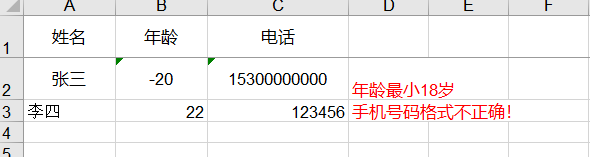

# easypoi使用文档

[官方文档地址](http://easypoi.mydoc.io)

 easypoi功能如同名字easy,主打的功能就是容易,让一个没见接触过poi的人员
就可以方便的写出Excel导出,Excel模板导出,Excel导入,Word模板导出,通过简单的注解和模板
语言(熟悉的表达式语法),完成以前复杂的写法

### 1.框架使用

##### 1.1 框架依赖

```xml
<easypoi.version>3.3.0</easypoi.version>

        <dependency>
            <groupId>cn.afterturn</groupId>
            <artifactId>easypoi-base</artifactId>
            <version>${easypoi.version}</version>
        </dependency>
        <dependency>
            <groupId>cn.afterturn</groupId>
            <artifactId>easypoi-web</artifactId>
            <version>${easypoi.version}</version>
        </dependency>
        <dependency>
            <groupId>cn.afterturn</groupId>
            <artifactId>easypoi-annotation</artifactId>
            <version>${easypoi.version}</version>
        </dependency>
```

##### 1.2 创建实体类

```java
/**
 * @description: 测试实体类
 * @author: lcm
 * @create: 2019-05-08 11:24
 **/
@NoArgsConstructor
@Data
public class TestEntity extends MyExcelModel {

    public TestEntity(String name, @Min(value = 18, message = "年龄最小18岁") @Max(value = 70, message = "年龄最大70岁") Integer age, @Pattern(regexp = RegexCheckUtils.MOBILE_NUM_REGEX, message = "手机号码格式不正确") String phone) {
        this.name = name;
        this.age = age;
        this.phone = phone;
    }

    @Excel(name = "姓名", orderNum = "0")
    private String name;

    @Excel(name = "年龄", orderNum = "1")
    @Min(value = 18, message = "年龄最小18岁")
    @Max(value = 70,message = "年龄最大70岁")
    private Integer age;

    @Excel(name = "电话", orderNum = "2")
    @Pattern(regexp = RegexCheckUtils.MOBILE_NUM_REGEX,message = "手机号码格式不正确！")
    @NotNull(message = "手机号码不可为空！")
    private String phone;

}
```

**实体类必须拥有空构造函数，否则excel导入时会报对象创建错误。**

##### 1.3 @Excel属性内容

| 属性           | 类型     | 默认值           | 功能                                                         |
| -------------- | -------- | ---------------- | ------------------------------------------------------------ |
| name           | String   | null             | 列名,支持name_id                                             |
| needMerge      | boolean  | fasle            | 是否需要纵向合并单元格(用于含有list中,单个的单元格,合并list创建的多个row) |
| orderNum       | String   | "0"              | 列的排序,支持name_id                                         |
| replace        | String[] | {}               | 值得替换  导出是{a_id,b_id} 导入反过来                       |
| savePath       | String   | "upload"         | 导入文件保存路径,如果是图片可以填写,默认是upload/className/ IconEntity这个类对应的就是upload/Icon/ |
| type           | int      | 1                | 导出类型 1 是文本 2 是图片,3 是函数,10 是数字 默认是文本     |
| width          | double   | 10               | 列宽                                                         |
| height         | double   | 10               | **列高,后期打算统一使用@ExcelTarget的height,这个会被废弃,注意** |
| isStatistics   | boolean  | fasle            | 自动统计数据,在追加一行统计,把所有数据都和输出  **这个处理会吞没异常,请注意这一点** |
| isHyperlink    | boolean  | false            | 超链接,如果是需要实现接口返回对象                            |
| isImportField  | boolean  | true             | 校验字段,看看这个字段是不是导入的Excel中有,如果没有说明是错误的Excel,读取失败,支持name_id |
| exportFormat   | String   | ""               | 导出的时间格式,以这个是否为空来判断是否需要格式化日期        |
| importFormat   | String   | ""               | 导入的时间格式,以这个是否为空来判断是否需要格式化日期        |
| format         | String   | ""               | 时间格式,相当于同时设置了exportFormat 和 importFormat        |
| databaseFormat | String   | "yyyyMMddHHmmss" | 导出时间设置,如果字段是Date类型则不需要设置 数据库如果是string 类型,这个需要设置这个数据库格式,用以转换时间格式输出 |
| numFormat      | String   | ""               | 数字格式化,参数是Pattern,使用的对象是DecimalFormat           |
| imageType      | int      | 1                | 导出类型 1 从file读取 2 是从数据库中读取 默认是文件 同样导入也是一样的 |
| suffix         | String   | ""               | 文字后缀,如% 90 变成90%                                      |
| isWrap         | boolean  | true             | 是否换行 即支持\n                                            |
| mergeRely      | int[]    | {}               | 合并单元格依赖关系,比如第二列合并是基于第一列 则{0}就可以了  |
| mergeVertical  | boolean  | fasle            | 纵向合并内容相同的单元格                                     |
| fixedIndex     | int      | -1               | 对应excel的列,忽略名字                                       |
| isColumnHidden | boolean  | false            | 导出隐藏列                                                   |

##### 1.4 导入导出公用工具类

```java
/**
 * @description: excel导入导出
 * @author: lcm
 * @create: 2019-05-08 11:27
 **/

public class ExcelUtil {

    public static void exportExcel(List<?> list, String title, String sheetName, Class<?> pojoClass, String fileName, boolean isCreateHeader, HttpServletResponse response){
        ExportParams exportParams = new ExportParams(title, sheetName);
        exportParams.setCreateHeadRows(isCreateHeader);
        defaultExport(list, pojoClass, fileName, response, exportParams);

    }

    /**
     * 导出excel无标题，sheetName和filename相同
     * @param list
     * @param name sheetName和filename
     * @param pojoClass 实体类类型
     * @param response
     */
    public static void exportExcel(List<?> list, String name, Class<?> pojoClass,HttpServletResponse response){
        defaultExport(list, pojoClass, name+ ExcelConstant.EXCEL_XLS, response, new ExportParams(null, name));
    }

    public static void exportExcel(List<?> list, String title, String sheetName, Class<?> pojoClass,String fileName, HttpServletResponse response){
        defaultExport(list, pojoClass, fileName, response, new ExportParams(title, sheetName));
    }
    public static void exportExcel(List<Map<String, Object>> list, String fileName, HttpServletResponse response){
        defaultExport(list, fileName, response);
    }

    private static void defaultExport(List<?> list, Class<?> pojoClass, String fileName, HttpServletResponse response, ExportParams exportParams) {
        Workbook workbook = ExcelExportUtil.exportExcel(exportParams,pojoClass,list);
        if (workbook != null) { }
        downLoadExcel(fileName, response, workbook);
    }

    private static void downLoadExcel(String fileName, HttpServletResponse response, Workbook workbook) {
        try {
            response.setCharacterEncoding("UTF-8");
            response.setHeader("content-Type", "application/vnd.ms-excel");
            response.setHeader("Content-Disposition",
                    "attachment;filename=" + URLEncoder.encode(fileName, "UTF-8"));
            workbook.write(response.getOutputStream());
        } catch (IOException e) {
            throw new GlobalException(e.getMessage());
        }
    }
    private static void defaultExport(List<Map<String, Object>> list, String fileName, HttpServletResponse response) {
        Workbook workbook = ExcelExportUtil.exportExcel(list, ExcelType.HSSF);
        if (workbook != null){}
        downLoadExcel(fileName, response, workbook);
    }

    public static <T> List<T> importExcel(String filePath,Integer titleRows,Integer headerRows, Class<T> pojoClass){
        if (StringUtils.isBlank(filePath)){
            return null;
        }
        ImportParams params = new ImportParams();
        params.setTitleRows(titleRows);
        params.setHeadRows(headerRows);
        List<T> list = null;
        try {
            list = ExcelImportUtil.importExcel(new File(filePath), pojoClass, params);
        }catch (NoSuchElementException e){
            throw new GlobalException("模板不能为空");
        } catch (Exception e) {
            e.printStackTrace();
            throw new GlobalException(e.getMessage());
        }
        return list;
    }

    /**
     * 错误信息返回字符串
     * @param file
     * @param titleRows
     * @param headerRows
     * @param pojoClass
     * @param <T>
     * @return
     */
    public static <T> List<T> importExcel(MultipartFile file, Integer titleRows, Integer headerRows, Class<T> pojoClass){
        if (file == null){
            return null;
        }
        ImportParams params = new ImportParams();
        params.setTitleRows(titleRows);
        params.setHeadRows(headerRows);
        params.setNeedVerfiy(true);
        ExcelImportResult<T> result=null;
        try {
            result = ExcelImportUtil.importExcelMore(file.getInputStream(), pojoClass, params);
            if(result.isVerfiyFail()){
                List list=result.getFailList();
                MyExcelModel model=(MyExcelModel) list.get(0);
                throw new GlobalException("【excel数据异常：第"+model.getRowNum()+"行"+model.getErrorMsg()+"】"+model);
            }
        }catch (NoSuchElementException e){
            throw new GlobalException("excel文件不能为空");
        } catch (Exception e) {
            throw new GlobalException(e.getMessage());
        }
        return result.getList();
    }

    /**
     * 错误信息返回excel
     * @param file
     * @param titleRows
     * @param headerRows
     * @param pojoClass
     * @param response
     * @param <T>
     * @return
     */
    public static <T> List<T> importExcelNew(MultipartFile file, Integer titleRows, Integer headerRows, Class<T> pojoClass,HttpServletResponse response){
        if (file == null){
            return null;
        }
        ImportParams params = new ImportParams();
        params.setTitleRows(titleRows);
        params.setHeadRows(headerRows);
        params.setNeedVerfiy(true);
        ExcelImportResult<T> result=null;
        try {
            result = ExcelImportUtil.importExcelMore(file.getInputStream(), pojoClass, params);
            if(result.isVerfiyFail()){
                downLoadExcel(ExcelConstant.ERROR_FILE_NAME,response,result.getFailWorkbook());
                return result.getFailList();
            }
        }catch (NoSuchElementException e){
            throw new GlobalException("excel文件不能为空");
        } catch (Exception e) {
            throw new GlobalException(e.getMessage());
        }
        return result.getList();
    }

    /**
     * 导出标题行数和头行数使用默认值
     * @param file
     * @param pojoClass
     * @param response
     * @param <T>
     * @return
     */
    public static <T> List<T> importExcelNew(MultipartFile file,Class<T> pojoClass,HttpServletResponse response){
        return importExcelNew(file,ExcelConstant.TITLE_ROWS,ExcelConstant.HEADER_ROWS,pojoClass,response);
    }

    public static <T> List<T> importExcelNew(MultipartFile file, Class<T> pojoClass, HttpServletResponse response, IExcelVerifyHandler<T> verifyHandler){
        return importExcelNew(file,ExcelConstant.TITLE_ROWS,ExcelConstant.HEADER_ROWS,pojoClass,response,verifyHandler);
    }

    /**
     *
     * @param file  上传的excel文件
     * @param titleRows title行数
     * @param headerRows header行数
     * @param pojoClass 实体类类型
     * @param response  HttpServletResponse
     * @param verifyHandler 自定义数据校验接口
     * @param <T>
     * @return
     */
    public static <T> List<T> importExcelNew(MultipartFile file, Integer titleRows, Integer headerRows, Class<T> pojoClass, HttpServletResponse response, IExcelVerifyHandler<T> verifyHandler){
        if (file == null){
            return null;
        }
        ImportParams params = new ImportParams();
        params.setTitleRows(titleRows);
        params.setHeadRows(headerRows);
        params.setNeedVerfiy(true);
        params.setVerifyHandler(verifyHandler);
        ExcelImportResult<T> result=null;
        try {
            result = ExcelImportUtil.importExcelMore(file.getInputStream(), pojoClass, params);
            if(result.isVerfiyFail()){
                downLoadExcel("错误报告.xls",response,result.getFailWorkbook());
                return result.getFailList();
            }
        }catch (NoSuchElementException e){
            throw new GlobalException("excel文件不能为空");
        } catch (Exception e) {
            throw new GlobalException(e.getMessage());
        }
        return result.getList();
    }


}
```

##### 1.5 excel导入示例

```java
@NotLogin
@PostMapping("export")
public void export(HttpServletResponse response){

    //模拟从数据库获取需要导出的数据
    List<TestEntity> list = new ArrayList<>();
    list.add(new TestEntity("张三",20,"15300000000"));

    //导出操作,title第一行标题，sheetName为下方片名
    ExcelUtil.exportExcel(list,null,"草帽一伙",TestEntity.class,"test.xls",response);
}
```

##### 1.6 excel导出示例

```java
@NotLogin
@PostMapping("upload")
@ResponseBody
public Result upload(@RequestParam("file") MultipartFile file,HttpServletResponse response) throws InvocationTargetException, IllegalAccessException {

    List<TestEntity> list = ExcelUtil.importExcelNew(file, 0, 1, TestEntity.class ,response);

    System.out.println(list);

    if(list==null){
        return null;
    }

    return Result.ok().put("data",list);

}
```

### 2. 导入数据校验

EasyPoi的校验使用也很简单,对象上加上通用的校验规则或者这定义的这个看你用的哪个实现
然后**params.setNeedVerfiy(true);**配置下需要校验就可以了，详情请看公用工具类**ExcelUtil**

校验规则都是JSR 303 的,使用方式也是的

##### 2.1 jsr-303 相关注解

| **Constraint**                | **详细信息**                                             |
| ----------------------------- | -------------------------------------------------------- |
| @Null                       | 被注释的元素必须为 `null`                                |
| @NotNull                    | 被注释的元素必须不为 `null`                              |
| @AssertTrue                 | 被注释的元素必须为 `true`                                |
| @AssertFalse                | 被注释的元素必须为 `false`                               |
| @Min(value)                 | 被注释的元素必须是一个数字，其值必须大于等于指定的最小值 |
| @Max(value)                 | 被注释的元素必须是一个数字，其值必须小于等于指定的最大值 |
| @DecimalMin(value)          | 被注释的元素必须是一个数字，其值必须大于等于指定的最小值 |
| @DecimalMax(value)          | 被注释的元素必须是一个数字，其值必须小于等于指定的最大值 |
|@Size(max, min)             | 被注释的元素的大小必须在指定的范围内                     |
| @Digits (integer, fraction) | 被注释的元素必须是一个数字，其值必须在可接受的范围内     |
| @Past                       | 被注释的元素必须是一个过去的日期                         |
| @Future                     | 被注释的元素必须是一个将来的日期                         |
| @Pattern(value)             | 被注释的元素必须符合指定的正则表达式                     |

##### 2.2 自定义数据校验

如果jsr-303无法满足你的数据校验需求，可以使用自定义数据校验。

需要实现**IExcelVerifyHandler<T>**接口，设置**params.setVerifyHandler(verifyHandler);**

详情可以参考公用工具类**ExcelUtil**

```java
/**
 * @description: 司机信息自定义数据校验
 * @author: lcm
 * @create: 2019-05-13 17:40
 **/

public class DriverExcelVerifyHandler implements IExcelVerifyHandler<DriverInfo> {

    @Override
    public ExcelVerifyHandlerResult verifyHandler(DriverInfo driver) {
        ExcelVerifyHandlerResult result = new ExcelVerifyHandlerResult(true);
        if (driver.getDebitCardNum()!=null&&!RegexCheckUtils.checkBankCard(driver.getDebitCardNum().replaceAll(" ",""))){
            result.setSuccess(false);
            result.setMsg("银行卡号码格式错误");
        }
        return result;
    }

}
```

##### 2.3 处理数据校验错误信息

获取数据校验错误信息，需要实现两个接口**IExcelModel**和**IExcelDataModel**

###### 2.3.1 实现接口

```java
/**
 * @description: excel实体父类，用于数据校验，错误信息获取
 * @author: lcm
 * @create: 2019-05-13 10:50
 **/
public class MyExcelModel implements IExcelModel, IExcelDataModel {

    private int rowNum;
    private String errorMsg;

    @Override
    public int getRowNum() {
        return rowNum+1;
    }

    @Override
    public void setRowNum(int rowNum) {
        this.rowNum=rowNum;
    }

    @Override
    public String getErrorMsg() {
        return errorMsg;
    }

    @Override
    public void setErrorMsg(String errorMsg) {
        this.errorMsg=errorMsg;
    }
}
```

###### 2.3.2 错误信息处理

实现两个接口以后，ExcelImportResult对象会返回正确和错误的数据

```java
/**
 * 导入返回类
 * 
 * @author JueYue
 *  2014年6月29日 下午5:12:10
 */
public class ExcelImportResult<T> {

    /**
     * 结果集
     */
    private List<T>  list;
    /**
     * 失败数据
     */
    private List<T>  failList;

    /**
     * 是否存在校验失败
     */
    private boolean  verfiyFail;

    /**
     * 数据源
     */
    private Workbook workbook;
    /**
     * 失败的数据源
     */
    private Workbook failWorkbook;
    。。。。。。

}
```

failList时错误实体时间List，failWorkbook时错误的数据源，可以根据需求返回错误信息或者直接返回一个错误excel报表。

###### 2.3.3 返回错误excel报表

部分代码，详情请看公用工具类**ExcelUtil**

```java
result = ExcelImportUtil.importExcelMore(file.getInputStream(), pojoClass, params);
if(result.isVerfiyFail()){
    downLoadExcel("错误报告.xls",response,result.getFailWorkbook());
    return result.getFailList();
}
```
excel错误报告示例：


### 3. 注意事项

##### 3.1 replace数据为空时

replace 导出为null时excel显示null字符串 导入为null字符串，报错无法解析

使用replace时，建议不要有空值存在

##### 3.2 时间数据类型

只能使用Date，不能使用LocalDate，框架未实现此类型。