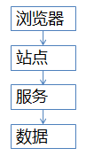

# 秒杀系统架构优化思路

[如何设计秒杀系统？](https://www.zhihu.com/question/54895548)

[秒杀系统的设计](https://learnku.com/articles/28245)                                                      

## 为什么难

 秒杀系统难做的原因：库存只有一份，所有人会在集中的时间读和写这些数据。
 例如小米手机每周二的秒杀，可能手机只有1万部，但瞬时进入的流量可能是几百几千万。
 又例如12306抢票，亦与秒杀类似，瞬时流量更甚。

## 常见架构

 流量到了亿级别，常见站点架构如上：
 1）浏览器端，最上层，会执行到一些JS代码
 2）站点层，这一层会访问后端数据，拼html页面返回给浏览器
 3）服务层，向上游屏蔽底层数据细节
 4）数据层，最终的库存是存在这里的，mysql是一个典型

## 优化方向

1）将请求尽量拦截在系统上游：传统秒杀系统之所以挂，请求都压倒了后端数据层，数据读写锁冲突严重，并发高响应慢，几乎所有请求都超时，流量虽大，下单成功的有效流量甚小

【一趟火车其实只有2000张票，200w个人来买，基本没有人能买成功，请求有效率为0】

2）充分利用缓存：这是一个典型的读多写少的应用场景，非常适合使用缓存

【一趟火车其实只有2000张票，200w个人来买，最多2000个人下单成功，其他人都是查询库存，写比例只有0.1%，读比例占99.9%】

# 优化细节

## 流量控制

### 前端拦截

 点击了“查询”按钮之后，系统那个卡呀，进度条涨的慢呀，作为用户，我会不自觉的再去点击“查询”，继续点，继续点，点点点。。。有用么？平白无故的增加了系统负载（一个用户点5次，80%的请求是这么多出来的），怎么整？
 a）产品层面，用户点击“查询”或者“购票”后，按钮置灰，禁止用户重复提交请求
 b）JS层面，限制用户在x秒之内只能提交一次请求
 如此限流，80%流量已拦。

### 后端拦截

 浏览器层的请求拦截，只能拦住小白用户（不过这是99%的用户哟），高端的程序员根本不吃这一套，写个for循环，直接调用你后端的http请求，怎么整？
 a）同一个uid，限制访问频度，做页面缓存，x秒内到达站点层的请求，均返回同一页面
 b）同一个item的查询，例如手机车次，做页面缓存，x秒内到达站点层的请求，均返回同一页面
 如此限流，又有99%的流量会被拦截在站点层

### 数据缓存

 站点层的请求拦截，只能拦住普通程序员，高级黑客，假设他控制了10w台肉鸡（并且假设买票不需要实名认证），这下uid的限制不行了吧？怎么整？异步处理、消息队列、并发限制
 a）大哥，我是服务层，我清楚的知道小米只有1万部手机，我清楚的知道一列火车只有2000张车票，我透10w个请求去数据库有什么意义呢？对于写请求，做请求队列，每次只透有限的写请求去数据层，如果均成功再放下一批，如果库存不够则队列里的写请求全部返回“已售完”
 b）对于读请求，还要我说么？cache抗，不管是memcached还是redis，单机抗个每秒10w应该都是没什么问题的
 如此限流，只有非常少的写请求，和非常少的读缓存mis的请求会透到数据层去，又有99.9%的请求被拦住了

### 数据库

 到了数据这一层，几乎就没有什么请求了，单机也能扛得住，还是那句话，库存是有限的，小米的产能有限，透这么多请求来数据库没有意义。

总结
 没什么总结了，上文应该描述的非常清楚了，对于秒杀系统，再次重复下笔者的两个架构优化思路：
 1）尽量将请求拦截在系统上游
 2）读多写少的常用多使用缓存

## 性能优化

- **读取加速**：在秒杀活动中，数据需求一般都是读多写少。20万人抢2000个商品，最后提交的订单最多也就2000个，但是在秒杀过程中，这20万人会一直产生大量的读取请求。因此可以使用缓存服务对用户请求进行缓存优化，把一些高频访问的内容放到缓存中去。对于更大规模的系统，可以通过静态文件分离、CDN服务等把用户请求分散到外围设施中去，以此来分担系统压力。
- **异步处理和排队**：通过消息队列和异步调用的方式可以实现接口异步处理，快速响应用户请求，在后端有较为充足的时间来处理实际的用户操作，提高对用户请求的响应速度，从而提升用户体验。通过消息队列还可以隔离前端的压力，实现排队系统，在涌入大量压力的情况下保证系统可以按照正常速率来处理请求，不会被流量压垮。
- **无状态服务设计**：相对于有状态服务，无状态服务更容易进行扩展，实现无状态化的服务可以在秒杀活动前进行快速扩容。而云化的服务更是有着先天的扩容优势，一般都可以实现分钟级别的资源扩容。

# Redis搭建电商秒杀系统

[使用Redis搭建电商秒杀系统](https://tech.antfin.com/docs/2/63920)

秒杀活动是绝大部分电商选择的低价促销、推广品牌的方式。不仅可以给平台带来用户量，还可以提高平台知名度。一个好的秒杀系统，可以提高平台系统的稳定性和公平性，获得更好的用户体验，提升平台的口碑，从而提升秒杀活动的最大价值。本文讨论云数据库Redis版缓存设计高并发的秒杀系统。

秒杀活动对稀缺或者特价的商品进行定时定量售卖，吸引成大量的消费者进行抢购，但又只有少部分消费者可以下单成功。因此，秒杀活动将在较短时间内产生比平时大数十倍，上百倍的页面访问流量和下单请求流量。

秒杀活动可以分为3个阶段：

- 秒杀前：用户不断刷新商品详情页，页面请求达到瞬时峰值。
- 秒杀开始：用户点击秒杀按钮，下单请求达到瞬时峰值。
- 秒杀后：一部分成功下单的用户不断刷新订单或者产生退单操作，大部分用户继续刷新商品详情页等待退单机会。

消费者提交订单，一般做法是利用数据库的行级锁，只有抢到锁的请求可以进行库存查询和下单操作。但是在高并发的情况下，数据库无法承担如此大的请求，往往会使整个服务blocked，在消费者看来就是服务器宕机。