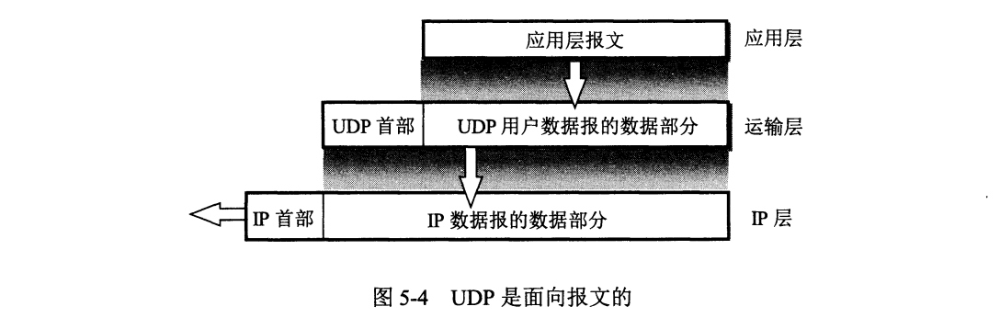

# 体系结构

# 物理层

# 数据链路层

# 网络层

# 传输层

## UDP

1. UDP 是**无连接**的，即发送数据之前不需要建立连接(发送数据结束时也没有连接可释放)，减少了开销和发送数据之前的时延。
2. UDP 使用**尽最大努力交付，即不保证可靠交付**，主机不需要维持复杂的连接状态表
3. UDP 是**面向报文**的，发送方的 UDP 对应用程序交下来的报文，在添加首部后就向下交付 IP 层。UDP 对应用层交下来的报文，既不合并，也不拆分，而是`保留这些报文的边界` 
4. UDP **没有拥塞控制**，网络出现的拥塞不会使源主机的发送速率降低。这对某些实时应用是很重要的
5. UDP 支持一对一、一对多、多对一和多对多的交互通信
6. UDP 的**首部开销小**，只有8个字节，比 TCP 的20个字节的首部要短

### 首部

1.源端口 ：源端口号。在需要对方回信时。不需要时可用全0

2.目的端口： 目的端口号。这在终点交付报文时必须使用

3.长度： UDP 用户数据报的长度，其最小值是8(仅有首部)

4.检验和： 检测 UDP 用户数据报在传输中是否有错。有错就丢弃

​	UDP 用户数据报首部中检验和的计算方法有些特殊。在计算检验和时，要在 UDP 用户数据报之前增加 12 个字节的`伪首部`。所谓“伪首部”是因为这种伪首部并不是 UDP 用户数据报真正的首部。只是在计算检验和时，临时添加在 UDP 用户数据报前面，得到一个临时的 UDP 用户数据报。检验和就是按照这个临时用户数据报来计算的。伪首部既不向下传也不向上递交，而仅仅是为了计算检验和

## TCP

传输控制协议 TCP（Transmission Control Protocol）是

1.TCP是**面向连接**的运输层协议。这就是说，应用程序在使用TCP协议之前，必须先建立TCP连接。在传送数据完毕后，必须释放已经建立的TCP连接。

2.每一条TCP连接只能有两个端点，每一条TCP连接只能是**点对点**的（一对一）。

3.TCP提供**可靠交付**的服务。通过TCP连接传送的数据，无差错、不丢失、不重复，并且按序到达。

4.TCP提供**全双工通信**。TCP允许通信双方的应用进程在任何时候都能发送数据。TCP连接的两端都设有发送缓存和接收缓存，用来临时存放双向通信的数据。在发送时应用程序在把数据传送给TCP的缓存后，就可以做自己的事，而TCP在合适的时候把数据发送出去。在接收时，TCP把收到的数据放入缓存，上层的应用进程在合适的时候读取缓存中的数据。

5.TCP面向**字节流**。TCP中的“流”指的是流入到进程或从进程中流出的的字节序列。“面向字节流”的含义是:虽然应用程序和TCP的交互是一次一个数据块（大小不等），但TCP把应用程序交下来的数据仅仅看成是一连串的无结构的字节流。

### 首部

tcp报文头部最小20个字节。

### 三次握手

第三次握手是为了防止失效的连接请求到达服务器，让服务器错误打开连接。

客户端发送的连接请求如果在网络中滞留，那么就会隔很长一段时间才能收到服务器端发回的连接确认。客户端等待一个超时重传时间之后，就会重新请求连接。但是这个滞留的连接请求最后还是会到达服务器，如果不进行三次握手，那么服务器就会打开两个连接。如果有第三次握手，客户端会忽略服务器之后发送的对滞留连接请求的连接确认，不进行第三次握手，因此就不会再次打开连接。

### 四次挥手

客户端发送了 FIN 连接释放报文之后，服务器收到了这个报文，就进入了 CLOSE-WAIT 状态。这个状态是为了让服务器端发送还未传送完毕的数据，传送完毕之后，服务器会发送 FIN 连接释放报文。

**TIME_WAIT**

客户端接收到服务器端的 FIN 报文后进入此状态，此时并不是直接进入 CLOSED 状态，还需要等待一个时间计时器设置的时间 2MSL(报文最大生存时间)。这么做有两个理由：

- 确保最后一个确认报文能够到达。如果 B 没收到 A 发送来的确认报文，那么就会重新发送连接释放请求报文，A 等待一段时间就是为了处理这种情况的发生。
- 等待一段时间是为了让本连接持续时间内所产生的所有报文都从网络中消失，使得下一个新的连接不会出现旧的连接请求报文。

### 可靠传输

TCP 使用超时重传来实现可靠传输：如果一个已经发送的报文段在超时时间内没有收到确认，那么就重传这个报文段。

#### 滑动窗口

1.保证顺序。

2.提高吞吐量。

我们能不能把第一个和第二个包发过去后，收到第一个确认包就把第三个包发过去呢？而不是去等到第二个包的确认包才去发第三个包。这样就很自然的产生了我们"滑动窗口"的实现。

在图中，我们可看出灰色1号2号3号包已经发送完毕，并且已经收到Ack。这些包就已经是过去式。4、5、6、7号包是黄色的，表示已经发送了。但是并没有收到对方的Ack，所以也不知道接收方有没有收到。8、9、10号包是绿色的。是我们还没有发送的。这些绿色也就是我们接下来马上要发送的包。  可以看出我们的窗口正好是11格。后面的11-16还没有被读进内存。要等4号-10号包有接下来的动作后，我们的包才会继续往下发送。

**正常情况**

可以看到4号包对方已经被接收到，所以被涂成了灰色。“窗口”就往右移一格，这里只要保证“窗口”是7格的。  我们就把11号包读进了我们的缓存。进入了“待发送”的状态。8、9号包已经变成了黄色，表示已经发送出去了。接下来的操作就是一样的了，确认包后，窗口往后移继续将未发送的包读进缓存，把“待发送“状态的包变为”已发送“。

**丢包情况**

有可能我们包发过去，对方的Ack丢了。也有可能我们的包并没有发送过去。从发送方角度看就是我们没有收到Ack。

发生的情况：一直在等Ack。如果一直等不到的话，我们也会把读进缓存的待发送的包也一起发过去。但是，这个时候我们的窗口已经发满了。所以并不能把12号包读进来，而是始终在等待5号包的Ack。

#### 超时重传

发送方在发送完数据后等待一个时间，时间到达没有接收到ACK报文，那么对刚才发送的数据进行重新发送。

### 拥塞控制

# 应用层

