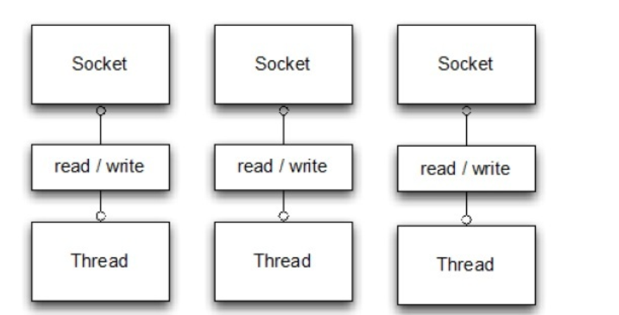
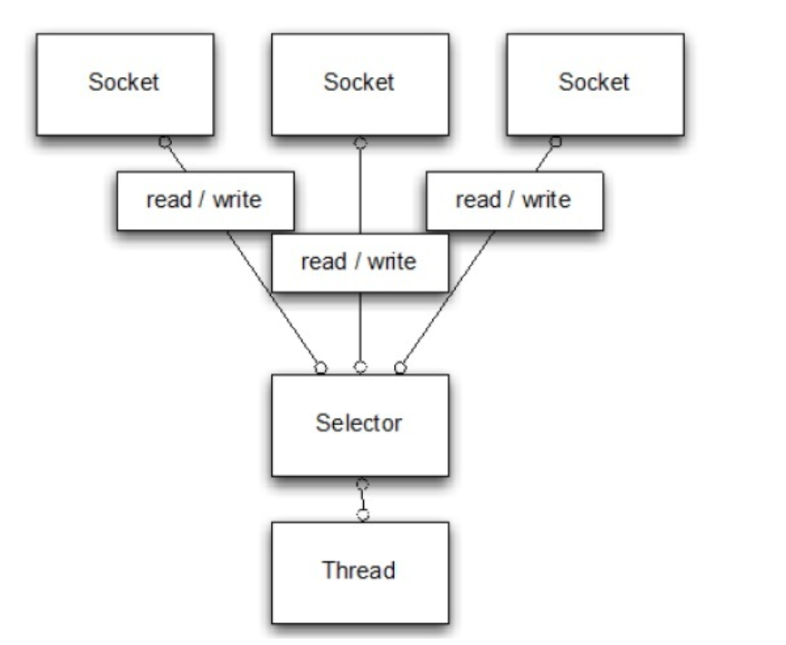
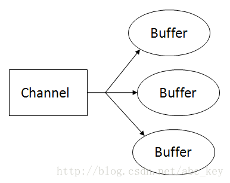
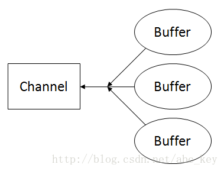
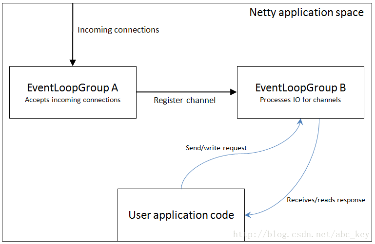
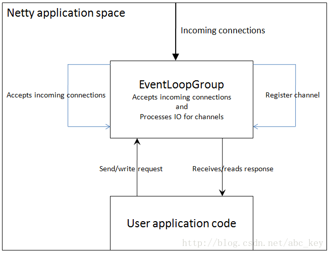
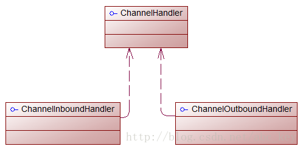
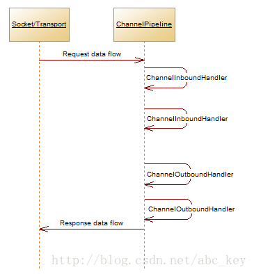
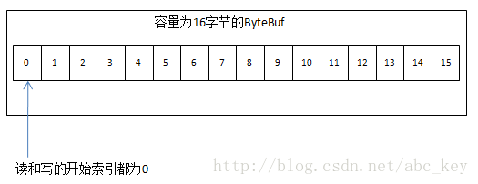

# netty学习笔记

[Netty In Action中文版](https://blog.csdn.net/abc_key/category_9262838.html)

​	Netty 是一个利用 Java 的高级网络的能力，隐藏其背后的复杂性而提供一个易于使用的 API的客户端/服务器框架。Netty 提供高性能和可扩展性，让你可以自由地专注于你真正感兴趣的东西，你的独特的应用！ 

# io模型

## 阻塞BIO

blocking io

​	为了实现多个并行的客户端我们需要分配一个新的 Thread 给每个新的客户端 Socket(当然需要更多的代码)。但考虑使用这种方法来支持大量的同步，长连接。在任何时间点多线程可能处于休眠状态，等待输入或输出数据。这很容易使得资源的大量浪费，对性能产生负面影响。 




## 非阻塞NIO

nonblocking io




# 异步实现

 	整个Netty的API都是异步的，异步处理不是一个新的机制，这个机制出来已经有一些时间了。对网络应用来说，IO一般是性能的瓶颈，使用异步IO可以较大程度上提高程序性能，因为异步变的越来越重要。但是它是如何工作的呢？以及有哪些不同的模式可用呢？

​        异步处理提倡更有效的使用资源，它允许你创建一个任务，当有事件发生时将获得通知并等待事件完成。这样就不会阻塞，不管事件完成与否都会及时返回，资源利用率更高，程序可以利用剩余的资源做一些其他的事情。

## callback

​	回调一般是异步处理的一种技术。一个回调是被传递到并且执行完该方法。你可能认为这种模式来自JavaScript，在Javascript中，回调是它的核心。下面的代码显示了如何使用这种技术来获取数据。

## future

​	第二种技术是使用Futures。Futures是一个抽象的概念，它表示一个值，该值可能在某一点变得可用。一个Future要么获得计算完的结果，要么获得计算失败后的异常。Java在java.util.concurrent包中附带了Future接口，它使用Executor异步执行。例如下面的代码，每传递一个Runnable对象到ExecutorService.submit()方法就会得到一个回调的Future，你能使用它检测是否执行完成。


# nio的问题

## 跨平台和兼容性问题

 	NIO是一个比较底层的APIs，它依赖于操作系统的IO  APIs。Java实现了统一的接口来操作IO，其在所有操作系统中的工作行为是一样的，这是很伟大的。使用NIO会经常发现代码在Linux上正常运行，但在Windows上就会出现问题。我建议你如果使用NIO编写程序，就应该在所有的操作系统上进行测试来支持，使程序可以在任何操作系统上正常运行；即使在所有的Linux系统上都测试通过了，也要在其他的操作系统上进行测试；你若不验证，以后就可能会出问题。

​        NIO2看起来很理想，但是NIO2只支持Jdk1.7+，若你的程序在Java1.6上运行，则无法使用NIO2。另外，Java7的NIO2中没有提供DatagramSocket的支持，所以NIO2只支持TCP程序，不支持UDP程序。

​        Netty提供一个统一的接口，同一语义无论在Java6还是Java7的环境下都是可以运行的，开发者无需关心底层APIs就可以轻松实现相关功能。

## 扩展ByteBuffer

​	ByteBuffer是一个数据容器，但是可惜的是JDK没有开发ByteBuffer实现的源码；ByteBuffer允许包装一个byte[]来获得一个实例，如果你希望尽量减少内存拷贝，那么这种方式是非常有用的。若果你想将ByteBuffer重新实现，那么不要浪费你的时间了，ByteBuffer的构造函数是私有的，所以它不能被扩展。Netty提供了自己的ByteBuffer实现，Netty通过一些简单的APIs对ByteBuffer进行构造、使用和操作，以此来解决NIO中的一些限制。

## 内存泄露

NIO对缓冲区的聚合和分散操作可能会操作内存泄露

  很多Channel的实现支持Gather和Scatter。这个功能允许从从多个ByteBuffer中读入或写入到过个ByteBuffer，这样做可以提供性能。操作系统底层知道如何处理这些被写入/读出，并且能以最有效的方式处理。如果要分割的数据再多个不同的ByteBuffer中，使用Gather/Scatter是比较好的方式。

​        例如，你可能希望header在一个ByteBuffer中，而body在另外的ByteBuffer中；

​        下图显示的是Scatter(分散)，将ScatteringByteBuffer中的数据分散读取到多个ByteBuffer中：



​        下图显示的是Gather(聚合)，将多个ByteBuffer的数据写入到GatheringByteChannel：



​        可惜Gather/Scatter功能会导致内存泄露，知道Java7才解决内存泄露问题。使用这个功能必须小心编码和Java版本。

## epoll bug

​	 Linux-like OSs的选择器使用的是epoll-IO事件通知工具。这是一个在操作系统以异步方式工作的网络stack.Unfortunately，即使是现在，著名的epoll-bug也可能会导致无效的状态的选择和100%的CPU利用率。要解决epoll-bug的唯一方法是回收旧的选择器，将先前注册的通道实例转移到新创建的选择器上。

​	这里发生的是，不管有没有已选择的SelectionKey，Selector.select()方法总是不会阻塞并且会立刻返回。这违反了Javadoc中对Selector.select()方法的描述，Javadoc中的描述：Selector.select()
must not unblock if nothing is selected. (Selector.select()方法若未选中任何事件将会阻塞。)


# 核心概念

EventLoop

EventLoopGroup

ChannelPipeline

Channel

Future or ChannelFuture

ChannelInitializer

ChannelHandler

## 引导和事件组

“引导”是Netty中配置程序的过程，当你需要连接客户端或服务器绑定指定端口时需要使用bootstrap。如前面所述，“引导”有两种类型，一种是用于**客户端**的Bootstrap(也适用于DatagramChannel)，一种是用于**服务端**的ServerBootstrap。不管程序使用哪种协议，无论是创建一个客户端还是服务器都需要使用“引导”。

​        两种bootsstraps之间有一些相似之处，其实他们有很多相似之处，也有一些不同。Bootstrap和ServerBootstrap之间的差异：

- Bootstrap用来连接远程主机，有1个EventLoopGroup
- ServerBootstrap用来绑定本地端口，有2个EventLoopGroup

​          事件组(Groups)，传输(transports)和处理程序(handlers)分别在本章后面讲述，我们在这里只讨论两种"引导"的差异(Bootstrap和ServerBootstrap)。第一个差异很明显，“ServerBootstrap”监听在服务器监听一个端口轮询客户端的“Bootstrap”或DatagramChannel是否连接服务器。通常需要调用“Bootstrap”类的connect()方法，但是也可以先调用bind()再调用connect()进行连接，之后使用的Channel包含在bind()返回的ChannelFuture中。

​         第二个差别也许是最重要的。客户端bootstraps/applications使用一个单例EventLoopGroup，而ServerBootstrap使用2个EventLoopGroup(实际上使用的是相同的实例)，它可能不是显而易见的，但是它是个好的方案。一个ServerBootstrap可以认为有2个channels组，第一组包含一个单例ServerChannel，代表持有一个绑定了本地端口的socket；第二组包含所有的Channel，代表服务器已接受了的连接。下图形象的描述了这种情况：



上图中，EventLoopGroup A唯一的目的就是接受连接然后交给EventLoopGroup  B。**Netty可以使用两个不同的Group，因为服务器程序需要接受很多客户端连接的情况下，一个EventLoopGroup将是程序性能的瓶颈，因为事件循环忙于处理连接请求，没有多余的资源和空闲来处理业务逻辑，最后的结果会是很多连接请求超时。若有两EventLoops，  即使在高负载下，所有的连接也都会被接受，因为EventLoops接受连接不会和哪些已经连接了的处理共享资源。**

​          EventLoopGroup和EventLoop是什么关系？EventLoopGroup可以包含很多个EventLoop，每个Channel绑定一个EventLoop不会被改变，因为EventLoopGroup包含少量的EventLoop的Channels，很多Channel会共享同一个EventLoop。这意味着在一个Channel保持EventLoop繁忙会禁止其他Channel绑定到相同的EventLoop。我们可以理解为EventLoop是一个事件循环线程，而EventLoopGroup是一个事件循环集合。

​        如果你决定两次使用相同的EventLoopGroup实例配置Netty服务器，下图显示了它是如何改变的：



Netty允许处理IO和接受连接使用同一个EventLoopGroup，这在实际中适用于多种应用。上图显示了一个EventLoopGroup处理连接请求和IO操作。

​        下一节我们将介绍Netty是如何执行IO操作以及在什么时候执行。


## 通道处理和数据流

 本节我们一起来看看当你发送或接收数据时发生了什么？回想本章开始提到的handler概念。要明白Netty程序wirte或read时发生了什么，首先要对Handler是什么有一定的了解。Handlers自身依赖于ChannelPipeline来决定它们执行的顺序，因此不可能通过**ChannelPipeline**定义处理程序的某些方面,反过来不可能定义也不可能通过ChannelHandler定义ChannelPipeline的某些方面。没必要说我们必须定义一个自己和其他的规定。本节将介绍ChannelHandler和ChannelPipeline在某种程度上细微的依赖。

​         在很多地方，Netty的ChannelHandler是你的应用程序中处理最多的。即使你没有意识到这一点，如果你使用Netty应用将至少有一个ChannelHandler参与，换句话说，ChannelHandler对很多事情是关键的。那么ChannelHandler究竟是什么？给ChannelHandler一个定义不容易，我们可以理解为ChannelHandler是一段执行业务逻辑处理数据的代码，它们来来往往的通过ChannelPipeline。实际上，ChannelHandler是定义一个handler的父接口，ChannelInboundHandler和ChannelOutboundHandler都实现ChannelHandler接口，如下图：



上图显示的比较容易，更重要的是ChannelHandler在数据流方面的应用，在这里讨论的例子只是一个简单的例子。ChannelHandler被应用在许多方面，在本书中会慢慢学习。

​         Netty中有两个方向的数据流，上图显示的入站(**ChannelInboundHandler**)和出站(**ChannelOutboundHandler**)之间有一个明显的区别：若数据是从用户应用程序到远程主机则是“出站(outbound)”，相反若数据时从远程主机到用户应用程序则是“入站(inbound)”。

​         为了使数据从一端到达另一端，一个或多个ChannelHandler将以某种方式操作数据。这些ChannelHandler会在程序的“引导”阶段被添加ChannelPipeline中，并且被添加的顺序将决定处理数据的顺序。ChannelPipeline的作用我们可以理解为用来管理ChannelHandler的一个容器，每个ChannelHandler处理各自的数据(例如入站数据只能由ChannelInboundHandler处理)，处理完成后将转换的数据放到ChannelPipeline中交给下一个ChannelHandler继续处理，直到最后一个ChannelHandler处理完成。

​        下图显示了ChannelPipeline的处理过程：



上图显示ChannelInboundHandler和ChannelOutboundHandler都要经过相同的ChannelPipeline。

​         在ChannelPipeline中，如果消息被读取或有任何其他的入站事件，消息将从ChannelPipeline的头部开始传递给第一个ChannelInboundHandler，这个ChannelInboundHandler可以处理该消息或将消息传递到下一个ChannelInboundHandler中，一旦在ChannelPipeline中没有剩余的ChannelInboundHandler后，ChannelPipeline就知道消息已被所有的饿Handler处理完成了。

​         反过来也是如此，任何出站事件或写入将从ChannelPipeline的尾部开始，并传递到最后一个ChannelOutboundHandler。ChannelOutboundHandler的作用和ChannelInboundHandler相同，它可以传递事件消息到下一个Handler或者自己处理消息。不同的是ChannelOutboundHandler是从ChannelPipeline的尾部开始，而ChannelInboundHandler是从ChannelPipeline的头部开始，当处理完第一个ChannelOutboundHandler处理完成后会出发一些操作，比如一个写操作。

​         一个事件能传递到下一个ChannelInboundHandler或上一个ChannelOutboundHandler，在ChannelPipeline中通过使用ChannelHandlerContext调用每一个方法。Netty提供了抽象的事件基类称为ChannelInboundHandlerAdapter和ChannelOutboundHandlerAdapter。每个都提供了在ChannelPipeline中通过调用相应的方法将事件传递给下一个Handler的方法的实现。我们能覆盖的方法就是我们需要做的处理。

​         可能有读者会奇怪，出站和入站的操作不同，能放在同一个ChannelPipeline工作？Netty的设计是很巧妙的，入站和出站Handler有不同的实现，Netty能跳过一个不能处理的操作，所以在出站事件的情况下，ChannelInboundHandler将被跳过，Netty知道每个handler都必须实现ChannelInboundHandler或ChannelOutboundHandler。

​         当一个ChannelHandler添加到ChannelPipeline中时获得一个ChannelHandlerContext。通常是安全的获得这个对象的引用，但是当一个数据报协议如UDP时这是不正确的，这个对象可以在之后用来获取底层通道，因为要用它来read/write消息，因此通道会保留。也就是说Netty中发送消息有两种方法：直接写入通道或写入ChannelHandlerContext对象。这两种方法的主要区别如下：

- 直接写入通道导致处理消息从ChannelPipeline的尾部开始
- 写入ChannelHandlerContext对象导致处理消息从ChannelPipeline的下一个handler开始


# 缓冲ByteBuf

​	当需要与远程进行交互时，需要以字节码发送/接收数据。由于各种原因，一个高效、方便、易用的数据接口是必须的，而Netty的ByteBuf满足这些需求，ByteBuf是一个很好的经过优化的数据容器，我们可以将字节数据有效的添加到ByteBuf中或从ByteBuf中获取数据。ByteBuf有2部分：一个用于读，一个用于写。我们可以按顺序的读取数据，并且可以跳到开始重新读一遍。所有的数据操作，我们只需要做的是调整读取数据索引和再次开始读操作。	

​	写入数据到ByteBuf后，写入索引是增加的字节数量。开始读字节后，读取索引增加。你可以读取字节，直到写入索引和读取索引处理相同的位置，次数若继续读取，则会抛出IndexOutOfBoundsException。调用ByteBuf的任何方法开始读/写都会单独维护读索引和写索引。ByteBuf的默认最大容量限制是Integer.MAX_VALUE，写入时若超出这个值将会导致一个异常。

​        ByteBuf类似于一个字节数组，最大的区别是读和写的索引可以用来控制对缓冲区数据的访问。下图显示了一个容量为16的ByteBuf：



## 缓冲区类型

**Heap Buffer(堆缓冲区)**

​        最常用的类型是ByteBuf将数据存储在**JVM的堆空间**，这是通过将数据存储在数组的实现。堆缓冲区可以快速分配，当不使用时也可以快速释放。它还提供了直接访问数组的方法，通过ByteBuf.array()来获取byte[]数据。

​        访问非堆缓冲区ByteBuf的数组会导致UnsupportedOperationException，可以使用ByteBuf.hasArray()来检查是否支持访问数组。

**Direct Buffer(直接缓冲区)**

​         直接缓冲区，在**堆之外直接分配内存**。直接缓冲区不会占用堆空间容量，使用时应该考虑到应用程序要使用的最大内存容量以及如何限制它。直接缓冲区在使用Socket传递数据时性能很好，因为若使用间接缓冲区，JVM会先将数据复制到直接缓冲区再进行传递；但是直接缓冲区的缺点是在分配内存空间和释放内存时比堆缓冲区更复杂，而Netty使用内存池来解决这样的问题，这也是Netty使用内存池的原因之一。直接缓冲区不支持数组访问数据，但是我们可以间接的访问数据数组，

访问直接缓冲区的数据数组需要更多的编码和更复杂的操作，建议若需要在数组访问数据使用堆缓冲区会更好。

**Composite Buffer(复合缓冲区)**

​         复合缓冲区，我们可以创建多个不同的ByteBuf，然后提供一个这些ByteBuf组合的视图。复合缓冲区就像一个列表，我们可以动态的添加和删除其中的ByteBuf，JDK的ByteBuffer没有这样的功能。Netty提供了CompositeByteBuf类来处理复合缓冲区，CompositeByteBuf只是一个视图，CompositeByteBuf.hasArray()总是返回false，因为它可能包含一些直接或间接的不同类型的ByteBuf。

​         例如，一条消息由header和body两部分组成，将header和body组装成一条消息发送出去，可能body相同，只是header不同，使用CompositeByteBuf就不用每次都重新分配一个新的缓冲区。

## 字节操作

### 随机访问索引 

​         ByteBuf使用zero-based-indexing(从0开始的索引)，第一个字节的索引是0，最后一个字节的索引是ByteBuf的capacity - 1，下面代码是遍历ByteBuf的所有字节：

```java
//create a ByteBuf of capacity is 16
ByteBuf buf = Unpooled.buffer(16);
//write data to buf
for(int i=0;i<16;i++){
    buf.writeByte(i+1);
}
//read data from buf
for(int i=0;i<buf.capacity();i++){
    System.out.println(buf.getByte(i));
}
```

注意通过索引访问时不会推进读索引和写索引，我们可以通过ByteBuf的readerIndex()或writerIndex()来分别推进读索引或写索引。


