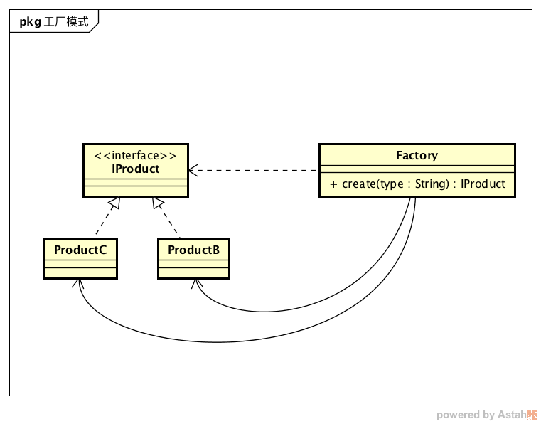

# 设计模式

# 基本原则

**单一职责**，一个类只负责一个功能领域中的相应职责。

**开闭原则**，软件实体应对扩展开放，而对修改关闭。

**里氏替换原则**，所有引用基类对象的地方能够透明地使用其子类的对象。大意为如果你用了基类，那么我可以使用它的多个子类，而不用关心子类是怎么实现的。

**接口隔离原则**，使用多个专门的接口，而不使用单一的总接口，即客户端不应该依赖那些它不需要的接口。如果有接口，要对接口作下分类，避免大杂烩。

**依赖倒置原则**，抽象不依赖于细节，细节应该依赖于抽象。面向抽象编程。

**迪米特法则**，一个软件实体应当尽可能少地与其他实体发生相互作用。最小知识原则，不要和陌生人说话，只与直接朋友通信。

# 简单工厂

simple factory pattern：定义一个工厂类，可以根据不同的参数返回不同类的实例

工厂模式的作用，将实例的创建和使用进行分离，将实例化的配置和创建的过程封装在工厂类中。

简单工厂模式是工厂三兄弟之一，但并不属于 GOF 的 23 种设计模式。

使用的时候，无需关心实例化细节，只要传递自己想要的产品类型，创建过程委托给工厂来实现。



## 设计

### 普通简单工厂

```java
public class NormalSimpleFactory {

    public static final String TYPE_CHINESE = "Chinese";
    public static final String TYPE_ENGLISH = "English";
    public static final String TYPE_GERMAN = "German";

    public IProduct getProduct(String type) {
        if (TYPE_CHINESE.equals(type)) {
            return new ChineseProduct();
        } else if (TYPE_ENGLISH.equals(type)) {
            return new EnglishProduct();
        } else if (TYPE_GERMAN.equals(type)) {
            return new GermanProduct();
        } else {
            return null;
        }
    }
}
```

### 多方法简单工厂

```java
public class MultiMethodFactory {

    public IProduct getChineseProduct() {
        return new ChineseProduct();
    }

    public IProduct getEnglishProduct() {
        return new EnglishProduct();
    }

    public IProduct getGermanProduct() {
        return new GermanProduct();
    }
}
```
### 静态工厂方法（使用较多）

```java
public class StaticMethodSimpleFactory {

    public static IProduct getChineseProduct() {
        return new ChineseProduct();
    }

    public static IProduct getEnglishProduct() {
        return new EnglishProduct();
    }

    public static IProduct getGermanProduct() {
        return new GermanProduct();
    }
}
```
## 示例

### JDK：MessageDigest

```java
MessageDigest md=MessageDigest.getInstance("MD2");
MessageDigest md=MessageDigest.getInstance("MD5");
MessageDigest md = MessageDigest.getInstance("SHA");
```
### JDK：Executors

```java
ExecutorService cacheThreadPool = Executors.newCachedThreadPool();
ExecutorService fixCacheThreadPool = Executors.newFixedThreadPool(10);
ExecutorService singleThreadPool = Executors.newSingleThreadExecutor();
ScheduledExecutorService scheduleThreadPool = Executors.newScheduledThreadPool(4);
```

优点
易于阅读：因为类型不一样，需要 if else 分支判断，过多的 if else 代码块会造成维护困难，集中在工厂有利于代码复用和可读性。
易于修改：调用者可以遵循依赖倒置原则，面向抽象编程。创建过程交给工厂实现，如果更换产品只需要调整工厂。
易于复用：如果对象创建需要大量复杂的配置和初始化操作，内聚到工厂进行复用。

缺点
要修改工厂。如果要新增产品，还是要修改工厂，不符合开闭原则

    优化思路
    如果产品相当复杂的话，可以考虑改用工厂方法或抽象工厂


# 工厂方法模式


# 抽象工厂模式


# 建造者模式

## 介绍

建造者模式(Builder Pattern)：将一个复杂对象的构建与它的表示分离，使得同样的构建过程可以创建不同的表示。建造者模式是一种对象创建型模式。

建造者模式一步一步创建一个复杂的对象，它允许用户只通过指定复杂对象的类型和内容就可以构建它们，用户不需要知道内部的具体构建细节。

## 角色

**Builder（抽象建造者）**：它为创建一个产品Product对象的各个部件指定抽象接口，在该接口中一般声明两类方法，一类方法是buildPartX()，它们用于创建复杂对象的各个部件；另一类方法是getResult()，它们用于返回复杂对象。Builder既可以是抽象类，也可以是接口。

**ConcreteBuilder（具体建造者）**：它实现了Builder接口，实现各个部件的具体构造和装配方法，定义并明确它所创建的复杂对象，也可以提供一个方法返回创建好的复杂产品对象。

**Product（产品角色）**：它是被构建的复杂对象，包含多个组成部件，具体建造者创建该产品的内部表示并定义它的装配过程。

**Director（指挥者）**：指挥者又称为导演类，它负责安排复杂对象的建造次序，指挥者与抽象建造者之间存在关联关系，可以在其construct()建造方法中调用建造者对象的部件构造与装配方法，完成复杂对象的建造。客户端一般只需要与指挥者进行交互，在客户端确定具体建造者的类型，并实例化具体建造者对象（也可以通过配置文件和反射机制），然后通过指挥者类的构造函数或者Setter方法将该对象传入指挥者类中。

在建造者模式的定义中提到了复杂对象，那么什么是复杂对象？简单来说，**复杂对象**是指那些包含多个成员属性的对象，这些成员属性也称为部件或零件，如汽车包括方向盘、发动机、轮胎等部件，电子邮件包括发件人、收件人、主题、内容、附件等部件

## 示例

okhttpclient的构造


# 单例模式

## 介绍

**单例模式(Singleton Pattern)**：确保某一个类只有一个实例，而且自行实例化并向整个系统提供这个实例，这个类称为单例类，它提供全局访问的方法。单例模式是一种对象创建型模式。

单例模式有三个要点：

1. 构造方法私有化；
2. 实例化的变量引用私有化；
3. 获取实例的方法共有

## 角色

**Singleton（单例）**：在单例类的内部实现只生成一个实例，同时它提供一个静态的 `getInstance()` 工厂方法，让客户可以访问它的唯一实例；为了防止在外部对其实例化，将其构造函数设计为私有；在单例类内部定义了一个 `Singleton` 类型的静态对象，作为外部共享的唯一实例。

## 示例

[设计模式 | 单例模式及典型应用](http://laijianfeng.org/2019/01/%E8%AE%BE%E8%AE%A1%E6%A8%A1%E5%BC%8F-%E5%8D%95%E4%BE%8B%E6%A8%A1%E5%BC%8F%E5%8F%8A%E5%85%B8%E5%9E%8B%E5%BA%94%E7%94%A8/)

最佳方式是使用**枚举**，线程安全，懒加载，避免序列化和反射攻击。

# 原型模式

## 介绍

使用原型实例指定创建对象的种类，并且通过拷贝这些原型创建新的对象。原型模式是一种对象创建型模式。

原型模式的工作原理很简单：将一个原型对象传给那个要发动创建的对象，这个要发动创建的对象通过请求原型对象拷贝自己来实现创建过程。

原型模式是一种“另类”的创建型模式，创建克隆对象的工厂就是原型类自身，工厂方法由克隆方法来实现。

需要注意的是通过克隆方法所创建的对象是全新的对象，它们在内存中拥有新的地址，通常对克隆所产生的对象进行修改对原型对象不会造成任何影响，每一个克隆对象都是相互独立的。通过不同的方式修改可以得到一系列相似但不完全相同的对象。


## 示例

jdk中Object的clone()方法

浅克隆和深克隆

# 适配器模式


## 示例

InputStreamReader和OutputStreamWriter是适配器类，能将InputStream/OutputStream转换为Reader/Writer，字节流转换为字符流。


# 装饰器模式


## 示例

BufferedReader/BufferedWriter是装饰类，提供缓冲，以及按行读写功能。


# 桥接器模式


## 示例

JDBC 针对 Java 平台，对底层数据库做了一个统一的封装，也是一套规范。各个数据库厂商自己去实现


# 代理模式


## 示例

spring aop 

mybatis

各种框架大量使用

# 门面模式(外观模式)

## 介绍

外观模式是一种使用频率非常高的结构型设计模式，它通过引入一个外观角色来简化客户端与子系统之间的交互，为复杂的子系统调用提供一个统一的入口，降低子系统与客户端的耦合度，且客户端调用非常方便。

外观模式又称为门面模式，它是一种对象结构型模式。外观模式是迪米特法则的一种具体实现，通过引入一个新的外观角色可以降低原有系统的复杂度，同时降低客户类与子系统的耦合度。

## 角色

外观模式包含如下两个角色：

**Facade（外观角色）**：在客户端可以调用它的方法，在外观角色中可以知道相关的（一个或者多个）子系统的功能和责任；在正常情况下，它将所有从客户端发来的请求委派到相应的子系统去，传递给相应的子系统对象处理。

**SubSystem（子系统角色）**：在软件系统中可以有一个或者多个子系统角色，每一个子系统可以不是一个单独的类，而是一个类的集合，它实现子系统的功能；每一个子系统都可以被客户端直接调用，或者被外观角色调用，它处理由外观类传过来的请求；子系统并不知道外观的存在，对于子系统而言，外观角色仅仅是另外一个客户端而已。

外观模式的目的不是给予子系统添加新的功能接口，而是为了让外部减少与子系统内多个模块的交互，松散耦合，从而让外部能够更简单地使用子系统。

外观模式的本质是：**封装交互，简化调用**。

## 示例

`SLF4J` 是简单的日志外观模式框架，抽象了各种日志框架例如 `Logback`、`Log4j`、`Commons-logging` 和 `JDK` 自带的 `logging` 实现接口。它使得用户可以在部署时使用自己想要的日志框架。


# 组合模式

## 介绍

树形结构不论在生活中或者是开发中都是一种非常常见的结构，一个容器对象（如文件夹）下可以存放多种不同的叶子对象或者容器对象，容器对象与叶子对象之间属性差别可能非常大。

由于容器对象和叶子对象在功能上的区别，在使用这些对象的代码中必须有区别地对待容器对象和叶子对象，而实际上**大多数情况下我们希望一致地处理它们**，因为对于这些对象的区别对待将会使得程序非常复杂。

组合模式为解决此类问题而诞生，**它可以让叶子对象和容器对象的使用具有一致性**。

**组合模式(Composite Pattern)**：组合多个对象形成树形结构以表示具有 “整体—部分” 关系的层次结构。组合模式对单个对象（即叶子对象）和组合对象（即容器对象）的使用具有一致性，组合模式又可以称为 “整体—部分”(Part-Whole) 模式，它是一种对象结构型模式。

由于在软件开发中存在大量的树形结构，因此组合模式是一种使用频率较高的结构型设计模式，Java SE中的AWT和Swing包的设计就基于组合模式。

除此以外，在XML解析、组织结构树处理、文件系统设计等领域，组合模式都得到了广泛应用。

## 角色

**Component（抽象构件）**：它可以是接口或抽象类，为叶子构件和容器构件对象声明接口，在该角色中可以包含所有子类共有行为的声明和实现。在抽象构件中定义了访问及管理它的子构件的方法，如增加子构件、删除子构件、获取子构件等。

**Leaf（叶子构件）**：它在组合结构中表示叶子节点对象，叶子节点没有子节点，它实现了在抽象构件中定义的行为。对于那些访问及管理子构件的方法，可以通过异常等方式进行处理。

**Composite（容器构件）**：它在组合结构中表示容器节点对象，容器节点包含子节点，其子节点可以是叶子节点，也可以是容器节点，它提供一个集合用于存储子节点，实现了在抽象构件中定义的行为，包括那些访问及管理子构件的方法，在其业务方法中可以递归调用其子节点的业务方法。

组合模式的**关键是定义了一个抽象构件类，它既可以代表叶子，又可以代表容器**，而客户端针对该抽象构件类进行编程，无须知道它到底表示的是叶子还是容器，可以对其进行统一处理。**同时容器对象与抽象构件类之间还建立一个聚合关联关系**，在容器对象中既可以包含叶子，也可以包含容器，以此实现递归组合，形成一个树形结构。

## 示例

我们来实现一个简单的目录树，有文件夹和文件两种类型，首先需要一个抽象构件类，声明了文件夹类和文件类需要的方法

```java
public abstract class Component {

    public String getName() {
        throw new UnsupportedOperationException("不支持获取名称操作");
    }

    public void add(Component component) {
        throw new UnsupportedOperationException("不支持添加操作");
    }

    public void remove(Component component) {
        throw new UnsupportedOperationException("不支持删除操作");
    }

    public void print() {
        throw new UnsupportedOperationException("不支持打印操作");
    }

    public String getContent() {
        throw new UnsupportedOperationException("不支持获取内容操作");
    }
}
```

实现一个文件夹类 Folder，继承 Component，定义一个 `List<Component>` 类型的componentList属性，用来存储该文件夹下的文件和子文件夹，并实现 getName、add、remove、print等方法

```java
public class Folder extends Component {
    private String name;
    private List<Component> componentList = new ArrayList<Component>();

    public Folder(String name) {
        this.name = name;
    }

    @Override
    public String getName() {
        return this.name;
    }

    @Override
    public void add(Component component) {
        this.componentList.add(component);
    }

    @Override
    public void remove(Component component) {
        this.componentList.remove(component);
    }

    @Override
    public void print() {
        System.out.println(this.getName());
        for (Component component : this.componentList) {
            component.print();
        }
    }
}
```

文件类 File，继承Component父类，实现 getName、print、getContent等方法

```java
public class File extends Component {
    private String name;
    private String content;

    public File(String name, String content) {
        this.name = name;
        this.content = content;
    }

    @Override
    public String getName() {
        return this.name;
    }

    @Override
    public void print() {
        System.out.println(this.getName());
    }

    @Override
    public String getContent() {
        return this.content;
    }
}
```

我们来测试一下

```java
public class Test {
    public static void main(String[] args) {
        Folder DSFolder = new Folder("设计模式资料");
        File note1 = new File("组合模式笔记.md", "组合模式组合多个对象形成树形结构以表示具有 \"整体—部分\" 关系的层次结构");
        File note2 = new File("工厂方法模式.md", "工厂方法模式定义一个用于创建对象的接口，让子类决定将哪一个类实例化。");
        DSFolder.add(note1);
        DSFolder.add(note2);

        Folder codeFolder = new Folder("样例代码");
        File readme = new File("README.md", "# 设计模式示例代码项目");
        Folder srcFolder = new Folder("src");
        File code1 = new File("组合模式示例.java", "这是组合模式的示例代码");

        srcFolder.add(code1);
        codeFolder.add(readme);
        codeFolder.add(srcFolder);
        DSFolder.add(codeFolder);

        DSFolder.print();
    }
}
```

输出结果

```
设计模式资料
组合模式笔记.md
工厂方法模式.md
样例代码
README.md
src
组合模式示例.java
```

输出正常，不过有个小问题，**从输出看不出它们的层级结构**，为了体现出它们之间的层级关系，我们需要改造一下 Folder 类，增加一个 level 属性，并修改 print 方法

```java
public class Folder extends Component {
    private String name;
    private List<Component> componentList = new ArrayList<Component>();
    public Integer level;

    public Folder(String name) {
        this.name = name;
    }

    @Override
    public String getName() {
        return this.name;
    }

    @Override
    public void add(Component component) {
        this.componentList.add(component);
    }

    @Override
    public void remove(Component component) {
        this.componentList.remove(component);
    }

    @Override
    public void print() {
        System.out.println(this.getName());
        if (this.level == null) {
            this.level = 1;
        }
        String prefix = "";
        for (int i = 0; i < this.level; i++) {
            prefix += "\t- ";
        }
        for (Component component : this.componentList) {
            if (component instanceof Folder){
                ((Folder)component).level = this.level + 1;
            }
            System.out.print(prefix);
            component.print();
        }
        this.level = null;
    }
}
```

现在的输出就有相应的层级结构了

```
设计模式资料
    - 组合模式笔记.md
    - 工厂方法模式.md
    - 样例代码
    -     - README.md
    -     - src
    -     -     - 组合模式示例.java
```

# 享元模式

## 介绍

**享元模式(Flyweight Pattern)**：运用共享技术有效地支持大量细粒度对象的复用。系统只使用少量的对象，而这些对象都很相似，状态变化很小，可以实现对象的多次复用。由于享元模式要求能够共享的对象必须是细粒度对象，因此它又称为轻量级模式，它是一种对象结构型模式。享元模式结构较为复杂，一般结合工厂模式一起使用。

## 角色

**Flyweight（抽象享元类）**：通常是一个接口或抽象类，在抽象享元类中声明了具体享元类公共的方法，这些方法可以向外界提供享元对象的内部数据（内部状态），同时也可以通过这些方法来设置外部数据（外部状态）。

**ConcreteFlyweight（具体享元类）**：它实现了抽象享元类，其实例称为享元对象；在具体享元类中为内部状态提供了存储空间。通常我们可以结合单例模式来设计具体享元类，为每一个具体享元类提供唯一的享元对象。

**UnsharedConcreteFlyweight（非共享具体享元类）**：并不是所有的抽象享元类的子类都需要被共享，不能被共享的子类可设计为非共享具体享元类；当需要一个非共享具体享元类的对象时可以直接通过实例化创建。

**FlyweightFactory（享元工厂类）**：享元工厂类用于创建并管理享元对象，它针对抽象享元类编程，将各种类型的具体享元对象存储在一个享元池中，享元池一般设计为一个存储“键值对”的集合（也可以是其他类型的集合），可以结合工厂模式进行设计；当用户请求一个具体享元对象时，享元工厂提供一个存储在享元池中已创建的实例或者创建一个新的实例（如果不存在的话），返回新创建的实例并将其存储在享元池中。

> 单纯享元模式：在单纯享元模式中，所有的具体享元类都是可以共享的，不存在非共享具体享元类。
> 复合享元模式：将一些单纯享元对象使用组合模式加以组合，还可以形成复合享元对象，这样的复合享元对象本身不能共享，但是它们可以分解成单纯享元对象，而后者则可以共享

在享元模式中引入了享元工厂类，享元工厂类的作用在于提供一个用于存储享元对象的享元池，当用户需要对象时，首先从享元池中获取，如果享元池中不存在，则创建一个新的享元对象返回给用户，并在享元池中保存该新增对象。

## 示例

Integer 缓存`-128 ~ 127`对象

HashSet 其实也是享元模式的一种应用

各种连接池线程池，池化。

# 策略模式

## 介绍

在软件开发中，我们也常常会遇到类似的情况，实现某一个功能有多条途径，每一条途径对应一种算法，此时我们可以使用一种设计模式来实现灵活地选择解决途径，也能够方便地增加新的解决途径。

譬如商场购物场景中，有些商品按原价卖，商场可能为了促销而推出优惠活动，有些商品打九折，有些打八折，有些则是返现10元等。

而优惠活动并不影响结算之外的其他过程，只是在结算的时候需要根据优惠方案结算


## 角色

**Context（环境类）**：环境类是使用算法的角色，它在解决某个问题（即实现某个方法）时可以采用多种策略。在环境类中维持一个对抽象策略类的引用实例，用于定义所采用的策略。

**Strategy（抽象策略类）**：它为所支持的算法声明了抽象方法，是所有策略类的父类，它可以是抽象类或具体类，也可以是接口。环境类通过抽象策略类中声明的方法在运行时调用具体策略类中实现的算法。

**ConcreteStrategy（具体策略类）**：它实现了在抽象策略类中声明的算法，在运行时，具体策略类将覆盖在环境类中定义的抽象策略类对象，使用一种具体的算法实现某个业务处理。

## 示例

- Java Comparator 中的策略模式
- Spring Resource 中的策略模式
- Spring Bean 实例化中的策略模式


# 模板方法模式

## 介绍

在程序开发中，经常会遇到这种情况：某个方法要实现的算法需要多个步骤，但其中有一些步骤是固定不变的，而另一些步骤则是不固定的。为了提高代码的可扩展性和可维护性，模板方法模式在这种场景下就派上了用场。

譬如制作一节网课的步骤可以简化为4个步骤：

1. 制作PPT
2. 录制视频
3. 编写笔记
4. 提供课程资料

其中1、2、3的动作在所有课程中的固定不变的，步骤3可有可无，步骤4在每个课程都不同（有些课程需要提供源代码，有些需要提供图片文件等）

我们可以在父类中确定整个流程的循序，并实现固定不变的步骤，而把不固定的步骤留给子类实现。甚至可以通过一个钩子方法，让子类来决定流程中某个方法的执行与否

# 观察者模式

## 介绍

**观察者模式(Observer Pattern)**：定义对象之间的一种一对多依赖关系，使得每当一个对象状态发生改变时，其相关依赖对象皆得到通知并被自动更新。观察者模式是一种对象行为型模式。

观察者模式的别名包括发布-订阅（Publish/Subscribe）模式、模型-视图（Model/View）模式、源-监听器（Source/Listener）模式或从属者（Dependents）模式。

观察者模式包含观察目标和观察者两类对象，一个目标可以有任意数目的与之相依赖的观察者，一旦观察目标的状态发生改变，所有的观察者都将得到通知。

## 角色

**Subject（目标）**：目标又称为主题，它是指被观察的对象。在目标中定义了一个观察者集合，一个观察目标可以接受任意数量的观察者来观察，它提供一系列方法来增加和删除观察者对象，同时它定义了通知方法notify()。目标类可以是接口，也可以是抽象类或具体类。

**ConcreteSubject（具体目标）**：具体目标是目标类的子类，通常它包含有经常发生改变的数据，当它的状态发生改变时，向它的各个观察者发出通知；同时它还实现了在目标类中定义的抽象业务逻辑方法（如果有的话）。如果无须扩展目标类，则具体目标类可以省略。

**Observer（观察者）**：观察者将对观察目标的改变做出反应，观察者一般定义为接口，该接口声明了更新数据的方法update()，因此又称为抽象观察者。

**ConcreteObserver（具体观察者）**：在具体观察者中维护一个指向具体目标对象的引用，它存储具体观察者的有关状态，这些状态需要和具体目标的状态保持一致；它实现了在抽象观察者Observer中定义的update()方法。通常在实现时，可以调用具体目标类的attach()方法将自己添加到目标类的集合中或通过detach()方法将自己从目标类的集合中删除。

## 示例

微信公众号推送


# 责任链模式

## 介绍

**责任链模式(Chain of Responsibility Pattern)**：避免请求发送者与接收者耦合在一起，让多个对象都有可能接收请求，将这些对象连接成一条链，并且沿着这条链传递请求，直到有对象处理它为止。职责链模式是一种对象行为型模式。

## 角色

**Handler（抽象处理者）**：它定义了一个处理请求的接口，一般设计为抽象类，由于不同的具体处理者处理请求的方式不同，因此在其中定义了抽象请求处理方法。因为每一个处理者的下家还是一个处理者，因此在抽象处理者中定义了一个抽象处理者类型的对象，作为其对下家的引用。通过该引用，处理者可以连成一条链。

**ConcreteHandler（具体处理者）**：它是抽象处理者的子类，可以处理用户请求，在具体处理者类中实现了抽象处理者中定义的抽象请求处理方法，在处理请求之前需要进行判断，看是否有相应的处理权限，如果可以处理请求就处理它，否则将请求转发给后继者；在具体处理者中可以访问链中下一个对象，以便请求的转发。

## 示例

okhttpclient的拦截器

netty

# 命令模式

## 介绍

命令模式(Command Pattern)：将一个请求封装为一个对象，从而让我们可用不同的请求对客户进行参数化；对请求排队或者记录请求日志，以及支持可撤销的操作。命令模式是一种对象行为型模式，其别名为动作(Action)模式或事务(Transaction)模式。

比如一个品牌下的多功能遥控器。可以控制风扇、空调、电灯、电视等等。

可以单独控制，也可以同时把所有电器打开。

也就是一个命令可能需要调用多个接收者，然后多个接收者又可以单独变化（比如换了台电视）。

这里的遥控器就类似于命令模式中的命令传递者。

我们可以很方便地发出指令，由遥控器来传达，控制相应设备。而不需要直接去和电器的控制进行交互。

命令模式抽象出一个层次，对请求的发送者和接受者进行解耦。

    双方独立发展，无需互相依赖。
    可以记录执行的命令，进行复原。
    易于扩展新的命令。


# 状态模式

## 介绍

状态模式(State Pattern)：允许一个对象在其内部状态改变时改变它的行为，对象看起来似乎修改了它的类。其别名为状态对象(Objects for States)，状态模式是一种对象行为型模式。

现实的模式，比如人的情绪有状态，喜怒哀乐等等，不同的状态会随着某个事件而改变。

状态模式应用在这样的对象上面：

    有多种状态。
    不同的状态可以相互转换。
    不同的状态拥有不同的行为和数据。

状态模式把每一个状态进行封装，单独一个状态类，然后把和该状态的操作内聚到一起，以及处理下一个状态的切换。

所以对于状态节点，需要关心的是：

    如何对当前状态进行处理。
    如何切换到其他状态。


# 迭代模式

## 介绍

**迭代器模式(Iterator Pattern)**：提供一种方法来访问聚合对象，而不用暴露这个对象的内部表示，其别名为游标(Cursor)。迭代器模式是一种对象行为型模式。

## 角色

**Iterator（抽象迭代器）**：它定义了访问和遍历元素的接口，声明了用于遍历数据元素的方法，例如：用于获取第一个元素的first()方法，用于访问下一个元素的next()方法，用于判断是否还有下一个元素的hasNext()方法，用于获取当前元素的currentItem()方法等，在具体迭代器中将实现这些方法。

**ConcreteIterator（具体迭代器）**：它实现了抽象迭代器接口，完成对聚合对象的遍历，同时在具体迭代器中通过游标来记录在聚合对象中所处的当前位置，在具体实现时，游标通常是一个表示位置的非负整数。

**Aggregate（抽象聚合类）**：它用于存储和管理元素对象，声明一个createIterator()方法用于创建一个迭代器对象，充当抽象迭代器工厂角色。

**ConcreteAggregate（具体聚合类）**：它实现了在抽象聚合类中声明的createIterator()方法，该方法返回一个与该具体聚合类对应的具体迭代器ConcreteIterator实例。

在迭代器模式中，提供了一个外部的迭代器来对聚合对象进行访问和遍历，迭代器定义了一个访问该聚合元素的接口，并且可以跟踪当前遍历的元素，了解哪些元素已经遍历过而哪些没有。迭代器的引入，将使得对一个复杂聚合对象的操作变得简单。

在迭代器模式中应用了工厂方法模式，抽象迭代器对应于抽象产品角色，具体迭代器对应于具体产品角色，抽象聚合类对应于抽象工厂角色，具体聚合类对应于具体工厂角色。

## 示例

- Java集合中的迭代器模式
- Mybatis中的迭代器模式


# 中介者模式


# 备忘录模式


# 访问者模式


# 解释器模式


