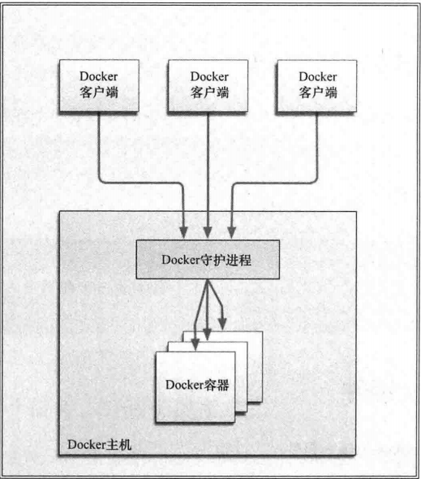

# Docker

我们可以通过以下几个维度来了解Docker可以为我们做什么。

- 加速本地开发和构建流程，使其更加高效、更加轻量化。本地开发人员可以构建、运行并分享Docker容器。容器可以在开发环境中构建，然后轻松地提交到测试环境中，并最终进入生产环境。
- 能够让独立服务或应用程序在不同的环境中，得到相同的运行结果。这一点在面向服务架构和重度依赖微型服务的部署中尤其实用。
- 用Docker创建隔离的环境来进行测试。例如，用Jenkins CI这样的持续集成工具启动一个用于测试的容器。
- Docker可以让开发者现在本机上构建一个复杂的程序或架构来进行测试，而不是一开始就在生产环境部署、测试。
- 构建一个多用户的平台及服务（PaaS）基础设施
- 为开发、测试提供一个轻量级的独立沙盒环境，或者将独立的沙盒环境用于技术教学，如Unix Shell的使用、编程语言教学。
- 提供软件即服务（SaaS）应用程序，如Memcached即服务。
- 高性能、超大规模的宿主机部署。

## 简介

Docker是一个能把应用程序自动部署到容器的开源引擎。

### 简单、轻量的建模方式

Docker依赖写时复制（copy on write）模型，使得修改应用程序也非常迅速。

由于去除了管理程序的开销，Docker容器拥有很高的性能，同一台宿主机可以运行更多的容器，使用户可以充分的利用系统资源。

### 职责的逻辑分离

开发人员只需要关心容器中运行的应用程序，运维人员只需要关心如何管理容器。Docker设计的目的就是要加强开发人员写代码的开发环境与应用程序要部署的生产环境的一致性，减低 “开发时一切都正常，肯定是运维的锅” 的风险。

### 快速、高效的开发生命周期

Docker的目标之一，就是缩短代码从开发、测试到部署、上线运行的周期，让你的应用程序具备可移植性，易于构建，易于协作。

### 鼓励使用面向服务的架构

Docker推荐单个容器只运行一个应用程序或进程，形成一个分布式的应用程序模型，在这种模型下，应用程序或服务都可以表示为一系列内部互联的容器，从而使分布式部署应用程序，扩展和调试应用程序变得非常简单，同时提高了程序的内省性。

## Docker组件

### Docker客户端和服务器

Docker是一个客户-服务器架构的程序。Docker客户端只需向Docker服务器或守护进程发出请求，服务器或守护进程将完成所有工作并返回结果。

Docker提供了一个命令行工具docker以及一整套restful api。



### Docker镜像

用户基于镜像来运行自己的容器。镜像是基于联合文件系统的一种层式的结构，由一系列指令一步一步构建出来。

也可以把镜像当作容器的源代码。镜像体积很小，非常便携，易于分享、存储和更新。

### Register

Docker用Register来保存用户构建的镜像。Register分为公共和私有两种。Docker公司运营的公共Register叫做Docker Hub。

可以假设自己私有Register。私有Register可以受到防火墙的保护，将镜像保护在防火墙后面，以满足一些组织的特殊需求。

### Docker容器

我们可以认为，镜像是Docker生命周期中的构建或打包阶段，而容器则是启动或者执行阶段。

每个容器都包含一个软件镜像，也就是容器的货物，而且与真正的货物一样，容器里的软件镜像可以进行一些操作。如创建、启动、关闭、重启和销毁。

和集装箱一样，Docker在执行上述操作时，并不关心容器中到底塞进了什么，它不管里面是web服务器还是数据库，或者应用程序服务器什么的，所有的容器都按照相同的方式将内容装载进去。


# Docker入门

## docker安装

### 安装前的准备

- 内核检测

```shell
# uname -a
```

通过uname命令来确认是否安装了3.8或更高的内核版本，一些老板本的2.6.x或其后的内核也能够运行Docker，但运行结果会有很大的不同。而且，如果你需要就老版本内核寻求帮助时，通常大家会建议你升到更高版本的内核。所以这里我们需要升级我们的内核版本。

如何更新内核可以参考http://www.cnblogs.com/Bourbon-tian/p/6868850.html

- 检查Device Mapper

我们这里使用Device Mapper作为Docker的存储驱动，为Docker提供存储能力。

```shell
# ls -l /sys/class/misc/device-mapper
```

同样，也可以在/proc/devices文件中检测是否有device-mapper条目：

```shell
# grep device-mapper /proc/devices
```

如果没有检测到Device Mapper，我们也可以试着安装device-mapper软件包：

```shell
# yum install -y device-mapper
## 安装完成后，还需要加载dm_mod模块
# modprobe dm_mod
## 模块加载完，我们就应该可以找到/sys/class/misc/device-mapper条目了。
```

### 安装Docker

```shell
# rpm -Uvh http://ftp.cuhk.edu.hk/pub/linux/fedora-epel/6/x86_64/epel-release-6-8.noarch.rpm
# yum install docker-io
# /etc/init.d/docker start
```

 启动Docker，命令：systemctl start docker，然后加入开机启动，如下

```shell
[root@localhost ~]# systemctl start docker
[root@localhost ~]# systemctl enable docker
Created symlink from /etc/systemd/system/multi-user.target.wants/docker.service to /usr/lib/systemd/system/docker.service.
```

## 简单使用

```shell
# docker info
```

info命令会返回所有容器和镜像（镜像即是Docker用来构建容器的“构建块”）的数量、Docker使用的执行驱动和存储驱动（execution and storage driver），以及Docker的基本配置。

接下来通过docker run命令创建容器，docker run命令提供了Docker容器的创建到启动的功能。

```shell
# docker run -i -t ubuntu /bin/bash
```

- -i: 以交互模式运行容器，通常与 -t 同时使用；
- -t: 为容器重新分配一个伪输入终端，通常与 -i 同时使用；
- ubuntu: 告诉Docker基于什么镜像来创建容器，它由Docker Hub Registry 提供。

我们可以用ubuntu基础镜像（以及类似的fedora，debian，centos等镜像）为基础，构建自己的镜像，这里我们基于此基础镜像启动了一个容器，并且没有对容器进行任何改动。

Docker首先会检查本地是否存在ubuntu镜像，如果本地还没有该镜像的话，那么Docker就会连接官方维护的Docker Hub  Registry，查看Docker  Hub中是否有该镜像。一旦找到，则会下载该镜像并将其保存到本地宿主机中。随后，Docker在文件系统内部用这个镜像创建了一个新容器。该容器拥有自己的网络、IP地址，以及一个用来和宿主机进行通信的桥接网络接口。最后，我们告诉Docker在新容器中要运行什么命令，在本例中我们在容器中运行/bin/bash命令启动了一个Bash  Shell。

当容器创建完成后，Docker就会执行容器中的/bin/bash命令，这时我们就可以看到容器内的shell了：

```shell
root@f4d39b81dd5d:/#
```

### 使用第一个容器

```shell
# 获取该容器的主机名
root@f4d39b81dd5d:/# hostname
f4d39b81dd5d
 
-------------------------------------------------------
 
# 查看/etc/hosts 文件
root@f4d39b81dd5d:/# cat /etc/hosts
172.17.0.1      f4d39b81dd5d
127.0.0.1       localhost
::1     localhost ip6-localhost ip6-loopback
fe00::0 ip6-localnet
ff00::0 ip6-mcastprefix
ff02::1 ip6-allnodes
ff02::2 ip6-allrouters
 
-------------------------------------------------------
 
# 如果新装的Ubuntu没有ifconfig命令和ping命令，则我们需要手动安装
root@f4d39b81dd5d:/# apt-get update
# ifconfig
root@f4d39b81dd5d:/# apt install net-tools       
# ping
root@f4d39b81dd5d:/# apt install iputils-ping
 
# 接下来我们就可以通过ifconfig来看看容器的网络配置情况
root@f4d39b81dd5d:/# ifconfig
eth0      Link encap:Ethernet  HWaddr 02:42:ac:11:00:01 
          inet addr:172.17.0.1  Bcast:0.0.0.0  Mask:255.255.0.0
          UP BROADCAST RUNNING MULTICAST  MTU:1500  Metric:1
          RX packets:9323 errors:0 dropped:0 overruns:0 frame:0
          TX packets:7266 errors:0 dropped:0 overruns:0 carrier:0
          collisions:0 txqueuelen:0
          RX bytes:26015244 (26.0 MB)  TX bytes:508075 (508.0 KB)
 
lo        Link encap:Local Loopback 
          inet addr:127.0.0.1  Mask:255.0.0.0
          UP LOOPBACK RUNNING  MTU:65536  Metric:1
          RX packets:0 errors:0 dropped:0 overruns:0 frame:0
          TX packets:0 errors:0 dropped:0 overruns:0 carrier:0
          collisions:0 txqueuelen:0
          RX bytes:0 (0.0 B)  TX bytes:0 (0.0 B)
 
-------------------------------------------------------
 
# 我们还可以查看容器中运行的进程
root@f4d39b81dd5d:/# ps -aux
USER        PID %CPU %MEM    VSZ   RSS TTY      STAT START   TIME COMMAND
root          1  0.0  0.2  18300  2108 ?        Ss   04:29   0:00 /bin/bash
root        337  0.0  0.1  34416  1464 ?        R+   04:39   0:00 ps -aux
 
-------------------------------------------------------
 
# 再尝试安装一个vim
root@f4d39b81dd5d:/# apt-get install vim
```

### 容器命名

当所有工作都结束时，输入exit，就可以返回到宿主机的命令提示符了。这时容器已经停止运行了！只有在指定的/bin/bash命令处于运行状态的时候，我们容器才会相应地处于运行状态。一旦退出容器，/bin/bash
命令也就结束了，这时容器也随之停止运行。但容器仍是存在的，我们可以用docker ps -a命令查看当前系统中容器的列表：

```shell
# docker ps -a 
```

默认情况下，当执行docker ps命令时，只能看到正在运行的容器。

-a 参数则是列出所有容器，包括正在运行和已经停止的。

**-**l 参数列出最后一次运行的容器，包括正在运行和已经停止的。

-n 参数列出最近创建的n个容器。（# docker ps -n 5  则表示列出最近创建的5个容器）

Docker会为我们创建的每一个容器自动生成一个随机的名称，如果想为容器命名，则可以用--name标志来实现。一个合法的容器名称只能包含以下字符：

- 小写字母a~z；
- 大写字母A~Z；
- 数字0-9；
- 下划线、
- 圆点、
- 横线（如果用正则表示来表示这些符号，就是[a-zA-Z0-9_.-]）。

```shell
# docker run --name SetName -i -t ubuntu /bin/bash 
root@78679e02be1c:/# exit
```

容器的名称有助于分辨容器，当构建容器和应用程序之间的逻辑连接时，容器的名称也有助于从逻辑上理解连接关系。具体的名称（如web、db）比容器ID和随机容器名好记多。我推荐大家都使用容器名称，以更加方便地管理容器。

容器的命名必须是唯一的。如果我们试图创建两个名称相同的容器，则命令将会失败。如果要使用的容器名称已经存在，可以先用docker rm命令删除已有的同名容器后，再来创建新的容器。

**重启已经停止的容器：**

SetName容器已经停止了，如果想重新启动这个容器，则可以同过docker start + 容器名或者是容器的ID来启动一个已经停止的容器

```shell
## 回归刚刚我们所讲的知识，通过ps -a 查看所有已创建容器
# docker ps -a
CONTAINER ID        IMAGE               COMMAND             CREATED             STATUS                      PORTS               NAMES
78679e02be1c        ubuntu              "/bin/bash"         9 minutes ago       Exited (0) 9 minutes ago                        SetName            
f4d39b81dd5d        ubuntu              "/bin/bash"         54 minutes ago      Exited (0) 32 minutes ago                       clever_noyce
 
## 通过容器名启动容器
# docker start SetName
# docker ps
CONTAINER ID        IMAGE               COMMAND             CREATED             STATUS              PORTS               NAMES
78679e02be1c        ubuntu              "/bin/bash"         11 minutes ago      Up 21 seconds                           SetName
 
## 我们也可以通过ID来启动容器
# docker start 78679e02be1c
# docker ps
CONTAINER ID        IMAGE               COMMAND             CREATED             STATUS              PORTS               NAMES
78679e02be1c        ubuntu              "/bin/bash"         12 minutes ago      Up 2 seconds                            SetName
```

我们也可以使用docker restart命令来重启一个容器。　

**附着到容器上：**

和启动容器一样，我们可以通过docker attach + 容器名或ID 重新附着到容器的会话上。

```shell
# docker attach SetName
root@78679e02be1c:/#
 
# docker attach 78679e02be1c
root@78679e02be1c:/#
 
## 你可能需要按一下回车键才能进入会话。
```

### 创建守护试容器
```shell
# docker run --name daemon_dave -d ubuntu /bin/sh -c "while true; do echo hello world; sleep 1; done"
64b5c862a23cb5b15e489fbd51dab5cfc958ca447db936732abb0f01ca2282b0
```

- -d 参数，docker会将容器放到后台运行，并返回容器ID

我们还在容器要运行的命令里使用了一个while循环，该循环会一直打印hello  world，直到容器或其进程停止运行。通过组合使用上面的这些参数，可以发现docker  run命令并没有像上一个容器一样将主机的控制台附着到新的shell会话上，而是仅仅返回了一个容器ID而已，我们还是在宿主机的命令行之中。通过docker  ps 命令可以看到一个正在运行的容器。

```shell
##通过docker logs命令来获取容器的日志
# docker logs daemon_dave
hello world
hello world
hello world

##通过 -f 参数可以跟踪守护式容器的日志，功能类似与tail -f命令，通过Ctrl+c退出日志跟踪。
# docker logs -f daemon_dave
hello world
hello world
hello world

##通过--tail 10 可以获取日志最后10行的内容
# docker logs --tail 10 daemon_dave 

##通过--tail 0 -f 命令来跟踪某个容器的最新日志而不必读取整个日志文件。
# docker logs --tail 0 -f daemon_dave 

##为了让调试更简单，我们还可以使用-t标志为每条日志项加上时间戳
# docker logs --tail 0 -ft daemon_dave
2017-05-11T08:16:11.088410871Z hello world
2017-05-11T08:16:12.090729257Z hello world
2017-05-11T08:16:13.093541541Z hello world
```

### 容器内的进程

```shell
##除了容器的日志，我们也可以查看容器内部运行的进程。通过docker top我们可以看到容器内所有的进程：
# docker top daemon_dave

##通过docker exec命令在容器内部额外启动新进程(后台任务)。
# docker exec -d daemon_dave touch /etc/new_config_file

##在daemon_dave容器中启动一个诸如打开shell的交互式任务：
# docker exec -t -i daemon_dave /bin/bash
root@64b5c862a23c:/# ls -l /etc/new_config_file
-rw-r--r-- 1 root root 0 May 11 08:39 /etc/new_config_file
```

可以在容器内运行的进程有两种类型：后台任务和交互式任务。后台任务在容器内运行且没有交互需求，而交互式任务则保持在前台运行。对于需要在容器内部打开Shell的任务，交互式任务是很实用的。

-d表示需要运行一个后台进程，-d标志之后，指定的是要在内部执行这个命令的容器的名字以及要执行的命令。上面例子中的命令在daemon_dave容器内创建了一个空文件，文件名为/etc/new_config_file。通过docker
exec后台命令，我们可以在正在运行的容器中进行维护、监控以及管理任务。

和运行交互容器时一样，这里的-t 和 -i 标志为我们执行的进程创建了TTY并捕捉STDIN。这条命令会在daemon_dave容器内创建一个新的bash会话，有了这个会话，我们就可以在该容器中运行其他命令了。这里我们找到了之前我们通过后台任务创建的文件。

```shell
## 只需要执行docker stop + 容器名 命令，就可以停止守护式容器
# docker stop daemon_dave
daemon_dave

## 当然我们也可以通过docker stop + 容器ID 来停止守护式容器

# docker run --restart=always --name daemon_dave_restart -d ubuntu /bin/sh -c "while true; do echo hello world;sleep 1; done"
0e6bf4b02e2593605821dc53c0daea7ec3d899e844bd56902f1c0a548c85ea68
```

### 自动重启容器

 如果由于某种错误而导致容器停止运行，我们可以通过--restart标志，让Docker自动重启该容器。--restart标志会检查容器的退出代码，并据此来决定是否要重启容器。默认的行为是Docker不会重启容器。

这里--restart标志被设置为always。无论容器的退出代码是什么，Docker都会自动重启该容器。除了always，我们还可以将这个标志设为on-failure，这样，只有当容器的退出代码为非0值的时候，才会自动重启。另外，on-failure还接受一个可选的重启次数参数

```shell
`-``-``restart``=``on``-``failure:``5`
```

这样，当容器退出代码为非0时，Docker会尝试自动重启该容器，最多重启5次。

### 深入容器

除了通过docker ps命令获取容器的信息，我们还可以使用docker inspect来获取更多的容器信息，docker inspect命令会对容器进行详细的检查，然后返回其配置信息，包括名称、命令、网络配置以及很多有用的数据。

我们也可以用-f或者--format标志来选定查看结果。

```shell
# docker inspect daemon_dave

## 这条命令会返回容器的运行状态
# docker inspect --format='{{ .State.Running }}' daemon_dave
true
 
## 我们还可以通过它来获取容器的IP地址等
# docker inspect --format='{{ .NetworkSettings.IPAddress }}' daemon_dave
172.17.0.9
 
## 我们也可以同时指定多个容器，并显示每个容器的输出结果
# docker inspect --format='{{ .Name }} {{ .State.Running }}' daemon_dave SetName
/daemon_dave true
/SetName false
```

**除了查看容器，我们还可以通过浏览/var/lib/docker目录来深入了解Docker的工作原理。该目录存放着Docker镜像、容器以及容器的配置。所有的容器都保存在/var/lib/docker/containers目录下。**

### 删除容器

如果容器不再使用，我们可以使用docker rm命令来删除它们

```shell
# docker rm daemon_dave
Error response ``from` `daemon:  Cannot destroy container daemon_dave: Conflict, You cannot remove a  running container. Stop the container before attempting removal ``or` `use ``-``f
Error: failed to remove containers: [daemon_dave]

## 运行中的容器是无法直接删除的！必须先通过docker stop或docker kill命令停止容器
# docker stop daemon_dave
daemon_dave

# docker rm daemon_dave
daemon_dave
```


# Docker镜像和仓库

## 什么是Docker镜像

Docker镜像是由文件系统叠加而成。

- 最底端是一个引导文件系统，即bootfs: 
  - 这很像典型的Linux/Unix的引导文件系统。Docker用户几乎永远不会和引导文件系统有什么交互。实际上，当一个容器启动后，它将会被移到内存中，而引导文件系统则会被卸载（unmount），以留出更多的内存供initrd磁盘镜像使用。

- Docker镜像的第二层是root文件系统rootfs: 
  - 它位于引导文件系统之上。rootfs可以是一种或多种操作系统（如Debian或者Ubuntu文件系统）。

在传统的Linux引导过程中，root文件系统会最先以只读的方式加载，当引导结束并完成了完整性检查之后，它才会被切换为读写模式。但是在Docker里，root文件系统永远只能是只读状态，并且Docker利用联合加载（union   mount）技术又会在root文件系统层上加载更多的只读文件系统。联合加载指的是一次同时加载多个文件系统，但是在外面看起来只能看到一个文件系统。联合加载会将各层文件系统叠加到一起，这样最终的文件系统会包含所有底层的文件和目录。

Docker将这样的文件系统称为镜像。一个镜像可以放到另一个镜像的顶部。位于下面的镜像称为父镜像（parent  image），可以一次类推，直到镜像栈的最底部，最底部的镜像称为基础镜像（base  image）。最后，当从一个镜像启动容器时，Docker会在该镜像的最顶层加载一个读写文件系统。我们想在Docker中运行的程序就是在这个读写层中执行。


当Docker第一次启动一个容器时，初始的读写层是空的。当文件系统发生变化时，这些变化都会应用到这一层上。比如，如果想要修改一个文件，这个文件首先会从该读写层下面的只读层复制到读写层。该文件的只读层版本依然存在，但是已经被读写层中的该文件副本所隐藏。通常这种机制被称为写时复制（copy  on  write），这也是使Docker如此强大的技术之一。每个只读镜像层都是只读的，并且以后永远不会变化。当创建一个新容器时，Docker会构建出一个镜像栈，并在栈的最顶端添加一个读写层。这个读写层再加上其下面的镜像层以及一些配置数据，就构成了一个容器。在上一章我们已经知道，容器可以修改，它们有自己的状态，并且是可以启动和停止的。容器的这种特点加上镜像分层框架（image-layering  framework）,使我们可以快速构建镜像并运行包含我们自己的应用程序和服务的容器。


## 镜像管理

在之前我们执行了docker run命令的同时将ubuntu的镜像也下载到了本地，本地镜像都保存在Docker宿主机的/var/lib/docker目录下。镜像从仓库下载下来，而仓库在Registry中。默认的Registry是由Docker公司运营的公共Registry服务，即DockerHub。https://hub.docker.com/　

我们虽然称之为Ubuntu操作系统，但实际上它并不是一个完整的操作系统。它只是一个裁剪版，只包含最低限度的支持系统运行的组件。

为了区分同一个仓库中的不同镜像，Docker提供了一种称为标签（tag）的功能。每个镜像在列出来时都带有一个标签，每个标签对组成特定镜像的一些镜像层标记。这种机制使得在同一个仓库中可以存储多个镜像。我们可以通过在仓库名后面加上一个冒号和标签名来指定该仓库中的某一个镜像。用docker  run命令从镜像启动一个容器时，如果该镜像不在本地，Docker会先从Docker  Hub下载该镜像。如果没有指定具体的镜像标签，那么Docker会自动下载latest标签的镜像。

```shell
##通过docker images命令列出docker主机上可用的镜像
# docker images

##以通过docker pull来拉去我们想要的镜像，比如说Centos
# docker pull centos

##通过docker search命令来查找所有Docker Hub上公共的可用镜像
# docker search puppet
```

镜像查找命令会完成镜像查找工作，返回如下信息：

- 仓库名；
- 镜像描述；
- 用户评论（Stars）——反映出一个镜像的受欢迎程度；
- 是否官方（Official）——由上游开发者管理的镜像；
- 自动构建（Automated）——表示这个镜像是由Docker Hub的自动构建（Automated Build）流程创建的。 


## 构建镜像

构建Docker镜像有以下两种方法：

- 使用docker commit命令。
- 使用docker build命令和 Dockerfile 文件。

在这里并不推荐使用docker  commit来构建镜像，而应该使用更灵活、更强大的Dockerfile来构建Docker镜像。但是为了对Docker有一个更全面的了解，还是会先介绍以下如何使用docker  commit构建Docker镜像。之后将重点介绍Docker所推荐的镜像构建方法：编写Dockerfile之后使用docker  build命令。

一般来说，我们不是真正的“创建”新镜像，而是基于一个已有的基础镜像，如ubuntu或centos等，构建新镜像而已。如果真的想从零构建一个全新的镜像，也可以参考https://docs.docker.com/engine/userguide/eng-image/baseimages/。

**Docker Hub账号**

docker hub官网注册账号
```shell
[root@VM_0_8_centos ~]# docker login
Login with your Docker ID to push and pull images from Docker Hub. If you don't have a Docker ID, head over to https://hub.docker.com to create one.
Username: longchenming
Password: 
Login Succeeded
```
### commit命令创建镜像

docker commit 构建镜像可以想象为是在往版本控制系统里提交变更。我们先创建一个容器，并在容器里做出修改，就像修改代码一样，最后再将修改提交为一个镜像。

```shell
# docker run -i -t ubuntu /bin/bash
root@b437ffe4d630:/# apt-get -yqq update
root@b437ffe4d630:/# apt-get -y install apache2

# docker ps -a
CONTAINER ID        IMAGE               COMMAND             CREATED             STATUS                      PORTS               NAMES
b437ffe4d630        ubuntu              "/bin/bash"         45 minutes ago      Exited (0) 10 seconds ago                       clever_pare        
b87f9dde62b0        devopsil/puppet     "/bin/bash"         2 days ago          Up 2 days                                       evil_archimedes    
 
# docker commit b437ffe4d630 test/apache2
9c30616364f44a519571709690e3c92a5cad4ad01c007d8126eb6d63670d33f4

# docker commit -m="A new custom image" --author="Bourbon Tian" b437ffe4d630 test/apache2:webserver
27fc508c41d1180b1a421380d755cf00f9dfb6b0d354b9eccaec94ae58a06675
 
# docker images test/apache2
REPOSITORY          TAG                 IMAGE ID            CREATED             VIRTUAL SIZE
test/apache2        latest              9c30616364f4        36 seconds ago      254.4 MB
```

我们启动了一个容器，并在里面安装了Apache。我们会将这个容器作为一个Web服务器来运行，所以我们想把它的当前状态保存下来。这样我们就不必每次都创建一个新容器并再次在里面安装Apache了。为了完成此项工作，需要先使用exit命令从容器里退出，之后再运行docker commit命令：

这条命令里，我们指定了更多的信息选项：

- -m 用来指定创建镜像的提交信息；
- --author 用来列出该镜像的作者信息；
- 最后在test/apache2后面增加了一个webserver标签。


### Dockerfile创建镜像

#### 创建Dockerfile

Dockerfile使用基本的基于DSL语法的指令来构建一个Docker镜像，之后使用docker build命令基于该Dockerfile中的指令构建一个新的镜像。

```shell
# mkdir /opt/static_web
# cd /opt/static_web/
# vim Dockerfile
```

首先创建一个名为static_web的目录用来保存Dockerfile，这个目录就是我们的构建环境（build environment）,Docker则称此环境为上下文（context）或者构建上下文（build context）。Docker会在构建镜像时将构建上下文和该上下文中的文件和目录上传到Docker守护进程。这样Docker守护进程就能直接访问你想在镜像中存储的任何代码、文件或者其他数据。这里我们还创建了一个Dockerfile文件，我们将用它构建一个能作为Web服务器的Docker镜像。

```shell
# Version: 0.0.1
FROM ubuntu:latest
MAINTAINER Bourbon Tian "bourbon@1mcloud.com"
RUN apt-get update
RUN apt-get install -y nginx
RUN echo 'Hi, I am in your container' > /usr/share/nginx/html/index.html
EXPOSE 80
```

Dockerfile由一系列指令和参数组成。每条指令都必须为大写字母，切后面要跟随一个参数。Dockerfile中的指令会按照顺序从上到下执行，所以应该根据需要合理安排指令的顺序。每条指令都会创建一个新的镜像层并对镜像进行提交。Docker大体上按照如下流程执行Dockerfile中的指令。

- Docker从基础镜像运行一个容器。
- 执行第一条指令，对容器进行修改。
- 执行类似docker commit的操作，提交一个新的镜像层。
- Docker再基于刚提交的镜像运行一个新的容器。
- 执行Dockerfile中的下一条命令，直到所有指令都执行完毕。

从上面可以看出，如果你的Dockerfile由于某些原因（如某条指令失败了）没有正常结束，那你也可以得到一个可以使用的镜像。这对调试非常有帮助：可以基于该镜像运行一个具备交互功能的容器，使用最后创建的镜像对为什么你的指令会失败进行调试。

Dockerfile也支持注释。以#开头的行都会被认为是注释，# Version: 0.0.1这就是个注释

**FROM：**

每个Dockerfile的第一条指令都应该是FROM。FROM指令指定一个已经存在的镜像，后续指令都是将基于该镜像进行，这个镜像被称为基础镜像（base   iamge）。在这里ubuntu:latest就是作为新镜像的基础镜像。也就是说Dockerfile构建的新镜像将以ubuntu:latest操作系统为基础。在运行一个容器时，必须要指明是基于哪个基础镜像在进行构建。

**MAINTAINER：**

MAINTAINER指令，这条指令会告诉Docker该镜像的作者是谁，以及作者的邮箱地址。这有助于表示镜像的所有者和联系方式

**RUN：**

在这些命令之后，我们指定了三条RUN指令。RUN指令会在当前镜像中运行指定的命令。这里我们通过RUN指令更新了APT仓库，安装nginx包，并创建了一个index.html文件。像前面说的那样，每条RUN指令都会创建一个新的镜像层，如果该指令执行成功，就会将此镜像层提交，之后继续执行Dockerfile中的下一个指令。

默认情况下，RUN指令会在shell里使用命令包装器/bin/sh -c  来执行。如果是在一个不支持shell的平台上运行或者不希望在shell中运行（比如避免shell字符串篡改），也可以使用exec格式的RUN指令，通过一个数组的方式指定要运行的命令和传递给该命令的每个参数：

```shell
`RUN [``"apt-get"``, ``"install"``, ``"-y"``, ``"nginx"``]`
```

**EXPOSE：**

EXPOSE指令是告诉Docker该容器内的应用程序将会使用容器的指定端口。这并不意味着可以自动访问任意容器运行中服务的端口。出于安全的原因，Docker并不会自动打开该端口，而是需要你在使用docker run运行容器时来指定需要打开哪些端口。

可以指定多个EXPOSE指令来向外部公开多个端口，Docker也使用EXPOSE指令来帮助将多个容器链接，在后面的学习过程中我们会接触到。

#### 构建新镜像

执行docker build命令时，Dockerfile中的所有指令都会被执行并且提交，并且在该命令成功结束后返回一个新镜像。

“.”告诉Docker到当前目录中去找Dockerfile文件，也可以指定一个Git仓库地址来指定Dockerfile的位置。

```shell
# cd static_web
# docker build -t="test/static_web" .

##在构建镜像的过程当中为镜像设置一个标签
# docker build -t="test/static_web:v1" .

##这里Docker假设在Git仓库的根目录下存在Dockerfile文件
# docker build -t="test/static_web:v1" git@github.com:test/static_web
```


#### 从新镜像启动容器

```shell
# docker run -d -p 80 --name static_web test/static_web nginx -g "daemon off;"
a4ad951b2ef91275bb918d11964d7d60889608efa3958e699030d38a681ba35e

# docker ps -l
```

- -d选项，告诉Docker以分离（detached）的方式在后台运行。这种方式非常适合运行类似Nginx守护进程这样的需要长时间运行的进程。
- 这里也指定了需要在容器中运行的命令：nginx -g "daemon off;"。这将以前台运行的方式启动Nginx，来作为我们的Web服务器。
- -p选项，控制Docker在运行时应该公开哪些网络端口给外部（宿主机）。运行一个容器时，Docker可通过两种方法在宿主机上分配端口。 
  - Docker可以在宿主机上通过/proc/sys/net/ipv4/ip_local_port_range文件随机一个端口映射到容器的80端口。
  - 可以在Docker宿主机中指定一个具体的端口号来映射到容器的80端口上。

这将在Docker宿主机上随机打开一个端口，这个端口会连接到容器中的80端口上。可以使用docker ps命令查看容得的端口分配情况：